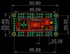
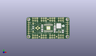
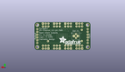
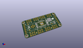

Contents
========

* [PROJ-ADAF-1429-STAN-01>Adafruit TLC5947 PCB](#proj-adaf-1429-stan-01adafruit-tlc5947-pcb)
	* [Images](#images)
	* [Interactive BOM](#interactive-bom)
	* [OOMP Parts](#oomp-parts)
	* [Tags](#tags)
  
![][im]
# PROJ-ADAF-1429-STAN-01>Adafruit TLC5947 PCB

- ID: PROJ-ADAF-1429-STAN-01
- Hex ID: PRA1429
- Name: Adafruit TLC5947 PCB
- Description: 

## Images
  
  

|eagleImage|kicadPcb3dFront|kicadPcb3dBack|kicadPcb3d|
| :---: | :---: | :---: | :---: |
|||||

## Interactive BOM

- Interactive BOM page: [ibom.html](kicad/bom/ibom.html)

## OOMP Parts
  

|OOMP Parts|
| :---: |
|UNMATCHED-0805-X-UNMATCHED-01, C1, 18.541999999999998, 14.985999999999999, 270,C1, 10uF/16V, 0805, microbuilder, (0.73, 0.59), R270|
|UNMATCHED-0805-X-UNMATCHED-01, C2, 33.274, 9.143999999999998, 90,C2, 1uF/50V, 0805, microbuilder, (1.31, 0.36), R90|
|UNMATCHED-0805-X-UNMATCHED-01, C3, 42.925999999999995, 8.636000000000001, 90,C3, 10uF/16V, 0805, microbuilder, (1.69, 0.34), R90|
|UNMATCHED-UNMATCHED-X-UNMATCHED-01, C4, 13.208, 12.7, 270,C4, ~1000uF, E3,5-8, adafruit, (0.52, 0.5), R270|
|UNMATCHED-UNMATCHED-X-UNMATCHED-01, IC1, 25.907999999999998, 12.7, 0,IC1, TLC5947-DAP, HTSSOP32DAP, adafruit, (1.02, 0.5), R0|
|UNMATCHED-UNMATCHED-X-UNMATCHED-01, IC2, 38.099999999999994, 12.7, 0,IC2, LM2931ADT-5.0, TO252, national-semiconductor, (1.5, 0.5), R0|
|UNMATCHED-UNMATCHED-X-UNMATCHED-01, J1, 13.208, 12.7, M180,J1, 1X2-3.5MM, 1X2-3.5MM, adafruit, (0.52, 0.5), MR180|
|UNMATCHED-UNMATCHED-X-UNMATCHED-01, JP1, 2.54, 12.7, 270,JP1, INPUT, 1X06-CLEANBIG, adafruit, (0.1, 0.5), R270|
|UNMATCHED-UNMATCHED-X-UNMATCHED-01, JP2, 10.16, 2.54, 0,JP2, 2X03_ROUND_70MIL, microbuilder, (0.4, 0.1), R0|
|UNMATCHED-UNMATCHED-X-UNMATCHED-01, JP3, 20.32, 2.54, 0,JP3, 2X03_ROUND_70MIL, microbuilder, (0.8, 0.1), R0|
|UNMATCHED-UNMATCHED-X-UNMATCHED-01, JP4, 30.479999999999997, 2.54, 0,JP4, 2X03_ROUND_70MIL, microbuilder, (1.2, 0.1), R0|
|UNMATCHED-UNMATCHED-X-UNMATCHED-01, JP5, 40.64, 2.54, 0,JP5, 2X03_ROUND_70MIL, microbuilder, (1.6, 0.1), R0|
|UNMATCHED-UNMATCHED-X-UNMATCHED-01, JP6, 40.64, 22.86, 180,JP6, 2X03_ROUND_70MIL, microbuilder, (1.6, 0.9), R180|
|UNMATCHED-UNMATCHED-X-UNMATCHED-01, JP7, 30.479999999999997, 22.86, 180,JP7, 2X03_ROUND_70MIL, microbuilder, (1.2, 0.9), R180|
|UNMATCHED-UNMATCHED-X-UNMATCHED-01, JP8, 20.32, 22.86, 180,JP8, 2X03_ROUND_70MIL, microbuilder, (0.8, 0.9), R180|
|UNMATCHED-UNMATCHED-X-UNMATCHED-01, JP9, 10.16, 22.86, 180,JP9, 2X03_ROUND_70MIL, microbuilder, (0.4, 0.9), R180|
|UNMATCHED-UNMATCHED-X-UNMATCHED-01, JP10, 48.26, 12.7, 270,JP10, OUTPUT, 1X06-CLEANBIG, adafruit, (1.9, 0.5), R270|
|UNMATCHED-UNMATCHED-X-UNMATCHED-01, JP11, 38.480999999999995, 8.001, 0,JP11, 1X01-CLEANBIG, adafruit, (1.515, 0.315), R0|
|UNMATCHED-0805-X-UNMATCHED-01, LED1, 33.274, 16.764, 180,LED1, Green, CHIP-LED0805, adafruit, (1.31, 0.66), R180|
|RESE-0805-X-UNMATCHED-01, R1, 7.874, 13.208, 90,R1, 3.3K, 0805-THM, adafruit, (0.31, 0.52), R90|
|ERROR, R2 470 ohm, 0, 0, 0,R2, 470, ohm, 0805, microbuilder, (1.31, 0.51), R90|
|<table><tr><td></td><td> R3</td><td>[RESE-0805-X-O103-01 SMD (0805) 10k Ohm Resistor](https://github.com/oomlout/oomlout_OOMP_parts/tree/main/RESE-0805-X-O103-01/)</td><td>[R85103](https://github.com/oomlout/oomlout_OOMP_parts/tree/main/RESE-0805-X-O103-01/)</td></tr></table>|

## Tags

- hexID: PRA1429
- oompType: PROJ
- oompSize: ADAF
- oompColor: 1429
- oompDesc: STAN
- oompIndex: 01
- oompName: Adafruit TLC5947 PCB
- sources: All source files from https://github.com/adafruit/Adafruit-TLC5947-PCB (source licence details in srcLicense.md)
- linkBuyPage: http://www.adafruit.com/products/1429
- oompPart: UNMATCHED-0805-X-UNMATCHED-01, C1, 18.541999999999998, 14.985999999999999, 270
- oompPart: UNMATCHED-0805-X-UNMATCHED-01, C2, 33.274, 9.143999999999998, 90
- oompPart: UNMATCHED-0805-X-UNMATCHED-01, C3, 42.925999999999995, 8.636000000000001, 90
- oompPart: UNMATCHED-UNMATCHED-X-UNMATCHED-01, C4, 13.208, 12.7, 270
- oompPart: SKIP-UNMATCHED-X-UNMATCHED-01, FID1, 15.239999999999998, 2.54, 0
- oompPart: SKIP-UNMATCHED-X-UNMATCHED-01, FID2, 25.4, 22.86, 0
- oompPart: SKIP-UNMATCHED-X-UNMATCHED-01, FID3, 35.559999999999995, 2.54, 0
- oompPart: UNMATCHED-UNMATCHED-X-UNMATCHED-01, IC1, 25.907999999999998, 12.7, 0
- oompPart: UNMATCHED-UNMATCHED-X-UNMATCHED-01, IC2, 38.099999999999994, 12.7, 0
- oompPart: UNMATCHED-UNMATCHED-X-UNMATCHED-01, J1, 13.208, 12.7, M180
- oompPart: UNMATCHED-UNMATCHED-X-UNMATCHED-01, JP1, 2.54, 12.7, 270
- oompPart: UNMATCHED-UNMATCHED-X-UNMATCHED-01, JP2, 10.16, 2.54, 0
- oompPart: UNMATCHED-UNMATCHED-X-UNMATCHED-01, JP3, 20.32, 2.54, 0
- oompPart: UNMATCHED-UNMATCHED-X-UNMATCHED-01, JP4, 30.479999999999997, 2.54, 0
- oompPart: UNMATCHED-UNMATCHED-X-UNMATCHED-01, JP5, 40.64, 2.54, 0
- oompPart: UNMATCHED-UNMATCHED-X-UNMATCHED-01, JP6, 40.64, 22.86, 180
- oompPart: UNMATCHED-UNMATCHED-X-UNMATCHED-01, JP7, 30.479999999999997, 22.86, 180
- oompPart: UNMATCHED-UNMATCHED-X-UNMATCHED-01, JP8, 20.32, 22.86, 180
- oompPart: UNMATCHED-UNMATCHED-X-UNMATCHED-01, JP9, 10.16, 22.86, 180
- oompPart: UNMATCHED-UNMATCHED-X-UNMATCHED-01, JP10, 48.26, 12.7, 270
- oompPart: UNMATCHED-UNMATCHED-X-UNMATCHED-01, JP11, 38.480999999999995, 8.001, 0
- oompPart: UNMATCHED-0805-X-UNMATCHED-01, LED1, 33.274, 16.764, 180
- oompPart: RESE-0805-X-UNMATCHED-01, R1, 7.874, 13.208, 90
- oompPart: ERROR, R2 470 ohm, 0, 0, 0
- oompPart: RESE-0805-X-O103-01, R3, 18.541999999999998, 9.906, 90
- oompPart: SKIP-UNMATCHED-X-UNMATCHED-01, U$1, 2.54, 22.86, 0
- oompPart: SKIP-UNMATCHED-X-UNMATCHED-01, U$2, 48.26, 22.86, 0
- oompPart: SKIP-UNMATCHED-X-UNMATCHED-01, U$3, 2.54, 2.54, 0
- oompPart: SKIP-UNMATCHED-X-UNMATCHED-01, U$4, 48.26, 2.54, 0
- rawPart: C1, 10uF/16V, 0805, microbuilder, (0.73, 0.59), R270
- rawPart: C2, 1uF/50V, 0805, microbuilder, (1.31, 0.36), R90
- rawPart: C3, 10uF/16V, 0805, microbuilder, (1.69, 0.34), R90
- rawPart: C4, ~1000uF, E3,5-8, adafruit, (0.52, 0.5), R270
- rawPart: FID1, FIDUCIAL, FIDUCIAL_1MM, microbuilder, (0.6, 0.1), R0
- rawPart: FID2, FIDUCIAL, FIDUCIAL_1MM, microbuilder, (1, 0.9), R0
- rawPart: FID3, FIDUCIAL, FIDUCIAL_1MM, microbuilder, (1.4, 0.1), R0
- rawPart: IC1, TLC5947-DAP, HTSSOP32DAP, adafruit, (1.02, 0.5), R0
- rawPart: IC2, LM2931ADT-5.0, TO252, national-semiconductor, (1.5, 0.5), R0
- rawPart: J1, 1X2-3.5MM, 1X2-3.5MM, adafruit, (0.52, 0.5), MR180
- rawPart: JP1, INPUT, 1X06-CLEANBIG, adafruit, (0.1, 0.5), R270
- rawPart: JP2, 2X03_ROUND_70MIL, microbuilder, (0.4, 0.1), R0
- rawPart: JP3, 2X03_ROUND_70MIL, microbuilder, (0.8, 0.1), R0
- rawPart: JP4, 2X03_ROUND_70MIL, microbuilder, (1.2, 0.1), R0
- rawPart: JP5, 2X03_ROUND_70MIL, microbuilder, (1.6, 0.1), R0
- rawPart: JP6, 2X03_ROUND_70MIL, microbuilder, (1.6, 0.9), R180
- rawPart: JP7, 2X03_ROUND_70MIL, microbuilder, (1.2, 0.9), R180
- rawPart: JP8, 2X03_ROUND_70MIL, microbuilder, (0.8, 0.9), R180
- rawPart: JP9, 2X03_ROUND_70MIL, microbuilder, (0.4, 0.9), R180
- rawPart: JP10, OUTPUT, 1X06-CLEANBIG, adafruit, (1.9, 0.5), R270
- rawPart: JP11, 1X01-CLEANBIG, adafruit, (1.515, 0.315), R0
- rawPart: LED1, Green, CHIP-LED0805, adafruit, (1.31, 0.66), R180
- rawPart: R1, 3.3K, 0805-THM, adafruit, (0.31, 0.52), R90
- rawPart: R2, 470, ohm, 0805, microbuilder, (1.31, 0.51), R90
- rawPart: R3, 10K, 0805, microbuilder, (0.73, 0.39), R90
- rawPart: U$1, MOUNTINGHOLE2.5, MOUNTINGHOLE_2.5_PLATED, microbuilder, (0.1, 0.9), R0
- rawPart: U$2, MOUNTINGHOLE2.5, MOUNTINGHOLE_2.5_PLATED, microbuilder, (1.9, 0.9), R0
- rawPart: U$3, MOUNTINGHOLE2.5, MOUNTINGHOLE_2.5_PLATED, microbuilder, (0.1, 0.1), R0
- rawPart: U$4, MOUNTINGHOLE2.5, MOUNTINGHOLE_2.5_PLATED, microbuilder, (1.9, 0.1), R0

[im]: kicadPcb3d_450.png
