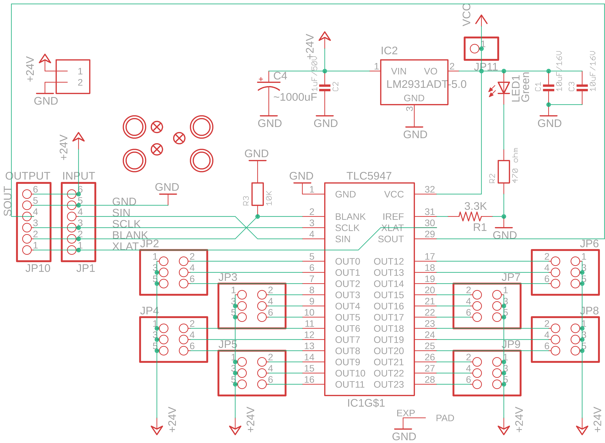
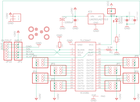

Contents
========

* [PRA1429 > Adafruit](#pra1429--adafruit)
	* [Schematic](#schematic)
	* [Interactive BOM](#interactive-bom)
	* [OOMP Parts](#oomp-parts)
	* [Images](#images)
	* [Tags](#tags)
  
![][im]
# PRA1429 > Adafruit

- ID: PROJ-ADAF-1429-STAN-01
- Hex ID: PRA1429
- Name: Adafruit
- Description: Adafruit
- Long Link: [http://oom.lt/PROJ-ADAF-1429-STAN-01](http://oom.lt/PROJ-ADAF-1429-STAN-01)
- Short Link: [http://oom.lt/PRA1429](http://oom.lt/PRA1429)

## Schematic
  

## Interactive BOM

- Interactive BOM page: [ibom.html](https://htmlpreview.github.io/?https://github.com/oomlout/oomlout_OOMP_projects/blob/main/PROJ-ADAF-1429-STAN-01/kicad/bom/ibom.html)

## OOMP Parts
  

|OOMP Parts|
| :---: |
|C1,CAPC-0805-X-UNMATCHED-01,C1,10uF/16V,CAP_CERAMIC0805,0805,Ceramic Capacitors,,,,,,|
|C2,CAPC-0805-X-UNMATCHED-01,C2,1uF/50V,CAP_CERAMIC0805,0805,Ceramic Capacitors,,,,,,|
|C3,CAPC-0805-X-UNMATCHED-01,C3,10uF/16V,CAP_CERAMIC0805,0805,Ceramic Capacitors,,,,,,|
|C4,CAPX-UNMATCHED-X-UNMATCHED-01,C4,~1000uF,CPOL-USE3.5-8,E3,5-8,POLARIZED CAPACITOR, American symbol,,,,,,|
|IC1,UNMATCHED-UNMATCHED-X-UNMATCHED-01,FID1,FIDUCIAL,FIDUCIAL,FIDUCIAL_1MM,Fiducial Alignment Points,EXCLUDE,,,,,|
|IC2,UNMATCHED-UNMATCHED-X-UNMATCHED-01,FID2,FIDUCIAL,FIDUCIAL,FIDUCIAL_1MM,Fiducial Alignment Points,EXCLUDE,,,,,|
|J1,UNMATCHED-UNMATCHED-X-UNMATCHED-01,FID3,FIDUCIAL,FIDUCIAL,FIDUCIAL_1MM,Fiducial Alignment Points,EXCLUDE,,,,,|
|JP1,HEAD-I01-X-PI06-01,IC1,TLC5947-DAP,TLC5947-DAP,HTSSOP32DAP,,,,,,,|
|JP2,HEAD-I01-X-UNMATCHED-01,IC2,LM2931ADT-5.0,LM2936DT-3.3,TO252,Ultra-Low Quiescent Current LDO Voltage Regulator,,,LM2936DT-3.3.,1286863,26M0361,|
|JP3,HEAD-I01-X-UNMATCHED-01,J1,1X2-3.5MM,1X2-3.5MM,1X2-3.5MM,3.5mm Terminal block,,,,,,|
|JP4,HEAD-I01-X-UNMATCHED-01,JP1,INPUT,PINHD-1X6CB,1X06-CLEANBIG,PIN HEADER,,,,,,|
|JP5,HEAD-I01-X-UNMATCHED-01,JP2,,HEADER-2X3,2X03_ROUND_70MIL,PIN HEADER,,,,,,|
|JP6,HEAD-I01-X-UNMATCHED-01,JP3,,HEADER-2X3,2X03_ROUND_70MIL,PIN HEADER,,,,,,|
|JP7,HEAD-I01-X-UNMATCHED-01,JP4,,HEADER-2X3,2X03_ROUND_70MIL,PIN HEADER,,,,,,|
|JP8,HEAD-I01-X-UNMATCHED-01,JP5,,HEADER-2X3,2X03_ROUND_70MIL,PIN HEADER,,,,,,|
|JP9,HEAD-I01-X-UNMATCHED-01,JP6,,HEADER-2X3,2X03_ROUND_70MIL,PIN HEADER,,,,,,|
|JP10,HEAD-I01-X-PI06-01,JP7,,HEADER-2X3,2X03_ROUND_70MIL,PIN HEADER,,,,,,|
|JP11,HEAD-I01-X-PI01-01,JP8,,HEADER-2X3,2X03_ROUND_70MIL,PIN HEADER,,,,,,|
|LED1,LEDS-0805-G-STAN-01,JP9,,HEADER-2X3,2X03_ROUND_70MIL,PIN HEADER,,,,,,|
|R1,RESE-0805-X-UNMATCHED-01,JP10,OUTPUT,PINHD-1X6CB,1X06-CLEANBIG,PIN HEADER,,,,,,|
|R2,RESE-0805-X-UNMATCHED-01,JP11,,PINHD-1X1CB,1X01-CLEANBIG,Pin header 1x1 for 0.1 spacing,,,,,,|
|R3,RESE-0805-X-O103-01,LED1,Green,LEDCHIP-LED0805,CHIP-LED0805,LED,,,,,,|
|U$1,UNMATCHED-UNMATCHED-X-UNMATCHED-01,R1,3.3K,FLIPFLOP-RES,0805-THM,Flip Flop resistor,,,,,,|
|U$2,UNMATCHED-UNMATCHED-X-UNMATCHED-01,R2,470 ohm,RESISTOR0805,0805,Resistors,,,,,,|
|U$3,UNMATCHED-UNMATCHED-X-UNMATCHED-01,R3,10K,RESISTOR0805,0805,Resistors,,,,,,|
|U$4,UNMATCHED-UNMATCHED-X-UNMATCHED-01,U$1,MOUNTINGHOLE2.5,MOUNTINGHOLE2.5,MOUNTINGHOLE_2.5_PLATED,Mounting Hole,,,,,,|

## Images
  
  

|kicadPcb3d|kicadPcb3dFront|kicadPcb3dBack|eagleImage|eagleSchemImage|
| :---: | :---: | :---: | :---: | :---: |
||||||

## Tags

- hexID: PRA1429
- oompType: PROJ
- oompSize: ADAF
- oompColor: 1429
- oompDesc: STAN
- oompIndex: 01
- oompName: Adafruit TLC5947 PCB
- sources: All source files from https://github.com/adafruit/Adafruit-TLC5947-PCB (source licence details in srcLicense.md)
- linkBuyPage: http://www.adafruit.com/products/1429
- oompID: PROJ-ADAF-1429-STAN-01
- oompParts: C1,CAPC-0805-X-UNMATCHED-01
- oompParts: C2,CAPC-0805-X-UNMATCHED-01
- oompParts: C3,CAPC-0805-X-UNMATCHED-01
- oompParts: C4,CAPX-UNMATCHED-X-UNMATCHED-01
- oompParts: IC1,UNMATCHED-UNMATCHED-X-UNMATCHED-01
- oompParts: IC2,UNMATCHED-UNMATCHED-X-UNMATCHED-01
- oompParts: J1,UNMATCHED-UNMATCHED-X-UNMATCHED-01
- oompParts: JP1,HEAD-I01-X-PI06-01
- oompParts: JP2,HEAD-I01-X-UNMATCHED-01
- oompParts: JP3,HEAD-I01-X-UNMATCHED-01
- oompParts: JP4,HEAD-I01-X-UNMATCHED-01
- oompParts: JP5,HEAD-I01-X-UNMATCHED-01
- oompParts: JP6,HEAD-I01-X-UNMATCHED-01
- oompParts: JP7,HEAD-I01-X-UNMATCHED-01
- oompParts: JP8,HEAD-I01-X-UNMATCHED-01
- oompParts: JP9,HEAD-I01-X-UNMATCHED-01
- oompParts: JP10,HEAD-I01-X-PI06-01
- oompParts: JP11,HEAD-I01-X-PI01-01
- oompParts: LED1,LEDS-0805-G-STAN-01
- oompParts: R1,RESE-0805-X-UNMATCHED-01
- oompParts: R2,RESE-0805-X-UNMATCHED-01
- oompParts: R3,RESE-0805-X-O103-01
- oompParts: U$1,UNMATCHED-UNMATCHED-X-UNMATCHED-01
- oompParts: U$2,UNMATCHED-UNMATCHED-X-UNMATCHED-01
- oompParts: U$3,UNMATCHED-UNMATCHED-X-UNMATCHED-01
- oompParts: U$4,UNMATCHED-UNMATCHED-X-UNMATCHED-01
- rawParts: C1,10uF/16V,CAP_CERAMIC0805,0805,Ceramic Capacitors,,,,,,
- rawParts: C2,1uF/50V,CAP_CERAMIC0805,0805,Ceramic Capacitors,,,,,,
- rawParts: C3,10uF/16V,CAP_CERAMIC0805,0805,Ceramic Capacitors,,,,,,
- rawParts: C4,~1000uF,CPOL-USE3.5-8,E3,5-8,POLARIZED CAPACITOR, American symbol,,,,,,
- rawParts: FID1,FIDUCIAL,FIDUCIAL,FIDUCIAL_1MM,Fiducial Alignment Points,EXCLUDE,,,,,
- rawParts: FID2,FIDUCIAL,FIDUCIAL,FIDUCIAL_1MM,Fiducial Alignment Points,EXCLUDE,,,,,
- rawParts: FID3,FIDUCIAL,FIDUCIAL,FIDUCIAL_1MM,Fiducial Alignment Points,EXCLUDE,,,,,
- rawParts: IC1,TLC5947-DAP,TLC5947-DAP,HTSSOP32DAP,,,,,,,
- rawParts: IC2,LM2931ADT-5.0,LM2936DT-3.3,TO252,Ultra-Low Quiescent Current LDO Voltage Regulator,,,LM2936DT-3.3.,1286863,26M0361,
- rawParts: J1,1X2-3.5MM,1X2-3.5MM,1X2-3.5MM,3.5mm Terminal block,,,,,,
- rawParts: JP1,INPUT,PINHD-1X6CB,1X06-CLEANBIG,PIN HEADER,,,,,,
- rawParts: JP2,,HEADER-2X3,2X03_ROUND_70MIL,PIN HEADER,,,,,,
- rawParts: JP3,,HEADER-2X3,2X03_ROUND_70MIL,PIN HEADER,,,,,,
- rawParts: JP4,,HEADER-2X3,2X03_ROUND_70MIL,PIN HEADER,,,,,,
- rawParts: JP5,,HEADER-2X3,2X03_ROUND_70MIL,PIN HEADER,,,,,,
- rawParts: JP6,,HEADER-2X3,2X03_ROUND_70MIL,PIN HEADER,,,,,,
- rawParts: JP7,,HEADER-2X3,2X03_ROUND_70MIL,PIN HEADER,,,,,,
- rawParts: JP8,,HEADER-2X3,2X03_ROUND_70MIL,PIN HEADER,,,,,,
- rawParts: JP9,,HEADER-2X3,2X03_ROUND_70MIL,PIN HEADER,,,,,,
- rawParts: JP10,OUTPUT,PINHD-1X6CB,1X06-CLEANBIG,PIN HEADER,,,,,,
- rawParts: JP11,,PINHD-1X1CB,1X01-CLEANBIG,Pin header 1x1 for 0.1 spacing,,,,,,
- rawParts: LED1,Green,LEDCHIP-LED0805,CHIP-LED0805,LED,,,,,,
- rawParts: R1,3.3K,FLIPFLOP-RES,0805-THM,Flip Flop resistor,,,,,,
- rawParts: R2,470 ohm,RESISTOR0805,0805,Resistors,,,,,,
- rawParts: R3,10K,RESISTOR0805,0805,Resistors,,,,,,
- rawParts: U$1,MOUNTINGHOLE2.5,MOUNTINGHOLE2.5,MOUNTINGHOLE_2.5_PLATED,Mounting Hole,,,,,,
- rawParts: U$2,MOUNTINGHOLE2.5,MOUNTINGHOLE2.5,MOUNTINGHOLE_2.5_PLATED,Mounting Hole,,,,,,
- rawParts: U$3,MOUNTINGHOLE2.5,MOUNTINGHOLE2.5,MOUNTINGHOLE_2.5_PLATED,Mounting Hole,,,,,,
- rawParts: U$4,MOUNTINGHOLE2.5,MOUNTINGHOLE2.5,MOUNTINGHOLE_2.5_PLATED,Mounting Hole,,,,,,

[im]: kicadPcb3d_450.png
