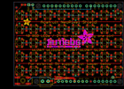
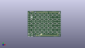
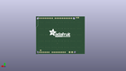
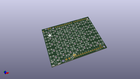

Contents
========

* [PROJ-ADAF-1430-STAN-01>Adafruit NeoPixel Shield PCB](#proj-adaf-1430-stan-01adafruit-neopixel-shield-pcb)
	* [Images](#images)
	* [Interactive BOM](#interactive-bom)
	* [OOMP Parts](#oomp-parts)
	* [Tags](#tags)
  
![][im]
# PROJ-ADAF-1430-STAN-01>Adafruit NeoPixel Shield PCB

- ID: PROJ-ADAF-1430-STAN-01
- Hex ID: PRA1430
- Name: Adafruit NeoPixel Shield PCB
- Description: 

## Images
  
  

|eagleImage|kicadPcb3dFront|kicadPcb3dBack|kicadPcb3d|
| :---: | :---: | :---: | :---: |
|||||

## Interactive BOM

- Interactive BOM page: [ibom.html](kicad/bom/ibom.html)

## OOMP Parts
  

|OOMP Parts|
| :---: |
|UNMATCHED-0805-X-UNMATCHED-01, C1, 16.509999999999998, 44.958, 90,C1, _0805NO, microbuilder, (0.65, 1.77), R90|
|UNMATCHED-0805-X-UNMATCHED-01, C2, 25.526999999999997, 44.958, 90,C2, _0805NO, microbuilder, (1.005, 1.77), R90|
|UNMATCHED-0805-X-UNMATCHED-01, C3, 34.416999999999994, 44.958, 90,C3, _0805NO, microbuilder, (1.355, 1.77), R90|
|UNMATCHED-0805-X-UNMATCHED-01, C4, 43.18, 44.958, 90,C4, _0805NO, microbuilder, (1.7, 1.77), R90|
|UNMATCHED-0805-X-UNMATCHED-01, C5, 52.197, 44.958, 90,C5, _0805NO, microbuilder, (2.055, 1.77), R90|
|UNMATCHED-0805-X-UNMATCHED-01, C6, 61.08699999999999, 44.958, 90,C6, _0805NO, microbuilder, (2.405, 1.77), R90|
|UNMATCHED-0805-X-UNMATCHED-01, C7, 7.746999999999999, 44.958, 90,C7, _0805NO, microbuilder, (0.305, 1.77), R90|
|UNMATCHED-0805-X-UNMATCHED-01, C8, 52.324, 36.068, 90,C8, _0805NO, microbuilder, (2.06, 1.42), R90|
|UNMATCHED-0805-X-UNMATCHED-01, C9, 61.340999999999994, 36.068, 90,C9, _0805NO, microbuilder, (2.415, 1.42), R90|
|UNMATCHED-0805-X-UNMATCHED-01, C10, 7.746999999999999, 36.068, 90,C10, _0805NO, microbuilder, (0.305, 1.42), R90|
|UNMATCHED-0805-X-UNMATCHED-01, C11, 43.434, 36.068, 90,C11, _0805NO, microbuilder, (1.71, 1.42), R90|
|UNMATCHED-0805-X-UNMATCHED-01, C12, 16.637, 36.068, 90,C12, _0805NO, microbuilder, (0.655, 1.42), R90|
|UNMATCHED-0805-X-UNMATCHED-01, C13, 25.526999999999997, 36.068, 90,C13, _0805NO, microbuilder, (1.005, 1.42), R90|
|UNMATCHED-0805-X-UNMATCHED-01, C14, 34.416999999999994, 36.068, 90,C14, _0805NO, microbuilder, (1.355, 1.42), R90|
|UNMATCHED-0805-X-UNMATCHED-01, C15, 16.637, 27.178, 90,C15, _0805NO, microbuilder, (0.655, 1.07), R90|
|UNMATCHED-0805-X-UNMATCHED-01, C16, 7.746999999999999, 27.178, 90,C16, _0805NO, microbuilder, (0.305, 1.07), R90|
|UNMATCHED-0805-X-UNMATCHED-01, C17, 25.526999999999997, 27.178, 90,C17, _0805NO, microbuilder, (1.005, 1.07), R90|
|UNMATCHED-0805-X-UNMATCHED-01, C18, 61.214, 27.178, 90,C18, _0805NO, microbuilder, (2.41, 1.07), R90|
|UNMATCHED-0805-X-UNMATCHED-01, C19, 34.416999999999994, 27.178, 90,C19, _0805NO, microbuilder, (1.355, 1.07), R90|
|UNMATCHED-0805-X-UNMATCHED-01, C20, 52.324, 27.178, 90,C20, _0805NO, microbuilder, (2.06, 1.07), R90|
|UNMATCHED-0805-X-UNMATCHED-01, C21, 43.434, 27.178, 90,C21, _0805NO, microbuilder, (1.71, 1.07), R90|
|UNMATCHED-0805-X-UNMATCHED-01, C22, 34.416999999999994, 18.287999999999997, 90,C22, _0805NO, microbuilder, (1.355, 0.72), R90|
|UNMATCHED-0805-X-UNMATCHED-01, C23, 7.746999999999999, 18.287999999999997, 90,C23, _0805NO, microbuilder, (0.305, 0.72), R90|
|UNMATCHED-0805-X-UNMATCHED-01, C24, 16.637, 18.287999999999997, 90,C24, _0805NO, microbuilder, (0.655, 0.72), R90|
|UNMATCHED-0805-X-UNMATCHED-01, C25, 25.526999999999997, 18.287999999999997, 90,C25, _0805NO, microbuilder, (1.005, 0.72), R90|
|UNMATCHED-0805-X-UNMATCHED-01, C26, 43.307, 18.287999999999997, 90,C26, _0805NO, microbuilder, (1.705, 0.72), R90|
|UNMATCHED-0805-X-UNMATCHED-01, C27, 52.324, 18.287999999999997, 90,C27, _0805NO, microbuilder, (2.06, 0.72), R90|
|UNMATCHED-0805-X-UNMATCHED-01, C28, 61.214, 18.287999999999997, 90,C28, _0805NO, microbuilder, (2.41, 0.72), R90|
|UNMATCHED-0805-X-UNMATCHED-01, C29, 52.324, 9.398, 90,C29, _0805NO, microbuilder, (2.06, 0.37), R90|
|UNMATCHED-0805-X-UNMATCHED-01, C30, 7.746999999999999, 9.398, 90,C30, _0805NO, microbuilder, (0.305, 0.37), R90|
|UNMATCHED-0805-X-UNMATCHED-01, C31, 16.637, 9.398, 90,C31, _0805NO, microbuilder, (0.655, 0.37), R90|
|UNMATCHED-0805-X-UNMATCHED-01, C32, 25.526999999999997, 9.398, 90,C32, _0805NO, microbuilder, (1.005, 0.37), R90|
|UNMATCHED-0805-X-UNMATCHED-01, C33, 34.416999999999994, 9.398, 90,C33, _0805NO, microbuilder, (1.355, 0.37), R90|
|UNMATCHED-0805-X-UNMATCHED-01, C34, 43.307, 9.398, 90,C34, _0805NO, microbuilder, (1.705, 0.37), R90|
|UNMATCHED-0805-X-UNMATCHED-01, C35, 61.214, 9.398, 90,C35, _0805NO, microbuilder, (2.41, 0.37), R90|
|UNMATCHED-UNMATCHED-X-UNMATCHED-01, J1, 19.558, 2.667, 0,J1, 1X2-3.5MM, 1X2-3.5MM, adafruit, (0.77, 0.105), R0|
|UNMATCHED-UNMATCHED-X-UNMATCHED-01, JP1, 10.413999999999998, 51.56199999999999, 0,JP1, 1X02_ROUND, microbuilder, (0.41, 2.03), R0|
|UNMATCHED-UNMATCHED-X-UNMATCHED-01, JP2, 62.230000000000004, 5.206999999999999, 0,JP2, 1X01-CLEANBIG, adafruit, (2.45, 0.205), R0|
|UNMATCHED-UNMATCHED-X-UNMATCHED-01, LED1, 3.302, 44.958, 270,LED1, WS2812B5050, WS2812B, microbuilder, (0.13, 1.77), R270|
|UNMATCHED-UNMATCHED-X-UNMATCHED-01, LED2, 12.191999999999998, 44.958, 270,LED2, WS2812B5050, WS2812B, microbuilder, (0.48, 1.77), R270|
|UNMATCHED-UNMATCHED-X-UNMATCHED-01, LED3, 21.081999999999997, 44.958, 270,LED3, WS2812B5050, WS2812B, microbuilder, (0.83, 1.77), R270|
|UNMATCHED-UNMATCHED-X-UNMATCHED-01, LED4, 29.971999999999998, 44.958, 270,LED4, WS2812B5050, WS2812B, microbuilder, (1.18, 1.77), R270|
|UNMATCHED-UNMATCHED-X-UNMATCHED-01, LED5, 38.862, 44.958, 270,LED5, WS2812B5050, WS2812B, microbuilder, (1.53, 1.77), R270|
|UNMATCHED-UNMATCHED-X-UNMATCHED-01, LED6, 47.751999999999995, 44.958, 270,LED6, WS2812B5050, WS2812B, microbuilder, (1.88, 1.77), R270|
|UNMATCHED-UNMATCHED-X-UNMATCHED-01, LED7, 56.641999999999996, 44.958, 270,LED7, WS2812B5050, WS2812B, microbuilder, (2.23, 1.77), R270|
|UNMATCHED-UNMATCHED-X-UNMATCHED-01, LED8, 65.532, 44.958, 270,LED8, WS2812B5050, WS2812B, microbuilder, (2.58, 1.77), R270|
|UNMATCHED-UNMATCHED-X-UNMATCHED-01, LED9, 3.302, 36.068, 270,LED9, WS2812B5050, WS2812B, microbuilder, (0.13, 1.42), R270|
|UNMATCHED-UNMATCHED-X-UNMATCHED-01, LED10, 12.191999999999998, 36.068, 270,LED10, WS2812B5050, WS2812B, microbuilder, (0.48, 1.42), R270|
|UNMATCHED-UNMATCHED-X-UNMATCHED-01, LED11, 21.081999999999997, 36.068, 270,LED11, WS2812B5050, WS2812B, microbuilder, (0.83, 1.42), R270|
|UNMATCHED-UNMATCHED-X-UNMATCHED-01, LED12, 29.971999999999998, 36.068, 270,LED12, WS2812B5050, WS2812B, microbuilder, (1.18, 1.42), R270|
|UNMATCHED-UNMATCHED-X-UNMATCHED-01, LED13, 38.862, 36.068, 270,LED13, WS2812B5050, WS2812B, microbuilder, (1.53, 1.42), R270|
|UNMATCHED-UNMATCHED-X-UNMATCHED-01, LED14, 47.751999999999995, 36.068, 270,LED14, WS2812B5050, WS2812B, microbuilder, (1.88, 1.42), R270|
|UNMATCHED-UNMATCHED-X-UNMATCHED-01, LED15, 56.896, 36.068, 270,LED15, WS2812B5050, WS2812B, microbuilder, (2.24, 1.42), R270|
|UNMATCHED-UNMATCHED-X-UNMATCHED-01, LED16, 65.532, 36.068, 270,LED16, WS2812B5050, WS2812B, microbuilder, (2.58, 1.42), R270|
|UNMATCHED-UNMATCHED-X-UNMATCHED-01, LED17, 3.302, 27.178, 270,LED17, WS2812B5050, WS2812B, microbuilder, (0.13, 1.07), R270|
|UNMATCHED-UNMATCHED-X-UNMATCHED-01, LED18, 12.191999999999998, 27.178, 270,LED18, WS2812B5050, WS2812B, microbuilder, (0.48, 1.07), R270|
|UNMATCHED-UNMATCHED-X-UNMATCHED-01, LED19, 21.081999999999997, 27.178, 270,LED19, WS2812B5050, WS2812B, microbuilder, (0.83, 1.07), R270|
|UNMATCHED-UNMATCHED-X-UNMATCHED-01, LED20, 29.971999999999998, 27.178, 270,LED20, WS2812B5050, WS2812B, microbuilder, (1.18, 1.07), R270|
|UNMATCHED-UNMATCHED-X-UNMATCHED-01, LED21, 38.862, 27.178, 270,LED21, WS2812B5050, WS2812B, microbuilder, (1.53, 1.07), R270|
|UNMATCHED-UNMATCHED-X-UNMATCHED-01, LED22, 47.751999999999995, 27.178, 270,LED22, WS2812B5050, WS2812B, microbuilder, (1.88, 1.07), R270|
|UNMATCHED-UNMATCHED-X-UNMATCHED-01, LED23, 56.896, 27.178, 270,LED23, WS2812B5050, WS2812B, microbuilder, (2.24, 1.07), R270|
|UNMATCHED-UNMATCHED-X-UNMATCHED-01, LED24, 65.532, 27.178, 270,LED24, WS2812B5050, WS2812B, microbuilder, (2.58, 1.07), R270|
|UNMATCHED-UNMATCHED-X-UNMATCHED-01, LED25, 3.302, 18.287999999999997, 270,LED25, WS2812B5050, WS2812B, microbuilder, (0.13, 0.72), R270|
|UNMATCHED-UNMATCHED-X-UNMATCHED-01, LED26, 12.191999999999998, 18.287999999999997, 270,LED26, WS2812B5050, WS2812B, microbuilder, (0.48, 0.72), R270|
|UNMATCHED-UNMATCHED-X-UNMATCHED-01, LED27, 21.081999999999997, 18.287999999999997, 270,LED27, WS2812B5050, WS2812B, microbuilder, (0.83, 0.72), R270|
|UNMATCHED-UNMATCHED-X-UNMATCHED-01, LED28, 29.971999999999998, 18.287999999999997, 270,LED28, WS2812B5050, WS2812B, microbuilder, (1.18, 0.72), R270|
|UNMATCHED-UNMATCHED-X-UNMATCHED-01, LED29, 38.862, 18.287999999999997, 270,LED29, WS2812B5050, WS2812B, microbuilder, (1.53, 0.72), R270|
|UNMATCHED-UNMATCHED-X-UNMATCHED-01, LED30, 47.751999999999995, 18.287999999999997, 270,LED30, WS2812B5050, WS2812B, microbuilder, (1.88, 0.72), R270|
|UNMATCHED-UNMATCHED-X-UNMATCHED-01, LED31, 56.896, 18.287999999999997, 270,LED31, WS2812B5050, WS2812B, microbuilder, (2.24, 0.72), R270|
|UNMATCHED-UNMATCHED-X-UNMATCHED-01, LED32, 65.532, 18.287999999999997, 270,LED32, WS2812B5050, WS2812B, microbuilder, (2.58, 0.72), R270|
|UNMATCHED-UNMATCHED-X-UNMATCHED-01, LED33, 3.302, 9.398, 270,LED33, WS2812B5050, WS2812B, microbuilder, (0.13, 0.37), R270|
|UNMATCHED-UNMATCHED-X-UNMATCHED-01, LED34, 12.191999999999998, 9.398, 270,LED34, WS2812B5050, WS2812B, microbuilder, (0.48, 0.37), R270|
|UNMATCHED-UNMATCHED-X-UNMATCHED-01, LED35, 21.081999999999997, 9.398, 270,LED35, WS2812B5050, WS2812B, microbuilder, (0.83, 0.37), R270|
|UNMATCHED-UNMATCHED-X-UNMATCHED-01, LED36, 29.971999999999998, 9.398, 270,LED36, WS2812B5050, WS2812B, microbuilder, (1.18, 0.37), R270|
|UNMATCHED-UNMATCHED-X-UNMATCHED-01, LED37, 38.862, 9.398, 270,LED37, WS2812B5050, WS2812B, microbuilder, (1.53, 0.37), R270|
|UNMATCHED-UNMATCHED-X-UNMATCHED-01, LED38, 47.751999999999995, 9.398, 270,LED38, WS2812B5050, WS2812B, microbuilder, (1.88, 0.37), R270|
|UNMATCHED-UNMATCHED-X-UNMATCHED-01, LED39, 56.896, 9.398, 270,LED39, WS2812B5050, WS2812B, microbuilder, (2.24, 0.37), R270|
|UNMATCHED-UNMATCHED-X-UNMATCHED-01, LED40, 65.532, 9.398, 270,LED40, WS2812B5050, WS2812B, microbuilder, (2.58, 0.37), R270|
|UNMATCHED-UNMATCHED-X-UNMATCHED-01, Q1, 24.892, 2.921, 90,Q1, IRLML6401, SOT23-WIDE, microbuilder, (0.98, 0.115), R90|
|RESE-0805-X-UNMATCHED-01, R1, 5.842, 51.56199999999999, 0,R1, _0805NO, microbuilder, (0.23, 2.03), R0|
|UNMATCHED-UNMATCHED-X-UNMATCHED-01, SJ1, 28.194000000000003, 4.699, 0,SJ1, SOLDERJUMPER_CLOSEDWIRE, microbuilder, (1.11, 0.185), R0|
|UNMATCHED-UNMATCHED-X-UNMATCHED-01, SW1, 5.460999999999999, 3.0479999999999996, 180,SW1, SPST_TACT-EVQQ2, EVQ-Q2, adafruit, (0.215, 0.12), R180|
|UNMATCHED-UNMATCHED-X-UNMATCHED-01, U1, 0.0, 0.0, 0,U1, ARDUINOR3-BPLACE, ARDUINOR3-BPLACE, adafruit, (0, 0), R0|

## Tags

- hexID: PRA1430
- oompType: PROJ
- oompSize: ADAF
- oompColor: 1430
- oompDesc: STAN
- oompIndex: 01
- oompName: Adafruit NeoPixel Shield PCB
- sources: All source files from https://github.com/adafruit/Adafruit-NeoPixel-Shield-PCB (source licence details in srcLicense.md)
- linkBuyPage: http://www.adafruit.com/products/1430
- oompPart: UNMATCHED-0805-X-UNMATCHED-01, C1, 16.509999999999998, 44.958, 90
- oompPart: UNMATCHED-0805-X-UNMATCHED-01, C2, 25.526999999999997, 44.958, 90
- oompPart: UNMATCHED-0805-X-UNMATCHED-01, C3, 34.416999999999994, 44.958, 90
- oompPart: UNMATCHED-0805-X-UNMATCHED-01, C4, 43.18, 44.958, 90
- oompPart: UNMATCHED-0805-X-UNMATCHED-01, C5, 52.197, 44.958, 90
- oompPart: UNMATCHED-0805-X-UNMATCHED-01, C6, 61.08699999999999, 44.958, 90
- oompPart: UNMATCHED-0805-X-UNMATCHED-01, C7, 7.746999999999999, 44.958, 90
- oompPart: UNMATCHED-0805-X-UNMATCHED-01, C8, 52.324, 36.068, 90
- oompPart: UNMATCHED-0805-X-UNMATCHED-01, C9, 61.340999999999994, 36.068, 90
- oompPart: UNMATCHED-0805-X-UNMATCHED-01, C10, 7.746999999999999, 36.068, 90
- oompPart: UNMATCHED-0805-X-UNMATCHED-01, C11, 43.434, 36.068, 90
- oompPart: UNMATCHED-0805-X-UNMATCHED-01, C12, 16.637, 36.068, 90
- oompPart: UNMATCHED-0805-X-UNMATCHED-01, C13, 25.526999999999997, 36.068, 90
- oompPart: UNMATCHED-0805-X-UNMATCHED-01, C14, 34.416999999999994, 36.068, 90
- oompPart: UNMATCHED-0805-X-UNMATCHED-01, C15, 16.637, 27.178, 90
- oompPart: UNMATCHED-0805-X-UNMATCHED-01, C16, 7.746999999999999, 27.178, 90
- oompPart: UNMATCHED-0805-X-UNMATCHED-01, C17, 25.526999999999997, 27.178, 90
- oompPart: UNMATCHED-0805-X-UNMATCHED-01, C18, 61.214, 27.178, 90
- oompPart: UNMATCHED-0805-X-UNMATCHED-01, C19, 34.416999999999994, 27.178, 90
- oompPart: UNMATCHED-0805-X-UNMATCHED-01, C20, 52.324, 27.178, 90
- oompPart: UNMATCHED-0805-X-UNMATCHED-01, C21, 43.434, 27.178, 90
- oompPart: UNMATCHED-0805-X-UNMATCHED-01, C22, 34.416999999999994, 18.287999999999997, 90
- oompPart: UNMATCHED-0805-X-UNMATCHED-01, C23, 7.746999999999999, 18.287999999999997, 90
- oompPart: UNMATCHED-0805-X-UNMATCHED-01, C24, 16.637, 18.287999999999997, 90
- oompPart: UNMATCHED-0805-X-UNMATCHED-01, C25, 25.526999999999997, 18.287999999999997, 90
- oompPart: UNMATCHED-0805-X-UNMATCHED-01, C26, 43.307, 18.287999999999997, 90
- oompPart: UNMATCHED-0805-X-UNMATCHED-01, C27, 52.324, 18.287999999999997, 90
- oompPart: UNMATCHED-0805-X-UNMATCHED-01, C28, 61.214, 18.287999999999997, 90
- oompPart: UNMATCHED-0805-X-UNMATCHED-01, C29, 52.324, 9.398, 90
- oompPart: UNMATCHED-0805-X-UNMATCHED-01, C30, 7.746999999999999, 9.398, 90
- oompPart: UNMATCHED-0805-X-UNMATCHED-01, C31, 16.637, 9.398, 90
- oompPart: UNMATCHED-0805-X-UNMATCHED-01, C32, 25.526999999999997, 9.398, 90
- oompPart: UNMATCHED-0805-X-UNMATCHED-01, C33, 34.416999999999994, 9.398, 90
- oompPart: UNMATCHED-0805-X-UNMATCHED-01, C34, 43.307, 9.398, 90
- oompPart: UNMATCHED-0805-X-UNMATCHED-01, C35, 61.214, 9.398, 90
- oompPart: SKIP-UNMATCHED-X-UNMATCHED-01, FID1, 48.26, 2.54, 0
- oompPart: SKIP-UNMATCHED-X-UNMATCHED-01, FID2, 1.397, 49.784, 0
- oompPart: SKIP-UNMATCHED-X-UNMATCHED-01, FID3, 65.27799999999999, 48.513999999999996, 0
- oompPart: UNMATCHED-UNMATCHED-X-UNMATCHED-01, J1, 19.558, 2.667, 0
- oompPart: UNMATCHED-UNMATCHED-X-UNMATCHED-01, JP1, 10.413999999999998, 51.56199999999999, 0
- oompPart: UNMATCHED-UNMATCHED-X-UNMATCHED-01, JP2, 62.230000000000004, 5.206999999999999, 0
- oompPart: UNMATCHED-UNMATCHED-X-UNMATCHED-01, LED1, 3.302, 44.958, 270
- oompPart: UNMATCHED-UNMATCHED-X-UNMATCHED-01, LED2, 12.191999999999998, 44.958, 270
- oompPart: UNMATCHED-UNMATCHED-X-UNMATCHED-01, LED3, 21.081999999999997, 44.958, 270
- oompPart: UNMATCHED-UNMATCHED-X-UNMATCHED-01, LED4, 29.971999999999998, 44.958, 270
- oompPart: UNMATCHED-UNMATCHED-X-UNMATCHED-01, LED5, 38.862, 44.958, 270
- oompPart: UNMATCHED-UNMATCHED-X-UNMATCHED-01, LED6, 47.751999999999995, 44.958, 270
- oompPart: UNMATCHED-UNMATCHED-X-UNMATCHED-01, LED7, 56.641999999999996, 44.958, 270
- oompPart: UNMATCHED-UNMATCHED-X-UNMATCHED-01, LED8, 65.532, 44.958, 270
- oompPart: UNMATCHED-UNMATCHED-X-UNMATCHED-01, LED9, 3.302, 36.068, 270
- oompPart: UNMATCHED-UNMATCHED-X-UNMATCHED-01, LED10, 12.191999999999998, 36.068, 270
- oompPart: UNMATCHED-UNMATCHED-X-UNMATCHED-01, LED11, 21.081999999999997, 36.068, 270
- oompPart: UNMATCHED-UNMATCHED-X-UNMATCHED-01, LED12, 29.971999999999998, 36.068, 270
- oompPart: UNMATCHED-UNMATCHED-X-UNMATCHED-01, LED13, 38.862, 36.068, 270
- oompPart: UNMATCHED-UNMATCHED-X-UNMATCHED-01, LED14, 47.751999999999995, 36.068, 270
- oompPart: UNMATCHED-UNMATCHED-X-UNMATCHED-01, LED15, 56.896, 36.068, 270
- oompPart: UNMATCHED-UNMATCHED-X-UNMATCHED-01, LED16, 65.532, 36.068, 270
- oompPart: UNMATCHED-UNMATCHED-X-UNMATCHED-01, LED17, 3.302, 27.178, 270
- oompPart: UNMATCHED-UNMATCHED-X-UNMATCHED-01, LED18, 12.191999999999998, 27.178, 270
- oompPart: UNMATCHED-UNMATCHED-X-UNMATCHED-01, LED19, 21.081999999999997, 27.178, 270
- oompPart: UNMATCHED-UNMATCHED-X-UNMATCHED-01, LED20, 29.971999999999998, 27.178, 270
- oompPart: UNMATCHED-UNMATCHED-X-UNMATCHED-01, LED21, 38.862, 27.178, 270
- oompPart: UNMATCHED-UNMATCHED-X-UNMATCHED-01, LED22, 47.751999999999995, 27.178, 270
- oompPart: UNMATCHED-UNMATCHED-X-UNMATCHED-01, LED23, 56.896, 27.178, 270
- oompPart: UNMATCHED-UNMATCHED-X-UNMATCHED-01, LED24, 65.532, 27.178, 270
- oompPart: UNMATCHED-UNMATCHED-X-UNMATCHED-01, LED25, 3.302, 18.287999999999997, 270
- oompPart: UNMATCHED-UNMATCHED-X-UNMATCHED-01, LED26, 12.191999999999998, 18.287999999999997, 270
- oompPart: UNMATCHED-UNMATCHED-X-UNMATCHED-01, LED27, 21.081999999999997, 18.287999999999997, 270
- oompPart: UNMATCHED-UNMATCHED-X-UNMATCHED-01, LED28, 29.971999999999998, 18.287999999999997, 270
- oompPart: UNMATCHED-UNMATCHED-X-UNMATCHED-01, LED29, 38.862, 18.287999999999997, 270
- oompPart: UNMATCHED-UNMATCHED-X-UNMATCHED-01, LED30, 47.751999999999995, 18.287999999999997, 270
- oompPart: UNMATCHED-UNMATCHED-X-UNMATCHED-01, LED31, 56.896, 18.287999999999997, 270
- oompPart: UNMATCHED-UNMATCHED-X-UNMATCHED-01, LED32, 65.532, 18.287999999999997, 270
- oompPart: UNMATCHED-UNMATCHED-X-UNMATCHED-01, LED33, 3.302, 9.398, 270
- oompPart: UNMATCHED-UNMATCHED-X-UNMATCHED-01, LED34, 12.191999999999998, 9.398, 270
- oompPart: UNMATCHED-UNMATCHED-X-UNMATCHED-01, LED35, 21.081999999999997, 9.398, 270
- oompPart: UNMATCHED-UNMATCHED-X-UNMATCHED-01, LED36, 29.971999999999998, 9.398, 270
- oompPart: UNMATCHED-UNMATCHED-X-UNMATCHED-01, LED37, 38.862, 9.398, 270
- oompPart: UNMATCHED-UNMATCHED-X-UNMATCHED-01, LED38, 47.751999999999995, 9.398, 270
- oompPart: UNMATCHED-UNMATCHED-X-UNMATCHED-01, LED39, 56.896, 9.398, 270
- oompPart: UNMATCHED-UNMATCHED-X-UNMATCHED-01, LED40, 65.532, 9.398, 270
- oompPart: UNMATCHED-UNMATCHED-X-UNMATCHED-01, Q1, 24.892, 2.921, 90
- oompPart: RESE-0805-X-UNMATCHED-01, R1, 5.842, 51.56199999999999, 0
- oompPart: UNMATCHED-UNMATCHED-X-UNMATCHED-01, SJ1, 28.194000000000003, 4.699, 0
- oompPart: UNMATCHED-UNMATCHED-X-UNMATCHED-01, SW1, 5.460999999999999, 3.0479999999999996, 180
- oompPart: UNMATCHED-UNMATCHED-X-UNMATCHED-01, U1, 0.0, 0.0, 0
- rawPart: C1, _0805NO, microbuilder, (0.65, 1.77), R90
- rawPart: C2, _0805NO, microbuilder, (1.005, 1.77), R90
- rawPart: C3, _0805NO, microbuilder, (1.355, 1.77), R90
- rawPart: C4, _0805NO, microbuilder, (1.7, 1.77), R90
- rawPart: C5, _0805NO, microbuilder, (2.055, 1.77), R90
- rawPart: C6, _0805NO, microbuilder, (2.405, 1.77), R90
- rawPart: C7, _0805NO, microbuilder, (0.305, 1.77), R90
- rawPart: C8, _0805NO, microbuilder, (2.06, 1.42), R90
- rawPart: C9, _0805NO, microbuilder, (2.415, 1.42), R90
- rawPart: C10, _0805NO, microbuilder, (0.305, 1.42), R90
- rawPart: C11, _0805NO, microbuilder, (1.71, 1.42), R90
- rawPart: C12, _0805NO, microbuilder, (0.655, 1.42), R90
- rawPart: C13, _0805NO, microbuilder, (1.005, 1.42), R90
- rawPart: C14, _0805NO, microbuilder, (1.355, 1.42), R90
- rawPart: C15, _0805NO, microbuilder, (0.655, 1.07), R90
- rawPart: C16, _0805NO, microbuilder, (0.305, 1.07), R90
- rawPart: C17, _0805NO, microbuilder, (1.005, 1.07), R90
- rawPart: C18, _0805NO, microbuilder, (2.41, 1.07), R90
- rawPart: C19, _0805NO, microbuilder, (1.355, 1.07), R90
- rawPart: C20, _0805NO, microbuilder, (2.06, 1.07), R90
- rawPart: C21, _0805NO, microbuilder, (1.71, 1.07), R90
- rawPart: C22, _0805NO, microbuilder, (1.355, 0.72), R90
- rawPart: C23, _0805NO, microbuilder, (0.305, 0.72), R90
- rawPart: C24, _0805NO, microbuilder, (0.655, 0.72), R90
- rawPart: C25, _0805NO, microbuilder, (1.005, 0.72), R90
- rawPart: C26, _0805NO, microbuilder, (1.705, 0.72), R90
- rawPart: C27, _0805NO, microbuilder, (2.06, 0.72), R90
- rawPart: C28, _0805NO, microbuilder, (2.41, 0.72), R90
- rawPart: C29, _0805NO, microbuilder, (2.06, 0.37), R90
- rawPart: C30, _0805NO, microbuilder, (0.305, 0.37), R90
- rawPart: C31, _0805NO, microbuilder, (0.655, 0.37), R90
- rawPart: C32, _0805NO, microbuilder, (1.005, 0.37), R90
- rawPart: C33, _0805NO, microbuilder, (1.355, 0.37), R90
- rawPart: C34, _0805NO, microbuilder, (1.705, 0.37), R90
- rawPart: C35, _0805NO, microbuilder, (2.41, 0.37), R90
- rawPart: FID1, FIDUCIAL, FIDUCIAL_1MM, microbuilder, (1.9, 0.1), R0
- rawPart: FID2, FIDUCIAL, FIDUCIAL_1MM, microbuilder, (0.055, 1.96), R0
- rawPart: FID3, FIDUCIAL, FIDUCIAL_1MM, microbuilder, (2.57, 1.91), R0
- rawPart: J1, 1X2-3.5MM, 1X2-3.5MM, adafruit, (0.77, 0.105), R0
- rawPart: JP1, 1X02_ROUND, microbuilder, (0.41, 2.03), R0
- rawPart: JP2, 1X01-CLEANBIG, adafruit, (2.45, 0.205), R0
- rawPart: LED1, WS2812B5050, WS2812B, microbuilder, (0.13, 1.77), R270
- rawPart: LED2, WS2812B5050, WS2812B, microbuilder, (0.48, 1.77), R270
- rawPart: LED3, WS2812B5050, WS2812B, microbuilder, (0.83, 1.77), R270
- rawPart: LED4, WS2812B5050, WS2812B, microbuilder, (1.18, 1.77), R270
- rawPart: LED5, WS2812B5050, WS2812B, microbuilder, (1.53, 1.77), R270
- rawPart: LED6, WS2812B5050, WS2812B, microbuilder, (1.88, 1.77), R270
- rawPart: LED7, WS2812B5050, WS2812B, microbuilder, (2.23, 1.77), R270
- rawPart: LED8, WS2812B5050, WS2812B, microbuilder, (2.58, 1.77), R270
- rawPart: LED9, WS2812B5050, WS2812B, microbuilder, (0.13, 1.42), R270
- rawPart: LED10, WS2812B5050, WS2812B, microbuilder, (0.48, 1.42), R270
- rawPart: LED11, WS2812B5050, WS2812B, microbuilder, (0.83, 1.42), R270
- rawPart: LED12, WS2812B5050, WS2812B, microbuilder, (1.18, 1.42), R270
- rawPart: LED13, WS2812B5050, WS2812B, microbuilder, (1.53, 1.42), R270
- rawPart: LED14, WS2812B5050, WS2812B, microbuilder, (1.88, 1.42), R270
- rawPart: LED15, WS2812B5050, WS2812B, microbuilder, (2.24, 1.42), R270
- rawPart: LED16, WS2812B5050, WS2812B, microbuilder, (2.58, 1.42), R270
- rawPart: LED17, WS2812B5050, WS2812B, microbuilder, (0.13, 1.07), R270
- rawPart: LED18, WS2812B5050, WS2812B, microbuilder, (0.48, 1.07), R270
- rawPart: LED19, WS2812B5050, WS2812B, microbuilder, (0.83, 1.07), R270
- rawPart: LED20, WS2812B5050, WS2812B, microbuilder, (1.18, 1.07), R270
- rawPart: LED21, WS2812B5050, WS2812B, microbuilder, (1.53, 1.07), R270
- rawPart: LED22, WS2812B5050, WS2812B, microbuilder, (1.88, 1.07), R270
- rawPart: LED23, WS2812B5050, WS2812B, microbuilder, (2.24, 1.07), R270
- rawPart: LED24, WS2812B5050, WS2812B, microbuilder, (2.58, 1.07), R270
- rawPart: LED25, WS2812B5050, WS2812B, microbuilder, (0.13, 0.72), R270
- rawPart: LED26, WS2812B5050, WS2812B, microbuilder, (0.48, 0.72), R270
- rawPart: LED27, WS2812B5050, WS2812B, microbuilder, (0.83, 0.72), R270
- rawPart: LED28, WS2812B5050, WS2812B, microbuilder, (1.18, 0.72), R270
- rawPart: LED29, WS2812B5050, WS2812B, microbuilder, (1.53, 0.72), R270
- rawPart: LED30, WS2812B5050, WS2812B, microbuilder, (1.88, 0.72), R270
- rawPart: LED31, WS2812B5050, WS2812B, microbuilder, (2.24, 0.72), R270
- rawPart: LED32, WS2812B5050, WS2812B, microbuilder, (2.58, 0.72), R270
- rawPart: LED33, WS2812B5050, WS2812B, microbuilder, (0.13, 0.37), R270
- rawPart: LED34, WS2812B5050, WS2812B, microbuilder, (0.48, 0.37), R270
- rawPart: LED35, WS2812B5050, WS2812B, microbuilder, (0.83, 0.37), R270
- rawPart: LED36, WS2812B5050, WS2812B, microbuilder, (1.18, 0.37), R270
- rawPart: LED37, WS2812B5050, WS2812B, microbuilder, (1.53, 0.37), R270
- rawPart: LED38, WS2812B5050, WS2812B, microbuilder, (1.88, 0.37), R270
- rawPart: LED39, WS2812B5050, WS2812B, microbuilder, (2.24, 0.37), R270
- rawPart: LED40, WS2812B5050, WS2812B, microbuilder, (2.58, 0.37), R270
- rawPart: Q1, IRLML6401, SOT23-WIDE, microbuilder, (0.98, 0.115), R90
- rawPart: R1, _0805NO, microbuilder, (0.23, 2.03), R0
- rawPart: SJ1, SOLDERJUMPER_CLOSEDWIRE, microbuilder, (1.11, 0.185), R0
- rawPart: SW1, SPST_TACT-EVQQ2, EVQ-Q2, adafruit, (0.215, 0.12), R180
- rawPart: U1, ARDUINOR3-BPLACE, ARDUINOR3-BPLACE, adafruit, (0, 0), R0

[im]: kicadPcb3d_450.png
