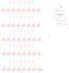

Contents
========

* [PRA1430 > Adafruit NeoPixel Shield PCB](#pra1430--adafruit-neopixel-shield-pcb)
	* [Schematic](#schematic)
	* [PCB](#pcb)
	* [Interactive BOM](#interactive-bom)
	* [OOMP Parts](#oomp-parts)
	* [Images](#images)
	* [Tags](#tags)
  
![][im]
# PRA1430 > Adafruit NeoPixel Shield PCB

- ID: PROJ-ADAF-1430-STAN-01
- Hex ID: PRA1430
- Name: Adafruit
- Description: Adafruit
- Long Link: [http://oom.lt/PROJ-ADAF-1430-STAN-01](http://oom.lt/PROJ-ADAF-1430-STAN-01)
- Short Link: [http://oom.lt/PRA1430](http://oom.lt/PRA1430)

## Schematic
  

## PCB
  

## Interactive BOM

- Interactive BOM page: [ibom.html](https://htmlpreview.github.io/?https://github.com/oomlout/oomlout_OOMP_projects/blob/main/PROJ-ADAF-1430-STAN-01/kicad/bom/ibom.html)

## OOMP Parts
  

|OOMP Parts|
| :---: |
|[C1 CAPC-0805-X-NF100-V50 SMD (0805) 100 nF Capacitor (Ceramic) 50v](https://github.com/oomlout/oomlout_OOMP_parts/tree/main/CAPC-0805-X-NF100-V50/)|
|[C2 CAPC-0805-X-NF100-V50 SMD (0805) 100 nF Capacitor (Ceramic) 50v](https://github.com/oomlout/oomlout_OOMP_parts/tree/main/CAPC-0805-X-NF100-V50/)|
|[C3 CAPC-0805-X-NF100-V50 SMD (0805) 100 nF Capacitor (Ceramic) 50v](https://github.com/oomlout/oomlout_OOMP_parts/tree/main/CAPC-0805-X-NF100-V50/)|
|[C4 CAPC-0805-X-NF100-V50 SMD (0805) 100 nF Capacitor (Ceramic) 50v](https://github.com/oomlout/oomlout_OOMP_parts/tree/main/CAPC-0805-X-NF100-V50/)|
|[C5 CAPC-0805-X-NF100-V50 SMD (0805) 100 nF Capacitor (Ceramic) 50v](https://github.com/oomlout/oomlout_OOMP_parts/tree/main/CAPC-0805-X-NF100-V50/)|
|[C6 CAPC-0805-X-NF100-V50 SMD (0805) 100 nF Capacitor (Ceramic) 50v](https://github.com/oomlout/oomlout_OOMP_parts/tree/main/CAPC-0805-X-NF100-V50/)|
|[C7 CAPC-0805-X-NF100-V50 SMD (0805) 100 nF Capacitor (Ceramic) 50v](https://github.com/oomlout/oomlout_OOMP_parts/tree/main/CAPC-0805-X-NF100-V50/)|
|[C8 CAPC-0805-X-NF100-V50 SMD (0805) 100 nF Capacitor (Ceramic) 50v](https://github.com/oomlout/oomlout_OOMP_parts/tree/main/CAPC-0805-X-NF100-V50/)|
|[C9 CAPC-0805-X-NF100-V50 SMD (0805) 100 nF Capacitor (Ceramic) 50v](https://github.com/oomlout/oomlout_OOMP_parts/tree/main/CAPC-0805-X-NF100-V50/)|
|[C10 CAPC-0805-X-NF100-V50 SMD (0805) 100 nF Capacitor (Ceramic) 50v](https://github.com/oomlout/oomlout_OOMP_parts/tree/main/CAPC-0805-X-NF100-V50/)|
|[C11 CAPC-0805-X-NF100-V50 SMD (0805) 100 nF Capacitor (Ceramic) 50v](https://github.com/oomlout/oomlout_OOMP_parts/tree/main/CAPC-0805-X-NF100-V50/)|
|[C12 CAPC-0805-X-NF100-V50 SMD (0805) 100 nF Capacitor (Ceramic) 50v](https://github.com/oomlout/oomlout_OOMP_parts/tree/main/CAPC-0805-X-NF100-V50/)|
|[C13 CAPC-0805-X-NF100-V50 SMD (0805) 100 nF Capacitor (Ceramic) 50v](https://github.com/oomlout/oomlout_OOMP_parts/tree/main/CAPC-0805-X-NF100-V50/)|
|[C14 CAPC-0805-X-NF100-V50 SMD (0805) 100 nF Capacitor (Ceramic) 50v](https://github.com/oomlout/oomlout_OOMP_parts/tree/main/CAPC-0805-X-NF100-V50/)|
|[C15 CAPC-0805-X-NF100-V50 SMD (0805) 100 nF Capacitor (Ceramic) 50v](https://github.com/oomlout/oomlout_OOMP_parts/tree/main/CAPC-0805-X-NF100-V50/)|
|[C16 CAPC-0805-X-NF100-V50 SMD (0805) 100 nF Capacitor (Ceramic) 50v](https://github.com/oomlout/oomlout_OOMP_parts/tree/main/CAPC-0805-X-NF100-V50/)|
|[C17 CAPC-0805-X-NF100-V50 SMD (0805) 100 nF Capacitor (Ceramic) 50v](https://github.com/oomlout/oomlout_OOMP_parts/tree/main/CAPC-0805-X-NF100-V50/)|
|[C18 CAPC-0805-X-NF100-V50 SMD (0805) 100 nF Capacitor (Ceramic) 50v](https://github.com/oomlout/oomlout_OOMP_parts/tree/main/CAPC-0805-X-NF100-V50/)|
|[C19 CAPC-0805-X-NF100-V50 SMD (0805) 100 nF Capacitor (Ceramic) 50v](https://github.com/oomlout/oomlout_OOMP_parts/tree/main/CAPC-0805-X-NF100-V50/)|
|[C20 CAPC-0805-X-NF100-V50 SMD (0805) 100 nF Capacitor (Ceramic) 50v](https://github.com/oomlout/oomlout_OOMP_parts/tree/main/CAPC-0805-X-NF100-V50/)|
|[C21 CAPC-0805-X-NF100-V50 SMD (0805) 100 nF Capacitor (Ceramic) 50v](https://github.com/oomlout/oomlout_OOMP_parts/tree/main/CAPC-0805-X-NF100-V50/)|
|[C22 CAPC-0805-X-NF100-V50 SMD (0805) 100 nF Capacitor (Ceramic) 50v](https://github.com/oomlout/oomlout_OOMP_parts/tree/main/CAPC-0805-X-NF100-V50/)|
|[C23 CAPC-0805-X-NF100-V50 SMD (0805) 100 nF Capacitor (Ceramic) 50v](https://github.com/oomlout/oomlout_OOMP_parts/tree/main/CAPC-0805-X-NF100-V50/)|
|[C24 CAPC-0805-X-NF100-V50 SMD (0805) 100 nF Capacitor (Ceramic) 50v](https://github.com/oomlout/oomlout_OOMP_parts/tree/main/CAPC-0805-X-NF100-V50/)|
|[C25 CAPC-0805-X-NF100-V50 SMD (0805) 100 nF Capacitor (Ceramic) 50v](https://github.com/oomlout/oomlout_OOMP_parts/tree/main/CAPC-0805-X-NF100-V50/)|
|[C26 CAPC-0805-X-NF100-V50 SMD (0805) 100 nF Capacitor (Ceramic) 50v](https://github.com/oomlout/oomlout_OOMP_parts/tree/main/CAPC-0805-X-NF100-V50/)|
|[C27 CAPC-0805-X-NF100-V50 SMD (0805) 100 nF Capacitor (Ceramic) 50v](https://github.com/oomlout/oomlout_OOMP_parts/tree/main/CAPC-0805-X-NF100-V50/)|
|[C28 CAPC-0805-X-NF100-V50 SMD (0805) 100 nF Capacitor (Ceramic) 50v](https://github.com/oomlout/oomlout_OOMP_parts/tree/main/CAPC-0805-X-NF100-V50/)|
|[C29 CAPC-0805-X-NF100-V50 SMD (0805) 100 nF Capacitor (Ceramic) 50v](https://github.com/oomlout/oomlout_OOMP_parts/tree/main/CAPC-0805-X-NF100-V50/)|
|[C30 CAPC-0805-X-NF100-V50 SMD (0805) 100 nF Capacitor (Ceramic) 50v](https://github.com/oomlout/oomlout_OOMP_parts/tree/main/CAPC-0805-X-NF100-V50/)|
|[C31 CAPC-0805-X-NF100-V50 SMD (0805) 100 nF Capacitor (Ceramic) 50v](https://github.com/oomlout/oomlout_OOMP_parts/tree/main/CAPC-0805-X-NF100-V50/)|
|[C32 CAPC-0805-X-NF100-V50 SMD (0805) 100 nF Capacitor (Ceramic) 50v](https://github.com/oomlout/oomlout_OOMP_parts/tree/main/CAPC-0805-X-NF100-V50/)|
|[C33 CAPC-0805-X-NF100-V50 SMD (0805) 100 nF Capacitor (Ceramic) 50v](https://github.com/oomlout/oomlout_OOMP_parts/tree/main/CAPC-0805-X-NF100-V50/)|
|[C34 CAPC-0805-X-NF100-V50 SMD (0805) 100 nF Capacitor (Ceramic) 50v](https://github.com/oomlout/oomlout_OOMP_parts/tree/main/CAPC-0805-X-NF100-V50/)|
|[C35 CAPC-0805-X-NF100-V50 SMD (0805) 100 nF Capacitor (Ceramic) 50v](https://github.com/oomlout/oomlout_OOMP_parts/tree/main/CAPC-0805-X-NF100-V50/)|
|J1 J1,UNMATCHED-UNMATCHED-X-UNMATCHED-01|
|[JP1 HEAD-I01-X-PI02-01 2.54 mm 2 Pin Header](https://github.com/oomlout/oomlout_OOMP_parts/tree/main/HEAD-I01-X-PI02-01/)|
|JP2 JP2,HEAD-I01-X-PI01-01|
|LED1 LED1,LEDS-UNMATCHED-RGB-K2812-01|
|LED2 LED2,LEDS-UNMATCHED-RGB-K2812-01|
|LED3 LED3,LEDS-UNMATCHED-RGB-K2812-01|
|LED4 LED4,LEDS-UNMATCHED-RGB-K2812-01|
|LED5 LED5,LEDS-UNMATCHED-RGB-K2812-01|
|LED6 LED6,LEDS-UNMATCHED-RGB-K2812-01|
|LED7 LED7,LEDS-UNMATCHED-RGB-K2812-01|
|LED8 LED8,LEDS-UNMATCHED-RGB-K2812-01|
|LED9 LED9,LEDS-UNMATCHED-RGB-K2812-01|
|LED10 LED10,LEDS-UNMATCHED-RGB-K2812-01|
|LED11 LED11,LEDS-UNMATCHED-RGB-K2812-01|
|LED12 LED12,LEDS-UNMATCHED-RGB-K2812-01|
|LED13 LED13,LEDS-UNMATCHED-RGB-K2812-01|
|LED14 LED14,LEDS-UNMATCHED-RGB-K2812-01|
|LED15 LED15,LEDS-UNMATCHED-RGB-K2812-01|
|LED16 LED16,LEDS-UNMATCHED-RGB-K2812-01|
|LED17 LED17,LEDS-UNMATCHED-RGB-K2812-01|
|LED18 LED18,LEDS-UNMATCHED-RGB-K2812-01|
|LED19 LED19,LEDS-UNMATCHED-RGB-K2812-01|
|LED20 LED20,LEDS-UNMATCHED-RGB-K2812-01|
|LED21 LED21,LEDS-UNMATCHED-RGB-K2812-01|
|LED22 LED22,LEDS-UNMATCHED-RGB-K2812-01|
|LED23 LED23,LEDS-UNMATCHED-RGB-K2812-01|
|LED24 LED24,LEDS-UNMATCHED-RGB-K2812-01|
|LED25 LED25,LEDS-UNMATCHED-RGB-K2812-01|
|LED26 LED26,LEDS-UNMATCHED-RGB-K2812-01|
|LED27 LED27,LEDS-UNMATCHED-RGB-K2812-01|
|LED28 LED28,LEDS-UNMATCHED-RGB-K2812-01|
|LED29 LED29,LEDS-UNMATCHED-RGB-K2812-01|
|LED30 LED30,LEDS-UNMATCHED-RGB-K2812-01|
|LED31 LED31,LEDS-UNMATCHED-RGB-K2812-01|
|LED32 LED32,LEDS-UNMATCHED-RGB-K2812-01|
|LED33 LED33,LEDS-UNMATCHED-RGB-K2812-01|
|LED34 LED34,LEDS-UNMATCHED-RGB-K2812-01|
|LED35 LED35,LEDS-UNMATCHED-RGB-K2812-01|
|LED36 LED36,LEDS-UNMATCHED-RGB-K2812-01|
|LED37 LED37,LEDS-UNMATCHED-RGB-K2812-01|
|LED38 LED38,LEDS-UNMATCHED-RGB-K2812-01|
|LED39 LED39,LEDS-UNMATCHED-RGB-K2812-01|
|LED40 LED40,LEDS-UNMATCHED-RGB-K2812-01|
|Q1 Q1,MOSP-SO23-X-UNMATCHED-01|
|R1 R1,RESE-0805-X-UNMATCHED-01|
|SW1 SW1,UNMATCHED-UNMATCHED-X-UNMATCHED-01|
|U1 U1,UNMATCHED-UNMATCHED-X-UNMATCHED-01|

## Images
  
  

|kicadPcb3d|kicadPcb3dFront|kicadPcb3dBack|eagleImage|eagleSchemImage|
| :---: | :---: | :---: | :---: | :---: |
||||||

## Tags

- hexID: PRA1430
- oompType: PROJ
- oompSize: ADAF
- oompColor: 1430
- oompDesc: STAN
- oompIndex: 01
- oompName: Adafruit NeoPixel Shield PCB
- sources: All source files from https://github.com/adafruit/Adafruit-NeoPixel-Shield-PCB (source licence details in srcLicense.md)
- linkBuyPage: http://www.adafruit.com/products/1430
- oompID: PROJ-ADAF-1430-STAN-01
- oompParts: C1,CAPC-0805-X-NF100-V50
- oompParts: C2,CAPC-0805-X-NF100-V50
- oompParts: C3,CAPC-0805-X-NF100-V50
- oompParts: C4,CAPC-0805-X-NF100-V50
- oompParts: C5,CAPC-0805-X-NF100-V50
- oompParts: C6,CAPC-0805-X-NF100-V50
- oompParts: C7,CAPC-0805-X-NF100-V50
- oompParts: C8,CAPC-0805-X-NF100-V50
- oompParts: C9,CAPC-0805-X-NF100-V50
- oompParts: C10,CAPC-0805-X-NF100-V50
- oompParts: C11,CAPC-0805-X-NF100-V50
- oompParts: C12,CAPC-0805-X-NF100-V50
- oompParts: C13,CAPC-0805-X-NF100-V50
- oompParts: C14,CAPC-0805-X-NF100-V50
- oompParts: C15,CAPC-0805-X-NF100-V50
- oompParts: C16,CAPC-0805-X-NF100-V50
- oompParts: C17,CAPC-0805-X-NF100-V50
- oompParts: C18,CAPC-0805-X-NF100-V50
- oompParts: C19,CAPC-0805-X-NF100-V50
- oompParts: C20,CAPC-0805-X-NF100-V50
- oompParts: C21,CAPC-0805-X-NF100-V50
- oompParts: C22,CAPC-0805-X-NF100-V50
- oompParts: C23,CAPC-0805-X-NF100-V50
- oompParts: C24,CAPC-0805-X-NF100-V50
- oompParts: C25,CAPC-0805-X-NF100-V50
- oompParts: C26,CAPC-0805-X-NF100-V50
- oompParts: C27,CAPC-0805-X-NF100-V50
- oompParts: C28,CAPC-0805-X-NF100-V50
- oompParts: C29,CAPC-0805-X-NF100-V50
- oompParts: C30,CAPC-0805-X-NF100-V50
- oompParts: C31,CAPC-0805-X-NF100-V50
- oompParts: C32,CAPC-0805-X-NF100-V50
- oompParts: C33,CAPC-0805-X-NF100-V50
- oompParts: C34,CAPC-0805-X-NF100-V50
- oompParts: C35,CAPC-0805-X-NF100-V50
- oompParts: J1,UNMATCHED-UNMATCHED-X-UNMATCHED-01
- oompParts: JP1,HEAD-I01-X-PI02-01
- oompParts: JP2,HEAD-I01-X-PI01-01
- oompParts: LED1,LEDS-UNMATCHED-RGB-K2812-01
- oompParts: LED2,LEDS-UNMATCHED-RGB-K2812-01
- oompParts: LED3,LEDS-UNMATCHED-RGB-K2812-01
- oompParts: LED4,LEDS-UNMATCHED-RGB-K2812-01
- oompParts: LED5,LEDS-UNMATCHED-RGB-K2812-01
- oompParts: LED6,LEDS-UNMATCHED-RGB-K2812-01
- oompParts: LED7,LEDS-UNMATCHED-RGB-K2812-01
- oompParts: LED8,LEDS-UNMATCHED-RGB-K2812-01
- oompParts: LED9,LEDS-UNMATCHED-RGB-K2812-01
- oompParts: LED10,LEDS-UNMATCHED-RGB-K2812-01
- oompParts: LED11,LEDS-UNMATCHED-RGB-K2812-01
- oompParts: LED12,LEDS-UNMATCHED-RGB-K2812-01
- oompParts: LED13,LEDS-UNMATCHED-RGB-K2812-01
- oompParts: LED14,LEDS-UNMATCHED-RGB-K2812-01
- oompParts: LED15,LEDS-UNMATCHED-RGB-K2812-01
- oompParts: LED16,LEDS-UNMATCHED-RGB-K2812-01
- oompParts: LED17,LEDS-UNMATCHED-RGB-K2812-01
- oompParts: LED18,LEDS-UNMATCHED-RGB-K2812-01
- oompParts: LED19,LEDS-UNMATCHED-RGB-K2812-01
- oompParts: LED20,LEDS-UNMATCHED-RGB-K2812-01
- oompParts: LED21,LEDS-UNMATCHED-RGB-K2812-01
- oompParts: LED22,LEDS-UNMATCHED-RGB-K2812-01
- oompParts: LED23,LEDS-UNMATCHED-RGB-K2812-01
- oompParts: LED24,LEDS-UNMATCHED-RGB-K2812-01
- oompParts: LED25,LEDS-UNMATCHED-RGB-K2812-01
- oompParts: LED26,LEDS-UNMATCHED-RGB-K2812-01
- oompParts: LED27,LEDS-UNMATCHED-RGB-K2812-01
- oompParts: LED28,LEDS-UNMATCHED-RGB-K2812-01
- oompParts: LED29,LEDS-UNMATCHED-RGB-K2812-01
- oompParts: LED30,LEDS-UNMATCHED-RGB-K2812-01
- oompParts: LED31,LEDS-UNMATCHED-RGB-K2812-01
- oompParts: LED32,LEDS-UNMATCHED-RGB-K2812-01
- oompParts: LED33,LEDS-UNMATCHED-RGB-K2812-01
- oompParts: LED34,LEDS-UNMATCHED-RGB-K2812-01
- oompParts: LED35,LEDS-UNMATCHED-RGB-K2812-01
- oompParts: LED36,LEDS-UNMATCHED-RGB-K2812-01
- oompParts: LED37,LEDS-UNMATCHED-RGB-K2812-01
- oompParts: LED38,LEDS-UNMATCHED-RGB-K2812-01
- oompParts: LED39,LEDS-UNMATCHED-RGB-K2812-01
- oompParts: LED40,LEDS-UNMATCHED-RGB-K2812-01
- oompParts: Q1,MOSP-SO23-X-UNMATCHED-01
- oompParts: R1,RESE-0805-X-UNMATCHED-01
- oompParts: SW1,UNMATCHED-UNMATCHED-X-UNMATCHED-01
- oompParts: U1,UNMATCHED-UNMATCHED-X-UNMATCHED-01
- rawParts: C1,,CAP_CERAMIC_0805NO,_0805NO,Ceramic Capacitors,,
- rawParts: C2,,CAP_CERAMIC_0805NO,_0805NO,Ceramic Capacitors,,
- rawParts: C3,,CAP_CERAMIC_0805NO,_0805NO,Ceramic Capacitors,,
- rawParts: C4,,CAP_CERAMIC_0805NO,_0805NO,Ceramic Capacitors,,
- rawParts: C5,,CAP_CERAMIC_0805NO,_0805NO,Ceramic Capacitors,,
- rawParts: C6,,CAP_CERAMIC_0805NO,_0805NO,Ceramic Capacitors,,
- rawParts: C7,,CAP_CERAMIC_0805NO,_0805NO,Ceramic Capacitors,,
- rawParts: C8,,CAP_CERAMIC_0805NO,_0805NO,Ceramic Capacitors,,
- rawParts: C9,,CAP_CERAMIC_0805NO,_0805NO,Ceramic Capacitors,,
- rawParts: C10,,CAP_CERAMIC_0805NO,_0805NO,Ceramic Capacitors,,
- rawParts: C11,,CAP_CERAMIC_0805NO,_0805NO,Ceramic Capacitors,,
- rawParts: C12,,CAP_CERAMIC_0805NO,_0805NO,Ceramic Capacitors,,
- rawParts: C13,,CAP_CERAMIC_0805NO,_0805NO,Ceramic Capacitors,,
- rawParts: C14,,CAP_CERAMIC_0805NO,_0805NO,Ceramic Capacitors,,
- rawParts: C15,,CAP_CERAMIC_0805NO,_0805NO,Ceramic Capacitors,,
- rawParts: C16,,CAP_CERAMIC_0805NO,_0805NO,Ceramic Capacitors,,
- rawParts: C17,,CAP_CERAMIC_0805NO,_0805NO,Ceramic Capacitors,,
- rawParts: C18,,CAP_CERAMIC_0805NO,_0805NO,Ceramic Capacitors,,
- rawParts: C19,,CAP_CERAMIC_0805NO,_0805NO,Ceramic Capacitors,,
- rawParts: C20,,CAP_CERAMIC_0805NO,_0805NO,Ceramic Capacitors,,
- rawParts: C21,,CAP_CERAMIC_0805NO,_0805NO,Ceramic Capacitors,,
- rawParts: C22,,CAP_CERAMIC_0805NO,_0805NO,Ceramic Capacitors,,
- rawParts: C23,,CAP_CERAMIC_0805NO,_0805NO,Ceramic Capacitors,,
- rawParts: C24,,CAP_CERAMIC_0805NO,_0805NO,Ceramic Capacitors,,
- rawParts: C25,,CAP_CERAMIC_0805NO,_0805NO,Ceramic Capacitors,,
- rawParts: C26,,CAP_CERAMIC_0805NO,_0805NO,Ceramic Capacitors,,
- rawParts: C27,,CAP_CERAMIC_0805NO,_0805NO,Ceramic Capacitors,,
- rawParts: C28,,CAP_CERAMIC_0805NO,_0805NO,Ceramic Capacitors,,
- rawParts: C29,,CAP_CERAMIC_0805NO,_0805NO,Ceramic Capacitors,,
- rawParts: C30,,CAP_CERAMIC_0805NO,_0805NO,Ceramic Capacitors,,
- rawParts: C31,,CAP_CERAMIC_0805NO,_0805NO,Ceramic Capacitors,,
- rawParts: C32,,CAP_CERAMIC_0805NO,_0805NO,Ceramic Capacitors,,
- rawParts: C33,,CAP_CERAMIC_0805NO,_0805NO,Ceramic Capacitors,,
- rawParts: C34,,CAP_CERAMIC_0805NO,_0805NO,Ceramic Capacitors,,
- rawParts: C35,,CAP_CERAMIC_0805NO,_0805NO,Ceramic Capacitors,,
- rawParts: FID1,FIDUCIAL,FIDUCIAL,FIDUCIAL_1MM,Fiducial Alignment Points,EXCLUDE,
- rawParts: FID2,FIDUCIAL,FIDUCIAL,FIDUCIAL_1MM,Fiducial Alignment Points,EXCLUDE,
- rawParts: FID3,FIDUCIAL,FIDUCIAL,FIDUCIAL_1MM,Fiducial Alignment Points,EXCLUDE,
- rawParts: J1,1X2-3.5MM,1X2-3.5MM,1X2-3.5MM,3.5mm Terminal block,,
- rawParts: JP1,,HEADER-1X2ROUND,1X02_ROUND,PIN HEADER,,
- rawParts: JP2,,PINHD-1X1CB,1X01-CLEANBIG,Pin header 1x1 for 0.1 spacing,,
- rawParts: LED1,WS2812B5050,WS2812B5050,WS2812B,,,
- rawParts: LED2,WS2812B5050,WS2812B5050,WS2812B,,,
- rawParts: LED3,WS2812B5050,WS2812B5050,WS2812B,,,
- rawParts: LED4,WS2812B5050,WS2812B5050,WS2812B,,,
- rawParts: LED5,WS2812B5050,WS2812B5050,WS2812B,,,
- rawParts: LED6,WS2812B5050,WS2812B5050,WS2812B,,,
- rawParts: LED7,WS2812B5050,WS2812B5050,WS2812B,,,
- rawParts: LED8,WS2812B5050,WS2812B5050,WS2812B,,,
- rawParts: LED9,WS2812B5050,WS2812B5050,WS2812B,,,
- rawParts: LED10,WS2812B5050,WS2812B5050,WS2812B,,,
- rawParts: LED11,WS2812B5050,WS2812B5050,WS2812B,,,
- rawParts: LED12,WS2812B5050,WS2812B5050,WS2812B,,,
- rawParts: LED13,WS2812B5050,WS2812B5050,WS2812B,,,
- rawParts: LED14,WS2812B5050,WS2812B5050,WS2812B,,,
- rawParts: LED15,WS2812B5050,WS2812B5050,WS2812B,,,
- rawParts: LED16,WS2812B5050,WS2812B5050,WS2812B,,,
- rawParts: LED17,WS2812B5050,WS2812B5050,WS2812B,,,
- rawParts: LED18,WS2812B5050,WS2812B5050,WS2812B,,,
- rawParts: LED19,WS2812B5050,WS2812B5050,WS2812B,,,
- rawParts: LED20,WS2812B5050,WS2812B5050,WS2812B,,,
- rawParts: LED21,WS2812B5050,WS2812B5050,WS2812B,,,
- rawParts: LED22,WS2812B5050,WS2812B5050,WS2812B,,,
- rawParts: LED23,WS2812B5050,WS2812B5050,WS2812B,,,
- rawParts: LED24,WS2812B5050,WS2812B5050,WS2812B,,,
- rawParts: LED25,WS2812B5050,WS2812B5050,WS2812B,,,
- rawParts: LED26,WS2812B5050,WS2812B5050,WS2812B,,,
- rawParts: LED27,WS2812B5050,WS2812B5050,WS2812B,,,
- rawParts: LED28,WS2812B5050,WS2812B5050,WS2812B,,,
- rawParts: LED29,WS2812B5050,WS2812B5050,WS2812B,,,
- rawParts: LED30,WS2812B5050,WS2812B5050,WS2812B,,,
- rawParts: LED31,WS2812B5050,WS2812B5050,WS2812B,,,
- rawParts: LED32,WS2812B5050,WS2812B5050,WS2812B,,,
- rawParts: LED33,WS2812B5050,WS2812B5050,WS2812B,,,
- rawParts: LED34,WS2812B5050,WS2812B5050,WS2812B,,,
- rawParts: LED35,WS2812B5050,WS2812B5050,WS2812B,,,
- rawParts: LED36,WS2812B5050,WS2812B5050,WS2812B,,,
- rawParts: LED37,WS2812B5050,WS2812B5050,WS2812B,,,
- rawParts: LED38,WS2812B5050,WS2812B5050,WS2812B,,,
- rawParts: LED39,WS2812B5050,WS2812B5050,WS2812B,,,
- rawParts: LED40,WS2812B5050,WS2812B5050,WS2812B,,,
- rawParts: Q1,IRLML6401,MOSFET-PWIDE,SOT23-WIDE,P-Channel Mosfet,,
- rawParts: R1,,RESISTOR_0805NO,_0805NO,Resistors,,
- rawParts: SJ1,,SOLDERJUMPERCLOSED,SOLDERJUMPER_CLOSEDWIRE,SMD Solder JUMPER,,
- rawParts: SW1,SPST_TACT-EVQQ2,SPST_TACT-EVQQ2,EVQ-Q2,SMT 6mm switch, EVQQ2 series,,
- rawParts: U1,ARDUINOR3-BPLACE,ARDUINOR3-BPLACE,ARDUINOR3-BPLACE,This is a new object for the new Arduino R3 - with extra pins that you may want to use (such as IOref, and duplicated A4/A5,,

[im]: kicadPcb3d_450.png
