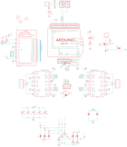

Contents
========

* [PRA1438 > Adafruit Motor Shield V2 PCB](#pra1438--adafruit-motor-shield-v2-pcb)
	* [Schematic](#schematic)
	* [PCB](#pcb)
	* [Interactive BOM](#interactive-bom)
	* [OOMP Parts](#oomp-parts)
	* [Images](#images)
	* [Tags](#tags)
  
![][im]
# PRA1438 > Adafruit Motor Shield V2 PCB

- ID: PROJ-ADAF-1438-STAN-01
- Hex ID: PRA1438
- Name: Adafruit
- Description: Adafruit
- Long Link: [http://oom.lt/PROJ-ADAF-1438-STAN-01](http://oom.lt/PROJ-ADAF-1438-STAN-01)
- Short Link: [http://oom.lt/PRA1438](http://oom.lt/PRA1438)

## Schematic
  

## PCB
  

## Interactive BOM

- Interactive BOM page: [ibom.html](https://htmlpreview.github.io/?https://github.com/oomlout/oomlout_OOMP_projects/blob/main/PROJ-ADAF-1438-STAN-01/kicad/bom/ibom.html)

## OOMP Parts
  

|OOMP Parts|
| :---: |
|UNMATCHED-UNMATCHED-X-UNMATCHED-01 A0, A1, A2, A3, A4, CN1, IC1, IC3, PWR, Q1, U$1, U$5, U2|
|[CAPC-0805-X-NF100-V50  SMD (0805) 100 nF Capacitor (Ceramic) 50v  C1, C2, C3](https://github.com/oomlout/oomlout_OOMP_parts/tree/main/CAPC-0805-X-NF100-V50/)|
|CAPE-PANC-X-UNMATCHED-01 C4, C5|
|[CAPC-0805-X-UF10-V10  SMD (0805) 10 uF Capacitor (Ceramic) 10v  C6, C10](https://github.com/oomlout/oomlout_OOMP_parts/tree/main/CAPC-0805-X-UF10-V10/)|
|CAPE-PANC-X-UF100-01 C9|
|[HEAD-I01-X-PI08-01  2.54 mm 8 Pin Header  D0-7, JP2](https://github.com/oomlout/oomlout_OOMP_parts/tree/main/HEAD-I01-X-PI08-01/)|
|TERS-35D-L-UNMATCHED-01 J1, J2|
|[HEAD-I01-X-PI04-01  2.54 mm 4 Pin Header  JP1](https://github.com/oomlout/oomlout_OOMP_parts/tree/main/HEAD-I01-X-PI04-01/)|
|[HEAD-I01-X-PI10-01  2.54 mm 10 Pin Header  JP3](https://github.com/oomlout/oomlout_OOMP_parts/tree/main/HEAD-I01-X-PI10-01/)|
|[LEDS-0805-G-STAN-01  SMD (0805) Green LED  LED1](https://github.com/oomlout/oomlout_OOMP_parts/tree/main/LEDS-0805-G-STAN-01/)|
|[TERS-35D-L-PI02-01  3.5 mm 2 Pin Blue Screw Terminal  MPOWER, SERPWR](https://github.com/oomlout/oomlout_OOMP_parts/tree/main/TERS-35D-L-PI02-01/)|
|[RESE-0805-X-O103-01  SMD (0805) 10k Ohm Resistor  R1, R2, R3, R5, R6, R7, R8](https://github.com/oomlout/oomlout_OOMP_parts/tree/main/RESE-0805-X-O103-01/)|
|[RESE-0805-X-O102-01  SMD (0805) 1k Ohm Resistor  R4](https://github.com/oomlout/oomlout_OOMP_parts/tree/main/RESE-0805-X-O102-01/)|
|[HEAD-I01-X-PI03-01  2.54 mm 3 Pin Header  SERVO1, SERVO2](https://github.com/oomlout/oomlout_OOMP_parts/tree/main/HEAD-I01-X-PI03-01/)|

## Images
  
  

|bominteractivefront|bominteractiveback|kicadPcb3d|kicadPcb3dFront|kicadPcb3dBack|eagleImage|eagleSchemImage|pcbdraw|pcbdrawback|
| :---: | :---: | :---: | :---: | :---: | :---: | :---: | :---: | :---: |
||||||||||

## Tags

- hexID: PRA1438
- oompType: PROJ
- oompSize: ADAF
- oompColor: 1438
- oompDesc: STAN
- oompIndex: 01
- oompName: Adafruit Motor Shield V2 PCB
- sources: All source files from https://github.com/adafruit/Adafruit-Motor-Shield-V2-PCB (source licence details in srcLicense.md)
- linkBuyPage: http://www.adafruit.com/products/1438
- oompID: PROJ-ADAF-1438-STAN-01
- oompParts: A0,UNMATCHED-UNMATCHED-X-UNMATCHED-01
- oompParts: A1,UNMATCHED-UNMATCHED-X-UNMATCHED-01
- oompParts: A2,UNMATCHED-UNMATCHED-X-UNMATCHED-01
- oompParts: A3,UNMATCHED-UNMATCHED-X-UNMATCHED-01
- oompParts: A4,UNMATCHED-UNMATCHED-X-UNMATCHED-01
- oompParts: C1,CAPC-0805-X-NF100-V50
- oompParts: C2,CAPC-0805-X-NF100-V50
- oompParts: C3,CAPC-0805-X-NF100-V50
- oompParts: C4,CAPE-PANC-X-UNMATCHED-01
- oompParts: C5,CAPE-PANC-X-UNMATCHED-01
- oompParts: C6,CAPC-0805-X-UF10-V10
- oompParts: C9,CAPE-PANC-X-UF100-01
- oompParts: C10,CAPC-0805-X-UF10-V10
- oompParts: CN1,UNMATCHED-UNMATCHED-X-UNMATCHED-01
- oompParts: D0-7,HEAD-I01-X-PI08-01
- oompParts: IC1,UNMATCHED-UNMATCHED-X-UNMATCHED-01
- oompParts: IC3,UNMATCHED-UNMATCHED-X-UNMATCHED-01
- oompParts: J1,TERS-35D-L-UNMATCHED-01
- oompParts: J2,TERS-35D-L-UNMATCHED-01
- oompParts: JP1,HEAD-I01-X-PI04-01
- oompParts: JP2,HEAD-I01-X-PI08-01
- oompParts: JP3,HEAD-I01-X-PI10-01
- oompParts: LED1,LEDS-0805-G-STAN-01
- oompParts: MPOWER,TERS-35D-L-PI02-01
- oompParts: PWR,UNMATCHED-UNMATCHED-X-UNMATCHED-01
- oompParts: Q1,UNMATCHED-UNMATCHED-X-UNMATCHED-01
- oompParts: R1,RESE-0805-X-O103-01
- oompParts: R2,RESE-0805-X-O103-01
- oompParts: R3,RESE-0805-X-O103-01
- oompParts: R4,RESE-0805-X-O102-01
- oompParts: R5,RESE-0805-X-O103-01
- oompParts: R6,RESE-0805-X-O103-01
- oompParts: R7,RESE-0805-X-O103-01
- oompParts: R8,RESE-0805-X-O103-01
- oompParts: SERPWR,TERS-35D-L-PI02-01
- oompParts: SERVO1,HEAD-I01-X-PI03-01
- oompParts: SERVO2,HEAD-I01-X-PI03-01
- oompParts: U$1,UNMATCHED-UNMATCHED-X-UNMATCHED-01
- oompParts: U$5,UNMATCHED-UNMATCHED-X-UNMATCHED-01
- oompParts: U2,UNMATCHED-UNMATCHED-X-UNMATCHED-01
- rawParts: A0,,SJ,SJ,SMD solder JUMPER,,
- rawParts: A1,,SJ,SJ,SMD solder JUMPER,,
- rawParts: A2,,SJ,SJ,SMD solder JUMPER,,
- rawParts: A3,,SJ,SJ,SMD solder JUMPER,,
- rawParts: A4,,SJ,SJ,SMD solder JUMPER,,
- rawParts: C1,0.1uF,C-USC0805K,C0805K,CAPACITOR, American symbol,,
- rawParts: C2,0.1uF,C-USC0805K,C0805K,CAPACITOR, American symbol,,
- rawParts: C3,0.1uF,C-USC0805K,C0805K,CAPACITOR, American symbol,,
- rawParts: C4,22uF/16v,CAP_ELECTROLYTICPANASONIC_C,PANASONIC_C,Electrolytic Capacitors,,
- rawParts: C5,22uF/16v,CAP_ELECTROLYTICPANASONIC_C,PANASONIC_C,Electrolytic Capacitors,,
- rawParts: C6,10uF,C-USC0805K,C0805K,CAPACITOR, American symbol,,
- rawParts: C9,100uF,CPOL-USC,PANASONIC_C,POLARIZED CAPACITOR, American symbol,,
- rawParts: C10,10uF,C-USC0805K,C0805K,CAPACITOR, American symbol,,
- rawParts: CN1,1X4-CLEANBIG,1X4-CLEANBIG,1X04-CLEANBIG,4-pin connector,,
- rawParts: D0-7,,PINHD-1X8CLEANBIG,1X08-CLEANBIG,PIN HEADER,,
- rawParts: IC1,TB6612FNG,TB6612FNG,SSOP24,TB6612FNG,,
- rawParts: IC3,TB6612FNG,TB6612FNG,SSOP24,TB6612FNG,,
- rawParts: J1,1X5,1X5,1X05-3.5MM,,,
- rawParts: J2,1X5,1X5,1X05-3.5MM,,,
- rawParts: JP1,,HEADER-1X476MIL,1X04_ROUND_76,PIN HEADER,,
- rawParts: JP2,,PINHD-1X8CLEANBIG,1X08-CLEANBIG,PIN HEADER,,
- rawParts: JP3,,HEADER-1X1070MIL,1X10_ROUND70,PIN HEADER,,
- rawParts: LED1,Green,LEDCHIP-LED0805,CHIP-LED0805,LED,,
- rawParts: MPOWER,1X2-3.5MM,1X2-3.5MM,1X2-3.5MM,3.5mm Terminal block,,
- rawParts: PWR,,JP1E,JP1,JUMPER,,
- rawParts: Q1,AOD417,IRFR5305,D-PAK_TO252AA,HEXFET Power MOSFET,,
- rawParts: R1,10k,R-US_R0805,R0805,RESISTOR, American symbol,,
- rawParts: R2,10k,R-US_R0805,R0805,RESISTOR, American symbol,,
- rawParts: R3,10k,R-US_R0805,R0805,RESISTOR, American symbol,,
- rawParts: R4,1K,R-US_R0805,R0805,RESISTOR, American symbol,,
- rawParts: R5,10k,R-US_R0805,R0805,RESISTOR, American symbol,,
- rawParts: R6,10k,R-US_R0805,R0805,RESISTOR, American symbol,,
- rawParts: R7,10K,R-US_R0805,R0805,RESISTOR, American symbol,,
- rawParts: R8,10K,R-US_R0805,R0805,RESISTOR, American symbol,,
- rawParts: SERPWR,1X2-3.5MM,1X2-3.5MM,1X2-3.5MM,3.5mm Terminal block,,
- rawParts: SERVO1,,PINHD-1X3,1X03,PIN HEADER,,
- rawParts: SERVO2,,PINHD-1X3,1X03,PIN HEADER,,
- rawParts: SJ1,,SOLDERJUMPER_2WAY,SOLDERJUMPER_2WAY_OPEN_NOPASTE,2-Way Solder Jumper,,
- rawParts: TP1,,TESTPOINTROUND2MM,TESTPOINT_ROUND_2MM,Test Point,,
- rawParts: TP2,,TESTPOINTROUND2MM,TESTPOINT_ROUND_2MM,Test Point,,
- rawParts: TP3,,TESTPOINTROUND2MM,TESTPOINT_ROUND_2MM,Test Point,,
- rawParts: TP4,,TESTPOINTROUND2MM,TESTPOINT_ROUND_2MM,Test Point,,
- rawParts: TP5,,TESTPOINTROUND2MM,TESTPOINT_ROUND_2MM,Test Point,,
- rawParts: U$1,ARDUINO_R3_ICSP,ARDUINO_R3_ICSP,ARDUINOR3_ICSP,,,
- rawParts: U$2,FIDUCIAL,FIDUCIAL,FIDUCIAL_1MM,For use by pick and place machines to calibrate the vision/machine, 1mm,,
- rawParts: U$3,FIDUCIAL,FIDUCIAL,FIDUCIAL_1MM,For use by pick and place machines to calibrate the vision/machine, 1mm,,
- rawParts: U$4,FIDUCIAL,FIDUCIAL,FIDUCIAL_1MM,For use by pick and place machines to calibrate the vision/machine, 1mm,,
- rawParts: U$5,ARDUINO_R3_ICSP,ARDUINO_R3_ICSP,ARDUINOR3_ICSP,,,
- rawParts: U2,PCA9685,PCA9685,TSSOP28,PCA9685 - 16 Channel 12-Bit I2C PWM Controller,,

[im]: kicadPcb3d_450.png
