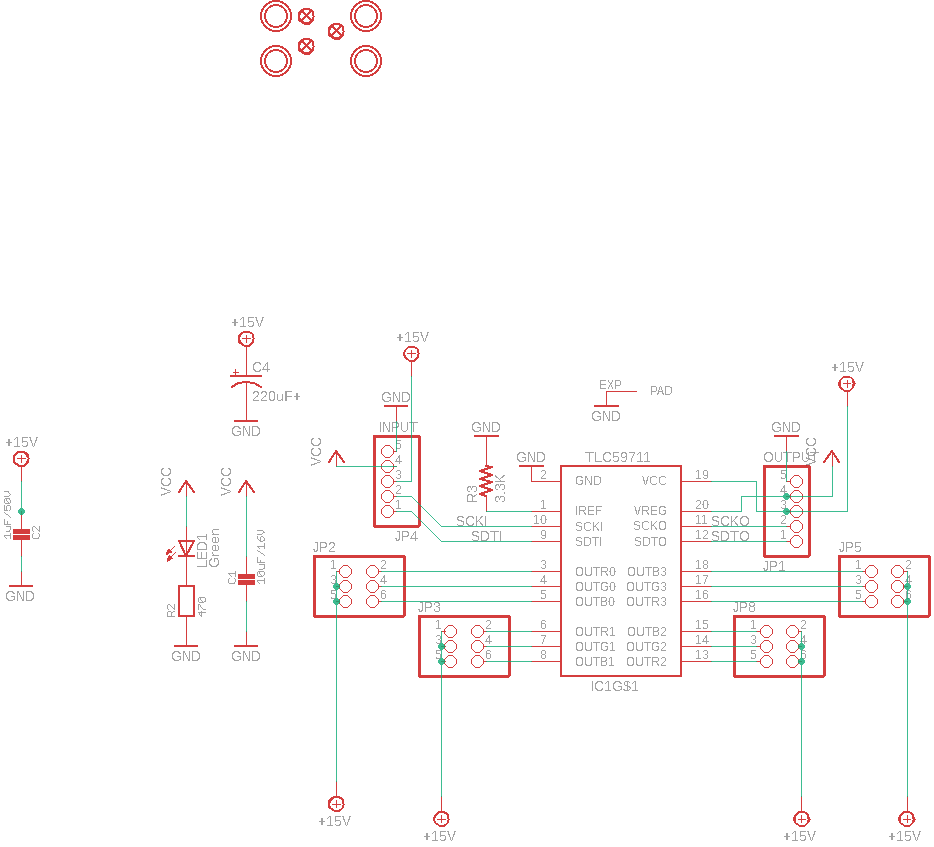
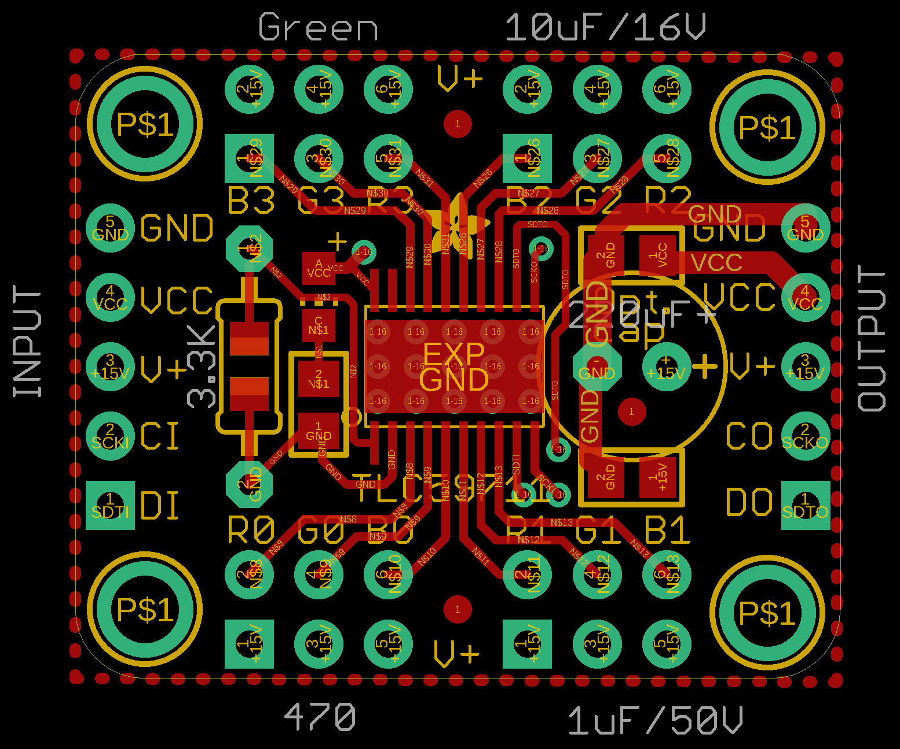
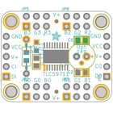
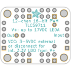
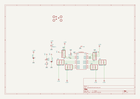
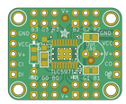
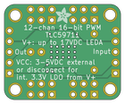

Contents
========

* [PRA1455 > Adafruit TLC59711 Breakout PCB](#pra1455--adafruit-tlc59711-breakout-pcb)
	* [Schematic](#schematic)
	* [PCB](#pcb)
	* [Interactive BOM](#interactive-bom)
	* [OOMP Parts](#oomp-parts)
	* [Images](#images)
	* [Tags](#tags)
  
![][im]
# PRA1455 > Adafruit TLC59711 Breakout PCB

- ID: PROJ-ADAF-1455-STAN-01
- Hex ID: PRA1455
- Name: Adafruit
- Description: Adafruit
- Long Link: [http://oom.lt/PROJ-ADAF-1455-STAN-01](http://oom.lt/PROJ-ADAF-1455-STAN-01)
- Short Link: [http://oom.lt/PRA1455](http://oom.lt/PRA1455)

## Schematic
  

## PCB
  

## Interactive BOM

- Interactive BOM page: [ibom.html](https://htmlpreview.github.io/?https://github.com/oomlout/oomlout_OOMP_projects/blob/main/PROJ-ADAF-1455-STAN-01/kicad/bom/ibom.html)

## OOMP Parts
  

|OOMP ID|Name|Identifier|
| :---: | :---: | :---: |
|CAPC-0805-X-UNMATCHED-01||C1, C2|
|CAPX-UNMATCHED-X-UNMATCHED-01||C4|
|UNMATCHED-UNMATCHED-X-UNMATCHED-01||IC1|
|[HEAD-I01-X-PI05-01](https://github.com/oomlout/oomlout_OOMP_parts/tree/main/HEAD-I01-X-PI05-01/)|[2.54 mm 5 Pin Header](https://github.com/oomlout/oomlout_OOMP_parts/tree/main/HEAD-I01-X-PI05-01/)|[JP1, JP4](https://github.com/oomlout/oomlout_OOMP_parts/tree/main/HEAD-I01-X-PI05-01/)|
|[HEAD-I01-X-PI2X03-01](https://github.com/oomlout/oomlout_OOMP_parts/tree/main/HEAD-I01-X-PI2X03-01/)|[2.54 mm 6 Pin (2x3) Header](https://github.com/oomlout/oomlout_OOMP_parts/tree/main/HEAD-I01-X-PI2X03-01/)|[JP2, JP3, JP5, JP8](https://github.com/oomlout/oomlout_OOMP_parts/tree/main/HEAD-I01-X-PI2X03-01/)|
|[LEDS-0805-G-STAN-01](https://github.com/oomlout/oomlout_OOMP_parts/tree/main/LEDS-0805-G-STAN-01/)|[SMD (0805) Green LED](https://github.com/oomlout/oomlout_OOMP_parts/tree/main/LEDS-0805-G-STAN-01/)|[LED1](https://github.com/oomlout/oomlout_OOMP_parts/tree/main/LEDS-0805-G-STAN-01/)|
|[RESE-0805-X-O471-01](https://github.com/oomlout/oomlout_OOMP_parts/tree/main/RESE-0805-X-O471-01/)|[SMD (0805) 470 Ohm Resistor](https://github.com/oomlout/oomlout_OOMP_parts/tree/main/RESE-0805-X-O471-01/)|[R2](https://github.com/oomlout/oomlout_OOMP_parts/tree/main/RESE-0805-X-O471-01/)|
|RESE-UNMATCHED-X-UNMATCHED-01||R3|

## Images
  
  

|bominteractivefront|bominteractiveback|kicadPcb3d|kicadPcb3dFront|kicadPcb3dBack|kicadSchem|eagleImage|eagleSchemImage|pcbdraw|pcbdrawback|
| :---: | :---: | :---: | :---: | :---: | :---: | :---: | :---: | :---: | :---: |
|||||||||||

## Tags

- hexID: PRA1455
- oompType: PROJ
- oompSize: ADAF
- oompColor: 1455
- oompDesc: STAN
- oompIndex: 01
- oompName: Adafruit TLC59711 Breakout PCB
- sources: All source files from https://github.com/adafruit/Adafruit-TLC59711-Breakout-PCB (source licence details in srcLicense.md)
- linkBuyPage: http://www.adafruit.com/products/1455
- oompID: PROJ-ADAF-1455-STAN-01
- oompParts: C1,CAPC-0805-X-UNMATCHED-01
- oompParts: C2,CAPC-0805-X-UNMATCHED-01
- oompParts: C4,CAPX-UNMATCHED-X-UNMATCHED-01
- oompParts: IC1,UNMATCHED-UNMATCHED-X-UNMATCHED-01
- oompParts: JP1,HEAD-I01-X-PI05-01
- oompParts: JP2,HEAD-I01-X-PI2X03-01
- oompParts: JP3,HEAD-I01-X-PI2X03-01
- oompParts: JP4,HEAD-I01-X-PI05-01
- oompParts: JP5,HEAD-I01-X-PI2X03-01
- oompParts: JP8,HEAD-I01-X-PI2X03-01
- oompParts: LED1,LEDS-0805-G-STAN-01
- oompParts: R2,RESE-0805-X-O471-01
- oompParts: R3,RESE-UNMATCHED-X-UNMATCHED-01
- rawParts: C1,10uF/16V,CAP_CERAMIC0805,0805,Ceramic Capacitors,,
- rawParts: C2,1uF/50V,CAP_CERAMIC0805,0805,Ceramic Capacitors,,
- rawParts: C4,220uF+,CPOL-USE2.5-7,E2,5-7,POLARIZED CAPACITOR, American symbol,,
- rawParts: FID1,FIDUCIAL,FIDUCIAL,FIDUCIAL_1MM,Fiducial Alignment Points,EXCLUDE,
- rawParts: FID2,FIDUCIAL,FIDUCIAL,FIDUCIAL_1MM,Fiducial Alignment Points,EXCLUDE,
- rawParts: FID3,FIDUCIAL,FIDUCIAL,FIDUCIAL_1MM,Fiducial Alignment Points,EXCLUDE,
- rawParts: IC1,TLC59711,TLC59711,HTSSOP20DAP,,,
- rawParts: JP1,OUTPUT,HEADER-1X570MIL,1X05_ROUND_70,PIN HEADER,,
- rawParts: JP2,,HEADER-2X3,2X03_ROUND_70MIL,PIN HEADER,,
- rawParts: JP3,,HEADER-2X3,2X03_ROUND_70MIL,PIN HEADER,,
- rawParts: JP4,INPUT,HEADER-1X570MIL,1X05_ROUND_70,PIN HEADER,,
- rawParts: JP5,,HEADER-2X3,2X03_ROUND_70MIL,PIN HEADER,,
- rawParts: JP8,,HEADER-2X3,2X03_ROUND_70MIL,PIN HEADER,,
- rawParts: LED1,Green,LEDCHIP-LED0805,CHIP-LED0805,LED,,
- rawParts: R2,470,RESISTOR0805,0805,Resistors,,
- rawParts: R3,3.3K,R-US_FLIPFLOP7,0805-THM-7,RESISTOR, American symbol,,
- rawParts: U$1,MOUNTINGHOLE2.5,MOUNTINGHOLE2.5,MOUNTINGHOLE_2.5_PLATED,Mounting Hole,,
- rawParts: U$2,MOUNTINGHOLE2.5,MOUNTINGHOLE2.5,MOUNTINGHOLE_2.5_PLATED,Mounting Hole,,
- rawParts: U$3,MOUNTINGHOLE2.5,MOUNTINGHOLE2.5,MOUNTINGHOLE_2.5_PLATED,Mounting Hole,,
- rawParts: U$4,MOUNTINGHOLE2.5,MOUNTINGHOLE2.5,MOUNTINGHOLE_2.5_PLATED,Mounting Hole,,

[im]: kicadPcb3d_450.png
