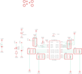

Contents
========

* [PRA1455 > Adafruit](#pra1455--adafruit)
	* [Schematic](#schematic)
	* [Interactive BOM](#interactive-bom)
	* [OOMP Parts](#oomp-parts)
	* [Images](#images)
	* [Tags](#tags)
  
![][im]
# PRA1455 > Adafruit

- ID: PROJ-ADAF-1455-STAN-01
- Hex ID: PRA1455
- Name: Adafruit
- Description: Adafruit
- Long Link: [http://oom.lt/PROJ-ADAF-1455-STAN-01](http://oom.lt/PROJ-ADAF-1455-STAN-01)
- Long Link: [http://oom.lt/PRA1455](http://oom.lt/PRA1455)

## Schematic
  
![][schem]
## Interactive BOM

- Interactive BOM page: [ibom.html](https://htmlpreview.github.io/?https://github.com/oomlout/oomlout_OOMP_projects/blob/main/PROJ-ADAF-1455-STAN-01/kicad/bom/ibom.html)

## OOMP Parts
  

|OOMP Parts|
| :---: |
|C1,UNMATCHED-UNMATCHED-UNMATCHED-UNMATCHED-UNMATCHED,C1,10uF/16V,CAP_CERAMIC0805,0805,Ceramic Capacitors,,|
|C2,UNMATCHED-UNMATCHED-UNMATCHED-UNMATCHED-UNMATCHED,C2,1uF/50V,CAP_CERAMIC0805,0805,Ceramic Capacitors,,|
|C4,UNMATCHED-UNMATCHED-UNMATCHED-UNMATCHED-UNMATCHED,C4,220uF+,CPOL-USE2.5-7,E2,5-7,POLARIZED CAPACITOR, American symbol,,|
|IC1,UNMATCHED-UNMATCHED-UNMATCHED-UNMATCHED-UNMATCHED,FID1,FIDUCIAL,FIDUCIAL,FIDUCIAL_1MM,Fiducial Alignment Points,EXCLUDE,|
|JP1,UNMATCHED-UNMATCHED-UNMATCHED-UNMATCHED-UNMATCHED,FID2,FIDUCIAL,FIDUCIAL,FIDUCIAL_1MM,Fiducial Alignment Points,EXCLUDE,|
|JP2,UNMATCHED-UNMATCHED-UNMATCHED-UNMATCHED-UNMATCHED,FID3,FIDUCIAL,FIDUCIAL,FIDUCIAL_1MM,Fiducial Alignment Points,EXCLUDE,|
|JP3,UNMATCHED-UNMATCHED-UNMATCHED-UNMATCHED-UNMATCHED,IC1,TLC59711,TLC59711,HTSSOP20DAP,,,|
|JP4,UNMATCHED-UNMATCHED-UNMATCHED-UNMATCHED-UNMATCHED,JP1,OUTPUT,HEADER-1X570MIL,1X05_ROUND_70,PIN HEADER,,|
|JP5,UNMATCHED-UNMATCHED-UNMATCHED-UNMATCHED-UNMATCHED,JP2,,HEADER-2X3,2X03_ROUND_70MIL,PIN HEADER,,|
|JP8,UNMATCHED-UNMATCHED-UNMATCHED-UNMATCHED-UNMATCHED,JP3,,HEADER-2X3,2X03_ROUND_70MIL,PIN HEADER,,|
|LED1,UNMATCHED-UNMATCHED-UNMATCHED-UNMATCHED-UNMATCHED,JP4,INPUT,HEADER-1X570MIL,1X05_ROUND_70,PIN HEADER,,|
|R2,UNMATCHED-UNMATCHED-UNMATCHED-UNMATCHED-UNMATCHED,JP5,,HEADER-2X3,2X03_ROUND_70MIL,PIN HEADER,,|
|R3,UNMATCHED-UNMATCHED-UNMATCHED-UNMATCHED-UNMATCHED,JP8,,HEADER-2X3,2X03_ROUND_70MIL,PIN HEADER,,|
|U$1,UNMATCHED-UNMATCHED-UNMATCHED-UNMATCHED-UNMATCHED,LED1,Green,LEDCHIP-LED0805,CHIP-LED0805,LED,,|
|U$2,UNMATCHED-UNMATCHED-UNMATCHED-UNMATCHED-UNMATCHED,R2,470,RESISTOR0805,0805,Resistors,,|
|U$3,UNMATCHED-UNMATCHED-UNMATCHED-UNMATCHED-UNMATCHED,R3,3.3K,R-US_FLIPFLOP7,0805-THM-7,RESISTOR, American symbol,,|
|U$4,UNMATCHED-UNMATCHED-UNMATCHED-UNMATCHED-UNMATCHED,U$1,MOUNTINGHOLE2.5,MOUNTINGHOLE2.5,MOUNTINGHOLE_2.5_PLATED,Mounting Hole,,|

## Images
  
  

|kicadPcb3d|kicadPcb3dFront|kicadPcb3dBack|eagleImage|eagleSchemImage|
| :---: | :---: | :---: | :---: | :---: |
||||||

## Tags

- hexID: PRA1455
- oompType: PROJ
- oompSize: ADAF
- oompColor: 1455
- oompDesc: STAN
- oompIndex: 01
- oompName: Adafruit TLC59711 Breakout PCB
- sources: All source files from https://github.com/adafruit/Adafruit-TLC59711-Breakout-PCB (source licence details in srcLicense.md)
- linkBuyPage: http://www.adafruit.com/products/1455
- oompID: PROJ-ADAF-1455-STAN-01
- oompParts: C1,UNMATCHED-UNMATCHED-UNMATCHED-UNMATCHED-UNMATCHED
- oompParts: C2,UNMATCHED-UNMATCHED-UNMATCHED-UNMATCHED-UNMATCHED
- oompParts: C4,UNMATCHED-UNMATCHED-UNMATCHED-UNMATCHED-UNMATCHED
- oompParts: IC1,UNMATCHED-UNMATCHED-UNMATCHED-UNMATCHED-UNMATCHED
- oompParts: JP1,UNMATCHED-UNMATCHED-UNMATCHED-UNMATCHED-UNMATCHED
- oompParts: JP2,UNMATCHED-UNMATCHED-UNMATCHED-UNMATCHED-UNMATCHED
- oompParts: JP3,UNMATCHED-UNMATCHED-UNMATCHED-UNMATCHED-UNMATCHED
- oompParts: JP4,UNMATCHED-UNMATCHED-UNMATCHED-UNMATCHED-UNMATCHED
- oompParts: JP5,UNMATCHED-UNMATCHED-UNMATCHED-UNMATCHED-UNMATCHED
- oompParts: JP8,UNMATCHED-UNMATCHED-UNMATCHED-UNMATCHED-UNMATCHED
- oompParts: LED1,UNMATCHED-UNMATCHED-UNMATCHED-UNMATCHED-UNMATCHED
- oompParts: R2,UNMATCHED-UNMATCHED-UNMATCHED-UNMATCHED-UNMATCHED
- oompParts: R3,UNMATCHED-UNMATCHED-UNMATCHED-UNMATCHED-UNMATCHED
- oompParts: U$1,UNMATCHED-UNMATCHED-UNMATCHED-UNMATCHED-UNMATCHED
- oompParts: U$2,UNMATCHED-UNMATCHED-UNMATCHED-UNMATCHED-UNMATCHED
- oompParts: U$3,UNMATCHED-UNMATCHED-UNMATCHED-UNMATCHED-UNMATCHED
- oompParts: U$4,UNMATCHED-UNMATCHED-UNMATCHED-UNMATCHED-UNMATCHED
- rawParts: C1,10uF/16V,CAP_CERAMIC0805,0805,Ceramic Capacitors,,
- rawParts: C2,1uF/50V,CAP_CERAMIC0805,0805,Ceramic Capacitors,,
- rawParts: C4,220uF+,CPOL-USE2.5-7,E2,5-7,POLARIZED CAPACITOR, American symbol,,
- rawParts: FID1,FIDUCIAL,FIDUCIAL,FIDUCIAL_1MM,Fiducial Alignment Points,EXCLUDE,
- rawParts: FID2,FIDUCIAL,FIDUCIAL,FIDUCIAL_1MM,Fiducial Alignment Points,EXCLUDE,
- rawParts: FID3,FIDUCIAL,FIDUCIAL,FIDUCIAL_1MM,Fiducial Alignment Points,EXCLUDE,
- rawParts: IC1,TLC59711,TLC59711,HTSSOP20DAP,,,
- rawParts: JP1,OUTPUT,HEADER-1X570MIL,1X05_ROUND_70,PIN HEADER,,
- rawParts: JP2,,HEADER-2X3,2X03_ROUND_70MIL,PIN HEADER,,
- rawParts: JP3,,HEADER-2X3,2X03_ROUND_70MIL,PIN HEADER,,
- rawParts: JP4,INPUT,HEADER-1X570MIL,1X05_ROUND_70,PIN HEADER,,
- rawParts: JP5,,HEADER-2X3,2X03_ROUND_70MIL,PIN HEADER,,
- rawParts: JP8,,HEADER-2X3,2X03_ROUND_70MIL,PIN HEADER,,
- rawParts: LED1,Green,LEDCHIP-LED0805,CHIP-LED0805,LED,,
- rawParts: R2,470,RESISTOR0805,0805,Resistors,,
- rawParts: R3,3.3K,R-US_FLIPFLOP7,0805-THM-7,RESISTOR, American symbol,,
- rawParts: U$1,MOUNTINGHOLE2.5,MOUNTINGHOLE2.5,MOUNTINGHOLE_2.5_PLATED,Mounting Hole,,
- rawParts: U$2,MOUNTINGHOLE2.5,MOUNTINGHOLE2.5,MOUNTINGHOLE_2.5_PLATED,Mounting Hole,,
- rawParts: U$3,MOUNTINGHOLE2.5,MOUNTINGHOLE2.5,MOUNTINGHOLE_2.5_PLATED,Mounting Hole,,
- rawParts: U$4,MOUNTINGHOLE2.5,MOUNTINGHOLE2.5,MOUNTINGHOLE_2.5_PLATED,Mounting Hole,,

[im]: kicadPcb3d_450.png
[schem]: eagleSchemImage.png
