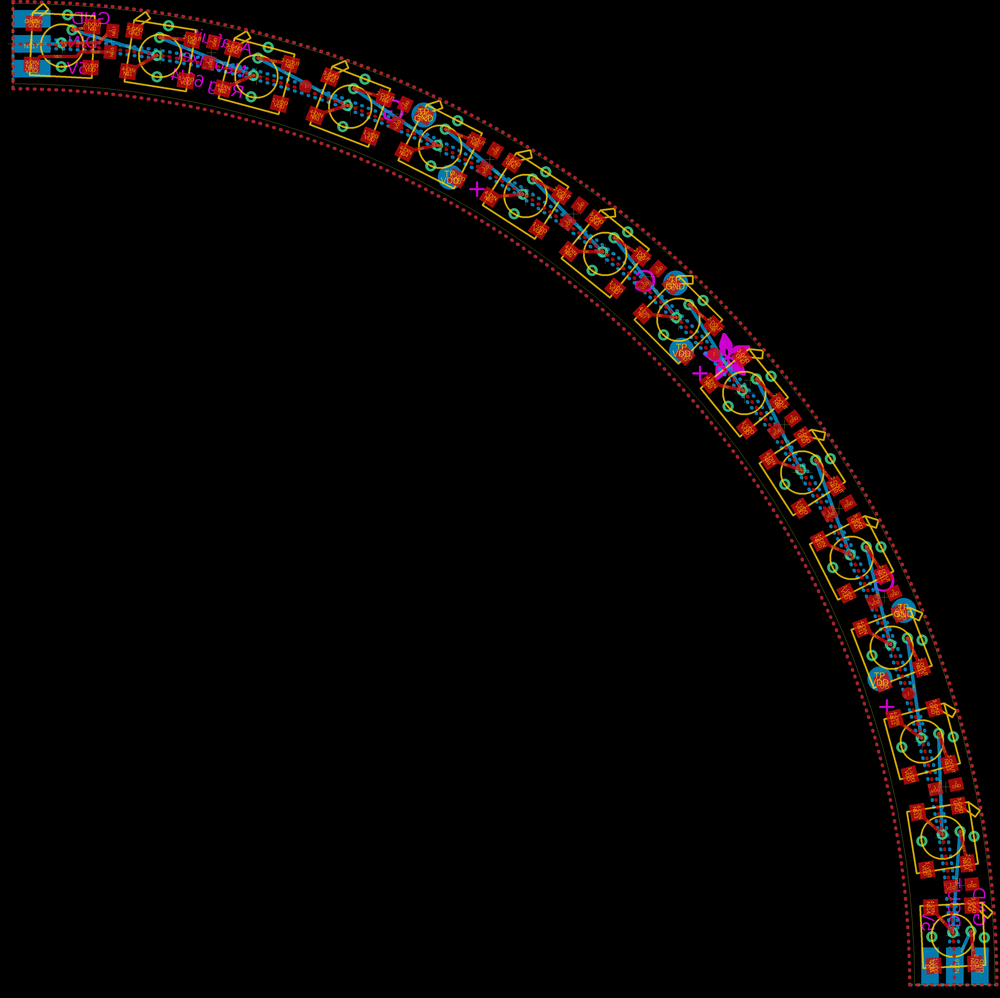
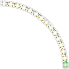
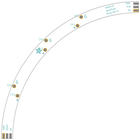
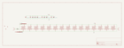
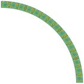
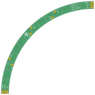

Contents
========

* [PRA1463 > Adafruit NeoPixel Ring](#pra1463--adafruit-neopixel-ring)
	* [Schematic](#schematic)
	* [PCB](#pcb)
	* [Interactive BOM](#interactive-bom)
	* [OOMP Parts](#oomp-parts)
	* [Images](#images)
	* [Tags](#tags)
  
![][im]
# PRA1463 > Adafruit NeoPixel Ring

- ID: PROJ-ADAF-1463-STAN-01
- Hex ID: PRA1463
- Name: Adafruit 1463
- Description: Adafruit 1463
- Long Link: [http://oom.lt/PROJ-ADAF-1463-STAN-01](http://oom.lt/PROJ-ADAF-1463-STAN-01)
- Short Link: [http://oom.lt/PRA1463](http://oom.lt/PRA1463)

## Schematic
  

## PCB
  

## Interactive BOM

- Interactive BOM page: [ibom.html](https://htmlpreview.github.io/?https://github.com/oomlout/oomlout_OOMP_projects/blob/main/PROJ-ADAF-1463-STAN-01/kicad/bom/ibom.html)

## OOMP Parts
  

|OOMP ID|Name|Identifier|
| :---: | :---: | :---: |
|[CAPC-0603-X-NF100-V50](https://github.com/oomlout/oomlout_OOMP_parts/tree/main/CAPC-0603-X-NF100-V50/)|[SMD (0603) 100 nF Capacitor (Ceramic) 50v](https://github.com/oomlout/oomlout_OOMP_parts/tree/main/CAPC-0603-X-NF100-V50/)|[C2, C4, C5, C6, C7, C9, C10, C11, C13, C14](https://github.com/oomlout/oomlout_OOMP_parts/tree/main/CAPC-0603-X-NF100-V50/)|
|[LEDS-5050-RGB-K2812-01](https://github.com/oomlout/oomlout_OOMP_parts/tree/main/LEDS-5050-RGB-K2812-01/)|[SMD (5050) Smart Controller (WS2812B) RGB LED](https://github.com/oomlout/oomlout_OOMP_parts/tree/main/LEDS-5050-RGB-K2812-01/)|[LED1, LED2, LED3, LED4, LED5, LED6, LED7, LED8, LED9, LED10, LED11, LED12, LED13, LED14, LED15](https://github.com/oomlout/oomlout_OOMP_parts/tree/main/LEDS-5050-RGB-K2812-01/)|
|RESE-0603-X-UNMATCHED-01||R1|
|UNMATCHED-UNMATCHED-X-UNMATCHED-01||U$1, U$2|

## Images
  
  

|bominteractivefront|bominteractiveback|kicadPcb3d|kicadPcb3dFront|kicadPcb3dBack|kicadSchem|eagleImage|eagleSchemImage|pcbdraw|pcbdrawback|
| :---: | :---: | :---: | :---: | :---: | :---: | :---: | :---: | :---: | :---: |
|||||||||||

## Tags

- hexID: PRA1463
- oompType: PROJ
- oompSize: ADAF
- oompColor: 1463
- oompDesc: STAN
- oompIndex: 01
- oompName: Adafruit NeoPixel Ring
- sources: All source files from https://github.com/adafruit/Adafruit-NeoPixel-Ring (source licence details in srcLicense.md)
- linkBuyPage: http://www.adafruit.com/products/1463
- oompID: PROJ-ADAF-1463-STAN-01
- oompParts: C2,CAPC-0603-X-NF100-V50
- oompParts: C4,CAPC-0603-X-NF100-V50
- oompParts: C5,CAPC-0603-X-NF100-V50
- oompParts: C6,CAPC-0603-X-NF100-V50
- oompParts: C7,CAPC-0603-X-NF100-V50
- oompParts: C9,CAPC-0603-X-NF100-V50
- oompParts: C10,CAPC-0603-X-NF100-V50
- oompParts: C11,CAPC-0603-X-NF100-V50
- oompParts: C13,CAPC-0603-X-NF100-V50
- oompParts: C14,CAPC-0603-X-NF100-V50
- oompParts: LED1,LEDS-5050-RGB-K2812-01
- oompParts: LED2,LEDS-5050-RGB-K2812-01
- oompParts: LED3,LEDS-5050-RGB-K2812-01
- oompParts: LED4,LEDS-5050-RGB-K2812-01
- oompParts: LED5,LEDS-5050-RGB-K2812-01
- oompParts: LED6,LEDS-5050-RGB-K2812-01
- oompParts: LED7,LEDS-5050-RGB-K2812-01
- oompParts: LED8,LEDS-5050-RGB-K2812-01
- oompParts: LED9,LEDS-5050-RGB-K2812-01
- oompParts: LED10,LEDS-5050-RGB-K2812-01
- oompParts: LED11,LEDS-5050-RGB-K2812-01
- oompParts: LED12,LEDS-5050-RGB-K2812-01
- oompParts: LED13,LEDS-5050-RGB-K2812-01
- oompParts: LED14,LEDS-5050-RGB-K2812-01
- oompParts: LED15,LEDS-5050-RGB-K2812-01
- oompParts: R1,RESE-0603-X-UNMATCHED-01
- oompParts: U$1,UNMATCHED-UNMATCHED-X-UNMATCHED-01
- oompParts: U$2,UNMATCHED-UNMATCHED-X-UNMATCHED-01
- rawParts: C2,,C-EUC0603,C0603,CAPACITOR, European symbol,,,
- rawParts: C4,,C-EUC0603,C0603,CAPACITOR, European symbol,,,
- rawParts: C5,,C-EUC0603,C0603,CAPACITOR, European symbol,,,
- rawParts: C6,,C-EUC0603,C0603,CAPACITOR, European symbol,,,
- rawParts: C7,,C-EUC0603,C0603,CAPACITOR, European symbol,,,
- rawParts: C9,,C-EUC0603,C0603,CAPACITOR, European symbol,,,
- rawParts: C10,,C-EUC0603,C0603,CAPACITOR, European symbol,,,
- rawParts: C11,,C-EUC0603,C0603,CAPACITOR, European symbol,,,
- rawParts: C13,,C-EUC0603,C0603,CAPACITOR, European symbol,,,
- rawParts: C14,,C-EUC0603,C0603,CAPACITOR, European symbol,,,
- rawParts: FID1,FIDUCIAL,FIDUCIAL,FIDUCIAL_1MM,Fiducial Alignment Points,EXCLUDE,,
- rawParts: FID2,FIDUCIAL,FIDUCIAL,FIDUCIAL_1MM,Fiducial Alignment Points,EXCLUDE,,
- rawParts: FID3,FIDUCIAL,FIDUCIAL,FIDUCIAL_1MM,Fiducial Alignment Points,EXCLUDE,,
- rawParts: LED1,WS2812B5050-NARROW,WS2812B5050-NARROW,WS2812B-NARROW,,,,
- rawParts: LED2,WS2812B5050-NARROW,WS2812B5050-NARROW,WS2812B-NARROW,,,,
- rawParts: LED3,WS2812B5050-NARROW,WS2812B5050-NARROW,WS2812B-NARROW,,,,
- rawParts: LED4,WS2812B5050-NARROW,WS2812B5050-NARROW,WS2812B-NARROW,,,,
- rawParts: LED5,WS2812B5050-NARROW,WS2812B5050-NARROW,WS2812B-NARROW,,,,
- rawParts: LED6,WS2812B5050-NARROW,WS2812B5050-NARROW,WS2812B-NARROW,,,,
- rawParts: LED7,WS2812B5050-NARROW,WS2812B5050-NARROW,WS2812B-NARROW,,,,
- rawParts: LED8,WS2812B5050-NARROW,WS2812B5050-NARROW,WS2812B-NARROW,,,,
- rawParts: LED9,WS2812B5050-NARROW,WS2812B5050-NARROW,WS2812B-NARROW,,,,
- rawParts: LED10,WS2812B5050-NARROW,WS2812B5050-NARROW,WS2812B-NARROW,,,,
- rawParts: LED11,WS2812B5050-NARROW,WS2812B5050-NARROW,WS2812B-NARROW,,,,
- rawParts: LED12,WS2812B5050-NARROW,WS2812B5050-NARROW,WS2812B-NARROW,,,,
- rawParts: LED13,WS2812B5050-NARROW,WS2812B5050-NARROW,WS2812B-NARROW,,,,
- rawParts: LED14,WS2812B5050-NARROW,WS2812B5050-NARROW,WS2812B-NARROW,,,,
- rawParts: LED15,WS2812B5050-NARROW,WS2812B5050-NARROW,WS2812B-NARROW,,,,
- rawParts: R1,470 ohm,RESISTOR_0603_NOOUT,0603-NO,Resistors,,,
- rawParts: TP1,TPTP20R,TPTP20R,TP20R,Test pad,,,
- rawParts: TP2,TPTP20R,TPTP20R,TP20R,Test pad,,,
- rawParts: TP3,TPTP20R,TPTP20R,TP20R,Test pad,,,
- rawParts: TP4,TPTP20R,TPTP20R,TP20R,Test pad,,,
- rawParts: TP5,TPTP20R,TPTP20R,TP20R,Test pad,,,
- rawParts: TP6,TPTP20R,TPTP20R,TP20R,Test pad,,,
- rawParts: U$1,RING_END_CONN_X3,RING_END_CONN_X3,RING_END_CONN_X3,,,,
- rawParts: U$2,RING_END_CONN_X3,RING_END_CONN_X3,RING_END_CONN_X3,,,,

[im]: kicadPcb3d_450.png
