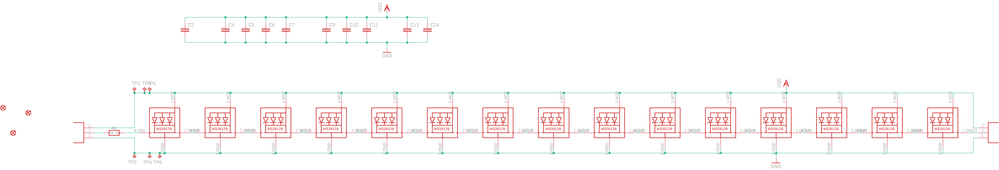

Contents
========

* [PRA1463 > Adafruit](#pra1463--adafruit)
	* [Schematic](#schematic)
	* [Interactive BOM](#interactive-bom)
	* [OOMP Parts](#oomp-parts)
	* [Images](#images)
	* [Tags](#tags)
  
![][im]
# PRA1463 > Adafruit

- ID: PROJ-ADAF-1463-STAN-01
- Hex ID: PRA1463
- Name: Adafruit
- Description: Adafruit
- Long Link: [http://oom.lt/PROJ-ADAF-1463-STAN-01](http://oom.lt/PROJ-ADAF-1463-STAN-01)
- Short Link: [http://oom.lt/PRA1463](http://oom.lt/PRA1463)

## Schematic
  

## Interactive BOM

- Interactive BOM page: [ibom.html](https://htmlpreview.github.io/?https://github.com/oomlout/oomlout_OOMP_projects/blob/main/PROJ-ADAF-1463-STAN-01/kicad/bom/ibom.html)

## OOMP Parts
  

|OOMP Parts|
| :---: |
|C2,UNMATCHED-UNMATCHED-UNMATCHED-UNMATCHED-UNMATCHED,C2,,C-EUC0603,C0603,CAPACITOR, European symbol,,,|
|C4,UNMATCHED-UNMATCHED-UNMATCHED-UNMATCHED-UNMATCHED,C4,,C-EUC0603,C0603,CAPACITOR, European symbol,,,|
|C5,UNMATCHED-UNMATCHED-UNMATCHED-UNMATCHED-UNMATCHED,C5,,C-EUC0603,C0603,CAPACITOR, European symbol,,,|
|C6,UNMATCHED-UNMATCHED-UNMATCHED-UNMATCHED-UNMATCHED,C6,,C-EUC0603,C0603,CAPACITOR, European symbol,,,|
|C7,UNMATCHED-UNMATCHED-UNMATCHED-UNMATCHED-UNMATCHED,C7,,C-EUC0603,C0603,CAPACITOR, European symbol,,,|
|C9,UNMATCHED-UNMATCHED-UNMATCHED-UNMATCHED-UNMATCHED,C9,,C-EUC0603,C0603,CAPACITOR, European symbol,,,|
|C10,UNMATCHED-UNMATCHED-UNMATCHED-UNMATCHED-UNMATCHED,C10,,C-EUC0603,C0603,CAPACITOR, European symbol,,,|
|C11,UNMATCHED-UNMATCHED-UNMATCHED-UNMATCHED-UNMATCHED,C11,,C-EUC0603,C0603,CAPACITOR, European symbol,,,|
|C13,UNMATCHED-UNMATCHED-UNMATCHED-UNMATCHED-UNMATCHED,C13,,C-EUC0603,C0603,CAPACITOR, European symbol,,,|
|C14,UNMATCHED-UNMATCHED-UNMATCHED-UNMATCHED-UNMATCHED,C14,,C-EUC0603,C0603,CAPACITOR, European symbol,,,|
|LED1,UNMATCHED-UNMATCHED-UNMATCHED-UNMATCHED-UNMATCHED,FID1,FIDUCIAL,FIDUCIAL,FIDUCIAL_1MM,Fiducial Alignment Points,EXCLUDE,,|
|LED2,UNMATCHED-UNMATCHED-UNMATCHED-UNMATCHED-UNMATCHED,FID2,FIDUCIAL,FIDUCIAL,FIDUCIAL_1MM,Fiducial Alignment Points,EXCLUDE,,|
|LED3,UNMATCHED-UNMATCHED-UNMATCHED-UNMATCHED-UNMATCHED,FID3,FIDUCIAL,FIDUCIAL,FIDUCIAL_1MM,Fiducial Alignment Points,EXCLUDE,,|
|LED4,UNMATCHED-UNMATCHED-UNMATCHED-UNMATCHED-UNMATCHED,LED1,WS2812B5050-NARROW,WS2812B5050-NARROW,WS2812B-NARROW,,,,|
|LED5,UNMATCHED-UNMATCHED-UNMATCHED-UNMATCHED-UNMATCHED,LED2,WS2812B5050-NARROW,WS2812B5050-NARROW,WS2812B-NARROW,,,,|
|LED6,UNMATCHED-UNMATCHED-UNMATCHED-UNMATCHED-UNMATCHED,LED3,WS2812B5050-NARROW,WS2812B5050-NARROW,WS2812B-NARROW,,,,|
|LED7,UNMATCHED-UNMATCHED-UNMATCHED-UNMATCHED-UNMATCHED,LED4,WS2812B5050-NARROW,WS2812B5050-NARROW,WS2812B-NARROW,,,,|
|LED8,UNMATCHED-UNMATCHED-UNMATCHED-UNMATCHED-UNMATCHED,LED5,WS2812B5050-NARROW,WS2812B5050-NARROW,WS2812B-NARROW,,,,|
|LED9,UNMATCHED-UNMATCHED-UNMATCHED-UNMATCHED-UNMATCHED,LED6,WS2812B5050-NARROW,WS2812B5050-NARROW,WS2812B-NARROW,,,,|
|LED10,UNMATCHED-UNMATCHED-UNMATCHED-UNMATCHED-UNMATCHED,LED7,WS2812B5050-NARROW,WS2812B5050-NARROW,WS2812B-NARROW,,,,|
|LED11,UNMATCHED-UNMATCHED-UNMATCHED-UNMATCHED-UNMATCHED,LED8,WS2812B5050-NARROW,WS2812B5050-NARROW,WS2812B-NARROW,,,,|
|LED12,UNMATCHED-UNMATCHED-UNMATCHED-UNMATCHED-UNMATCHED,LED9,WS2812B5050-NARROW,WS2812B5050-NARROW,WS2812B-NARROW,,,,|
|LED13,UNMATCHED-UNMATCHED-UNMATCHED-UNMATCHED-UNMATCHED,LED10,WS2812B5050-NARROW,WS2812B5050-NARROW,WS2812B-NARROW,,,,|
|LED14,UNMATCHED-UNMATCHED-UNMATCHED-UNMATCHED-UNMATCHED,LED11,WS2812B5050-NARROW,WS2812B5050-NARROW,WS2812B-NARROW,,,,|
|LED15,UNMATCHED-UNMATCHED-UNMATCHED-UNMATCHED-UNMATCHED,LED12,WS2812B5050-NARROW,WS2812B5050-NARROW,WS2812B-NARROW,,,,|
|R1,UNMATCHED-UNMATCHED-UNMATCHED-UNMATCHED-UNMATCHED,LED13,WS2812B5050-NARROW,WS2812B5050-NARROW,WS2812B-NARROW,,,,|
|TP1,UNMATCHED-UNMATCHED-UNMATCHED-UNMATCHED-UNMATCHED,LED14,WS2812B5050-NARROW,WS2812B5050-NARROW,WS2812B-NARROW,,,,|
|TP2,UNMATCHED-UNMATCHED-UNMATCHED-UNMATCHED-UNMATCHED,LED15,WS2812B5050-NARROW,WS2812B5050-NARROW,WS2812B-NARROW,,,,|
|TP3,UNMATCHED-UNMATCHED-UNMATCHED-UNMATCHED-UNMATCHED,R1,470 ohm,RESISTOR_0603_NOOUT,0603-NO,Resistors,,,|
|TP4,UNMATCHED-UNMATCHED-UNMATCHED-UNMATCHED-UNMATCHED,TP1,TPTP20R,TPTP20R,TP20R,Test pad,,,|
|TP5,UNMATCHED-UNMATCHED-UNMATCHED-UNMATCHED-UNMATCHED,TP2,TPTP20R,TPTP20R,TP20R,Test pad,,,|
|TP6,UNMATCHED-UNMATCHED-UNMATCHED-UNMATCHED-UNMATCHED,TP3,TPTP20R,TPTP20R,TP20R,Test pad,,,|
|U$1,UNMATCHED-UNMATCHED-UNMATCHED-UNMATCHED-UNMATCHED,TP4,TPTP20R,TPTP20R,TP20R,Test pad,,,|
|U$2,UNMATCHED-UNMATCHED-UNMATCHED-UNMATCHED-UNMATCHED,TP5,TPTP20R,TPTP20R,TP20R,Test pad,,,|

## Images
  
  

|kicadPcb3d|kicadPcb3dFront|kicadPcb3dBack|eagleImage|eagleSchemImage|
| :---: | :---: | :---: | :---: | :---: |
||||||

## Tags

- hexID: PRA1463
- oompType: PROJ
- oompSize: ADAF
- oompColor: 1463
- oompDesc: STAN
- oompIndex: 01
- oompName: Adafruit NeoPixel Ring
- sources: All source files from https://github.com/adafruit/Adafruit-NeoPixel-Ring (source licence details in srcLicense.md)
- linkBuyPage: http://www.adafruit.com/products/1463
- oompID: PROJ-ADAF-1463-STAN-01
- oompParts: C2,UNMATCHED-UNMATCHED-UNMATCHED-UNMATCHED-UNMATCHED
- oompParts: C4,UNMATCHED-UNMATCHED-UNMATCHED-UNMATCHED-UNMATCHED
- oompParts: C5,UNMATCHED-UNMATCHED-UNMATCHED-UNMATCHED-UNMATCHED
- oompParts: C6,UNMATCHED-UNMATCHED-UNMATCHED-UNMATCHED-UNMATCHED
- oompParts: C7,UNMATCHED-UNMATCHED-UNMATCHED-UNMATCHED-UNMATCHED
- oompParts: C9,UNMATCHED-UNMATCHED-UNMATCHED-UNMATCHED-UNMATCHED
- oompParts: C10,UNMATCHED-UNMATCHED-UNMATCHED-UNMATCHED-UNMATCHED
- oompParts: C11,UNMATCHED-UNMATCHED-UNMATCHED-UNMATCHED-UNMATCHED
- oompParts: C13,UNMATCHED-UNMATCHED-UNMATCHED-UNMATCHED-UNMATCHED
- oompParts: C14,UNMATCHED-UNMATCHED-UNMATCHED-UNMATCHED-UNMATCHED
- oompParts: LED1,UNMATCHED-UNMATCHED-UNMATCHED-UNMATCHED-UNMATCHED
- oompParts: LED2,UNMATCHED-UNMATCHED-UNMATCHED-UNMATCHED-UNMATCHED
- oompParts: LED3,UNMATCHED-UNMATCHED-UNMATCHED-UNMATCHED-UNMATCHED
- oompParts: LED4,UNMATCHED-UNMATCHED-UNMATCHED-UNMATCHED-UNMATCHED
- oompParts: LED5,UNMATCHED-UNMATCHED-UNMATCHED-UNMATCHED-UNMATCHED
- oompParts: LED6,UNMATCHED-UNMATCHED-UNMATCHED-UNMATCHED-UNMATCHED
- oompParts: LED7,UNMATCHED-UNMATCHED-UNMATCHED-UNMATCHED-UNMATCHED
- oompParts: LED8,UNMATCHED-UNMATCHED-UNMATCHED-UNMATCHED-UNMATCHED
- oompParts: LED9,UNMATCHED-UNMATCHED-UNMATCHED-UNMATCHED-UNMATCHED
- oompParts: LED10,UNMATCHED-UNMATCHED-UNMATCHED-UNMATCHED-UNMATCHED
- oompParts: LED11,UNMATCHED-UNMATCHED-UNMATCHED-UNMATCHED-UNMATCHED
- oompParts: LED12,UNMATCHED-UNMATCHED-UNMATCHED-UNMATCHED-UNMATCHED
- oompParts: LED13,UNMATCHED-UNMATCHED-UNMATCHED-UNMATCHED-UNMATCHED
- oompParts: LED14,UNMATCHED-UNMATCHED-UNMATCHED-UNMATCHED-UNMATCHED
- oompParts: LED15,UNMATCHED-UNMATCHED-UNMATCHED-UNMATCHED-UNMATCHED
- oompParts: R1,UNMATCHED-UNMATCHED-UNMATCHED-UNMATCHED-UNMATCHED
- oompParts: TP1,UNMATCHED-UNMATCHED-UNMATCHED-UNMATCHED-UNMATCHED
- oompParts: TP2,UNMATCHED-UNMATCHED-UNMATCHED-UNMATCHED-UNMATCHED
- oompParts: TP3,UNMATCHED-UNMATCHED-UNMATCHED-UNMATCHED-UNMATCHED
- oompParts: TP4,UNMATCHED-UNMATCHED-UNMATCHED-UNMATCHED-UNMATCHED
- oompParts: TP5,UNMATCHED-UNMATCHED-UNMATCHED-UNMATCHED-UNMATCHED
- oompParts: TP6,UNMATCHED-UNMATCHED-UNMATCHED-UNMATCHED-UNMATCHED
- oompParts: U$1,UNMATCHED-UNMATCHED-UNMATCHED-UNMATCHED-UNMATCHED
- oompParts: U$2,UNMATCHED-UNMATCHED-UNMATCHED-UNMATCHED-UNMATCHED
- rawParts: C2,,C-EUC0603,C0603,CAPACITOR, European symbol,,,
- rawParts: C4,,C-EUC0603,C0603,CAPACITOR, European symbol,,,
- rawParts: C5,,C-EUC0603,C0603,CAPACITOR, European symbol,,,
- rawParts: C6,,C-EUC0603,C0603,CAPACITOR, European symbol,,,
- rawParts: C7,,C-EUC0603,C0603,CAPACITOR, European symbol,,,
- rawParts: C9,,C-EUC0603,C0603,CAPACITOR, European symbol,,,
- rawParts: C10,,C-EUC0603,C0603,CAPACITOR, European symbol,,,
- rawParts: C11,,C-EUC0603,C0603,CAPACITOR, European symbol,,,
- rawParts: C13,,C-EUC0603,C0603,CAPACITOR, European symbol,,,
- rawParts: C14,,C-EUC0603,C0603,CAPACITOR, European symbol,,,
- rawParts: FID1,FIDUCIAL,FIDUCIAL,FIDUCIAL_1MM,Fiducial Alignment Points,EXCLUDE,,
- rawParts: FID2,FIDUCIAL,FIDUCIAL,FIDUCIAL_1MM,Fiducial Alignment Points,EXCLUDE,,
- rawParts: FID3,FIDUCIAL,FIDUCIAL,FIDUCIAL_1MM,Fiducial Alignment Points,EXCLUDE,,
- rawParts: LED1,WS2812B5050-NARROW,WS2812B5050-NARROW,WS2812B-NARROW,,,,
- rawParts: LED2,WS2812B5050-NARROW,WS2812B5050-NARROW,WS2812B-NARROW,,,,
- rawParts: LED3,WS2812B5050-NARROW,WS2812B5050-NARROW,WS2812B-NARROW,,,,
- rawParts: LED4,WS2812B5050-NARROW,WS2812B5050-NARROW,WS2812B-NARROW,,,,
- rawParts: LED5,WS2812B5050-NARROW,WS2812B5050-NARROW,WS2812B-NARROW,,,,
- rawParts: LED6,WS2812B5050-NARROW,WS2812B5050-NARROW,WS2812B-NARROW,,,,
- rawParts: LED7,WS2812B5050-NARROW,WS2812B5050-NARROW,WS2812B-NARROW,,,,
- rawParts: LED8,WS2812B5050-NARROW,WS2812B5050-NARROW,WS2812B-NARROW,,,,
- rawParts: LED9,WS2812B5050-NARROW,WS2812B5050-NARROW,WS2812B-NARROW,,,,
- rawParts: LED10,WS2812B5050-NARROW,WS2812B5050-NARROW,WS2812B-NARROW,,,,
- rawParts: LED11,WS2812B5050-NARROW,WS2812B5050-NARROW,WS2812B-NARROW,,,,
- rawParts: LED12,WS2812B5050-NARROW,WS2812B5050-NARROW,WS2812B-NARROW,,,,
- rawParts: LED13,WS2812B5050-NARROW,WS2812B5050-NARROW,WS2812B-NARROW,,,,
- rawParts: LED14,WS2812B5050-NARROW,WS2812B5050-NARROW,WS2812B-NARROW,,,,
- rawParts: LED15,WS2812B5050-NARROW,WS2812B5050-NARROW,WS2812B-NARROW,,,,
- rawParts: R1,470 ohm,RESISTOR_0603_NOOUT,0603-NO,Resistors,,,
- rawParts: TP1,TPTP20R,TPTP20R,TP20R,Test pad,,,
- rawParts: TP2,TPTP20R,TPTP20R,TP20R,Test pad,,,
- rawParts: TP3,TPTP20R,TPTP20R,TP20R,Test pad,,,
- rawParts: TP4,TPTP20R,TPTP20R,TP20R,Test pad,,,
- rawParts: TP5,TPTP20R,TPTP20R,TP20R,Test pad,,,
- rawParts: TP6,TPTP20R,TPTP20R,TP20R,Test pad,,,
- rawParts: U$1,RING_END_CONN_X3,RING_END_CONN_X3,RING_END_CONN_X3,,,,
- rawParts: U$2,RING_END_CONN_X3,RING_END_CONN_X3,RING_END_CONN_X3,,,,

[im]: kicadPcb3d_450.png
