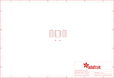

Contents
========

* [PRA1465 > Adafruit ISP SWD and JTAG Breakout PCBs](#pra1465--adafruit-isp-swd-and-jtag-breakout-pcbs)
	* [Schematic](#schematic)
	* [PCB](#pcb)
	* [Interactive BOM](#interactive-bom)
	* [OOMP Parts](#oomp-parts)
	* [Images](#images)
	* [Tags](#tags)
  
![][im]
# PRA1465 > Adafruit ISP SWD and JTAG Breakout PCBs

- ID: PROJ-ADAF-1465-STAN-01
- Hex ID: PRA1465
- Name: Adafruit
- Description: Adafruit
- Long Link: [http://oom.lt/PROJ-ADAF-1465-STAN-01](http://oom.lt/PROJ-ADAF-1465-STAN-01)
- Short Link: [http://oom.lt/PRA1465](http://oom.lt/PRA1465)

## Schematic
  

## PCB
  

## Interactive BOM

- Interactive BOM page: [ibom.html](https://htmlpreview.github.io/?https://github.com/oomlout/oomlout_OOMP_projects/blob/main/PROJ-ADAF-1465-STAN-01/kicad/bom/ibom.html)

## OOMP Parts
  

|OOMP ID|Name|Identifier|
| :---: | :---: | :---: |
|[HEAD-I01-X-PI05-01](https://github.com/oomlout/oomlout_OOMP_parts/tree/main/HEAD-I01-X-PI05-01/)|[2.54 mm 5 Pin Header](https://github.com/oomlout/oomlout_OOMP_parts/tree/main/HEAD-I01-X-PI05-01/)|[JP1, JP2](https://github.com/oomlout/oomlout_OOMP_parts/tree/main/HEAD-I01-X-PI05-01/)|
|UNMATCHED-UNMATCHED-X-UNMATCHED-01||X1|

## Images
  
  

|bominteractivefront|bominteractiveback|kicadPcb3d|kicadPcb3dFront|kicadPcb3dBack|eagleImage|eagleSchemImage|pcbdraw|pcbdrawback|
| :---: | :---: | :---: | :---: | :---: | :---: | :---: | :---: | :---: |
||||||||||

## Tags

- hexID: PRA1465
- oompType: PROJ
- oompSize: ADAF
- oompColor: 1465
- oompDesc: STAN
- oompIndex: 01
- oompName: Adafruit ISP SWD and JTAG Breakout PCBs
- sources: All source files from https://github.com/adafruit/Adafruit-ISP-SWD-and-JTAG-Breakout-PCBs (source licence details in srcLicense.md)
- linkBuyPage: http://www.adafruit.com/products/1465
- oompID: PROJ-ADAF-1465-STAN-01
- oompParts: JP1,HEAD-I01-X-PI05-01
- oompParts: JP2,HEAD-I01-X-PI05-01
- oompParts: X1,UNMATCHED-UNMATCHED-X-UNMATCHED-01
- rawParts: FID1,FIDUCIAL,FIDUCIAL,FIDUCIAL_1MM,Fiducial Alignment Points,EXCLUDE,
- rawParts: FID2,FIDUCIAL,FIDUCIAL,FIDUCIAL_1MM,Fiducial Alignment Points,EXCLUDE,
- rawParts: JP1,,HEADER-1X576MIL_FULL,1X05_ROUND_FULL_76,PIN HEADER,,
- rawParts: JP2,,HEADER-1X576MIL_FULL,1X05_ROUND_FULL_76,PIN HEADER,,
- rawParts: X1,20317,JTAG-CORTEXBOXPOSTS,2X05_1.27MM_BOX_POSTS,Serial Wire (SW-DP) Connector,,

[im]: kicadPcb3d_450.png
