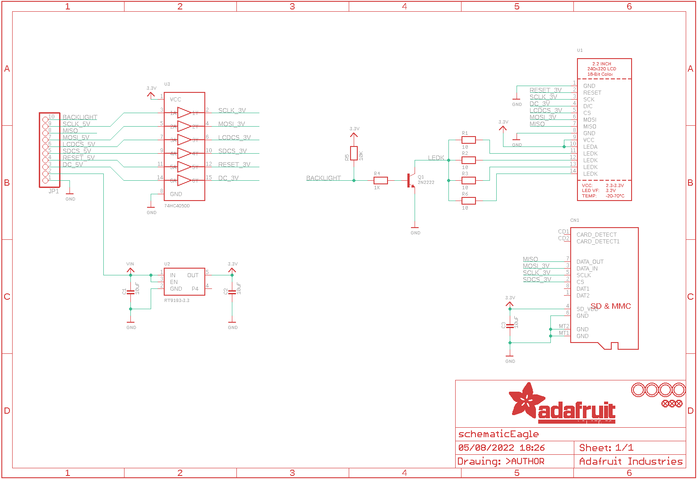
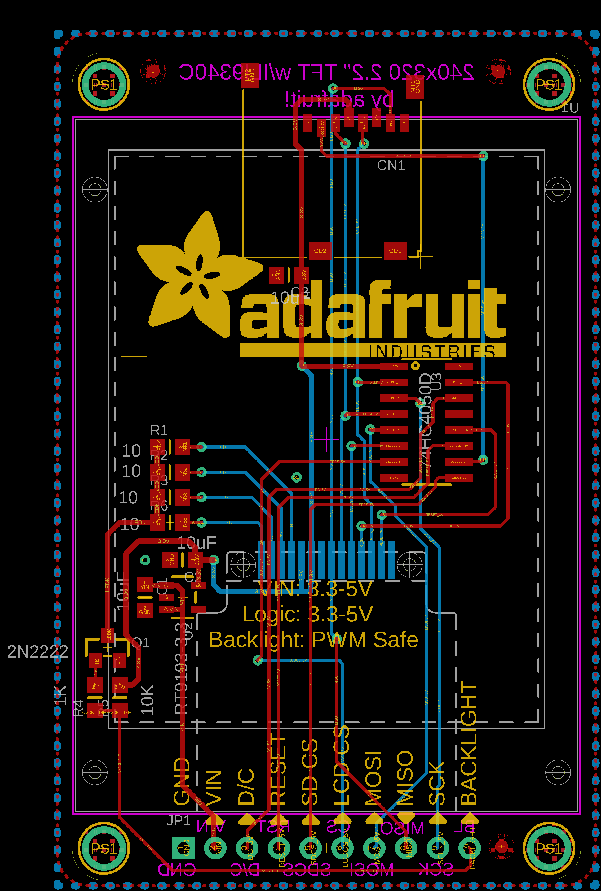

Contents
========

* [PRA1480 > Adafruit 2.2 SPI TFT](#pra1480--adafruit-22-spi-tft)
	* [Schematic](#schematic)
	* [PCB](#pcb)
	* [Interactive BOM](#interactive-bom)
	* [OOMP Parts](#oomp-parts)
	* [Images](#images)
	* [Tags](#tags)
  
![][im]
# PRA1480 > Adafruit 2.2 SPI TFT

- ID: PROJ-ADAF-1480-STAN-01
- Hex ID: PRA1480
- Name: Adafruit
- Description: Adafruit
- Long Link: [http://oom.lt/PROJ-ADAF-1480-STAN-01](http://oom.lt/PROJ-ADAF-1480-STAN-01)
- Short Link: [http://oom.lt/PRA1480](http://oom.lt/PRA1480)

## Schematic
  

## PCB
  

## Interactive BOM

- Interactive BOM page: [ibom.html](https://htmlpreview.github.io/?https://github.com/oomlout/oomlout_OOMP_projects/blob/main/PROJ-ADAF-1480-STAN-01/kicad/bom/ibom.html)

## OOMP Parts
  

|OOMP Parts|
| :---: |
|[C1 CAPC-0805-X-UF10-V10 SMD (0805) 10 uF Capacitor (Ceramic) 10v](https://github.com/oomlout/oomlout_OOMP_parts/tree/main/CAPC-0805-X-UF10-V10/)|
|[C2 CAPC-0805-X-UF10-V10 SMD (0805) 10 uF Capacitor (Ceramic) 10v](https://github.com/oomlout/oomlout_OOMP_parts/tree/main/CAPC-0805-X-UF10-V10/)|
|[C3 CAPC-0805-X-UF10-V10 SMD (0805) 10 uF Capacitor (Ceramic) 10v](https://github.com/oomlout/oomlout_OOMP_parts/tree/main/CAPC-0805-X-UF10-V10/)|
|CN1 CN1,UNMATCHED-UNMATCHED-X-UNMATCHED-01|
|[JP1 HEAD-I01-X-PI10-01 2.54 mm 10 Pin Header](https://github.com/oomlout/oomlout_OOMP_parts/tree/main/HEAD-I01-X-PI10-01/)|
|Q1 Q1,UNMATCHED-SO23-X-UNMATCHED-01|
|R1 R1,RESE-0805-X-O100-01|
|R2 R2,RESE-0805-X-O100-01|
|R3 R3,RESE-0805-X-O100-01|
|[R4 RESE-0805-X-O102-01 SMD (0805) 1k Ohm Resistor](https://github.com/oomlout/oomlout_OOMP_parts/tree/main/RESE-0805-X-O102-01/)|
|[R5 RESE-0805-X-O103-01 SMD (0805) 10k Ohm Resistor](https://github.com/oomlout/oomlout_OOMP_parts/tree/main/RESE-0805-X-O103-01/)|
|R6 R6,RESE-0805-X-O100-01|
|U1 U1,UNMATCHED-UNMATCHED-X-UNMATCHED-01|
|U2 U2,UNMATCHED-SO235-X-UNMATCHED-01|
|U3 U3,UNMATCHED-UNMATCHED-X-UNMATCHED-01|

## Images
  
  

|kicadPcb3d|kicadPcb3dFront|kicadPcb3dBack|eagleImage|eagleSchemImage|
| :---: | :---: | :---: | :---: | :---: |
||||||

## Tags

- hexID: PRA1480
- oompType: PROJ
- oompSize: ADAF
- oompColor: 1480
- oompDesc: STAN
- oompIndex: 01
- oompName: Adafruit 2.2 SPI TFT
- sources: All source files from https://github.com/adafruit/Adafruit-2.2-SPI-TFT (source licence details in srcLicense.md)
- linkBuyPage: http://www.adafruit.com/products/1480
- oompID: PROJ-ADAF-1480-STAN-01
- oompParts: C1,CAPC-0805-X-UF10-V10
- oompParts: C2,CAPC-0805-X-UF10-V10
- oompParts: C3,CAPC-0805-X-UF10-V10
- oompParts: CN1,UNMATCHED-UNMATCHED-X-UNMATCHED-01
- oompParts: JP1,HEAD-I01-X-PI10-01
- oompParts: Q1,UNMATCHED-SO23-X-UNMATCHED-01
- oompParts: R1,RESE-0805-X-O100-01
- oompParts: R2,RESE-0805-X-O100-01
- oompParts: R3,RESE-0805-X-O100-01
- oompParts: R4,RESE-0805-X-O102-01
- oompParts: R5,RESE-0805-X-O103-01
- oompParts: R6,RESE-0805-X-O100-01
- oompParts: U1,UNMATCHED-UNMATCHED-X-UNMATCHED-01
- oompParts: U2,UNMATCHED-SO235-X-UNMATCHED-01
- oompParts: U3,UNMATCHED-UNMATCHED-X-UNMATCHED-01
- rawParts: C1,10uF,CAP_CERAMIC_0805MP,_0805MP,Ceramic Capacitors,,
- rawParts: C2,10uF,CAP_CERAMIC_0805MP,_0805MP,Ceramic Capacitors,,
- rawParts: C3,10uF,CAP_CERAMIC_0805MP,_0805MP,Ceramic Capacitors,,
- rawParts: CN1,,MICROSD,MICROSD,MicroSD/Transflash Card Holder with SPI pinout,,
- rawParts: FID1,FIDUCIAL,FIDUCIAL,FIDUCIAL_1MM,Fiducial Alignment Points,EXCLUDE,
- rawParts: FID2,FIDUCIAL,FIDUCIAL,FIDUCIAL_1MM,Fiducial Alignment Points,EXCLUDE,
- rawParts: FID3,FIDUCIAL,FIDUCIAL,FIDUCIAL_1MM,Fiducial Alignment Points,EXCLUDE,
- rawParts: JP1,,HEADER-1X1070MIL,1X10_ROUND70,PIN HEADER,,
- rawParts: Q1,2N2222,TRANSISTOR_NPNWIDE,SOT23-WIDE,NPN Transistor,,
- rawParts: R1,10,RESISTOR_0805MP,_0805MP,Resistors,,
- rawParts: R2,10,RESISTOR_0805MP,_0805MP,Resistors,,
- rawParts: R3,10,RESISTOR_0805MP,_0805MP,Resistors,,
- rawParts: R4,1K,RESISTOR_0805MP,_0805MP,Resistors,,
- rawParts: R5,10K,RESISTOR_0805MP,_0805MP,Resistors,,
- rawParts: R6,10,RESISTOR_0805MP,_0805MP,Resistors,,
- rawParts: U$2,MOUNTINGHOLE2.5,MOUNTINGHOLE2.5,MOUNTINGHOLE_2.5_PLATED,Mounting Hole,,
- rawParts: U$3,MOUNTINGHOLE2.5,MOUNTINGHOLE2.5,MOUNTINGHOLE_2.5_PLATED,Mounting Hole,,
- rawParts: U$4,MOUNTINGHOLE2.5,MOUNTINGHOLE2.5,MOUNTINGHOLE_2.5_PLATED,Mounting Hole,,
- rawParts: U$5,MOUNTINGHOLE2.5,MOUNTINGHOLE2.5,MOUNTINGHOLE_2.5_PLATED,Mounting Hole,,
- rawParts: U1,,DISP_LCD_TM022HDH26,TM022HDH26_2.2IN_LCD,TM022HDH26 2.2 Inch 240x320 18-bit LCD - ILI9340C Controller,,
- rawParts: U2,RT9193-3.3,VREG_SOT23-5,SOT23-5,SOT23-5 Fixed Voltage Regulators,,
- rawParts: U3,74HC4050D,74HC4050D,SOIC16,6-channel level shifter,,

[im]: kicadPcb3d_450.png
