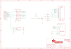

Contents
========

* [PRA1480 > Adafruit](#pra1480--adafruit)
	* [Images](#images)
	* [Tags](#tags)
  
![][im]
# PRA1480 > Adafruit

- ID: PROJ-ADAF-1480-STAN-01
- Hex ID: PRA1480
- Name: Adafruit
- Description: Adafruit

## Images
  
  

|kicadPcb3d|kicadPcb3dFront|kicadPcb3dBack|eagleImage|eagleSchemImage|
| :---: | :---: | :---: | :---: | :---: |
||||||

## Tags

- hexID: PRA1480
- oompType: PROJ
- oompSize: ADAF
- oompColor: 1480
- oompDesc: STAN
- oompIndex: 01
- oompName: Adafruit 2.2 SPI TFT
- sources: All source files from https://github.com/adafruit/Adafruit-2.2-SPI-TFT (source licence details in srcLicense.md)
- linkBuyPage: http://www.adafruit.com/products/1480
- oompID: PROJ-ADAF-1480-STAN-01
- oompParts: C1,UNMATCHED-UNMATCHED-UNMATCHED-UNMATCHED-UNMATCHED
- oompParts: C2,UNMATCHED-UNMATCHED-UNMATCHED-UNMATCHED-UNMATCHED
- oompParts: C3,UNMATCHED-UNMATCHED-UNMATCHED-UNMATCHED-UNMATCHED
- oompParts: CN1,UNMATCHED-UNMATCHED-UNMATCHED-UNMATCHED-UNMATCHED
- oompParts: JP1,UNMATCHED-UNMATCHED-UNMATCHED-UNMATCHED-UNMATCHED
- oompParts: Q1,UNMATCHED-UNMATCHED-UNMATCHED-UNMATCHED-UNMATCHED
- oompParts: R1,UNMATCHED-UNMATCHED-UNMATCHED-UNMATCHED-UNMATCHED
- oompParts: R2,UNMATCHED-UNMATCHED-UNMATCHED-UNMATCHED-UNMATCHED
- oompParts: R3,UNMATCHED-UNMATCHED-UNMATCHED-UNMATCHED-UNMATCHED
- oompParts: R4,UNMATCHED-UNMATCHED-UNMATCHED-UNMATCHED-UNMATCHED
- oompParts: R5,UNMATCHED-UNMATCHED-UNMATCHED-UNMATCHED-UNMATCHED
- oompParts: R6,UNMATCHED-UNMATCHED-UNMATCHED-UNMATCHED-UNMATCHED
- oompParts: U$2,UNMATCHED-UNMATCHED-UNMATCHED-UNMATCHED-UNMATCHED
- oompParts: U$3,UNMATCHED-UNMATCHED-UNMATCHED-UNMATCHED-UNMATCHED
- oompParts: U$4,UNMATCHED-UNMATCHED-UNMATCHED-UNMATCHED-UNMATCHED
- oompParts: U$5,UNMATCHED-UNMATCHED-UNMATCHED-UNMATCHED-UNMATCHED
- oompParts: U1,UNMATCHED-UNMATCHED-UNMATCHED-UNMATCHED-UNMATCHED
- oompParts: U2,UNMATCHED-UNMATCHED-UNMATCHED-UNMATCHED-UNMATCHED
- oompParts: U3,UNMATCHED-UNMATCHED-UNMATCHED-UNMATCHED-UNMATCHED
- rawParts: C1,10uF,CAP_CERAMIC_0805MP,_0805MP,Ceramic Capacitors,,
- rawParts: C2,10uF,CAP_CERAMIC_0805MP,_0805MP,Ceramic Capacitors,,
- rawParts: C3,10uF,CAP_CERAMIC_0805MP,_0805MP,Ceramic Capacitors,,
- rawParts: CN1,,MICROSD,MICROSD,MicroSD/Transflash Card Holder with SPI pinout,,
- rawParts: FID1,FIDUCIAL,FIDUCIAL,FIDUCIAL_1MM,Fiducial Alignment Points,EXCLUDE,
- rawParts: FID2,FIDUCIAL,FIDUCIAL,FIDUCIAL_1MM,Fiducial Alignment Points,EXCLUDE,
- rawParts: FID3,FIDUCIAL,FIDUCIAL,FIDUCIAL_1MM,Fiducial Alignment Points,EXCLUDE,
- rawParts: JP1,,HEADER-1X1070MIL,1X10_ROUND70,PIN HEADER,,
- rawParts: Q1,2N2222,TRANSISTOR_NPNWIDE,SOT23-WIDE,NPN Transistor,,
- rawParts: R1,10,RESISTOR_0805MP,_0805MP,Resistors,,
- rawParts: R2,10,RESISTOR_0805MP,_0805MP,Resistors,,
- rawParts: R3,10,RESISTOR_0805MP,_0805MP,Resistors,,
- rawParts: R4,1K,RESISTOR_0805MP,_0805MP,Resistors,,
- rawParts: R5,10K,RESISTOR_0805MP,_0805MP,Resistors,,
- rawParts: R6,10,RESISTOR_0805MP,_0805MP,Resistors,,
- rawParts: U$2,MOUNTINGHOLE2.5,MOUNTINGHOLE2.5,MOUNTINGHOLE_2.5_PLATED,Mounting Hole,,
- rawParts: U$3,MOUNTINGHOLE2.5,MOUNTINGHOLE2.5,MOUNTINGHOLE_2.5_PLATED,Mounting Hole,,
- rawParts: U$4,MOUNTINGHOLE2.5,MOUNTINGHOLE2.5,MOUNTINGHOLE_2.5_PLATED,Mounting Hole,,
- rawParts: U$5,MOUNTINGHOLE2.5,MOUNTINGHOLE2.5,MOUNTINGHOLE_2.5_PLATED,Mounting Hole,,
- rawParts: U1,,DISP_LCD_TM022HDH26,TM022HDH26_2.2IN_LCD,TM022HDH26 2.2 Inch 240x320 18-bit LCD - ILI9340C Controller,,
- rawParts: U2,RT9193-3.3,VREG_SOT23-5,SOT23-5,SOT23-5 Fixed Voltage Regulators,,
- rawParts: U3,74HC4050D,74HC4050D,SOIC16,6-channel level shifter,,

[im]: kicadPcb3d_450.png
