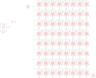

Contents
========

* [PRA1487 > Adafruit](#pra1487--adafruit)
	* [Schematic](#schematic)
	* [Interactive BOM](#interactive-bom)
	* [OOMP Parts](#oomp-parts)
	* [Images](#images)
	* [Tags](#tags)
  
![][im]
# PRA1487 > Adafruit

- ID: PROJ-ADAF-1487-STAN-01
- Hex ID: PRA1487
- Name: Adafruit
- Description: Adafruit
- Long Link: [http://oom.lt/PROJ-ADAF-1487-STAN-01](http://oom.lt/PROJ-ADAF-1487-STAN-01)
- Long Link: [http://oom.lt/PRA1487](http://oom.lt/PRA1487)

## Schematic
  
![][schem]
## Interactive BOM

- Interactive BOM page: [ibom.html](https://htmlpreview.github.io/?https://github.com/oomlout/oomlout_OOMP_projects/blob/main/PROJ-ADAF-1487-STAN-01/kicad/bom/ibom.html)

## OOMP Parts
  

|OOMP Parts|
| :---: |
|C1,UNMATCHED-UNMATCHED-UNMATCHED-UNMATCHED-UNMATCHED,C1,,RCL_C-USC0805K,RCL_C0805K,CAPACITOR, American symbol,,|
|C2,UNMATCHED-UNMATCHED-UNMATCHED-UNMATCHED-UNMATCHED,C2,,RCL_C-USC0805K,RCL_C0805K,CAPACITOR, American symbol,,|
|C3,UNMATCHED-UNMATCHED-UNMATCHED-UNMATCHED-UNMATCHED,C3,,RCL_C-USC0805K,RCL_C0805K,CAPACITOR, American symbol,,|
|C4,UNMATCHED-UNMATCHED-UNMATCHED-UNMATCHED-UNMATCHED,C4,,RCL_C-USC0805K,RCL_C0805K,CAPACITOR, American symbol,,|
|C5,UNMATCHED-UNMATCHED-UNMATCHED-UNMATCHED-UNMATCHED,C5,,RCL_C-USC0805K,RCL_C0805K,CAPACITOR, American symbol,,|
|C6,UNMATCHED-UNMATCHED-UNMATCHED-UNMATCHED-UNMATCHED,C6,,RCL_C-USC0805K,RCL_C0805K,CAPACITOR, American symbol,,|
|C7,UNMATCHED-UNMATCHED-UNMATCHED-UNMATCHED-UNMATCHED,C7,,RCL_C-USC0805K,RCL_C0805K,CAPACITOR, American symbol,,|
|C9,UNMATCHED-UNMATCHED-UNMATCHED-UNMATCHED-UNMATCHED,C9,,RCL_C-USC0805K,RCL_C0805K,CAPACITOR, American symbol,,|
|C10,UNMATCHED-UNMATCHED-UNMATCHED-UNMATCHED-UNMATCHED,C10,,RCL_C-USC0805K,RCL_C0805K,CAPACITOR, American symbol,,|
|C11,UNMATCHED-UNMATCHED-UNMATCHED-UNMATCHED-UNMATCHED,C11,,RCL_C-USC0805K,RCL_C0805K,CAPACITOR, American symbol,,|
|C12,UNMATCHED-UNMATCHED-UNMATCHED-UNMATCHED-UNMATCHED,C12,,RCL_C-USC0805K,RCL_C0805K,CAPACITOR, American symbol,,|
|C13,UNMATCHED-UNMATCHED-UNMATCHED-UNMATCHED-UNMATCHED,C13,,RCL_C-USC0805K,RCL_C0805K,CAPACITOR, American symbol,,|
|C14,UNMATCHED-UNMATCHED-UNMATCHED-UNMATCHED-UNMATCHED,C14,,RCL_C-USC0805K,RCL_C0805K,CAPACITOR, American symbol,,|
|C15,UNMATCHED-UNMATCHED-UNMATCHED-UNMATCHED-UNMATCHED,C15,,RCL_C-USC0805K,RCL_C0805K,CAPACITOR, American symbol,,|
|C17,UNMATCHED-UNMATCHED-UNMATCHED-UNMATCHED-UNMATCHED,C17,,RCL_C-USC0805K,RCL_C0805K,CAPACITOR, American symbol,,|
|C18,UNMATCHED-UNMATCHED-UNMATCHED-UNMATCHED-UNMATCHED,C18,,RCL_C-USC0805K,RCL_C0805K,CAPACITOR, American symbol,,|
|C19,UNMATCHED-UNMATCHED-UNMATCHED-UNMATCHED-UNMATCHED,C19,,RCL_C-USC0805K,RCL_C0805K,CAPACITOR, American symbol,,|
|C20,UNMATCHED-UNMATCHED-UNMATCHED-UNMATCHED-UNMATCHED,C20,,RCL_C-USC0805K,RCL_C0805K,CAPACITOR, American symbol,,|
|C21,UNMATCHED-UNMATCHED-UNMATCHED-UNMATCHED-UNMATCHED,C21,,RCL_C-USC0805K,RCL_C0805K,CAPACITOR, American symbol,,|
|C22,UNMATCHED-UNMATCHED-UNMATCHED-UNMATCHED-UNMATCHED,C22,,RCL_C-USC0805K,RCL_C0805K,CAPACITOR, American symbol,,|
|C23,UNMATCHED-UNMATCHED-UNMATCHED-UNMATCHED-UNMATCHED,C23,,RCL_C-USC0805K,RCL_C0805K,CAPACITOR, American symbol,,|
|C25,UNMATCHED-UNMATCHED-UNMATCHED-UNMATCHED-UNMATCHED,C25,,RCL_C-USC0805K,RCL_C0805K,CAPACITOR, American symbol,,|
|C26,UNMATCHED-UNMATCHED-UNMATCHED-UNMATCHED-UNMATCHED,C26,,RCL_C-USC0805K,RCL_C0805K,CAPACITOR, American symbol,,|
|C27,UNMATCHED-UNMATCHED-UNMATCHED-UNMATCHED-UNMATCHED,C27,,RCL_C-USC0805K,RCL_C0805K,CAPACITOR, American symbol,,|
|C28,UNMATCHED-UNMATCHED-UNMATCHED-UNMATCHED-UNMATCHED,C28,,RCL_C-USC0805K,RCL_C0805K,CAPACITOR, American symbol,,|
|C29,UNMATCHED-UNMATCHED-UNMATCHED-UNMATCHED-UNMATCHED,C29,,RCL_C-USC0805K,RCL_C0805K,CAPACITOR, American symbol,,|
|C30,UNMATCHED-UNMATCHED-UNMATCHED-UNMATCHED-UNMATCHED,C30,,RCL_C-USC0805K,RCL_C0805K,CAPACITOR, American symbol,,|
|C31,UNMATCHED-UNMATCHED-UNMATCHED-UNMATCHED-UNMATCHED,C31,,RCL_C-USC0805K,RCL_C0805K,CAPACITOR, American symbol,,|
|C33,UNMATCHED-UNMATCHED-UNMATCHED-UNMATCHED-UNMATCHED,C33,,RCL_C-USC0805K,RCL_C0805K,CAPACITOR, American symbol,,|
|C34,UNMATCHED-UNMATCHED-UNMATCHED-UNMATCHED-UNMATCHED,C34,,RCL_C-USC0805K,RCL_C0805K,CAPACITOR, American symbol,,|
|C35,UNMATCHED-UNMATCHED-UNMATCHED-UNMATCHED-UNMATCHED,C35,,RCL_C-USC0805K,RCL_C0805K,CAPACITOR, American symbol,,|
|C36,UNMATCHED-UNMATCHED-UNMATCHED-UNMATCHED-UNMATCHED,C36,,RCL_C-USC0805K,RCL_C0805K,CAPACITOR, American symbol,,|
|C37,UNMATCHED-UNMATCHED-UNMATCHED-UNMATCHED-UNMATCHED,C37,,RCL_C-USC0805K,RCL_C0805K,CAPACITOR, American symbol,,|
|C38,UNMATCHED-UNMATCHED-UNMATCHED-UNMATCHED-UNMATCHED,C38,,RCL_C-USC0805K,RCL_C0805K,CAPACITOR, American symbol,,|
|C39,UNMATCHED-UNMATCHED-UNMATCHED-UNMATCHED-UNMATCHED,C39,,RCL_C-USC0805K,RCL_C0805K,CAPACITOR, American symbol,,|
|C41,UNMATCHED-UNMATCHED-UNMATCHED-UNMATCHED-UNMATCHED,C41,,RCL_C-USC0805K,RCL_C0805K,CAPACITOR, American symbol,,|
|C42,UNMATCHED-UNMATCHED-UNMATCHED-UNMATCHED-UNMATCHED,C42,,RCL_C-USC0805K,RCL_C0805K,CAPACITOR, American symbol,,|
|C43,UNMATCHED-UNMATCHED-UNMATCHED-UNMATCHED-UNMATCHED,C43,,RCL_C-USC0805K,RCL_C0805K,CAPACITOR, American symbol,,|
|C44,UNMATCHED-UNMATCHED-UNMATCHED-UNMATCHED-UNMATCHED,C44,,RCL_C-USC0805K,RCL_C0805K,CAPACITOR, American symbol,,|
|C45,UNMATCHED-UNMATCHED-UNMATCHED-UNMATCHED-UNMATCHED,C45,,RCL_C-USC0805K,RCL_C0805K,CAPACITOR, American symbol,,|
|C46,UNMATCHED-UNMATCHED-UNMATCHED-UNMATCHED-UNMATCHED,C46,,RCL_C-USC0805K,RCL_C0805K,CAPACITOR, American symbol,,|
|C47,UNMATCHED-UNMATCHED-UNMATCHED-UNMATCHED-UNMATCHED,C47,,RCL_C-USC0805K,RCL_C0805K,CAPACITOR, American symbol,,|
|C49,UNMATCHED-UNMATCHED-UNMATCHED-UNMATCHED-UNMATCHED,C49,,RCL_C-USC0805K,RCL_C0805K,CAPACITOR, American symbol,,|
|C50,UNMATCHED-UNMATCHED-UNMATCHED-UNMATCHED-UNMATCHED,C50,,RCL_C-USC0805K,RCL_C0805K,CAPACITOR, American symbol,,|
|C51,UNMATCHED-UNMATCHED-UNMATCHED-UNMATCHED-UNMATCHED,C51,,RCL_C-USC0805K,RCL_C0805K,CAPACITOR, American symbol,,|
|C52,UNMATCHED-UNMATCHED-UNMATCHED-UNMATCHED-UNMATCHED,C52,,RCL_C-USC0805K,RCL_C0805K,CAPACITOR, American symbol,,|
|C53,UNMATCHED-UNMATCHED-UNMATCHED-UNMATCHED-UNMATCHED,C53,,RCL_C-USC0805K,RCL_C0805K,CAPACITOR, American symbol,,|
|C54,UNMATCHED-UNMATCHED-UNMATCHED-UNMATCHED-UNMATCHED,C54,,RCL_C-USC0805K,RCL_C0805K,CAPACITOR, American symbol,,|
|C55,UNMATCHED-UNMATCHED-UNMATCHED-UNMATCHED-UNMATCHED,C55,,RCL_C-USC0805K,RCL_C0805K,CAPACITOR, American symbol,,|
|C57,UNMATCHED-UNMATCHED-UNMATCHED-UNMATCHED-UNMATCHED,C57,,RCL_C-USC0805K,RCL_C0805K,CAPACITOR, American symbol,,|
|C58,UNMATCHED-UNMATCHED-UNMATCHED-UNMATCHED-UNMATCHED,C58,,RCL_C-USC0805K,RCL_C0805K,CAPACITOR, American symbol,,|
|C59,UNMATCHED-UNMATCHED-UNMATCHED-UNMATCHED-UNMATCHED,C59,,RCL_C-USC0805K,RCL_C0805K,CAPACITOR, American symbol,,|
|C60,UNMATCHED-UNMATCHED-UNMATCHED-UNMATCHED-UNMATCHED,C60,,RCL_C-USC0805K,RCL_C0805K,CAPACITOR, American symbol,,|
|C61,UNMATCHED-UNMATCHED-UNMATCHED-UNMATCHED-UNMATCHED,C61,,RCL_C-USC0805K,RCL_C0805K,CAPACITOR, American symbol,,|
|C62,UNMATCHED-UNMATCHED-UNMATCHED-UNMATCHED-UNMATCHED,C62,,RCL_C-USC0805K,RCL_C0805K,CAPACITOR, American symbol,,|
|C63,UNMATCHED-UNMATCHED-UNMATCHED-UNMATCHED-UNMATCHED,C63,,RCL_C-USC0805K,RCL_C0805K,CAPACITOR, American symbol,,|
|JP1,UNMATCHED-UNMATCHED-UNMATCHED-UNMATCHED-UNMATCHED,FID1,FIDUCIAL,FIDUCIAL,FIDUCIAL_1MM,Fiducial Alignment Points,EXCLUDE,|
|JP2,UNMATCHED-UNMATCHED-UNMATCHED-UNMATCHED-UNMATCHED,FID2,FIDUCIAL,FIDUCIAL,FIDUCIAL_1MM,Fiducial Alignment Points,EXCLUDE,|
|LED1,UNMATCHED-UNMATCHED-UNMATCHED-UNMATCHED-UNMATCHED,FID3,FIDUCIAL,FIDUCIAL,FIDUCIAL_1MM,Fiducial Alignment Points,EXCLUDE,|
|LED2,UNMATCHED-UNMATCHED-UNMATCHED-UNMATCHED-UNMATCHED,JP1,,M03PTH,1X03,Header 3,,|
|LED3,UNMATCHED-UNMATCHED-UNMATCHED-UNMATCHED-UNMATCHED,JP2,,M03PTH,1X03,Header 3,,|
|LED4,UNMATCHED-UNMATCHED-UNMATCHED-UNMATCHED-UNMATCHED,LED1,WS28115050,WS28115050,WS28115050,,,|
|LED5,UNMATCHED-UNMATCHED-UNMATCHED-UNMATCHED-UNMATCHED,LED2,WS28115050,WS28115050,WS28115050,,,|
|LED6,UNMATCHED-UNMATCHED-UNMATCHED-UNMATCHED-UNMATCHED,LED3,WS28115050,WS28115050,WS28115050,,,|
|LED7,UNMATCHED-UNMATCHED-UNMATCHED-UNMATCHED-UNMATCHED,LED4,WS28115050,WS28115050,WS28115050,,,|
|LED8,UNMATCHED-UNMATCHED-UNMATCHED-UNMATCHED-UNMATCHED,LED5,WS28115050,WS28115050,WS28115050,,,|
|LED9,UNMATCHED-UNMATCHED-UNMATCHED-UNMATCHED-UNMATCHED,LED6,WS28115050,WS28115050,WS28115050,,,|
|LED10,UNMATCHED-UNMATCHED-UNMATCHED-UNMATCHED-UNMATCHED,LED7,WS28115050,WS28115050,WS28115050,,,|
|LED11,UNMATCHED-UNMATCHED-UNMATCHED-UNMATCHED-UNMATCHED,LED8,WS28115050,WS28115050,WS28115050,,,|
|LED12,UNMATCHED-UNMATCHED-UNMATCHED-UNMATCHED-UNMATCHED,LED9,WS28115050,WS28115050,WS28115050,,,|
|LED13,UNMATCHED-UNMATCHED-UNMATCHED-UNMATCHED-UNMATCHED,LED10,WS28115050,WS28115050,WS28115050,,,|
|LED14,UNMATCHED-UNMATCHED-UNMATCHED-UNMATCHED-UNMATCHED,LED11,WS28115050,WS28115050,WS28115050,,,|
|LED15,UNMATCHED-UNMATCHED-UNMATCHED-UNMATCHED-UNMATCHED,LED12,WS28115050,WS28115050,WS28115050,,,|
|LED16,UNMATCHED-UNMATCHED-UNMATCHED-UNMATCHED-UNMATCHED,LED13,WS28115050,WS28115050,WS28115050,,,|
|LED17,UNMATCHED-UNMATCHED-UNMATCHED-UNMATCHED-UNMATCHED,LED14,WS28115050,WS28115050,WS28115050,,,|
|LED18,UNMATCHED-UNMATCHED-UNMATCHED-UNMATCHED-UNMATCHED,LED15,WS28115050,WS28115050,WS28115050,,,|
|LED19,UNMATCHED-UNMATCHED-UNMATCHED-UNMATCHED-UNMATCHED,LED16,WS28115050,WS28115050,WS28115050,,,|
|LED20,UNMATCHED-UNMATCHED-UNMATCHED-UNMATCHED-UNMATCHED,LED17,WS28115050,WS28115050,WS28115050,,,|
|LED21,UNMATCHED-UNMATCHED-UNMATCHED-UNMATCHED-UNMATCHED,LED18,WS28115050,WS28115050,WS28115050,,,|
|LED22,UNMATCHED-UNMATCHED-UNMATCHED-UNMATCHED-UNMATCHED,LED19,WS28115050,WS28115050,WS28115050,,,|
|LED23,UNMATCHED-UNMATCHED-UNMATCHED-UNMATCHED-UNMATCHED,LED20,WS28115050,WS28115050,WS28115050,,,|
|LED24,UNMATCHED-UNMATCHED-UNMATCHED-UNMATCHED-UNMATCHED,LED21,WS28115050,WS28115050,WS28115050,,,|
|LED25,UNMATCHED-UNMATCHED-UNMATCHED-UNMATCHED-UNMATCHED,LED22,WS28115050,WS28115050,WS28115050,,,|
|LED26,UNMATCHED-UNMATCHED-UNMATCHED-UNMATCHED-UNMATCHED,LED23,WS28115050,WS28115050,WS28115050,,,|
|LED27,UNMATCHED-UNMATCHED-UNMATCHED-UNMATCHED-UNMATCHED,LED24,WS28115050,WS28115050,WS28115050,,,|
|LED28,UNMATCHED-UNMATCHED-UNMATCHED-UNMATCHED-UNMATCHED,LED25,WS28115050,WS28115050,WS28115050,,,|
|LED29,UNMATCHED-UNMATCHED-UNMATCHED-UNMATCHED-UNMATCHED,LED26,WS28115050,WS28115050,WS28115050,,,|
|LED30,UNMATCHED-UNMATCHED-UNMATCHED-UNMATCHED-UNMATCHED,LED27,WS28115050,WS28115050,WS28115050,,,|
|LED31,UNMATCHED-UNMATCHED-UNMATCHED-UNMATCHED-UNMATCHED,LED28,WS28115050,WS28115050,WS28115050,,,|
|LED32,UNMATCHED-UNMATCHED-UNMATCHED-UNMATCHED-UNMATCHED,LED29,WS28115050,WS28115050,WS28115050,,,|
|LED33,UNMATCHED-UNMATCHED-UNMATCHED-UNMATCHED-UNMATCHED,LED30,WS28115050,WS28115050,WS28115050,,,|
|LED34,UNMATCHED-UNMATCHED-UNMATCHED-UNMATCHED-UNMATCHED,LED31,WS28115050,WS28115050,WS28115050,,,|
|LED35,UNMATCHED-UNMATCHED-UNMATCHED-UNMATCHED-UNMATCHED,LED32,WS28115050,WS28115050,WS28115050,,,|
|LED36,UNMATCHED-UNMATCHED-UNMATCHED-UNMATCHED-UNMATCHED,LED33,WS28115050,WS28115050,WS28115050,,,|
|LED37,UNMATCHED-UNMATCHED-UNMATCHED-UNMATCHED-UNMATCHED,LED34,WS28115050,WS28115050,WS28115050,,,|
|LED38,UNMATCHED-UNMATCHED-UNMATCHED-UNMATCHED-UNMATCHED,LED35,WS28115050,WS28115050,WS28115050,,,|
|LED39,UNMATCHED-UNMATCHED-UNMATCHED-UNMATCHED-UNMATCHED,LED36,WS28115050,WS28115050,WS28115050,,,|
|LED40,UNMATCHED-UNMATCHED-UNMATCHED-UNMATCHED-UNMATCHED,LED37,WS28115050,WS28115050,WS28115050,,,|
|LED41,UNMATCHED-UNMATCHED-UNMATCHED-UNMATCHED-UNMATCHED,LED38,WS28115050,WS28115050,WS28115050,,,|
|LED42,UNMATCHED-UNMATCHED-UNMATCHED-UNMATCHED-UNMATCHED,LED39,WS28115050,WS28115050,WS28115050,,,|
|LED43,UNMATCHED-UNMATCHED-UNMATCHED-UNMATCHED-UNMATCHED,LED40,WS28115050,WS28115050,WS28115050,,,|
|LED44,UNMATCHED-UNMATCHED-UNMATCHED-UNMATCHED-UNMATCHED,LED41,WS28115050,WS28115050,WS28115050,,,|
|LED45,UNMATCHED-UNMATCHED-UNMATCHED-UNMATCHED-UNMATCHED,LED42,WS28115050,WS28115050,WS28115050,,,|
|LED46,UNMATCHED-UNMATCHED-UNMATCHED-UNMATCHED-UNMATCHED,LED43,WS28115050,WS28115050,WS28115050,,,|
|LED47,UNMATCHED-UNMATCHED-UNMATCHED-UNMATCHED-UNMATCHED,LED44,WS28115050,WS28115050,WS28115050,,,|
|LED48,UNMATCHED-UNMATCHED-UNMATCHED-UNMATCHED-UNMATCHED,LED45,WS28115050,WS28115050,WS28115050,,,|
|LED49,UNMATCHED-UNMATCHED-UNMATCHED-UNMATCHED-UNMATCHED,LED46,WS28115050,WS28115050,WS28115050,,,|
|LED50,UNMATCHED-UNMATCHED-UNMATCHED-UNMATCHED-UNMATCHED,LED47,WS28115050,WS28115050,WS28115050,,,|
|LED51,UNMATCHED-UNMATCHED-UNMATCHED-UNMATCHED-UNMATCHED,LED48,WS28115050,WS28115050,WS28115050,,,|
|LED52,UNMATCHED-UNMATCHED-UNMATCHED-UNMATCHED-UNMATCHED,LED49,WS28115050,WS28115050,WS28115050,,,|
|LED53,UNMATCHED-UNMATCHED-UNMATCHED-UNMATCHED-UNMATCHED,LED50,WS28115050,WS28115050,WS28115050,,,|
|LED54,UNMATCHED-UNMATCHED-UNMATCHED-UNMATCHED-UNMATCHED,LED51,WS28115050,WS28115050,WS28115050,,,|
|LED55,UNMATCHED-UNMATCHED-UNMATCHED-UNMATCHED-UNMATCHED,LED52,WS28115050,WS28115050,WS28115050,,,|
|LED56,UNMATCHED-UNMATCHED-UNMATCHED-UNMATCHED-UNMATCHED,LED53,WS28115050,WS28115050,WS28115050,,,|
|LED57,UNMATCHED-UNMATCHED-UNMATCHED-UNMATCHED-UNMATCHED,LED54,WS28115050,WS28115050,WS28115050,,,|
|LED58,UNMATCHED-UNMATCHED-UNMATCHED-UNMATCHED-UNMATCHED,LED55,WS28115050,WS28115050,WS28115050,,,|
|LED59,UNMATCHED-UNMATCHED-UNMATCHED-UNMATCHED-UNMATCHED,LED56,WS28115050,WS28115050,WS28115050,,,|
|LED60,UNMATCHED-UNMATCHED-UNMATCHED-UNMATCHED-UNMATCHED,LED57,WS28115050,WS28115050,WS28115050,,,|
|LED61,UNMATCHED-UNMATCHED-UNMATCHED-UNMATCHED-UNMATCHED,LED58,WS28115050,WS28115050,WS28115050,,,|
|LED62,UNMATCHED-UNMATCHED-UNMATCHED-UNMATCHED-UNMATCHED,LED59,WS28115050,WS28115050,WS28115050,,,|
|LED63,UNMATCHED-UNMATCHED-UNMATCHED-UNMATCHED-UNMATCHED,LED60,WS28115050,WS28115050,WS28115050,,,|
|LED64,UNMATCHED-UNMATCHED-UNMATCHED-UNMATCHED-UNMATCHED,LED61,WS28115050,WS28115050,WS28115050,,,|
|TP1,UNMATCHED-UNMATCHED-UNMATCHED-UNMATCHED-UNMATCHED,LED62,WS28115050,WS28115050,WS28115050,,,|
|TP2,UNMATCHED-UNMATCHED-UNMATCHED-UNMATCHED-UNMATCHED,LED63,WS28115050,WS28115050,WS28115050,,,|
|TP3,UNMATCHED-UNMATCHED-UNMATCHED-UNMATCHED-UNMATCHED,LED64,WS28115050,WS28115050,WS28115050,,,|
|TP4,UNMATCHED-UNMATCHED-UNMATCHED-UNMATCHED-UNMATCHED,TP1,,TESTPOINT,TESTPOINT_SMT,Test Point,,|
|TP5,UNMATCHED-UNMATCHED-UNMATCHED-UNMATCHED-UNMATCHED,TP2,,TESTPOINT,TESTPOINT_SMT,Test Point,,|
|TP6,UNMATCHED-UNMATCHED-UNMATCHED-UNMATCHED-UNMATCHED,TP3,,TESTPOINT,TESTPOINT_SMT,Test Point,,|
|TP7,UNMATCHED-UNMATCHED-UNMATCHED-UNMATCHED-UNMATCHED,TP4,,TESTPOINT,TESTPOINT_SMT,Test Point,,|
|TP8,UNMATCHED-UNMATCHED-UNMATCHED-UNMATCHED-UNMATCHED,TP5,,TESTPOINT,TESTPOINT_SMT,Test Point,,|
|TP9,UNMATCHED-UNMATCHED-UNMATCHED-UNMATCHED-UNMATCHED,TP6,,TESTPOINT,TESTPOINT_SMT,Test Point,,|
|TP10,UNMATCHED-UNMATCHED-UNMATCHED-UNMATCHED-UNMATCHED,TP7,,TESTPOINT,TESTPOINT_SMT,Test Point,,|
|TP11,UNMATCHED-UNMATCHED-UNMATCHED-UNMATCHED-UNMATCHED,TP8,,TESTPOINT,TESTPOINT_SMT,Test Point,,|
|TP12,UNMATCHED-UNMATCHED-UNMATCHED-UNMATCHED-UNMATCHED,TP9,,TESTPOINT,TESTPOINT_SMT,Test Point,,|
|TP13,UNMATCHED-UNMATCHED-UNMATCHED-UNMATCHED-UNMATCHED,TP10,,TESTPOINT,TESTPOINT_SMT,Test Point,,|
|TP14,UNMATCHED-UNMATCHED-UNMATCHED-UNMATCHED-UNMATCHED,TP11,,TESTPOINT,TESTPOINT_SMT,Test Point,,|

## Images
  
  

|kicadPcb3d|kicadPcb3dFront|kicadPcb3dBack|eagleImage|eagleSchemImage|
| :---: | :---: | :---: | :---: | :---: |
||||||

## Tags

- hexID: PRA1487
- oompType: PROJ
- oompSize: ADAF
- oompColor: 1487
- oompDesc: STAN
- oompIndex: 01
- oompName: Adafruit NeoPixel 8x8 Matrix
- sources: All source files from https://github.com/adafruit/Adafruit-NeoPixel-8x8-Matrix (source licence details in srcLicense.md)
- linkBuyPage: http://www.adafruit.com/products/1487
- oompID: PROJ-ADAF-1487-STAN-01
- oompParts: C1,UNMATCHED-UNMATCHED-UNMATCHED-UNMATCHED-UNMATCHED
- oompParts: C2,UNMATCHED-UNMATCHED-UNMATCHED-UNMATCHED-UNMATCHED
- oompParts: C3,UNMATCHED-UNMATCHED-UNMATCHED-UNMATCHED-UNMATCHED
- oompParts: C4,UNMATCHED-UNMATCHED-UNMATCHED-UNMATCHED-UNMATCHED
- oompParts: C5,UNMATCHED-UNMATCHED-UNMATCHED-UNMATCHED-UNMATCHED
- oompParts: C6,UNMATCHED-UNMATCHED-UNMATCHED-UNMATCHED-UNMATCHED
- oompParts: C7,UNMATCHED-UNMATCHED-UNMATCHED-UNMATCHED-UNMATCHED
- oompParts: C9,UNMATCHED-UNMATCHED-UNMATCHED-UNMATCHED-UNMATCHED
- oompParts: C10,UNMATCHED-UNMATCHED-UNMATCHED-UNMATCHED-UNMATCHED
- oompParts: C11,UNMATCHED-UNMATCHED-UNMATCHED-UNMATCHED-UNMATCHED
- oompParts: C12,UNMATCHED-UNMATCHED-UNMATCHED-UNMATCHED-UNMATCHED
- oompParts: C13,UNMATCHED-UNMATCHED-UNMATCHED-UNMATCHED-UNMATCHED
- oompParts: C14,UNMATCHED-UNMATCHED-UNMATCHED-UNMATCHED-UNMATCHED
- oompParts: C15,UNMATCHED-UNMATCHED-UNMATCHED-UNMATCHED-UNMATCHED
- oompParts: C17,UNMATCHED-UNMATCHED-UNMATCHED-UNMATCHED-UNMATCHED
- oompParts: C18,UNMATCHED-UNMATCHED-UNMATCHED-UNMATCHED-UNMATCHED
- oompParts: C19,UNMATCHED-UNMATCHED-UNMATCHED-UNMATCHED-UNMATCHED
- oompParts: C20,UNMATCHED-UNMATCHED-UNMATCHED-UNMATCHED-UNMATCHED
- oompParts: C21,UNMATCHED-UNMATCHED-UNMATCHED-UNMATCHED-UNMATCHED
- oompParts: C22,UNMATCHED-UNMATCHED-UNMATCHED-UNMATCHED-UNMATCHED
- oompParts: C23,UNMATCHED-UNMATCHED-UNMATCHED-UNMATCHED-UNMATCHED
- oompParts: C25,UNMATCHED-UNMATCHED-UNMATCHED-UNMATCHED-UNMATCHED
- oompParts: C26,UNMATCHED-UNMATCHED-UNMATCHED-UNMATCHED-UNMATCHED
- oompParts: C27,UNMATCHED-UNMATCHED-UNMATCHED-UNMATCHED-UNMATCHED
- oompParts: C28,UNMATCHED-UNMATCHED-UNMATCHED-UNMATCHED-UNMATCHED
- oompParts: C29,UNMATCHED-UNMATCHED-UNMATCHED-UNMATCHED-UNMATCHED
- oompParts: C30,UNMATCHED-UNMATCHED-UNMATCHED-UNMATCHED-UNMATCHED
- oompParts: C31,UNMATCHED-UNMATCHED-UNMATCHED-UNMATCHED-UNMATCHED
- oompParts: C33,UNMATCHED-UNMATCHED-UNMATCHED-UNMATCHED-UNMATCHED
- oompParts: C34,UNMATCHED-UNMATCHED-UNMATCHED-UNMATCHED-UNMATCHED
- oompParts: C35,UNMATCHED-UNMATCHED-UNMATCHED-UNMATCHED-UNMATCHED
- oompParts: C36,UNMATCHED-UNMATCHED-UNMATCHED-UNMATCHED-UNMATCHED
- oompParts: C37,UNMATCHED-UNMATCHED-UNMATCHED-UNMATCHED-UNMATCHED
- oompParts: C38,UNMATCHED-UNMATCHED-UNMATCHED-UNMATCHED-UNMATCHED
- oompParts: C39,UNMATCHED-UNMATCHED-UNMATCHED-UNMATCHED-UNMATCHED
- oompParts: C41,UNMATCHED-UNMATCHED-UNMATCHED-UNMATCHED-UNMATCHED
- oompParts: C42,UNMATCHED-UNMATCHED-UNMATCHED-UNMATCHED-UNMATCHED
- oompParts: C43,UNMATCHED-UNMATCHED-UNMATCHED-UNMATCHED-UNMATCHED
- oompParts: C44,UNMATCHED-UNMATCHED-UNMATCHED-UNMATCHED-UNMATCHED
- oompParts: C45,UNMATCHED-UNMATCHED-UNMATCHED-UNMATCHED-UNMATCHED
- oompParts: C46,UNMATCHED-UNMATCHED-UNMATCHED-UNMATCHED-UNMATCHED
- oompParts: C47,UNMATCHED-UNMATCHED-UNMATCHED-UNMATCHED-UNMATCHED
- oompParts: C49,UNMATCHED-UNMATCHED-UNMATCHED-UNMATCHED-UNMATCHED
- oompParts: C50,UNMATCHED-UNMATCHED-UNMATCHED-UNMATCHED-UNMATCHED
- oompParts: C51,UNMATCHED-UNMATCHED-UNMATCHED-UNMATCHED-UNMATCHED
- oompParts: C52,UNMATCHED-UNMATCHED-UNMATCHED-UNMATCHED-UNMATCHED
- oompParts: C53,UNMATCHED-UNMATCHED-UNMATCHED-UNMATCHED-UNMATCHED
- oompParts: C54,UNMATCHED-UNMATCHED-UNMATCHED-UNMATCHED-UNMATCHED
- oompParts: C55,UNMATCHED-UNMATCHED-UNMATCHED-UNMATCHED-UNMATCHED
- oompParts: C57,UNMATCHED-UNMATCHED-UNMATCHED-UNMATCHED-UNMATCHED
- oompParts: C58,UNMATCHED-UNMATCHED-UNMATCHED-UNMATCHED-UNMATCHED
- oompParts: C59,UNMATCHED-UNMATCHED-UNMATCHED-UNMATCHED-UNMATCHED
- oompParts: C60,UNMATCHED-UNMATCHED-UNMATCHED-UNMATCHED-UNMATCHED
- oompParts: C61,UNMATCHED-UNMATCHED-UNMATCHED-UNMATCHED-UNMATCHED
- oompParts: C62,UNMATCHED-UNMATCHED-UNMATCHED-UNMATCHED-UNMATCHED
- oompParts: C63,UNMATCHED-UNMATCHED-UNMATCHED-UNMATCHED-UNMATCHED
- oompParts: JP1,UNMATCHED-UNMATCHED-UNMATCHED-UNMATCHED-UNMATCHED
- oompParts: JP2,UNMATCHED-UNMATCHED-UNMATCHED-UNMATCHED-UNMATCHED
- oompParts: LED1,UNMATCHED-UNMATCHED-UNMATCHED-UNMATCHED-UNMATCHED
- oompParts: LED2,UNMATCHED-UNMATCHED-UNMATCHED-UNMATCHED-UNMATCHED
- oompParts: LED3,UNMATCHED-UNMATCHED-UNMATCHED-UNMATCHED-UNMATCHED
- oompParts: LED4,UNMATCHED-UNMATCHED-UNMATCHED-UNMATCHED-UNMATCHED
- oompParts: LED5,UNMATCHED-UNMATCHED-UNMATCHED-UNMATCHED-UNMATCHED
- oompParts: LED6,UNMATCHED-UNMATCHED-UNMATCHED-UNMATCHED-UNMATCHED
- oompParts: LED7,UNMATCHED-UNMATCHED-UNMATCHED-UNMATCHED-UNMATCHED
- oompParts: LED8,UNMATCHED-UNMATCHED-UNMATCHED-UNMATCHED-UNMATCHED
- oompParts: LED9,UNMATCHED-UNMATCHED-UNMATCHED-UNMATCHED-UNMATCHED
- oompParts: LED10,UNMATCHED-UNMATCHED-UNMATCHED-UNMATCHED-UNMATCHED
- oompParts: LED11,UNMATCHED-UNMATCHED-UNMATCHED-UNMATCHED-UNMATCHED
- oompParts: LED12,UNMATCHED-UNMATCHED-UNMATCHED-UNMATCHED-UNMATCHED
- oompParts: LED13,UNMATCHED-UNMATCHED-UNMATCHED-UNMATCHED-UNMATCHED
- oompParts: LED14,UNMATCHED-UNMATCHED-UNMATCHED-UNMATCHED-UNMATCHED
- oompParts: LED15,UNMATCHED-UNMATCHED-UNMATCHED-UNMATCHED-UNMATCHED
- oompParts: LED16,UNMATCHED-UNMATCHED-UNMATCHED-UNMATCHED-UNMATCHED
- oompParts: LED17,UNMATCHED-UNMATCHED-UNMATCHED-UNMATCHED-UNMATCHED
- oompParts: LED18,UNMATCHED-UNMATCHED-UNMATCHED-UNMATCHED-UNMATCHED
- oompParts: LED19,UNMATCHED-UNMATCHED-UNMATCHED-UNMATCHED-UNMATCHED
- oompParts: LED20,UNMATCHED-UNMATCHED-UNMATCHED-UNMATCHED-UNMATCHED
- oompParts: LED21,UNMATCHED-UNMATCHED-UNMATCHED-UNMATCHED-UNMATCHED
- oompParts: LED22,UNMATCHED-UNMATCHED-UNMATCHED-UNMATCHED-UNMATCHED
- oompParts: LED23,UNMATCHED-UNMATCHED-UNMATCHED-UNMATCHED-UNMATCHED
- oompParts: LED24,UNMATCHED-UNMATCHED-UNMATCHED-UNMATCHED-UNMATCHED
- oompParts: LED25,UNMATCHED-UNMATCHED-UNMATCHED-UNMATCHED-UNMATCHED
- oompParts: LED26,UNMATCHED-UNMATCHED-UNMATCHED-UNMATCHED-UNMATCHED
- oompParts: LED27,UNMATCHED-UNMATCHED-UNMATCHED-UNMATCHED-UNMATCHED
- oompParts: LED28,UNMATCHED-UNMATCHED-UNMATCHED-UNMATCHED-UNMATCHED
- oompParts: LED29,UNMATCHED-UNMATCHED-UNMATCHED-UNMATCHED-UNMATCHED
- oompParts: LED30,UNMATCHED-UNMATCHED-UNMATCHED-UNMATCHED-UNMATCHED
- oompParts: LED31,UNMATCHED-UNMATCHED-UNMATCHED-UNMATCHED-UNMATCHED
- oompParts: LED32,UNMATCHED-UNMATCHED-UNMATCHED-UNMATCHED-UNMATCHED
- oompParts: LED33,UNMATCHED-UNMATCHED-UNMATCHED-UNMATCHED-UNMATCHED
- oompParts: LED34,UNMATCHED-UNMATCHED-UNMATCHED-UNMATCHED-UNMATCHED
- oompParts: LED35,UNMATCHED-UNMATCHED-UNMATCHED-UNMATCHED-UNMATCHED
- oompParts: LED36,UNMATCHED-UNMATCHED-UNMATCHED-UNMATCHED-UNMATCHED
- oompParts: LED37,UNMATCHED-UNMATCHED-UNMATCHED-UNMATCHED-UNMATCHED
- oompParts: LED38,UNMATCHED-UNMATCHED-UNMATCHED-UNMATCHED-UNMATCHED
- oompParts: LED39,UNMATCHED-UNMATCHED-UNMATCHED-UNMATCHED-UNMATCHED
- oompParts: LED40,UNMATCHED-UNMATCHED-UNMATCHED-UNMATCHED-UNMATCHED
- oompParts: LED41,UNMATCHED-UNMATCHED-UNMATCHED-UNMATCHED-UNMATCHED
- oompParts: LED42,UNMATCHED-UNMATCHED-UNMATCHED-UNMATCHED-UNMATCHED
- oompParts: LED43,UNMATCHED-UNMATCHED-UNMATCHED-UNMATCHED-UNMATCHED
- oompParts: LED44,UNMATCHED-UNMATCHED-UNMATCHED-UNMATCHED-UNMATCHED
- oompParts: LED45,UNMATCHED-UNMATCHED-UNMATCHED-UNMATCHED-UNMATCHED
- oompParts: LED46,UNMATCHED-UNMATCHED-UNMATCHED-UNMATCHED-UNMATCHED
- oompParts: LED47,UNMATCHED-UNMATCHED-UNMATCHED-UNMATCHED-UNMATCHED
- oompParts: LED48,UNMATCHED-UNMATCHED-UNMATCHED-UNMATCHED-UNMATCHED
- oompParts: LED49,UNMATCHED-UNMATCHED-UNMATCHED-UNMATCHED-UNMATCHED
- oompParts: LED50,UNMATCHED-UNMATCHED-UNMATCHED-UNMATCHED-UNMATCHED
- oompParts: LED51,UNMATCHED-UNMATCHED-UNMATCHED-UNMATCHED-UNMATCHED
- oompParts: LED52,UNMATCHED-UNMATCHED-UNMATCHED-UNMATCHED-UNMATCHED
- oompParts: LED53,UNMATCHED-UNMATCHED-UNMATCHED-UNMATCHED-UNMATCHED
- oompParts: LED54,UNMATCHED-UNMATCHED-UNMATCHED-UNMATCHED-UNMATCHED
- oompParts: LED55,UNMATCHED-UNMATCHED-UNMATCHED-UNMATCHED-UNMATCHED
- oompParts: LED56,UNMATCHED-UNMATCHED-UNMATCHED-UNMATCHED-UNMATCHED
- oompParts: LED57,UNMATCHED-UNMATCHED-UNMATCHED-UNMATCHED-UNMATCHED
- oompParts: LED58,UNMATCHED-UNMATCHED-UNMATCHED-UNMATCHED-UNMATCHED
- oompParts: LED59,UNMATCHED-UNMATCHED-UNMATCHED-UNMATCHED-UNMATCHED
- oompParts: LED60,UNMATCHED-UNMATCHED-UNMATCHED-UNMATCHED-UNMATCHED
- oompParts: LED61,UNMATCHED-UNMATCHED-UNMATCHED-UNMATCHED-UNMATCHED
- oompParts: LED62,UNMATCHED-UNMATCHED-UNMATCHED-UNMATCHED-UNMATCHED
- oompParts: LED63,UNMATCHED-UNMATCHED-UNMATCHED-UNMATCHED-UNMATCHED
- oompParts: LED64,UNMATCHED-UNMATCHED-UNMATCHED-UNMATCHED-UNMATCHED
- oompParts: TP1,UNMATCHED-UNMATCHED-UNMATCHED-UNMATCHED-UNMATCHED
- oompParts: TP2,UNMATCHED-UNMATCHED-UNMATCHED-UNMATCHED-UNMATCHED
- oompParts: TP3,UNMATCHED-UNMATCHED-UNMATCHED-UNMATCHED-UNMATCHED
- oompParts: TP4,UNMATCHED-UNMATCHED-UNMATCHED-UNMATCHED-UNMATCHED
- oompParts: TP5,UNMATCHED-UNMATCHED-UNMATCHED-UNMATCHED-UNMATCHED
- oompParts: TP6,UNMATCHED-UNMATCHED-UNMATCHED-UNMATCHED-UNMATCHED
- oompParts: TP7,UNMATCHED-UNMATCHED-UNMATCHED-UNMATCHED-UNMATCHED
- oompParts: TP8,UNMATCHED-UNMATCHED-UNMATCHED-UNMATCHED-UNMATCHED
- oompParts: TP9,UNMATCHED-UNMATCHED-UNMATCHED-UNMATCHED-UNMATCHED
- oompParts: TP10,UNMATCHED-UNMATCHED-UNMATCHED-UNMATCHED-UNMATCHED
- oompParts: TP11,UNMATCHED-UNMATCHED-UNMATCHED-UNMATCHED-UNMATCHED
- oompParts: TP12,UNMATCHED-UNMATCHED-UNMATCHED-UNMATCHED-UNMATCHED
- oompParts: TP13,UNMATCHED-UNMATCHED-UNMATCHED-UNMATCHED-UNMATCHED
- oompParts: TP14,UNMATCHED-UNMATCHED-UNMATCHED-UNMATCHED-UNMATCHED
- rawParts: C1,,RCL_C-USC0805K,RCL_C0805K,CAPACITOR, American symbol,,
- rawParts: C2,,RCL_C-USC0805K,RCL_C0805K,CAPACITOR, American symbol,,
- rawParts: C3,,RCL_C-USC0805K,RCL_C0805K,CAPACITOR, American symbol,,
- rawParts: C4,,RCL_C-USC0805K,RCL_C0805K,CAPACITOR, American symbol,,
- rawParts: C5,,RCL_C-USC0805K,RCL_C0805K,CAPACITOR, American symbol,,
- rawParts: C6,,RCL_C-USC0805K,RCL_C0805K,CAPACITOR, American symbol,,
- rawParts: C7,,RCL_C-USC0805K,RCL_C0805K,CAPACITOR, American symbol,,
- rawParts: C9,,RCL_C-USC0805K,RCL_C0805K,CAPACITOR, American symbol,,
- rawParts: C10,,RCL_C-USC0805K,RCL_C0805K,CAPACITOR, American symbol,,
- rawParts: C11,,RCL_C-USC0805K,RCL_C0805K,CAPACITOR, American symbol,,
- rawParts: C12,,RCL_C-USC0805K,RCL_C0805K,CAPACITOR, American symbol,,
- rawParts: C13,,RCL_C-USC0805K,RCL_C0805K,CAPACITOR, American symbol,,
- rawParts: C14,,RCL_C-USC0805K,RCL_C0805K,CAPACITOR, American symbol,,
- rawParts: C15,,RCL_C-USC0805K,RCL_C0805K,CAPACITOR, American symbol,,
- rawParts: C17,,RCL_C-USC0805K,RCL_C0805K,CAPACITOR, American symbol,,
- rawParts: C18,,RCL_C-USC0805K,RCL_C0805K,CAPACITOR, American symbol,,
- rawParts: C19,,RCL_C-USC0805K,RCL_C0805K,CAPACITOR, American symbol,,
- rawParts: C20,,RCL_C-USC0805K,RCL_C0805K,CAPACITOR, American symbol,,
- rawParts: C21,,RCL_C-USC0805K,RCL_C0805K,CAPACITOR, American symbol,,
- rawParts: C22,,RCL_C-USC0805K,RCL_C0805K,CAPACITOR, American symbol,,
- rawParts: C23,,RCL_C-USC0805K,RCL_C0805K,CAPACITOR, American symbol,,
- rawParts: C25,,RCL_C-USC0805K,RCL_C0805K,CAPACITOR, American symbol,,
- rawParts: C26,,RCL_C-USC0805K,RCL_C0805K,CAPACITOR, American symbol,,
- rawParts: C27,,RCL_C-USC0805K,RCL_C0805K,CAPACITOR, American symbol,,
- rawParts: C28,,RCL_C-USC0805K,RCL_C0805K,CAPACITOR, American symbol,,
- rawParts: C29,,RCL_C-USC0805K,RCL_C0805K,CAPACITOR, American symbol,,
- rawParts: C30,,RCL_C-USC0805K,RCL_C0805K,CAPACITOR, American symbol,,
- rawParts: C31,,RCL_C-USC0805K,RCL_C0805K,CAPACITOR, American symbol,,
- rawParts: C33,,RCL_C-USC0805K,RCL_C0805K,CAPACITOR, American symbol,,
- rawParts: C34,,RCL_C-USC0805K,RCL_C0805K,CAPACITOR, American symbol,,
- rawParts: C35,,RCL_C-USC0805K,RCL_C0805K,CAPACITOR, American symbol,,
- rawParts: C36,,RCL_C-USC0805K,RCL_C0805K,CAPACITOR, American symbol,,
- rawParts: C37,,RCL_C-USC0805K,RCL_C0805K,CAPACITOR, American symbol,,
- rawParts: C38,,RCL_C-USC0805K,RCL_C0805K,CAPACITOR, American symbol,,
- rawParts: C39,,RCL_C-USC0805K,RCL_C0805K,CAPACITOR, American symbol,,
- rawParts: C41,,RCL_C-USC0805K,RCL_C0805K,CAPACITOR, American symbol,,
- rawParts: C42,,RCL_C-USC0805K,RCL_C0805K,CAPACITOR, American symbol,,
- rawParts: C43,,RCL_C-USC0805K,RCL_C0805K,CAPACITOR, American symbol,,
- rawParts: C44,,RCL_C-USC0805K,RCL_C0805K,CAPACITOR, American symbol,,
- rawParts: C45,,RCL_C-USC0805K,RCL_C0805K,CAPACITOR, American symbol,,
- rawParts: C46,,RCL_C-USC0805K,RCL_C0805K,CAPACITOR, American symbol,,
- rawParts: C47,,RCL_C-USC0805K,RCL_C0805K,CAPACITOR, American symbol,,
- rawParts: C49,,RCL_C-USC0805K,RCL_C0805K,CAPACITOR, American symbol,,
- rawParts: C50,,RCL_C-USC0805K,RCL_C0805K,CAPACITOR, American symbol,,
- rawParts: C51,,RCL_C-USC0805K,RCL_C0805K,CAPACITOR, American symbol,,
- rawParts: C52,,RCL_C-USC0805K,RCL_C0805K,CAPACITOR, American symbol,,
- rawParts: C53,,RCL_C-USC0805K,RCL_C0805K,CAPACITOR, American symbol,,
- rawParts: C54,,RCL_C-USC0805K,RCL_C0805K,CAPACITOR, American symbol,,
- rawParts: C55,,RCL_C-USC0805K,RCL_C0805K,CAPACITOR, American symbol,,
- rawParts: C57,,RCL_C-USC0805K,RCL_C0805K,CAPACITOR, American symbol,,
- rawParts: C58,,RCL_C-USC0805K,RCL_C0805K,CAPACITOR, American symbol,,
- rawParts: C59,,RCL_C-USC0805K,RCL_C0805K,CAPACITOR, American symbol,,
- rawParts: C60,,RCL_C-USC0805K,RCL_C0805K,CAPACITOR, American symbol,,
- rawParts: C61,,RCL_C-USC0805K,RCL_C0805K,CAPACITOR, American symbol,,
- rawParts: C62,,RCL_C-USC0805K,RCL_C0805K,CAPACITOR, American symbol,,
- rawParts: C63,,RCL_C-USC0805K,RCL_C0805K,CAPACITOR, American symbol,,
- rawParts: FID1,FIDUCIAL,FIDUCIAL,FIDUCIAL_1MM,Fiducial Alignment Points,EXCLUDE,
- rawParts: FID2,FIDUCIAL,FIDUCIAL,FIDUCIAL_1MM,Fiducial Alignment Points,EXCLUDE,
- rawParts: FID3,FIDUCIAL,FIDUCIAL,FIDUCIAL_1MM,Fiducial Alignment Points,EXCLUDE,
- rawParts: JP1,,M03PTH,1X03,Header 3,,
- rawParts: JP2,,M03PTH,1X03,Header 3,,
- rawParts: LED1,WS28115050,WS28115050,WS28115050,,,
- rawParts: LED2,WS28115050,WS28115050,WS28115050,,,
- rawParts: LED3,WS28115050,WS28115050,WS28115050,,,
- rawParts: LED4,WS28115050,WS28115050,WS28115050,,,
- rawParts: LED5,WS28115050,WS28115050,WS28115050,,,
- rawParts: LED6,WS28115050,WS28115050,WS28115050,,,
- rawParts: LED7,WS28115050,WS28115050,WS28115050,,,
- rawParts: LED8,WS28115050,WS28115050,WS28115050,,,
- rawParts: LED9,WS28115050,WS28115050,WS28115050,,,
- rawParts: LED10,WS28115050,WS28115050,WS28115050,,,
- rawParts: LED11,WS28115050,WS28115050,WS28115050,,,
- rawParts: LED12,WS28115050,WS28115050,WS28115050,,,
- rawParts: LED13,WS28115050,WS28115050,WS28115050,,,
- rawParts: LED14,WS28115050,WS28115050,WS28115050,,,
- rawParts: LED15,WS28115050,WS28115050,WS28115050,,,
- rawParts: LED16,WS28115050,WS28115050,WS28115050,,,
- rawParts: LED17,WS28115050,WS28115050,WS28115050,,,
- rawParts: LED18,WS28115050,WS28115050,WS28115050,,,
- rawParts: LED19,WS28115050,WS28115050,WS28115050,,,
- rawParts: LED20,WS28115050,WS28115050,WS28115050,,,
- rawParts: LED21,WS28115050,WS28115050,WS28115050,,,
- rawParts: LED22,WS28115050,WS28115050,WS28115050,,,
- rawParts: LED23,WS28115050,WS28115050,WS28115050,,,
- rawParts: LED24,WS28115050,WS28115050,WS28115050,,,
- rawParts: LED25,WS28115050,WS28115050,WS28115050,,,
- rawParts: LED26,WS28115050,WS28115050,WS28115050,,,
- rawParts: LED27,WS28115050,WS28115050,WS28115050,,,
- rawParts: LED28,WS28115050,WS28115050,WS28115050,,,
- rawParts: LED29,WS28115050,WS28115050,WS28115050,,,
- rawParts: LED30,WS28115050,WS28115050,WS28115050,,,
- rawParts: LED31,WS28115050,WS28115050,WS28115050,,,
- rawParts: LED32,WS28115050,WS28115050,WS28115050,,,
- rawParts: LED33,WS28115050,WS28115050,WS28115050,,,
- rawParts: LED34,WS28115050,WS28115050,WS28115050,,,
- rawParts: LED35,WS28115050,WS28115050,WS28115050,,,
- rawParts: LED36,WS28115050,WS28115050,WS28115050,,,
- rawParts: LED37,WS28115050,WS28115050,WS28115050,,,
- rawParts: LED38,WS28115050,WS28115050,WS28115050,,,
- rawParts: LED39,WS28115050,WS28115050,WS28115050,,,
- rawParts: LED40,WS28115050,WS28115050,WS28115050,,,
- rawParts: LED41,WS28115050,WS28115050,WS28115050,,,
- rawParts: LED42,WS28115050,WS28115050,WS28115050,,,
- rawParts: LED43,WS28115050,WS28115050,WS28115050,,,
- rawParts: LED44,WS28115050,WS28115050,WS28115050,,,
- rawParts: LED45,WS28115050,WS28115050,WS28115050,,,
- rawParts: LED46,WS28115050,WS28115050,WS28115050,,,
- rawParts: LED47,WS28115050,WS28115050,WS28115050,,,
- rawParts: LED48,WS28115050,WS28115050,WS28115050,,,
- rawParts: LED49,WS28115050,WS28115050,WS28115050,,,
- rawParts: LED50,WS28115050,WS28115050,WS28115050,,,
- rawParts: LED51,WS28115050,WS28115050,WS28115050,,,
- rawParts: LED52,WS28115050,WS28115050,WS28115050,,,
- rawParts: LED53,WS28115050,WS28115050,WS28115050,,,
- rawParts: LED54,WS28115050,WS28115050,WS28115050,,,
- rawParts: LED55,WS28115050,WS28115050,WS28115050,,,
- rawParts: LED56,WS28115050,WS28115050,WS28115050,,,
- rawParts: LED57,WS28115050,WS28115050,WS28115050,,,
- rawParts: LED58,WS28115050,WS28115050,WS28115050,,,
- rawParts: LED59,WS28115050,WS28115050,WS28115050,,,
- rawParts: LED60,WS28115050,WS28115050,WS28115050,,,
- rawParts: LED61,WS28115050,WS28115050,WS28115050,,,
- rawParts: LED62,WS28115050,WS28115050,WS28115050,,,
- rawParts: LED63,WS28115050,WS28115050,WS28115050,,,
- rawParts: LED64,WS28115050,WS28115050,WS28115050,,,
- rawParts: TP1,,TESTPOINT,TESTPOINT_SMT,Test Point,,
- rawParts: TP2,,TESTPOINT,TESTPOINT_SMT,Test Point,,
- rawParts: TP3,,TESTPOINT,TESTPOINT_SMT,Test Point,,
- rawParts: TP4,,TESTPOINT,TESTPOINT_SMT,Test Point,,
- rawParts: TP5,,TESTPOINT,TESTPOINT_SMT,Test Point,,
- rawParts: TP6,,TESTPOINT,TESTPOINT_SMT,Test Point,,
- rawParts: TP7,,TESTPOINT,TESTPOINT_SMT,Test Point,,
- rawParts: TP8,,TESTPOINT,TESTPOINT_SMT,Test Point,,
- rawParts: TP9,,TESTPOINT,TESTPOINT_SMT,Test Point,,
- rawParts: TP10,,TESTPOINT,TESTPOINT_SMT,Test Point,,
- rawParts: TP11,,TESTPOINT,TESTPOINT_SMT,Test Point,,
- rawParts: TP12,,TESTPOINT,TESTPOINT_SMT,Test Point,,
- rawParts: TP13,,TESTPOINT,TESTPOINT_SMT,Test Point,,
- rawParts: TP14,,TESTPOINT,TESTPOINT_SMT,Test Point,,

[im]: kicadPcb3d_450.png
[schem]: eagleSchemImage.png
