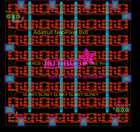
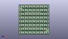
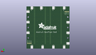
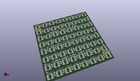

Contents
========

* [PROJ-ADAF-1487-STAN-01>Adafruit NeoPixel 8x8 Matrix](#proj-adaf-1487-stan-01adafruit-neopixel-8x8-matrix)
	* [Images](#images)
	* [Interactive BOM](#interactive-bom)
	* [Tags](#tags)
  
![][im]
# PROJ-ADAF-1487-STAN-01>Adafruit NeoPixel 8x8 Matrix

- ID: PROJ-ADAF-1487-STAN-01
- Hex ID: PRA1487
- Name: Adafruit NeoPixel 8x8 Matrix
- Description: 

## Images
  
  

|eagleImage|kicadPcb3dFront|kicadPcb3dBack|kicadPcb3d|
| :---: | :---: | :---: | :---: |
|||||

## Interactive BOM

- Interactive BOM page: [ibom.html](kicad/bom/ibom.html)

## Tags

- hexID: PRA1487
- oompType: PROJ
- oompSize: ADAF
- oompColor: 1487
- oompDesc: STAN
- oompIndex: 01
- oompName: Adafruit NeoPixel 8x8 Matrix
- sources: All source files from https://github.com/adafruit/Adafruit-NeoPixel-8x8-Matrix (source licence details in srcLicense.md)
- linkBuyPage: http://www.adafruit.com/products/1487
- oompPart: ERROR, C1  RCL_C0805K, 0, 0, 0
- oompPart: ERROR, C2  RCL_C0805K, 0, 0, 0
- oompPart: ERROR, C3  RCL_C0805K, 0, 0, 0
- oompPart: ERROR, C4  RCL_C0805K, 0, 0, 0
- oompPart: ERROR, C5  RCL_C0805K, 0, 0, 0
- oompPart: ERROR, C6  RCL_C0805K, 0, 0, 0
- oompPart: ERROR, C7  RCL_C0805K, 0, 0, 0
- oompPart: ERROR, C9  RCL_C0805K, 0, 0, 0
- oompPart: ERROR, C10  RCL_C0805K, 0, 0, 0
- oompPart: ERROR, C11  RCL_C0805K, 0, 0, 0
- oompPart: ERROR, C12  RCL_C0805K, 0, 0, 0
- oompPart: ERROR, C13  RCL_C0805K, 0, 0, 0
- oompPart: ERROR, C14  RCL_C0805K, 0, 0, 0
- oompPart: ERROR, C15  RCL_C0805K, 0, 0, 0
- oompPart: ERROR, C17  RCL_C0805K, 0, 0, 0
- oompPart: ERROR, C18  RCL_C0805K, 0, 0, 0
- oompPart: ERROR, C19  RCL_C0805K, 0, 0, 0
- oompPart: ERROR, C20  RCL_C0805K, 0, 0, 0
- oompPart: ERROR, C21  RCL_C0805K, 0, 0, 0
- oompPart: ERROR, C22  RCL_C0805K, 0, 0, 0
- oompPart: ERROR, C23  RCL_C0805K, 0, 0, 0
- oompPart: ERROR, C25  RCL_C0805K, 0, 0, 0
- oompPart: ERROR, C26  RCL_C0805K, 0, 0, 0
- oompPart: ERROR, C27  RCL_C0805K, 0, 0, 0
- oompPart: ERROR, C28  RCL_C0805K, 0, 0, 0
- oompPart: ERROR, C29  RCL_C0805K, 0, 0, 0
- oompPart: ERROR, C30  RCL_C0805K, 0, 0, 0
- oompPart: ERROR, C31  RCL_C0805K, 0, 0, 0
- oompPart: ERROR, C33  RCL_C0805K, 0, 0, 0
- oompPart: ERROR, C34  RCL_C0805K, 0, 0, 0
- oompPart: ERROR, C35  RCL_C0805K, 0, 0, 0
- oompPart: ERROR, C36  RCL_C0805K, 0, 0, 0
- oompPart: ERROR, C37  RCL_C0805K, 0, 0, 0
- oompPart: ERROR, C38  RCL_C0805K, 0, 0, 0
- oompPart: ERROR, C39  RCL_C0805K, 0, 0, 0
- oompPart: ERROR, C41  RCL_C0805K, 0, 0, 0
- oompPart: ERROR, C42  RCL_C0805K, 0, 0, 0
- oompPart: ERROR, C43  RCL_C0805K, 0, 0, 0
- oompPart: ERROR, C44  RCL_C0805K, 0, 0, 0
- oompPart: ERROR, C45  RCL_C0805K, 0, 0, 0
- oompPart: ERROR, C46  RCL_C0805K, 0, 0, 0
- oompPart: ERROR, C47  RCL_C0805K, 0, 0, 0
- oompPart: ERROR, C49  RCL_C0805K, 0, 0, 0
- oompPart: ERROR, C50  RCL_C0805K, 0, 0, 0
- oompPart: ERROR, C51  RCL_C0805K, 0, 0, 0
- oompPart: ERROR, C52  RCL_C0805K, 0, 0, 0
- oompPart: ERROR, C53  RCL_C0805K, 0, 0, 0
- oompPart: ERROR, C54  RCL_C0805K, 0, 0, 0
- oompPart: ERROR, C55  RCL_C0805K, 0, 0, 0
- oompPart: ERROR, C57  RCL_C0805K, 0, 0, 0
- oompPart: ERROR, C58  RCL_C0805K, 0, 0, 0
- oompPart: ERROR, C59  RCL_C0805K, 0, 0, 0
- oompPart: ERROR, C60  RCL_C0805K, 0, 0, 0
- oompPart: ERROR, C61  RCL_C0805K, 0, 0, 0
- oompPart: ERROR, C62  RCL_C0805K, 0, 0, 0
- oompPart: ERROR, C63  RCL_C0805K, 0, 0, 0
- oompPart: SKIP-UNMATCHED-X-UNMATCHED-01, FID1, 33.909, 26.162, 0
- oompPart: SKIP-UNMATCHED-X-UNMATCHED-01, FID2, -32.766, 8.889999999999999, 0
- oompPart: SKIP-UNMATCHED-X-UNMATCHED-01, FID3, -33.019999999999996, -26.542999999999996, 0
- oompPart: UNMATCHED-UNMATCHED-X-UNMATCHED-01, JP1, -33.654999999999994, 26.669999999999998, 0
- oompPart: UNMATCHED-UNMATCHED-X-UNMATCHED-01, JP2, 33.400999999999996, -26.669999999999998, 180
- oompPart: UNMATCHED-UNMATCHED-X-UNMATCHED-01, LED1, -31.115000000000002, 31.115000000000002, 0
- oompPart: UNMATCHED-UNMATCHED-X-UNMATCHED-01, LED2, -22.224999999999998, 31.115000000000002, 0
- oompPart: UNMATCHED-UNMATCHED-X-UNMATCHED-01, LED3, -13.334999999999999, 31.115000000000002, 0
- oompPart: UNMATCHED-UNMATCHED-X-UNMATCHED-01, LED4, -4.444999999999999, 31.115000000000002, 0
- oompPart: UNMATCHED-UNMATCHED-X-UNMATCHED-01, LED5, 4.444999999999999, 31.115000000000002, 0
- oompPart: UNMATCHED-UNMATCHED-X-UNMATCHED-01, LED6, 13.334999999999999, 31.115000000000002, 0
- oompPart: UNMATCHED-UNMATCHED-X-UNMATCHED-01, LED7, 22.224999999999998, 31.115000000000002, 0
- oompPart: UNMATCHED-UNMATCHED-X-UNMATCHED-01, LED8, 31.115000000000002, 31.115000000000002, 0
- oompPart: UNMATCHED-UNMATCHED-X-UNMATCHED-01, LED9, -31.115000000000002, 22.224999999999998, 0
- oompPart: UNMATCHED-UNMATCHED-X-UNMATCHED-01, LED10, -22.224999999999998, 22.224999999999998, 0
- oompPart: UNMATCHED-UNMATCHED-X-UNMATCHED-01, LED11, -13.334999999999999, 22.224999999999998, 0
- oompPart: UNMATCHED-UNMATCHED-X-UNMATCHED-01, LED12, -4.444999999999999, 22.224999999999998, 0
- oompPart: UNMATCHED-UNMATCHED-X-UNMATCHED-01, LED13, 4.444999999999999, 22.224999999999998, 0
- oompPart: UNMATCHED-UNMATCHED-X-UNMATCHED-01, LED14, 13.334999999999999, 22.224999999999998, 0
- oompPart: UNMATCHED-UNMATCHED-X-UNMATCHED-01, LED15, 22.224999999999998, 22.224999999999998, 0
- oompPart: UNMATCHED-UNMATCHED-X-UNMATCHED-01, LED16, 31.115000000000002, 22.224999999999998, 0
- oompPart: UNMATCHED-UNMATCHED-X-UNMATCHED-01, LED17, -31.115000000000002, 13.334999999999999, 0
- oompPart: UNMATCHED-UNMATCHED-X-UNMATCHED-01, LED18, -22.224999999999998, 13.334999999999999, 0
- oompPart: UNMATCHED-UNMATCHED-X-UNMATCHED-01, LED19, -13.334999999999999, 13.334999999999999, 0
- oompPart: UNMATCHED-UNMATCHED-X-UNMATCHED-01, LED20, -4.444999999999999, 13.334999999999999, 0
- oompPart: UNMATCHED-UNMATCHED-X-UNMATCHED-01, LED21, 4.444999999999999, 13.334999999999999, 0
- oompPart: UNMATCHED-UNMATCHED-X-UNMATCHED-01, LED22, 13.334999999999999, 13.334999999999999, 0
- oompPart: UNMATCHED-UNMATCHED-X-UNMATCHED-01, LED23, 22.224999999999998, 13.334999999999999, 0
- oompPart: UNMATCHED-UNMATCHED-X-UNMATCHED-01, LED24, 31.115000000000002, 13.334999999999999, 0
- oompPart: UNMATCHED-UNMATCHED-X-UNMATCHED-01, LED25, -31.115000000000002, 4.444999999999999, 0
- oompPart: UNMATCHED-UNMATCHED-X-UNMATCHED-01, LED26, -22.224999999999998, 4.444999999999999, 0
- oompPart: UNMATCHED-UNMATCHED-X-UNMATCHED-01, LED27, -13.334999999999999, 4.444999999999999, 0
- oompPart: UNMATCHED-UNMATCHED-X-UNMATCHED-01, LED28, -4.444999999999999, 4.444999999999999, 0
- oompPart: UNMATCHED-UNMATCHED-X-UNMATCHED-01, LED29, 4.444999999999999, 4.444999999999999, 0
- oompPart: UNMATCHED-UNMATCHED-X-UNMATCHED-01, LED30, 13.334999999999999, 4.444999999999999, 0
- oompPart: UNMATCHED-UNMATCHED-X-UNMATCHED-01, LED31, 22.224999999999998, 4.444999999999999, 0
- oompPart: UNMATCHED-UNMATCHED-X-UNMATCHED-01, LED32, 31.115000000000002, 4.444999999999999, 0
- oompPart: UNMATCHED-UNMATCHED-X-UNMATCHED-01, LED33, -31.115000000000002, -4.444999999999999, 0
- oompPart: UNMATCHED-UNMATCHED-X-UNMATCHED-01, LED34, -22.224999999999998, -4.444999999999999, 0
- oompPart: UNMATCHED-UNMATCHED-X-UNMATCHED-01, LED35, -13.334999999999999, -4.444999999999999, 0
- oompPart: UNMATCHED-UNMATCHED-X-UNMATCHED-01, LED36, -4.444999999999999, -4.444999999999999, 0
- oompPart: UNMATCHED-UNMATCHED-X-UNMATCHED-01, LED37, 4.444999999999999, -4.444999999999999, 0
- oompPart: UNMATCHED-UNMATCHED-X-UNMATCHED-01, LED38, 13.334999999999999, -4.444999999999999, 0
- oompPart: UNMATCHED-UNMATCHED-X-UNMATCHED-01, LED39, 22.224999999999998, -4.444999999999999, 0
- oompPart: UNMATCHED-UNMATCHED-X-UNMATCHED-01, LED40, 31.115000000000002, -4.444999999999999, 0
- oompPart: UNMATCHED-UNMATCHED-X-UNMATCHED-01, LED41, -31.115000000000002, -13.334999999999999, 0
- oompPart: UNMATCHED-UNMATCHED-X-UNMATCHED-01, LED42, -22.224999999999998, -13.334999999999999, 0
- oompPart: UNMATCHED-UNMATCHED-X-UNMATCHED-01, LED43, -13.334999999999999, -13.334999999999999, 0
- oompPart: UNMATCHED-UNMATCHED-X-UNMATCHED-01, LED44, -4.444999999999999, -13.334999999999999, 0
- oompPart: UNMATCHED-UNMATCHED-X-UNMATCHED-01, LED45, 4.444999999999999, -13.334999999999999, 0
- oompPart: UNMATCHED-UNMATCHED-X-UNMATCHED-01, LED46, 13.334999999999999, -13.334999999999999, 0
- oompPart: UNMATCHED-UNMATCHED-X-UNMATCHED-01, LED47, 22.224999999999998, -13.334999999999999, 0
- oompPart: UNMATCHED-UNMATCHED-X-UNMATCHED-01, LED48, 31.115000000000002, -13.334999999999999, 0
- oompPart: UNMATCHED-UNMATCHED-X-UNMATCHED-01, LED49, -31.115000000000002, -22.224999999999998, 0
- oompPart: UNMATCHED-UNMATCHED-X-UNMATCHED-01, LED50, -22.224999999999998, -22.224999999999998, 0
- oompPart: UNMATCHED-UNMATCHED-X-UNMATCHED-01, LED51, -13.334999999999999, -22.224999999999998, 0
- oompPart: UNMATCHED-UNMATCHED-X-UNMATCHED-01, LED52, -4.444999999999999, -22.224999999999998, 0
- oompPart: UNMATCHED-UNMATCHED-X-UNMATCHED-01, LED53, 4.444999999999999, -22.224999999999998, 0
- oompPart: UNMATCHED-UNMATCHED-X-UNMATCHED-01, LED54, 13.334999999999999, -22.224999999999998, 0
- oompPart: UNMATCHED-UNMATCHED-X-UNMATCHED-01, LED55, 22.224999999999998, -22.224999999999998, 0
- oompPart: UNMATCHED-UNMATCHED-X-UNMATCHED-01, LED56, 31.115000000000002, -22.224999999999998, 0
- oompPart: UNMATCHED-UNMATCHED-X-UNMATCHED-01, LED57, -31.115000000000002, -31.115000000000002, 0
- oompPart: UNMATCHED-UNMATCHED-X-UNMATCHED-01, LED58, -22.224999999999998, -31.115000000000002, 0
- oompPart: UNMATCHED-UNMATCHED-X-UNMATCHED-01, LED59, -13.334999999999999, -31.115000000000002, 0
- oompPart: UNMATCHED-UNMATCHED-X-UNMATCHED-01, LED60, -4.444999999999999, -31.115000000000002, 0
- oompPart: UNMATCHED-UNMATCHED-X-UNMATCHED-01, LED61, 4.444999999999999, -31.115000000000002, 0
- oompPart: UNMATCHED-UNMATCHED-X-UNMATCHED-01, LED62, 13.334999999999999, -31.115000000000002, 0
- oompPart: UNMATCHED-UNMATCHED-X-UNMATCHED-01, LED63, 22.224999999999998, -31.115000000000002, 0
- oompPart: UNMATCHED-UNMATCHED-X-UNMATCHED-01, LED64, 31.115000000000002, -31.115000000000002, 0
- oompPart: UNMATCHED-UNMATCHED-X-UNMATCHED-01, TP1, -33.147, 8.889999999999999, M0
- oompPart: UNMATCHED-UNMATCHED-X-UNMATCHED-01, TP2, 33.147, -8.889999999999999, M0
- oompPart: UNMATCHED-UNMATCHED-X-UNMATCHED-01, TP3, -33.147, -8.889999999999999, M0
- oompPart: UNMATCHED-UNMATCHED-X-UNMATCHED-01, TP4, 33.147, 9.017, M0
- oompPart: UNMATCHED-UNMATCHED-X-UNMATCHED-01, TP5, 11.049, 33.147, M270
- oompPart: UNMATCHED-UNMATCHED-X-UNMATCHED-01, TP6, -33.147, -26.669999999999998, M0
- oompPart: UNMATCHED-UNMATCHED-X-UNMATCHED-01, TP7, 33.147, 26.669999999999998, M0
- oompPart: UNMATCHED-UNMATCHED-X-UNMATCHED-01, TP8, -8.889999999999999, 33.147, M270
- oompPart: UNMATCHED-UNMATCHED-X-UNMATCHED-01, TP9, 26.669999999999998, 33.147, M270
- oompPart: UNMATCHED-UNMATCHED-X-UNMATCHED-01, TP10, -8.889999999999999, -33.147, M270
- oompPart: UNMATCHED-UNMATCHED-X-UNMATCHED-01, TP11, -26.669999999999998, -33.147, M270
- oompPart: UNMATCHED-UNMATCHED-X-UNMATCHED-01, TP12, -26.669999999999998, 33.147, M270
- oompPart: UNMATCHED-UNMATCHED-X-UNMATCHED-01, TP13, 8.889999999999999, -33.147, M270
- oompPart: UNMATCHED-UNMATCHED-X-UNMATCHED-01, TP14, 26.669999999999998, -33.147, M270
- rawPart: 

[im]: kicadPcb3d_450.png
