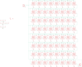

Contents
========

* [PRA1487 > Adafruit NeoPixel 8x8 Matrix](#pra1487--adafruit-neopixel-8x8-matrix)
	* [Schematic](#schematic)
	* [PCB](#pcb)
	* [Interactive BOM](#interactive-bom)
	* [OOMP Parts](#oomp-parts)
	* [Images](#images)
	* [Tags](#tags)
  
![][im]
# PRA1487 > Adafruit NeoPixel 8x8 Matrix

- ID: PROJ-ADAF-1487-STAN-01
- Hex ID: PRA1487
- Name: Adafruit
- Description: Adafruit
- Long Link: [http://oom.lt/PROJ-ADAF-1487-STAN-01](http://oom.lt/PROJ-ADAF-1487-STAN-01)
- Short Link: [http://oom.lt/PRA1487](http://oom.lt/PRA1487)

## Schematic
  

## PCB
  

## Interactive BOM

- Interactive BOM page: [ibom.html](https://htmlpreview.github.io/?https://github.com/oomlout/oomlout_OOMP_projects/blob/main/PROJ-ADAF-1487-STAN-01/kicad/bom/ibom.html)

## OOMP Parts
  

|OOMP ID|Name|Identifier|
| :---: | :---: | :---: |
|[CAPC-0805-X-NF100-V50](https://github.com/oomlout/oomlout_OOMP_parts/tree/main/CAPC-0805-X-NF100-V50/)|[SMD (0805) 100 nF Capacitor (Ceramic) 50v](https://github.com/oomlout/oomlout_OOMP_parts/tree/main/CAPC-0805-X-NF100-V50/)|[C1, C2, C3, C4, C5, C6, C7, C9, C10, C11, C12, C13, C14, C15, C17, C18, C19, C20, C21, C22, C23, C25, C26, C27, C28, C29, C30, C31, C33, C34, C35, C36, C37, C38, C39, C41, C42, C43, C44, C45, C46, C47, C49, C50, C51, C52, C53, C54, C55, C57, C58, C59, C60, C61, C62, C63](https://github.com/oomlout/oomlout_OOMP_parts/tree/main/CAPC-0805-X-NF100-V50/)|
|[HEAD-I01-X-PI03-01](https://github.com/oomlout/oomlout_OOMP_parts/tree/main/HEAD-I01-X-PI03-01/)|[2.54 mm 3 Pin Header](https://github.com/oomlout/oomlout_OOMP_parts/tree/main/HEAD-I01-X-PI03-01/)|[JP1, JP2](https://github.com/oomlout/oomlout_OOMP_parts/tree/main/HEAD-I01-X-PI03-01/)|
|LEDS-5050-RGB-K2811-01||LED1, LED2, LED3, LED4, LED5, LED6, LED7, LED8, LED9, LED10, LED11, LED12, LED13, LED14, LED15, LED16, LED17, LED18, LED19, LED20, LED21, LED22, LED23, LED24, LED25, LED26, LED27, LED28, LED29, LED30, LED31, LED32, LED33, LED34, LED35, LED36, LED37, LED38, LED39, LED40, LED41, LED42, LED43, LED44, LED45, LED46, LED47, LED48, LED49, LED50, LED51, LED52, LED53, LED54, LED55, LED56, LED57, LED58, LED59, LED60, LED61, LED62, LED63, LED64|

## Images
  
  

|bominteractivefront|bominteractiveback|kicadPcb3d|kicadPcb3dFront|kicadPcb3dBack|eagleImage|eagleSchemImage|pcbdraw|pcbdrawback|
| :---: | :---: | :---: | :---: | :---: | :---: | :---: | :---: | :---: |
||||||||||

## Tags

- hexID: PRA1487
- oompType: PROJ
- oompSize: ADAF
- oompColor: 1487
- oompDesc: STAN
- oompIndex: 01
- oompName: Adafruit NeoPixel 8x8 Matrix
- sources: All source files from https://github.com/adafruit/Adafruit-NeoPixel-8x8-Matrix (source licence details in srcLicense.md)
- linkBuyPage: http://www.adafruit.com/products/1487
- oompID: PROJ-ADAF-1487-STAN-01
- oompParts: C1,CAPC-0805-X-NF100-V50
- oompParts: C2,CAPC-0805-X-NF100-V50
- oompParts: C3,CAPC-0805-X-NF100-V50
- oompParts: C4,CAPC-0805-X-NF100-V50
- oompParts: C5,CAPC-0805-X-NF100-V50
- oompParts: C6,CAPC-0805-X-NF100-V50
- oompParts: C7,CAPC-0805-X-NF100-V50
- oompParts: C9,CAPC-0805-X-NF100-V50
- oompParts: C10,CAPC-0805-X-NF100-V50
- oompParts: C11,CAPC-0805-X-NF100-V50
- oompParts: C12,CAPC-0805-X-NF100-V50
- oompParts: C13,CAPC-0805-X-NF100-V50
- oompParts: C14,CAPC-0805-X-NF100-V50
- oompParts: C15,CAPC-0805-X-NF100-V50
- oompParts: C17,CAPC-0805-X-NF100-V50
- oompParts: C18,CAPC-0805-X-NF100-V50
- oompParts: C19,CAPC-0805-X-NF100-V50
- oompParts: C20,CAPC-0805-X-NF100-V50
- oompParts: C21,CAPC-0805-X-NF100-V50
- oompParts: C22,CAPC-0805-X-NF100-V50
- oompParts: C23,CAPC-0805-X-NF100-V50
- oompParts: C25,CAPC-0805-X-NF100-V50
- oompParts: C26,CAPC-0805-X-NF100-V50
- oompParts: C27,CAPC-0805-X-NF100-V50
- oompParts: C28,CAPC-0805-X-NF100-V50
- oompParts: C29,CAPC-0805-X-NF100-V50
- oompParts: C30,CAPC-0805-X-NF100-V50
- oompParts: C31,CAPC-0805-X-NF100-V50
- oompParts: C33,CAPC-0805-X-NF100-V50
- oompParts: C34,CAPC-0805-X-NF100-V50
- oompParts: C35,CAPC-0805-X-NF100-V50
- oompParts: C36,CAPC-0805-X-NF100-V50
- oompParts: C37,CAPC-0805-X-NF100-V50
- oompParts: C38,CAPC-0805-X-NF100-V50
- oompParts: C39,CAPC-0805-X-NF100-V50
- oompParts: C41,CAPC-0805-X-NF100-V50
- oompParts: C42,CAPC-0805-X-NF100-V50
- oompParts: C43,CAPC-0805-X-NF100-V50
- oompParts: C44,CAPC-0805-X-NF100-V50
- oompParts: C45,CAPC-0805-X-NF100-V50
- oompParts: C46,CAPC-0805-X-NF100-V50
- oompParts: C47,CAPC-0805-X-NF100-V50
- oompParts: C49,CAPC-0805-X-NF100-V50
- oompParts: C50,CAPC-0805-X-NF100-V50
- oompParts: C51,CAPC-0805-X-NF100-V50
- oompParts: C52,CAPC-0805-X-NF100-V50
- oompParts: C53,CAPC-0805-X-NF100-V50
- oompParts: C54,CAPC-0805-X-NF100-V50
- oompParts: C55,CAPC-0805-X-NF100-V50
- oompParts: C57,CAPC-0805-X-NF100-V50
- oompParts: C58,CAPC-0805-X-NF100-V50
- oompParts: C59,CAPC-0805-X-NF100-V50
- oompParts: C60,CAPC-0805-X-NF100-V50
- oompParts: C61,CAPC-0805-X-NF100-V50
- oompParts: C62,CAPC-0805-X-NF100-V50
- oompParts: C63,CAPC-0805-X-NF100-V50
- oompParts: JP1,HEAD-I01-X-PI03-01
- oompParts: JP2,HEAD-I01-X-PI03-01
- oompParts: LED1,LEDS-5050-RGB-K2811-01
- oompParts: LED2,LEDS-5050-RGB-K2811-01
- oompParts: LED3,LEDS-5050-RGB-K2811-01
- oompParts: LED4,LEDS-5050-RGB-K2811-01
- oompParts: LED5,LEDS-5050-RGB-K2811-01
- oompParts: LED6,LEDS-5050-RGB-K2811-01
- oompParts: LED7,LEDS-5050-RGB-K2811-01
- oompParts: LED8,LEDS-5050-RGB-K2811-01
- oompParts: LED9,LEDS-5050-RGB-K2811-01
- oompParts: LED10,LEDS-5050-RGB-K2811-01
- oompParts: LED11,LEDS-5050-RGB-K2811-01
- oompParts: LED12,LEDS-5050-RGB-K2811-01
- oompParts: LED13,LEDS-5050-RGB-K2811-01
- oompParts: LED14,LEDS-5050-RGB-K2811-01
- oompParts: LED15,LEDS-5050-RGB-K2811-01
- oompParts: LED16,LEDS-5050-RGB-K2811-01
- oompParts: LED17,LEDS-5050-RGB-K2811-01
- oompParts: LED18,LEDS-5050-RGB-K2811-01
- oompParts: LED19,LEDS-5050-RGB-K2811-01
- oompParts: LED20,LEDS-5050-RGB-K2811-01
- oompParts: LED21,LEDS-5050-RGB-K2811-01
- oompParts: LED22,LEDS-5050-RGB-K2811-01
- oompParts: LED23,LEDS-5050-RGB-K2811-01
- oompParts: LED24,LEDS-5050-RGB-K2811-01
- oompParts: LED25,LEDS-5050-RGB-K2811-01
- oompParts: LED26,LEDS-5050-RGB-K2811-01
- oompParts: LED27,LEDS-5050-RGB-K2811-01
- oompParts: LED28,LEDS-5050-RGB-K2811-01
- oompParts: LED29,LEDS-5050-RGB-K2811-01
- oompParts: LED30,LEDS-5050-RGB-K2811-01
- oompParts: LED31,LEDS-5050-RGB-K2811-01
- oompParts: LED32,LEDS-5050-RGB-K2811-01
- oompParts: LED33,LEDS-5050-RGB-K2811-01
- oompParts: LED34,LEDS-5050-RGB-K2811-01
- oompParts: LED35,LEDS-5050-RGB-K2811-01
- oompParts: LED36,LEDS-5050-RGB-K2811-01
- oompParts: LED37,LEDS-5050-RGB-K2811-01
- oompParts: LED38,LEDS-5050-RGB-K2811-01
- oompParts: LED39,LEDS-5050-RGB-K2811-01
- oompParts: LED40,LEDS-5050-RGB-K2811-01
- oompParts: LED41,LEDS-5050-RGB-K2811-01
- oompParts: LED42,LEDS-5050-RGB-K2811-01
- oompParts: LED43,LEDS-5050-RGB-K2811-01
- oompParts: LED44,LEDS-5050-RGB-K2811-01
- oompParts: LED45,LEDS-5050-RGB-K2811-01
- oompParts: LED46,LEDS-5050-RGB-K2811-01
- oompParts: LED47,LEDS-5050-RGB-K2811-01
- oompParts: LED48,LEDS-5050-RGB-K2811-01
- oompParts: LED49,LEDS-5050-RGB-K2811-01
- oompParts: LED50,LEDS-5050-RGB-K2811-01
- oompParts: LED51,LEDS-5050-RGB-K2811-01
- oompParts: LED52,LEDS-5050-RGB-K2811-01
- oompParts: LED53,LEDS-5050-RGB-K2811-01
- oompParts: LED54,LEDS-5050-RGB-K2811-01
- oompParts: LED55,LEDS-5050-RGB-K2811-01
- oompParts: LED56,LEDS-5050-RGB-K2811-01
- oompParts: LED57,LEDS-5050-RGB-K2811-01
- oompParts: LED58,LEDS-5050-RGB-K2811-01
- oompParts: LED59,LEDS-5050-RGB-K2811-01
- oompParts: LED60,LEDS-5050-RGB-K2811-01
- oompParts: LED61,LEDS-5050-RGB-K2811-01
- oompParts: LED62,LEDS-5050-RGB-K2811-01
- oompParts: LED63,LEDS-5050-RGB-K2811-01
- oompParts: LED64,LEDS-5050-RGB-K2811-01
- rawParts: C1,,RCL_C-USC0805K,RCL_C0805K,CAPACITOR, American symbol,,
- rawParts: C2,,RCL_C-USC0805K,RCL_C0805K,CAPACITOR, American symbol,,
- rawParts: C3,,RCL_C-USC0805K,RCL_C0805K,CAPACITOR, American symbol,,
- rawParts: C4,,RCL_C-USC0805K,RCL_C0805K,CAPACITOR, American symbol,,
- rawParts: C5,,RCL_C-USC0805K,RCL_C0805K,CAPACITOR, American symbol,,
- rawParts: C6,,RCL_C-USC0805K,RCL_C0805K,CAPACITOR, American symbol,,
- rawParts: C7,,RCL_C-USC0805K,RCL_C0805K,CAPACITOR, American symbol,,
- rawParts: C9,,RCL_C-USC0805K,RCL_C0805K,CAPACITOR, American symbol,,
- rawParts: C10,,RCL_C-USC0805K,RCL_C0805K,CAPACITOR, American symbol,,
- rawParts: C11,,RCL_C-USC0805K,RCL_C0805K,CAPACITOR, American symbol,,
- rawParts: C12,,RCL_C-USC0805K,RCL_C0805K,CAPACITOR, American symbol,,
- rawParts: C13,,RCL_C-USC0805K,RCL_C0805K,CAPACITOR, American symbol,,
- rawParts: C14,,RCL_C-USC0805K,RCL_C0805K,CAPACITOR, American symbol,,
- rawParts: C15,,RCL_C-USC0805K,RCL_C0805K,CAPACITOR, American symbol,,
- rawParts: C17,,RCL_C-USC0805K,RCL_C0805K,CAPACITOR, American symbol,,
- rawParts: C18,,RCL_C-USC0805K,RCL_C0805K,CAPACITOR, American symbol,,
- rawParts: C19,,RCL_C-USC0805K,RCL_C0805K,CAPACITOR, American symbol,,
- rawParts: C20,,RCL_C-USC0805K,RCL_C0805K,CAPACITOR, American symbol,,
- rawParts: C21,,RCL_C-USC0805K,RCL_C0805K,CAPACITOR, American symbol,,
- rawParts: C22,,RCL_C-USC0805K,RCL_C0805K,CAPACITOR, American symbol,,
- rawParts: C23,,RCL_C-USC0805K,RCL_C0805K,CAPACITOR, American symbol,,
- rawParts: C25,,RCL_C-USC0805K,RCL_C0805K,CAPACITOR, American symbol,,
- rawParts: C26,,RCL_C-USC0805K,RCL_C0805K,CAPACITOR, American symbol,,
- rawParts: C27,,RCL_C-USC0805K,RCL_C0805K,CAPACITOR, American symbol,,
- rawParts: C28,,RCL_C-USC0805K,RCL_C0805K,CAPACITOR, American symbol,,
- rawParts: C29,,RCL_C-USC0805K,RCL_C0805K,CAPACITOR, American symbol,,
- rawParts: C30,,RCL_C-USC0805K,RCL_C0805K,CAPACITOR, American symbol,,
- rawParts: C31,,RCL_C-USC0805K,RCL_C0805K,CAPACITOR, American symbol,,
- rawParts: C33,,RCL_C-USC0805K,RCL_C0805K,CAPACITOR, American symbol,,
- rawParts: C34,,RCL_C-USC0805K,RCL_C0805K,CAPACITOR, American symbol,,
- rawParts: C35,,RCL_C-USC0805K,RCL_C0805K,CAPACITOR, American symbol,,
- rawParts: C36,,RCL_C-USC0805K,RCL_C0805K,CAPACITOR, American symbol,,
- rawParts: C37,,RCL_C-USC0805K,RCL_C0805K,CAPACITOR, American symbol,,
- rawParts: C38,,RCL_C-USC0805K,RCL_C0805K,CAPACITOR, American symbol,,
- rawParts: C39,,RCL_C-USC0805K,RCL_C0805K,CAPACITOR, American symbol,,
- rawParts: C41,,RCL_C-USC0805K,RCL_C0805K,CAPACITOR, American symbol,,
- rawParts: C42,,RCL_C-USC0805K,RCL_C0805K,CAPACITOR, American symbol,,
- rawParts: C43,,RCL_C-USC0805K,RCL_C0805K,CAPACITOR, American symbol,,
- rawParts: C44,,RCL_C-USC0805K,RCL_C0805K,CAPACITOR, American symbol,,
- rawParts: C45,,RCL_C-USC0805K,RCL_C0805K,CAPACITOR, American symbol,,
- rawParts: C46,,RCL_C-USC0805K,RCL_C0805K,CAPACITOR, American symbol,,
- rawParts: C47,,RCL_C-USC0805K,RCL_C0805K,CAPACITOR, American symbol,,
- rawParts: C49,,RCL_C-USC0805K,RCL_C0805K,CAPACITOR, American symbol,,
- rawParts: C50,,RCL_C-USC0805K,RCL_C0805K,CAPACITOR, American symbol,,
- rawParts: C51,,RCL_C-USC0805K,RCL_C0805K,CAPACITOR, American symbol,,
- rawParts: C52,,RCL_C-USC0805K,RCL_C0805K,CAPACITOR, American symbol,,
- rawParts: C53,,RCL_C-USC0805K,RCL_C0805K,CAPACITOR, American symbol,,
- rawParts: C54,,RCL_C-USC0805K,RCL_C0805K,CAPACITOR, American symbol,,
- rawParts: C55,,RCL_C-USC0805K,RCL_C0805K,CAPACITOR, American symbol,,
- rawParts: C57,,RCL_C-USC0805K,RCL_C0805K,CAPACITOR, American symbol,,
- rawParts: C58,,RCL_C-USC0805K,RCL_C0805K,CAPACITOR, American symbol,,
- rawParts: C59,,RCL_C-USC0805K,RCL_C0805K,CAPACITOR, American symbol,,
- rawParts: C60,,RCL_C-USC0805K,RCL_C0805K,CAPACITOR, American symbol,,
- rawParts: C61,,RCL_C-USC0805K,RCL_C0805K,CAPACITOR, American symbol,,
- rawParts: C62,,RCL_C-USC0805K,RCL_C0805K,CAPACITOR, American symbol,,
- rawParts: C63,,RCL_C-USC0805K,RCL_C0805K,CAPACITOR, American symbol,,
- rawParts: FID1,FIDUCIAL,FIDUCIAL,FIDUCIAL_1MM,Fiducial Alignment Points,EXCLUDE,
- rawParts: FID2,FIDUCIAL,FIDUCIAL,FIDUCIAL_1MM,Fiducial Alignment Points,EXCLUDE,
- rawParts: FID3,FIDUCIAL,FIDUCIAL,FIDUCIAL_1MM,Fiducial Alignment Points,EXCLUDE,
- rawParts: JP1,,M03PTH,1X03,Header 3,,
- rawParts: JP2,,M03PTH,1X03,Header 3,,
- rawParts: LED1,WS28115050,WS28115050,WS28115050,,,
- rawParts: LED2,WS28115050,WS28115050,WS28115050,,,
- rawParts: LED3,WS28115050,WS28115050,WS28115050,,,
- rawParts: LED4,WS28115050,WS28115050,WS28115050,,,
- rawParts: LED5,WS28115050,WS28115050,WS28115050,,,
- rawParts: LED6,WS28115050,WS28115050,WS28115050,,,
- rawParts: LED7,WS28115050,WS28115050,WS28115050,,,
- rawParts: LED8,WS28115050,WS28115050,WS28115050,,,
- rawParts: LED9,WS28115050,WS28115050,WS28115050,,,
- rawParts: LED10,WS28115050,WS28115050,WS28115050,,,
- rawParts: LED11,WS28115050,WS28115050,WS28115050,,,
- rawParts: LED12,WS28115050,WS28115050,WS28115050,,,
- rawParts: LED13,WS28115050,WS28115050,WS28115050,,,
- rawParts: LED14,WS28115050,WS28115050,WS28115050,,,
- rawParts: LED15,WS28115050,WS28115050,WS28115050,,,
- rawParts: LED16,WS28115050,WS28115050,WS28115050,,,
- rawParts: LED17,WS28115050,WS28115050,WS28115050,,,
- rawParts: LED18,WS28115050,WS28115050,WS28115050,,,
- rawParts: LED19,WS28115050,WS28115050,WS28115050,,,
- rawParts: LED20,WS28115050,WS28115050,WS28115050,,,
- rawParts: LED21,WS28115050,WS28115050,WS28115050,,,
- rawParts: LED22,WS28115050,WS28115050,WS28115050,,,
- rawParts: LED23,WS28115050,WS28115050,WS28115050,,,
- rawParts: LED24,WS28115050,WS28115050,WS28115050,,,
- rawParts: LED25,WS28115050,WS28115050,WS28115050,,,
- rawParts: LED26,WS28115050,WS28115050,WS28115050,,,
- rawParts: LED27,WS28115050,WS28115050,WS28115050,,,
- rawParts: LED28,WS28115050,WS28115050,WS28115050,,,
- rawParts: LED29,WS28115050,WS28115050,WS28115050,,,
- rawParts: LED30,WS28115050,WS28115050,WS28115050,,,
- rawParts: LED31,WS28115050,WS28115050,WS28115050,,,
- rawParts: LED32,WS28115050,WS28115050,WS28115050,,,
- rawParts: LED33,WS28115050,WS28115050,WS28115050,,,
- rawParts: LED34,WS28115050,WS28115050,WS28115050,,,
- rawParts: LED35,WS28115050,WS28115050,WS28115050,,,
- rawParts: LED36,WS28115050,WS28115050,WS28115050,,,
- rawParts: LED37,WS28115050,WS28115050,WS28115050,,,
- rawParts: LED38,WS28115050,WS28115050,WS28115050,,,
- rawParts: LED39,WS28115050,WS28115050,WS28115050,,,
- rawParts: LED40,WS28115050,WS28115050,WS28115050,,,
- rawParts: LED41,WS28115050,WS28115050,WS28115050,,,
- rawParts: LED42,WS28115050,WS28115050,WS28115050,,,
- rawParts: LED43,WS28115050,WS28115050,WS28115050,,,
- rawParts: LED44,WS28115050,WS28115050,WS28115050,,,
- rawParts: LED45,WS28115050,WS28115050,WS28115050,,,
- rawParts: LED46,WS28115050,WS28115050,WS28115050,,,
- rawParts: LED47,WS28115050,WS28115050,WS28115050,,,
- rawParts: LED48,WS28115050,WS28115050,WS28115050,,,
- rawParts: LED49,WS28115050,WS28115050,WS28115050,,,
- rawParts: LED50,WS28115050,WS28115050,WS28115050,,,
- rawParts: LED51,WS28115050,WS28115050,WS28115050,,,
- rawParts: LED52,WS28115050,WS28115050,WS28115050,,,
- rawParts: LED53,WS28115050,WS28115050,WS28115050,,,
- rawParts: LED54,WS28115050,WS28115050,WS28115050,,,
- rawParts: LED55,WS28115050,WS28115050,WS28115050,,,
- rawParts: LED56,WS28115050,WS28115050,WS28115050,,,
- rawParts: LED57,WS28115050,WS28115050,WS28115050,,,
- rawParts: LED58,WS28115050,WS28115050,WS28115050,,,
- rawParts: LED59,WS28115050,WS28115050,WS28115050,,,
- rawParts: LED60,WS28115050,WS28115050,WS28115050,,,
- rawParts: LED61,WS28115050,WS28115050,WS28115050,,,
- rawParts: LED62,WS28115050,WS28115050,WS28115050,,,
- rawParts: LED63,WS28115050,WS28115050,WS28115050,,,
- rawParts: LED64,WS28115050,WS28115050,WS28115050,,,
- rawParts: TP1,,TESTPOINT,TESTPOINT_SMT,Test Point,,
- rawParts: TP2,,TESTPOINT,TESTPOINT_SMT,Test Point,,
- rawParts: TP3,,TESTPOINT,TESTPOINT_SMT,Test Point,,
- rawParts: TP4,,TESTPOINT,TESTPOINT_SMT,Test Point,,
- rawParts: TP5,,TESTPOINT,TESTPOINT_SMT,Test Point,,
- rawParts: TP6,,TESTPOINT,TESTPOINT_SMT,Test Point,,
- rawParts: TP7,,TESTPOINT,TESTPOINT_SMT,Test Point,,
- rawParts: TP8,,TESTPOINT,TESTPOINT_SMT,Test Point,,
- rawParts: TP9,,TESTPOINT,TESTPOINT_SMT,Test Point,,
- rawParts: TP10,,TESTPOINT,TESTPOINT_SMT,Test Point,,
- rawParts: TP11,,TESTPOINT,TESTPOINT_SMT,Test Point,,
- rawParts: TP12,,TESTPOINT,TESTPOINT_SMT,Test Point,,
- rawParts: TP13,,TESTPOINT,TESTPOINT_SMT,Test Point,,
- rawParts: TP14,,TESTPOINT,TESTPOINT_SMT,Test Point,,

[im]: kicadPcb3d_450.png
