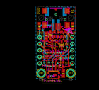
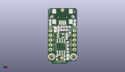
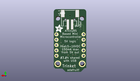
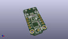

Contents
========

* [PROJ-ADAF-1500-STAN-01>Adafruit Trinket PCB](#proj-adaf-1500-stan-01adafruit-trinket-pcb)
	* [Images](#images)
	* [Interactive BOM](#interactive-bom)
	* [OOMP Parts](#oomp-parts)
	* [Tags](#tags)
  
![][im]
# PROJ-ADAF-1500-STAN-01>Adafruit Trinket PCB

- ID: PROJ-ADAF-1500-STAN-01
- Hex ID: PRA1500
- Name: Adafruit Trinket PCB
- Description: 

## Images
  
  

|eagleImage|kicadPcb3dFront|kicadPcb3dBack|kicadPcb3d|
| :---: | :---: | :---: | :---: |
|||||

## Interactive BOM

- Interactive BOM page: [ibom.html](kicad/bom/ibom.html)

## OOMP Parts
  

|OOMP Parts|
| :---: |
|UNMATCHED-UNMATCHED-X-UNMATCHED-01, B1, 6.476999999999999, 8.128, 0,B1, red, CHIPLED_0805_NOOUTLINE, microbuilder, (0.255, 0.32), R0|
|UNMATCHED-UNMATCHED-X-UNMATCHED-01, BAT, 0.0, 12.191999999999998, M0,BAT, JSTPH2, microbuilder, (0, 0.48), MR0|
|CAPE-0805-X-UNMATCHED-01, C1, -3.8099999999999996, 4.444999999999999, 90,C1, 10uF, 0805-NO, microbuilder, (-0.15, 0.175), R90|
|CAPE-0805-X-UNMATCHED-01, C8, 2.794, -10.287, 270,C8, 10uF, 0805-NO, microbuilder, (0.11, -0.405), R270|
|UNMATCHED-UNMATCHED-X-UNMATCHED-01, CN1, 0.0, 12.065, 180,CN1, USB-MINIB, microbuilder, (0, 0.475), R180|
|UNMATCHED-UNMATCHED-X-UNMATCHED-01, CN3, -6.35, -2.54, 90,CN3, 1X4-CLEANBIG, 1X04-CLEANBIG, adafruit, (-0.25, -0.1), R90|
|UNMATCHED-UNMATCHED-X-UNMATCHED-01, CN4, 6.35, -2.54, 90,CN4, 1X4-CLEANBIG, 1X04-CLEANBIG, adafruit, (0.25, -0.1), R90|
|UNMATCHED-UNMATCHED-X-UNMATCHED-01, D1, -2.1590000000000003, 4.571999999999999, 270,D1, 3.6V, SOD-323, microbuilder, (-0.085, 0.18), R270|
|UNMATCHED-UNMATCHED-X-UNMATCHED-01, D2, 3.8099999999999996, 4.1402, 90,D2, SCHOTTKY, SOD-123FL, adafruit, (0.15, 0.163), R90|
|UNMATCHED-UNMATCHED-X-UNMATCHED-01, D3, 2.2097999999999995, 0.7619999999999999, 270,D3, 3.6V, SOD-323, microbuilder, (0.087, 0.03), R270|
|UNMATCHED-UNMATCHED-X-UNMATCHED-01, IC2, -1.0413999999999999, 1.016, 270,IC2, MIC5225-5.0v, SOT23-5L, adafruit, (-0.041, 0.04), R270|
|UNMATCHED-UNMATCHED-X-UNMATCHED-01, IC3, -0.7619999999999999, -4.826, 180,IC3, ATTINY85-20S, SOIC8, avr, (-0.03, -0.19), R180|
|UNMATCHED-UNMATCHED-X-UNMATCHED-01, JP1, 6.35, 3.8099999999999996, 0,JP1, 1X01-CLEANBIG, adafruit, (0.25, 0.15), R0|
|UNMATCHED-UNMATCHED-X-UNMATCHED-01, JP2, -6.35, 3.8099999999999996, 0,JP2, 1X01-CLEANBIG, adafruit, (-0.25, 0.15), R0|
|UNMATCHED-UNMATCHED-X-UNMATCHED-01, PWR, -6.476999999999999, 8.128, 0,PWR, green, CHIPLED_0805_NOOUTLINE, microbuilder, (-0.255, 0.32), R0|
|UNMATCHED-UNMATCHED-X-UNMATCHED-01, Q1, -0.889, -10.795, 0,Q1, reset, BTN_KMR2_4.6X2.8, microbuilder, (-0.035, -0.425), R0|
|ERROR, R1 68 (0603), 0, 0, 0,R1, 68, (0603), 0603-NO, microbuilder, (0.03, 0.195), R270|
|ERROR, R2 68 (0603), 0, 0, 0,R2, 68, (0603), 0603-NO, microbuilder, (-0.025, 0.195), R270|
|ERROR, R3 1.5K (0603), 0, 0, 0,R3, 1.5K, (0603), 0603-NO, microbuilder, (0.085, 0.195), R270|
|ERROR, R4 470 (0603), 0, 0, 0,R4, 470, (0603), 0603-NO, microbuilder, (0.11, -0.265), R270|
|ERROR, R5 470 (0603), 0, 0, 0,R5, 470, (0603), 0603-NO, microbuilder, (0.11, -0.13), R270|

## Tags

- hexID: PRA1500
- oompType: PROJ
- oompSize: ADAF
- oompColor: 1500
- oompDesc: STAN
- oompIndex: 01
- oompName: Adafruit Trinket PCB
- sources: All source files from https://github.com/adafruit/Adafruit-Trinket-PCB (source licence details in srcLicense.md)
- linkBuyPage: http://www.adafruit.com/products/1500
- oompPart: UNMATCHED-UNMATCHED-X-UNMATCHED-01, B1, 6.476999999999999, 8.128, 0
- oompPart: UNMATCHED-UNMATCHED-X-UNMATCHED-01, BAT, 0.0, 12.191999999999998, M0
- oompPart: CAPE-0805-X-UNMATCHED-01, C1, -3.8099999999999996, 4.444999999999999, 90
- oompPart: CAPE-0805-X-UNMATCHED-01, C8, 2.794, -10.287, 270
- oompPart: UNMATCHED-UNMATCHED-X-UNMATCHED-01, CN1, 0.0, 12.065, 180
- oompPart: UNMATCHED-UNMATCHED-X-UNMATCHED-01, CN3, -6.35, -2.54, 90
- oompPart: UNMATCHED-UNMATCHED-X-UNMATCHED-01, CN4, 6.35, -2.54, 90
- oompPart: UNMATCHED-UNMATCHED-X-UNMATCHED-01, D1, -2.1590000000000003, 4.571999999999999, 270
- oompPart: UNMATCHED-UNMATCHED-X-UNMATCHED-01, D2, 3.8099999999999996, 4.1402, 90
- oompPart: UNMATCHED-UNMATCHED-X-UNMATCHED-01, D3, 2.2097999999999995, 0.7619999999999999, 270
- oompPart: UNMATCHED-UNMATCHED-X-UNMATCHED-01, IC2, -1.0413999999999999, 1.016, 270
- oompPart: UNMATCHED-UNMATCHED-X-UNMATCHED-01, IC3, -0.7619999999999999, -4.826, 180
- oompPart: UNMATCHED-UNMATCHED-X-UNMATCHED-01, JP1, 6.35, 3.8099999999999996, 0
- oompPart: UNMATCHED-UNMATCHED-X-UNMATCHED-01, JP2, -6.35, 3.8099999999999996, 0
- oompPart: UNMATCHED-UNMATCHED-X-UNMATCHED-01, PWR, -6.476999999999999, 8.128, 0
- oompPart: UNMATCHED-UNMATCHED-X-UNMATCHED-01, Q1, -0.889, -10.795, 0
- oompPart: ERROR, R1 68 (0603), 0, 0, 0
- oompPart: ERROR, R2 68 (0603), 0, 0, 0
- oompPart: ERROR, R3 1.5K (0603), 0, 0, 0
- oompPart: ERROR, R4 470 (0603), 0, 0, 0
- oompPart: ERROR, R5 470 (0603), 0, 0, 0
- oompPart: SKIP-UNMATCHED-X-UNMATCHED-01, U$1, 0.0, 14.731999999999998, 0
- oompPart: SKIP-UNMATCHED-X-UNMATCHED-01, U$6, -0.3175, -10.795, 0
- oompPart: SKIP-UNMATCHED-X-UNMATCHED-01, U$8, -5.715, -10.16, 0
- oompPart: SKIP-UNMATCHED-X-UNMATCHED-01, U$9, 5.715, -10.16, 0
- rawPart: B1, red, CHIPLED_0805_NOOUTLINE, microbuilder, (0.255, 0.32), R0
- rawPart: BAT, JSTPH2, microbuilder, (0, 0.48), MR0
- rawPart: C1, 10uF, 0805-NO, microbuilder, (-0.15, 0.175), R90
- rawPart: C8, 10uF, 0805-NO, microbuilder, (0.11, -0.405), R270
- rawPart: CN1, USB-MINIB, microbuilder, (0, 0.475), R180
- rawPart: CN3, 1X4-CLEANBIG, 1X04-CLEANBIG, adafruit, (-0.25, -0.1), R90
- rawPart: CN4, 1X4-CLEANBIG, 1X04-CLEANBIG, adafruit, (0.25, -0.1), R90
- rawPart: D1, 3.6V, SOD-323, microbuilder, (-0.085, 0.18), R270
- rawPart: D2, SCHOTTKY, SOD-123FL, adafruit, (0.15, 0.163), R90
- rawPart: D3, 3.6V, SOD-323, microbuilder, (0.087, 0.03), R270
- rawPart: IC2, MIC5225-5.0v, SOT23-5L, adafruit, (-0.041, 0.04), R270
- rawPart: IC3, ATTINY85-20S, SOIC8, avr, (-0.03, -0.19), R180
- rawPart: JP1, 1X01-CLEANBIG, adafruit, (0.25, 0.15), R0
- rawPart: JP2, 1X01-CLEANBIG, adafruit, (-0.25, 0.15), R0
- rawPart: PWR, green, CHIPLED_0805_NOOUTLINE, microbuilder, (-0.255, 0.32), R0
- rawPart: Q1, reset, BTN_KMR2_4.6X2.8, microbuilder, (-0.035, -0.425), R0
- rawPart: R1, 68, (0603), 0603-NO, microbuilder, (0.03, 0.195), R270
- rawPart: R2, 68, (0603), 0603-NO, microbuilder, (-0.025, 0.195), R270
- rawPart: R3, 1.5K, (0603), 0603-NO, microbuilder, (0.085, 0.195), R270
- rawPart: R4, 470, (0603), 0603-NO, microbuilder, (0.11, -0.265), R270
- rawPart: R5, 470, (0603), 0603-NO, microbuilder, (0.11, -0.13), R270
- rawPart: U$1, FIDUCIAL, FIDUCIAL_1MM, adafruit, (0, 0.58), R0
- rawPart: U$6, FIDUCIAL, FIDUCIAL_1MM, adafruit, (-0.0125, -0.425), R0
- rawPart: U$8, MOUNTINGHOLE2.0, MOUNTINGHOLE_2.0_PLATED, microbuilder, (-0.225, -0.4), R0
- rawPart: U$9, MOUNTINGHOLE2.0, MOUNTINGHOLE_2.0_PLATED, microbuilder, (0.225, -0.4), R0

[im]: kicadPcb3d_450.png
