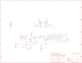

Contents
========

* [PRA1500 > Adafruit](#pra1500--adafruit)
	* [Images](#images)
	* [Tags](#tags)
  
![][im]
# PRA1500 > Adafruit

- ID: PROJ-ADAF-1500-STAN-01
- Hex ID: PRA1500
- Name: Adafruit
- Description: Adafruit

## Images
  
  

|kicadPcb3d|kicadPcb3dFront|kicadPcb3dBack|eagleImage|eagleSchemImage|
| :---: | :---: | :---: | :---: | :---: |
||||||

## Tags

- hexID: PRA1500
- oompType: PROJ
- oompSize: ADAF
- oompColor: 1500
- oompDesc: STAN
- oompIndex: 01
- oompName: Adafruit Trinket PCB
- sources: All source files from https://github.com/adafruit/Adafruit-Trinket-PCB (source licence details in srcLicense.md)
- linkBuyPage: http://www.adafruit.com/products/1500
- oompID: PROJ-ADAF-1500-STAN-01
- oompParts: B1,UNMATCHED-UNMATCHED-UNMATCHED-UNMATCHED-UNMATCHED
- oompParts: BAT,UNMATCHED-UNMATCHED-UNMATCHED-UNMATCHED-UNMATCHED
- oompParts: C1,UNMATCHED-UNMATCHED-UNMATCHED-UNMATCHED-UNMATCHED
- oompParts: C8,UNMATCHED-UNMATCHED-UNMATCHED-UNMATCHED-UNMATCHED
- oompParts: CN1,UNMATCHED-UNMATCHED-UNMATCHED-UNMATCHED-UNMATCHED
- oompParts: CN3,UNMATCHED-UNMATCHED-UNMATCHED-UNMATCHED-UNMATCHED
- oompParts: CN4,UNMATCHED-UNMATCHED-UNMATCHED-UNMATCHED-UNMATCHED
- oompParts: D1,UNMATCHED-UNMATCHED-UNMATCHED-UNMATCHED-UNMATCHED
- oompParts: D2,UNMATCHED-UNMATCHED-UNMATCHED-UNMATCHED-UNMATCHED
- oompParts: D3,UNMATCHED-UNMATCHED-UNMATCHED-UNMATCHED-UNMATCHED
- oompParts: IC2,UNMATCHED-UNMATCHED-UNMATCHED-UNMATCHED-UNMATCHED
- oompParts: IC3,UNMATCHED-UNMATCHED-UNMATCHED-UNMATCHED-UNMATCHED
- oompParts: JP1,UNMATCHED-UNMATCHED-UNMATCHED-UNMATCHED-UNMATCHED
- oompParts: JP2,UNMATCHED-UNMATCHED-UNMATCHED-UNMATCHED-UNMATCHED
- oompParts: PWR,UNMATCHED-UNMATCHED-UNMATCHED-UNMATCHED-UNMATCHED
- oompParts: Q1,UNMATCHED-UNMATCHED-UNMATCHED-UNMATCHED-UNMATCHED
- oompParts: R1,UNMATCHED-UNMATCHED-UNMATCHED-UNMATCHED-UNMATCHED
- oompParts: R2,UNMATCHED-UNMATCHED-UNMATCHED-UNMATCHED-UNMATCHED
- oompParts: R3,UNMATCHED-UNMATCHED-UNMATCHED-UNMATCHED-UNMATCHED
- oompParts: R4,UNMATCHED-UNMATCHED-UNMATCHED-UNMATCHED-UNMATCHED
- oompParts: R5,UNMATCHED-UNMATCHED-UNMATCHED-UNMATCHED-UNMATCHED
- rawParts: B1,red,LED0805_NOOUTLINE,CHIPLED_0805_NOOUTLINE,LED,,
- rawParts: BAT,,CON_JST_PH_2PIN,JSTPH2,JST 2-Pin Right-Angle Connector,,
- rawParts: C1,10uF,CAP_CERAMIC0805-NOOUTLINE,0805-NO,Ceramic Capacitors,,
- rawParts: C8,10uF,CAP_CERAMIC0805-NOOUTLINE,0805-NO,Ceramic Capacitors,,
- rawParts: CN1,,USBMINIB,USB-MINIB,USB Connectors,,
- rawParts: CN3,1X4-CLEANBIG,1X4-CLEANBIG,1X04-CLEANBIG,4-pin connector,,
- rawParts: CN4,1X4-CLEANBIG,1X4-CLEANBIG,1X04-CLEANBIG,4-pin connector,,
- rawParts: D1,3.6V,DIODESOD-323,SOD-323,Diode,,
- rawParts: D2,SCHOTTKY,DIODE_SOD-123FL,SOD-123FL,Diode,,
- rawParts: D3,3.6V,DIODESOD-323,SOD-323,Diode,,
- rawParts: IC2,MIC5225-5.0v,LP298XS,SOT23-5L,,,
- rawParts: IC3,ATTINY85-20S,ATTINY85V-10S,SOIC8,MICROCONTROLLER,,
- rawParts: JP1,,PINHD-1X1CB,1X01-CLEANBIG,Pin header 1x1 for 0.1 spacing,,
- rawParts: JP2,,PINHD-1X1CB,1X01-CLEANBIG,Pin header 1x1 for 0.1 spacing,,
- rawParts: PWR,green,LED0805_NOOUTLINE,CHIPLED_0805_NOOUTLINE,LED,,
- rawParts: Q1,reset,SWITCH_TACT_SMT4.6X2.8,BTN_KMR2_4.6X2.8,SMT Tact Switches,,
- rawParts: R1,68 (0603),RESISTOR_0603_NOOUT,0603-NO,Resistors,,
- rawParts: R2,68 (0603),RESISTOR_0603_NOOUT,0603-NO,Resistors,,
- rawParts: R3,1.5K (0603),RESISTOR_0603_NOOUT,0603-NO,Resistors,,
- rawParts: R4,470 (0603),RESISTOR_0603_NOOUT,0603-NO,Resistors,,
- rawParts: R5,470 (0603),RESISTOR_0603_NOOUT,0603-NO,Resistors,,
- rawParts: U$1,FIDUCIAL,FIDUCIAL,FIDUCIAL_1MM,For use by pick and place machines to calibrate the vision/machine, 1mm,,
- rawParts: U$6,FIDUCIAL,FIDUCIAL,FIDUCIAL_1MM,For use by pick and place machines to calibrate the vision/machine, 1mm,,
- rawParts: U$8,MOUNTINGHOLE2.0,MOUNTINGHOLE2.0,MOUNTINGHOLE_2.0_PLATED,Mounting Hole,EXCLUDE,
- rawParts: U$9,MOUNTINGHOLE2.0,MOUNTINGHOLE2.0,MOUNTINGHOLE_2.0_PLATED,Mounting Hole,EXCLUDE,

[im]: kicadPcb3d_450.png
