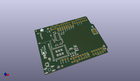
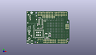
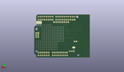
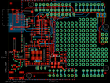

Contents
========

* [PRA1534 > Adafruit](#pra1534--adafruit)
	* [Images](#images)
	* [Tags](#tags)
  
![][im]
# PRA1534 > Adafruit

- ID: PROJ-ADAF-1534-STAN-01
- Hex ID: PRA1534
- Name: Adafruit
- Description: Adafruit

## Images
  
  

|kicadPcb3d|kicadPcb3dFront|kicadPcb3dBack|eagleImage|eagleSchemImage|
| :---: | :---: | :---: | :---: | :---: |
||||||

## Tags

- hexID: PRA1534
- oompType: PROJ
- oompSize: ADAF
- oompColor: 1534
- oompDesc: STAN
- oompIndex: 01
- oompName: Adafruit_CC3000_Shield_PCB
- sources: All source files from https://github.com/adafruit/Adafruit_CC3000_Shield_PCB (source licence details in srcLicense.md)
- linkBuyPage: http://www.adafruit.com/products/1534
- oompID: PROJ-ADAF-1534-STAN-01

[im]: kicadPcb3d_450.png
