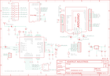

Contents
========

* [PRA1534 > Adafruit_CC3000_Shield_PCB](#pra1534--adafruit_cc3000_shield_pcb)
	* [Schematic](#schematic)
	* [PCB](#pcb)
	* [Interactive BOM](#interactive-bom)
	* [OOMP Parts](#oomp-parts)
	* [Images](#images)
	* [Tags](#tags)
  
![][im]
# PRA1534 > Adafruit_CC3000_Shield_PCB

- ID: PROJ-ADAF-1534-STAN-01
- Hex ID: PRA1534
- Name: Adafruit
- Description: Adafruit
- Long Link: [http://oom.lt/PROJ-ADAF-1534-STAN-01](http://oom.lt/PROJ-ADAF-1534-STAN-01)
- Short Link: [http://oom.lt/PRA1534](http://oom.lt/PRA1534)

## Schematic
  

## PCB
  

## Interactive BOM

- Interactive BOM page: [ibom.html](https://htmlpreview.github.io/?https://github.com/oomlout/oomlout_OOMP_projects/blob/main/PROJ-ADAF-1534-STAN-01/kicad/bom/ibom.html)

## OOMP Parts
  

|OOMP ID|Name|Identifier|
| :---: | :---: | :---: |
|[CAPC-0402-X-PF22D-V50](https://github.com/oomlout/oomlout_OOMP_parts/tree/main/CAPC-0402-X-PF22D-V50/)|[SMD (0402) 2.2 pF Capacitor (Ceramic) 50v](https://github.com/oomlout/oomlout_OOMP_parts/tree/main/CAPC-0402-X-PF22D-V50/)|[C1](https://github.com/oomlout/oomlout_OOMP_parts/tree/main/CAPC-0402-X-PF22D-V50/)|
|[CAPC-0402-X-PF10-V50](https://github.com/oomlout/oomlout_OOMP_parts/tree/main/CAPC-0402-X-PF10-V50/)|[SMD (0402) 10 pF Capacitor (Ceramic) 50v](https://github.com/oomlout/oomlout_OOMP_parts/tree/main/CAPC-0402-X-PF10-V50/)|[C2](https://github.com/oomlout/oomlout_OOMP_parts/tree/main/CAPC-0402-X-PF10-V50/)|
|CAPC-0402-X-UNMATCHED-01||C3|
|[CAPC-0805-X-UF1-V25](https://github.com/oomlout/oomlout_OOMP_parts/tree/main/CAPC-0805-X-UF1-V25/)|[SMD (0805) 1 uF Capacitor (Ceramic) 25v](https://github.com/oomlout/oomlout_OOMP_parts/tree/main/CAPC-0805-X-UF1-V25/)|[C4, C5](https://github.com/oomlout/oomlout_OOMP_parts/tree/main/CAPC-0805-X-UF1-V25/)|
|[CAPC-0805-X-UF10-V10](https://github.com/oomlout/oomlout_OOMP_parts/tree/main/CAPC-0805-X-UF10-V10/)|[SMD (0805) 10 uF Capacitor (Ceramic) 10v](https://github.com/oomlout/oomlout_OOMP_parts/tree/main/CAPC-0805-X-UF10-V10/)|[C6, C7, C8](https://github.com/oomlout/oomlout_OOMP_parts/tree/main/CAPC-0805-X-UF10-V10/)|
|UNMATCHED-UNMATCHED-X-UNMATCHED-01||CN2, U$35, U$36, U1, U2, U3, X1|
|FERB-0805-X-UNMATCHED-01||FB1|
|UNMATCHED-SO235-X-UNMATCHED-01||IC1|
|[HEAD-I01-X-PI08-01](https://github.com/oomlout/oomlout_OOMP_parts/tree/main/HEAD-I01-X-PI08-01/)|[2.54 mm 8 Pin Header](https://github.com/oomlout/oomlout_OOMP_parts/tree/main/HEAD-I01-X-PI08-01/)|[JP1, JP4, JP5](https://github.com/oomlout/oomlout_OOMP_parts/tree/main/HEAD-I01-X-PI08-01/)|
|[HEAD-I01-X-PI03-01](https://github.com/oomlout/oomlout_OOMP_parts/tree/main/HEAD-I01-X-PI03-01/)|[2.54 mm 3 Pin Header](https://github.com/oomlout/oomlout_OOMP_parts/tree/main/HEAD-I01-X-PI03-01/)|[JP2](https://github.com/oomlout/oomlout_OOMP_parts/tree/main/HEAD-I01-X-PI03-01/)|
|[HEAD-I01-X-PI10-01](https://github.com/oomlout/oomlout_OOMP_parts/tree/main/HEAD-I01-X-PI10-01/)|[2.54 mm 10 Pin Header](https://github.com/oomlout/oomlout_OOMP_parts/tree/main/HEAD-I01-X-PI10-01/)|[JP3](https://github.com/oomlout/oomlout_OOMP_parts/tree/main/HEAD-I01-X-PI10-01/)|
|[HEAD-I01-X-PI06-01](https://github.com/oomlout/oomlout_OOMP_parts/tree/main/HEAD-I01-X-PI06-01/)|[2.54 mm 6 Pin Header](https://github.com/oomlout/oomlout_OOMP_parts/tree/main/HEAD-I01-X-PI06-01/)|[JP6](https://github.com/oomlout/oomlout_OOMP_parts/tree/main/HEAD-I01-X-PI06-01/)|
|UNMATCHED-0402-X-UNMATCHED-01||L2|
|[LEDS-0805-G-STAN-01](https://github.com/oomlout/oomlout_OOMP_parts/tree/main/LEDS-0805-G-STAN-01/)|[SMD (0805) Green LED](https://github.com/oomlout/oomlout_OOMP_parts/tree/main/LEDS-0805-G-STAN-01/)|[LED1](https://github.com/oomlout/oomlout_OOMP_parts/tree/main/LEDS-0805-G-STAN-01/)|
|RESE-0805-X-UNMATCHED-01||R1|
|[RESE-0805-X-O103-01](https://github.com/oomlout/oomlout_OOMP_parts/tree/main/RESE-0805-X-O103-01/)|[SMD (0805) 10k Ohm Resistor](https://github.com/oomlout/oomlout_OOMP_parts/tree/main/RESE-0805-X-O103-01/)|[R2, R3](https://github.com/oomlout/oomlout_OOMP_parts/tree/main/RESE-0805-X-O103-01/)|
|[BUTA-6060-X-STAN-01](https://github.com/oomlout/oomlout_OOMP_parts/tree/main/BUTA-6060-X-STAN-01/)|[SMD (6060) Pushbutton (Tactile)](https://github.com/oomlout/oomlout_OOMP_parts/tree/main/BUTA-6060-X-STAN-01/)|[SW1](https://github.com/oomlout/oomlout_OOMP_parts/tree/main/BUTA-6060-X-STAN-01/)|

## Images
  
  

|bominteractivefront|bominteractiveback|kicadPcb3d|kicadPcb3dFront|kicadPcb3dBack|eagleImage|eagleSchemImage|pcbdraw|pcbdrawback|
| :---: | :---: | :---: | :---: | :---: | :---: | :---: | :---: | :---: |
||||||||||

## Tags

- hexID: PRA1534
- oompType: PROJ
- oompSize: ADAF
- oompColor: 1534
- oompDesc: STAN
- oompIndex: 01
- oompName: Adafruit_CC3000_Shield_PCB
- sources: All source files from https://github.com/adafruit/Adafruit_CC3000_Shield_PCB (source licence details in srcLicense.md)
- linkBuyPage: http://www.adafruit.com/products/1534
- oompID: PROJ-ADAF-1534-STAN-01
- oompParts: C1,CAPC-0402-X-PF22D-V50
- oompParts: C2,CAPC-0402-X-PF10-V50
- oompParts: C3,CAPC-0402-X-UNMATCHED-01
- oompParts: C4,CAPC-0805-X-UF1-V25
- oompParts: C5,CAPC-0805-X-UF1-V25
- oompParts: C6,CAPC-0805-X-UF10-V10
- oompParts: C7,CAPC-0805-X-UF10-V10
- oompParts: C8,CAPC-0805-X-UF10-V10
- oompParts: CN2,UNMATCHED-UNMATCHED-X-UNMATCHED-01
- oompParts: FB1,FERB-0805-X-UNMATCHED-01
- oompParts: IC1,UNMATCHED-SO235-X-UNMATCHED-01
- oompParts: JP1,HEAD-I01-X-PI08-01
- oompParts: JP2,HEAD-I01-X-PI03-01
- oompParts: JP3,HEAD-I01-X-PI10-01
- oompParts: JP4,HEAD-I01-X-PI08-01
- oompParts: JP5,HEAD-I01-X-PI08-01
- oompParts: JP6,HEAD-I01-X-PI06-01
- oompParts: L2,UNMATCHED-0402-X-UNMATCHED-01
- oompParts: LED1,LEDS-0805-G-STAN-01
- oompParts: R1,RESE-0805-X-UNMATCHED-01
- oompParts: R2,RESE-0805-X-O103-01
- oompParts: R3,RESE-0805-X-O103-01
- oompParts: SW1,BUTA-6060-X-STAN-01
- oompParts: U$35,UNMATCHED-UNMATCHED-X-UNMATCHED-01
- oompParts: U$36,UNMATCHED-UNMATCHED-X-UNMATCHED-01
- oompParts: U1,UNMATCHED-UNMATCHED-X-UNMATCHED-01
- oompParts: U2,UNMATCHED-UNMATCHED-X-UNMATCHED-01
- oompParts: U3,UNMATCHED-UNMATCHED-X-UNMATCHED-01
- oompParts: X1,UNMATCHED-UNMATCHED-X-UNMATCHED-01
- rawParts: C1,2.2pF,CAP_CERAMIC_0402,_0402,Ceramic Capacitors,,
- rawParts: C2,10pF,CAP_CERAMIC_0402,_0402,Ceramic Capacitors,,
- rawParts: C3,DNC_10pF,CAP_CERAMIC_0402,_0402,Ceramic Capacitors,,
- rawParts: C4,1µF,CAP_CERAMIC_0805MP,_0805MP,Ceramic Capacitors,,
- rawParts: C5,1µF,CAP_CERAMIC_0805MP,_0805MP,Ceramic Capacitors,,
- rawParts: C6,10µF,CAP_CERAMIC_0805MP,_0805MP,Ceramic Capacitors,,
- rawParts: C7,10µF,CAP_CERAMIC_0805MP,_0805MP,Ceramic Capacitors,,
- rawParts: C8,10µF,CAP_CERAMIC_0805MP,_0805MP,Ceramic Capacitors,,
- rawParts: CN2,microSD,MICROSD,MICROSD,MicroSD/Transflash Card Holder with SPI pinout,,
- rawParts: FB1,Ferrite,FERRITE_0805MP,_0805MP,Ferrite Bead,,
- rawParts: FID1,FIDUCIAL,FIDUCIAL,FIDUCIAL_1MM,Fiducial Alignment Points,EXCLUDE,
- rawParts: FID2,FIDUCIAL,FIDUCIAL,FIDUCIAL_1MM,Fiducial Alignment Points,EXCLUDE,
- rawParts: FID3,FIDUCIAL,FIDUCIAL,FIDUCIAL_1MM,Fiducial Alignment Points,EXCLUDE,
- rawParts: IC1,74AHC1G125,74AHC1G125,SOT23-5L,,,
- rawParts: JP1,,PINHD-1X8BIG,1X08-BIG,PIN HEADER,,
- rawParts: JP2,,HEADER-1X3ROUND,1X03_ROUND,PIN HEADER,,
- rawParts: JP3,,HEADER-1X1070MIL,1X10_ROUND70,PIN HEADER,,
- rawParts: JP4,,PINHD-1X8CLEANBIG,1X08-CLEANBIG,PIN HEADER,,
- rawParts: JP5,,PINHD-1X8CLEANBIG,1X08-CLEANBIG,PIN HEADER,,
- rawParts: JP6,,PINHD-1X6CB,1X06-CLEANBIG,PIN HEADER,,
- rawParts: L1,DNP,INDUCTOR_0402,_0402,Inductors,,
- rawParts: L2,2.2nH,INDUCTOR_0402,_0402,Inductors,,
- rawParts: LED1,green,LED0805_NOOUTLINE,CHIPLED_0805_NOOUTLINE,LED,,
- rawParts: R1,470 ohm,RESISTOR_0805MP,_0805MP,Resistors,,
- rawParts: R2,10K,RESISTOR_0805MP,_0805MP,Resistors,,
- rawParts: R3,10K,RESISTOR_0805MP,_0805MP,Resistors,,
- rawParts: SJ1,TESTMODE,SOLDERJUMPER_CLOSED,SOLDERJUMPER_CLOSEDWIRE,Solder Jumper - Closed,,
- rawParts: SJ2,MOSIHW,SOLDERJUMPER,SOLDERJUMPER_ARROW_NOPASTE,SMD Solder JUMPER,EXCLUDE,
- rawParts: SJ3,MISOHW,SOLDERJUMPER,SOLDERJUMPER_ARROW_NOPASTE,SMD Solder JUMPER,EXCLUDE,
- rawParts: SJ4,SCKHW,SOLDERJUMPER,SOLDERJUMPER_ARROW_NOPASTE,SMD Solder JUMPER,EXCLUDE,
- rawParts: SW1,SPST_TACT-EVQQ2,SPST_TACT-EVQQ2,EVQ-Q2,SMT 6mm switch, EVQQ2 series,,
- rawParts: TP1,SCL,TESTPOINTPAD1MM,TESTPOINT_PAD_1MM,Test Point,,
- rawParts: TP2,SDA,TESTPOINTPAD1MM,TESTPOINT_PAD_1MM,Test Point,,
- rawParts: U$35,U.FL,U.FL,U.FL,U.FL Antenna Connector,,
- rawParts: U$36,ARDUINO_R3_ICSP,ARDUINO_R3_ICSP,ARDUINOR3_ICSP,,,
- rawParts: U1,CC3000MOD,CC3000MOD,CC3000MOD,CC3000MOD Wifi Module,,
- rawParts: U2,LT1117-3v,VREG_SOT223,SOT223-R,SOT-223 Fixed Voltage Regulators,,
- rawParts: U3,74HC4050D,74HC4050D,SOIC16,6-channel level shifter,,
- rawParts: X1,2450AT18B100,ANTENNA_JOHANSON_2500AT44M0400,ANT_2500AT44M0400,Johanson 2.3-2.7 GHz Chip Antenna,,

[im]: kicadPcb3d_450.png
