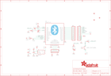

Contents
========

* [PRA1535 > Adafruit Bluefruit EZ Key PCB](#pra1535--adafruit-bluefruit-ez-key-pcb)
	* [Schematic](#schematic)
	* [PCB](#pcb)
	* [Interactive BOM](#interactive-bom)
	* [OOMP Parts](#oomp-parts)
	* [Images](#images)
	* [Tags](#tags)
  
![][im]
# PRA1535 > Adafruit Bluefruit EZ Key PCB

- ID: PROJ-ADAF-1535-STAN-01
- Hex ID: PRA1535
- Name: Adafruit
- Description: Adafruit
- Long Link: [http://oom.lt/PROJ-ADAF-1535-STAN-01](http://oom.lt/PROJ-ADAF-1535-STAN-01)
- Short Link: [http://oom.lt/PRA1535](http://oom.lt/PRA1535)

## Schematic
  

## PCB
  

## Interactive BOM

- Interactive BOM page: [ibom.html](https://htmlpreview.github.io/?https://github.com/oomlout/oomlout_OOMP_projects/blob/main/PROJ-ADAF-1535-STAN-01/kicad/bom/ibom.html)

## OOMP Parts
  

|OOMP Parts|
| :---: |
|[C1 CAPC-0805-X-UF10-V10 SMD (0805) 10 uF Capacitor (Ceramic) 10v](https://github.com/oomlout/oomlout_OOMP_parts/tree/main/CAPC-0805-X-UF10-V10/)|
|[C4 CAPC-0805-X-UF10-V10 SMD (0805) 10 uF Capacitor (Ceramic) 10v](https://github.com/oomlout/oomlout_OOMP_parts/tree/main/CAPC-0805-X-UF10-V10/)|
|[D1 DIOD-S323-X-K4148-01 SMD (SOD-323) Diode](https://github.com/oomlout/oomlout_OOMP_parts/tree/main/DIOD-S323-X-K4148-01/)|
|[JP1 HEAD-I01-X-PI12-01 2.54 mm 12 Pin Header](https://github.com/oomlout/oomlout_OOMP_parts/tree/main/HEAD-I01-X-PI12-01/)|
|[JP2 HEAD-I01-X-PI12-01 2.54 mm 12 Pin Header](https://github.com/oomlout/oomlout_OOMP_parts/tree/main/HEAD-I01-X-PI12-01/)|
|[JP3 HEAD-I01-X-PI06-01 2.54 mm 6 Pin Header](https://github.com/oomlout/oomlout_OOMP_parts/tree/main/HEAD-I01-X-PI06-01/)|
|[LED1 LEDS-0805-G-STAN-01 SMD (0805) Green LED](https://github.com/oomlout/oomlout_OOMP_parts/tree/main/LEDS-0805-G-STAN-01/)|
|[LED2 LEDS-0805-G-STAN-01 SMD (0805) Green LED](https://github.com/oomlout/oomlout_OOMP_parts/tree/main/LEDS-0805-G-STAN-01/)|
|[R1 RESE-0805-X-O103-01 SMD (0805) 10k Ohm Resistor](https://github.com/oomlout/oomlout_OOMP_parts/tree/main/RESE-0805-X-O103-01/)|
|[R2 RESE-0805-X-O102-01 SMD (0805) 1k Ohm Resistor](https://github.com/oomlout/oomlout_OOMP_parts/tree/main/RESE-0805-X-O102-01/)|
|[R3 RESE-0805-X-O102-01 SMD (0805) 1k Ohm Resistor](https://github.com/oomlout/oomlout_OOMP_parts/tree/main/RESE-0805-X-O102-01/)|
|[R4 RESE-0805-X-O103-01 SMD (0805) 10k Ohm Resistor](https://github.com/oomlout/oomlout_OOMP_parts/tree/main/RESE-0805-X-O103-01/)|
|[R5 RESE-0805-X-O222-01 SMD (0805) 2.2k Ohm Resistor](https://github.com/oomlout/oomlout_OOMP_parts/tree/main/RESE-0805-X-O222-01/)|
|SW1 SW1,UNMATCHED-UNMATCHED-X-UNMATCHED-01|
|U1 U1,UNMATCHED-UNMATCHED-X-UNMATCHED-01|
|[U2 VREG-SO235-X-KMIC5225-V33D SMD (SOT-23-5) MIC5225 Voltage Regulator 3.3v](https://github.com/oomlout/oomlout_OOMP_parts/tree/main/VREG-SO235-X-KMIC5225-V33D/)|

## Images
  
  

|kicadPcb3d|kicadPcb3dFront|kicadPcb3dBack|eagleImage|eagleSchemImage|
| :---: | :---: | :---: | :---: | :---: |
||||||

## Tags

- hexID: PRA1535
- oompType: PROJ
- oompSize: ADAF
- oompColor: 1535
- oompDesc: STAN
- oompIndex: 01
- oompName: Adafruit Bluefruit EZ Key PCB
- sources: All source files from https://github.com/adafruit/Adafruit-Bluefruit-EZ-Key-PCB (source licence details in srcLicense.md)
- linkBuyPage: http://www.adafruit.com/products/1535
- oompID: PROJ-ADAF-1535-STAN-01
- oompParts: C1,CAPC-0805-X-UF10-V10
- oompParts: C4,CAPC-0805-X-UF10-V10
- oompParts: D1,DIOD-S323-X-K4148-01
- oompParts: JP1,HEAD-I01-X-PI12-01
- oompParts: JP2,HEAD-I01-X-PI12-01
- oompParts: JP3,HEAD-I01-X-PI06-01
- oompParts: LED1,LEDS-0805-G-STAN-01
- oompParts: LED2,LEDS-0805-G-STAN-01
- oompParts: R1,RESE-0805-X-O103-01
- oompParts: R2,RESE-0805-X-O102-01
- oompParts: R3,RESE-0805-X-O102-01
- oompParts: R4,RESE-0805-X-O103-01
- oompParts: R5,RESE-0805-X-O222-01
- oompParts: SW1,UNMATCHED-UNMATCHED-X-UNMATCHED-01
- oompParts: U1,UNMATCHED-UNMATCHED-X-UNMATCHED-01
- oompParts: U2,VREG-SO235-X-KMIC5225-V33D
- rawParts: C1,10uF,C-USC0805,C0805,CAPACITOR, American symbol,,
- rawParts: C4,10uF,C-USC0805,C0805,CAPACITOR, American symbol,,
- rawParts: D1,1N4148,DIODESOD-323,SOD-323,Diode,,
- rawParts: FID1,FIDUCIAL,FIDUCIAL,FIDUCIAL_1MM,Fiducial Alignment Points,EXCLUDE,
- rawParts: FID2,FIDUCIAL,FIDUCIAL,FIDUCIAL_1MM,Fiducial Alignment Points,EXCLUDE,
- rawParts: FID3,FIDUCIAL,FIDUCIAL,FIDUCIAL_1MM,Fiducial Alignment Points,EXCLUDE,
- rawParts: JP1,,PINHD-1X12-CB,1X12-CB,PIN HEADER,,
- rawParts: JP2,,PINHD-1X12-CB,1X12-CB,PIN HEADER,,
- rawParts: JP3,,PINHD-1X6B,1X06-BIG,PIN HEADER,,
- rawParts: LED1,RED,LED0805_NOOUTLINE,CHIPLED_0805_NOOUTLINE,LED,,
- rawParts: LED2,GREEN,LED0805_NOOUTLINE,CHIPLED_0805_NOOUTLINE,LED,,
- rawParts: R1,10K,R-US_R0805,R0805,RESISTOR, American symbol,,
- rawParts: R2,1K,R-US_R0805,R0805,RESISTOR, American symbol,,
- rawParts: R3,1K,R-US_R0805,R0805,RESISTOR, American symbol,,
- rawParts: R4,10K,R-US_R0805,R0805,RESISTOR, American symbol,,
- rawParts: R5,2.2K,R-US_R0805,R0805,RESISTOR, American symbol,,
- rawParts: SW1,SPST_TACT-KMR2,SPST_TACT-KMR2,KMR2,SMT 6mm switch, EVQQ2 series,,
- rawParts: U1,BlueFruit,BLUETOOTH_MODULE,BLUETOOTH_MODULE,BLUETOOTH MODULE,,
- rawParts: U2,MIC5225,VREG_SOT23-5,SOT23-5,SOT23-5 Fixed Voltage Regulators,,

[im]: kicadPcb3d_450.png
