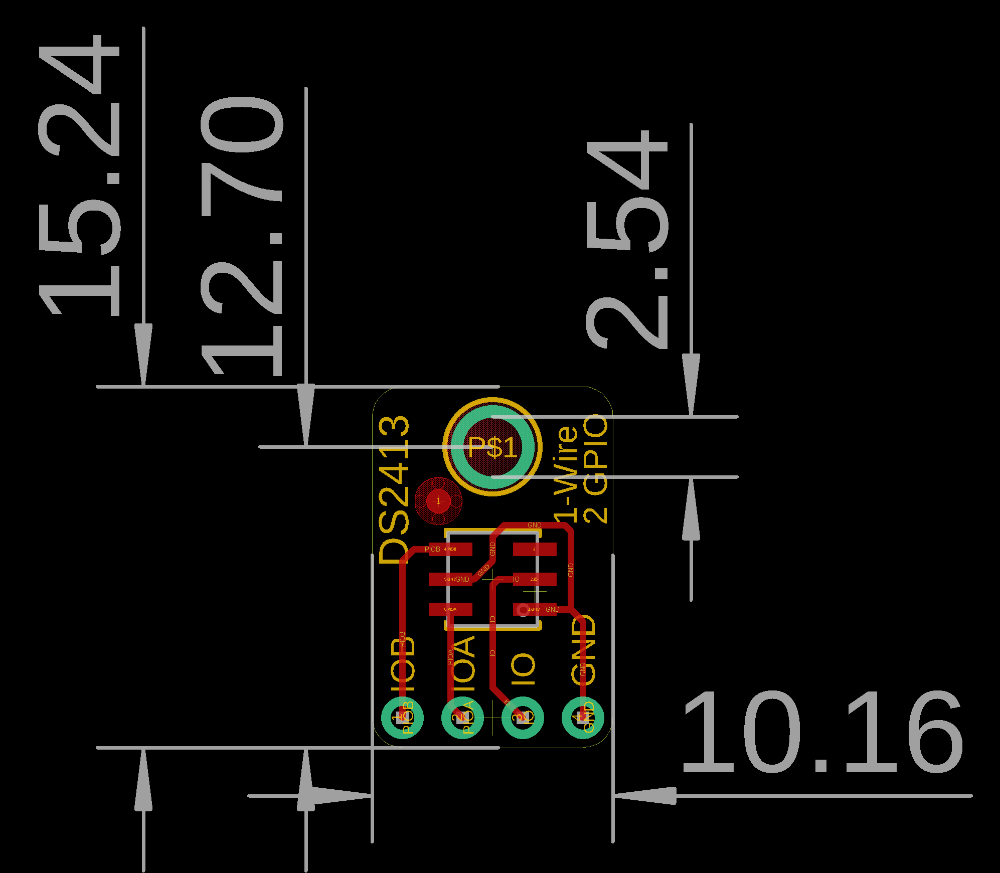
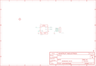

Contents
========

* [PRA1551 > Adafruit DS2413 PCB](#pra1551--adafruit-ds2413-pcb)
	* [Schematic](#schematic)
	* [PCB](#pcb)
	* [Interactive BOM](#interactive-bom)
	* [OOMP Parts](#oomp-parts)
	* [Images](#images)
	* [Tags](#tags)
  
![][im]
# PRA1551 > Adafruit DS2413 PCB

- ID: PROJ-ADAF-1551-STAN-01
- Hex ID: PRA1551
- Name: Adafruit
- Description: Adafruit
- Long Link: [http://oom.lt/PROJ-ADAF-1551-STAN-01](http://oom.lt/PROJ-ADAF-1551-STAN-01)
- Short Link: [http://oom.lt/PRA1551](http://oom.lt/PRA1551)

## Schematic
  

## PCB
  

## Interactive BOM

- Interactive BOM page: [ibom.html](https://htmlpreview.github.io/?https://github.com/oomlout/oomlout_OOMP_projects/blob/main/PROJ-ADAF-1551-STAN-01/kicad/bom/ibom.html)

## OOMP Parts
  

|OOMP Parts|
| :---: |
|CN1 CN1,UNMATCHED-UNMATCHED-X-UNMATCHED-01|
|U1 U1,UNMATCHED-UNMATCHED-X-UNMATCHED-01|

## Images
  
  

|kicadPcb3d|kicadPcb3dFront|kicadPcb3dBack|eagleImage|eagleSchemImage|
| :---: | :---: | :---: | :---: | :---: |
||||||

## Tags

- hexID: PRA1551
- oompType: PROJ
- oompSize: ADAF
- oompColor: 1551
- oompDesc: STAN
- oompIndex: 01
- oompName: Adafruit DS2413 PCB
- sources: All source files from https://github.com/adafruit/Adafruit-DS2413-PCB (source licence details in srcLicense.md)
- linkBuyPage: http://www.adafruit.com/products/1551
- oompID: PROJ-ADAF-1551-STAN-01
- oompParts: CN1,UNMATCHED-UNMATCHED-X-UNMATCHED-01
- oompParts: U1,UNMATCHED-UNMATCHED-X-UNMATCHED-01
- rawParts: CN1,1X4-CLEANBIG,1X4-CLEANBIG,1X04-CLEANBIG,4-pin connector,,
- rawParts: FID1,FIDUCIAL,FIDUCIAL,FIDUCIAL_1MM,Fiducial Alignment Points,EXCLUDE,
- rawParts: U$4,MOUNTINGHOLE2.5,MOUNTINGHOLE2.5,MOUNTINGHOLE_2.5_PLATED,Mounting Hole,EXCLUDE,
- rawParts: U1,DS2413,DS2413TSOC,DS2413_TSOC6L,DS2413 1-Wire Dual Channel,,

[im]: kicadPcb3d_450.png
