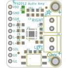
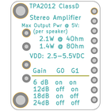
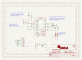
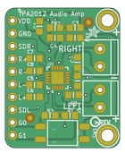

Contents
========

* [PRA1552 > Adafruit TPA2012 or TS2012 Breakout PCB](#pra1552--adafruit-tpa2012-or-ts2012-breakout-pcb)
	* [Schematic](#schematic)
	* [PCB](#pcb)
	* [Interactive BOM](#interactive-bom)
	* [OOMP Parts](#oomp-parts)
	* [Images](#images)
	* [Tags](#tags)
  
![][im]
# PRA1552 > Adafruit TPA2012 or TS2012 Breakout PCB

- ID: PROJ-ADAF-1552-STAN-01
- Hex ID: PRA1552
- Name: Adafruit 1552
- Description: Adafruit 1552
- Long Link: [http://oom.lt/PROJ-ADAF-1552-STAN-01](http://oom.lt/PROJ-ADAF-1552-STAN-01)
- Short Link: [http://oom.lt/PRA1552](http://oom.lt/PRA1552)

## Schematic
  

## PCB
  

## Interactive BOM

- Interactive BOM page: [ibom.html](https://htmlpreview.github.io/?https://github.com/oomlout/oomlout_OOMP_projects/blob/main/PROJ-ADAF-1552-STAN-01/kicad/bom/ibom.html)

## OOMP Parts
  

|OOMP ID|Name|Identifier|
| :---: | :---: | :---: |
|CAPC-0805-X-UNMATCHED-01||C1, C2, C3, C4, C5, C6, C7, C8|
|FERB-0805-X-UNMATCHED-01||FB1, FB2|
|[TERS-35D-L-PI02-01](https://github.com/oomlout/oomlout_OOMP_parts/tree/main/TERS-35D-L-PI02-01/)|[3.5 mm 2 Pin Blue Screw Terminal](https://github.com/oomlout/oomlout_OOMP_parts/tree/main/TERS-35D-L-PI02-01/)|[J1, J2](https://github.com/oomlout/oomlout_OOMP_parts/tree/main/TERS-35D-L-PI02-01/)|
|[HEAD-I01-X-PI10-01](https://github.com/oomlout/oomlout_OOMP_parts/tree/main/HEAD-I01-X-PI10-01/)|[2.54 mm 10 Pin Header](https://github.com/oomlout/oomlout_OOMP_parts/tree/main/HEAD-I01-X-PI10-01/)|[JP1](https://github.com/oomlout/oomlout_OOMP_parts/tree/main/HEAD-I01-X-PI10-01/)|
|RESE-0805-X-O1003-01||R1, R2, R3, R4|
|UNMATCHED-UNMATCHED-X-UNMATCHED-01||SW1, U1|

## Images
  
  

|bominteractivefront|bominteractiveback|kicadPcb3d|kicadPcb3dFront|kicadPcb3dBack|kicadSchem|eagleImage|eagleSchemImage|pcbdraw|pcbdrawback|
| :---: | :---: | :---: | :---: | :---: | :---: | :---: | :---: | :---: | :---: |
|||||||||||

## Tags

- hexID: PRA1552
- oompType: PROJ
- oompSize: ADAF
- oompColor: 1552
- oompDesc: STAN
- oompIndex: 01
- oompName: Adafruit TPA2012 or TS2012 Breakout PCB
- sources: All source files from https://github.com/adafruit/Adafruit-TPA2012-or-TS2012-Breakout-PCB (source licence details in srcLicense.md)
- linkBuyPage: http://www.adafruit.com/products/1552
- oompID: PROJ-ADAF-1552-STAN-01
- oompParts: C1,CAPC-0805-X-UNMATCHED-01
- oompParts: C2,CAPC-0805-X-UNMATCHED-01
- oompParts: C3,CAPC-0805-X-UNMATCHED-01
- oompParts: C4,CAPC-0805-X-UNMATCHED-01
- oompParts: C5,CAPC-0805-X-UNMATCHED-01
- oompParts: C6,CAPC-0805-X-UNMATCHED-01
- oompParts: C7,CAPC-0805-X-UNMATCHED-01
- oompParts: C8,CAPC-0805-X-UNMATCHED-01
- oompParts: FB1,FERB-0805-X-UNMATCHED-01
- oompParts: FB2,FERB-0805-X-UNMATCHED-01
- oompParts: J1,TERS-35D-L-PI02-01
- oompParts: J2,TERS-35D-L-PI02-01
- oompParts: JP1,HEAD-I01-X-PI10-01
- oompParts: R1,RESE-0805-X-O1003-01
- oompParts: R2,RESE-0805-X-O1003-01
- oompParts: R3,RESE-0805-X-O1003-01
- oompParts: R4,RESE-0805-X-O1003-01
- oompParts: SW1,UNMATCHED-UNMATCHED-X-UNMATCHED-01
- oompParts: U1,UNMATCHED-UNMATCHED-X-UNMATCHED-01
- rawParts: C1,10µF,CAP_CERAMIC_0805MP,_0805MP,Ceramic Capacitors,,
- rawParts: C2,0.1µF,CAP_CERAMIC_0805MP,_0805MP,Ceramic Capacitors,,
- rawParts: C3,0.1µF,CAP_CERAMIC_0805MP,_0805MP,Ceramic Capacitors,,
- rawParts: C4,0.1µF,CAP_CERAMIC_0805MP,_0805MP,Ceramic Capacitors,,
- rawParts: C5,1µF,CAP_CERAMIC_0805MP,_0805MP,Ceramic Capacitors,,
- rawParts: C6,1µF,CAP_CERAMIC_0805MP,_0805MP,Ceramic Capacitors,,
- rawParts: C7,1µF,CAP_CERAMIC_0805MP,_0805MP,Ceramic Capacitors,,
- rawParts: C8,1µF,CAP_CERAMIC_0805MP,_0805MP,Ceramic Capacitors,,
- rawParts: FB1,ferrite,FERRITE_0805MP,_0805MP,Ferrite Bead,,
- rawParts: FB2,ferrite,FERRITE_0805MP,_0805MP,Ferrite Bead,,
- rawParts: FID1,FIDUCIAL,FIDUCIAL,FIDUCIAL_1MM,Fiducial Alignment Points,EXCLUDE,
- rawParts: FID2,FIDUCIAL,FIDUCIAL,FIDUCIAL_1MM,Fiducial Alignment Points,EXCLUDE,
- rawParts: J1,,TERMBLOCK_1X2,TERMBLOCK_1X2-3.5MM,3.5mm Terminal block,,
- rawParts: J2,,TERMBLOCK_1X2,TERMBLOCK_1X2-3.5MM,3.5mm Terminal block,,
- rawParts: JP1,,HEADER-1X1070MIL,1X10_ROUND70,PIN HEADER,,
- rawParts: R1,100K,RESISTOR_0805MP,_0805MP,Resistors,,
- rawParts: R2,100K,RESISTOR_0805MP,_0805MP,Resistors,,
- rawParts: R3,100K,RESISTOR_0805MP,_0805MP,Resistors,,
- rawParts: R4,100K,RESISTOR_0805MP,_0805MP,Resistors,,
- rawParts: SW1,,DIPSWITCH_2PIN,DIPSWITCH_2PIN,DIP Switch - 2 Pin - [4UConnector: 19493],,
- rawParts: U$20,MOUNTINGHOLE2.5_THICK,MOUNTINGHOLE2.5_THICK,MOUNTINGHOLE_2.5_PLATED_THICK,Mounting Hole,EXCLUDE,
- rawParts: U$21,MOUNTINGHOLE2.5_THICK,MOUNTINGHOLE2.5_THICK,MOUNTINGHOLE_2.5_PLATED_THICK,Mounting Hole,EXCLUDE,
- rawParts: U1,TS2012,AUDIOAMP_TPA2012D2,WQFN20,TPA2012D2 2.1W/CH Stereo Class-D Audio Amp,,

[im]: kicadPcb3d_450.png
