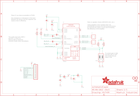

Contents
========

* [PRA1552 > Adafruit](#pra1552--adafruit)
	* [Schematic](#schematic)
	* [Interactive BOM](#interactive-bom)
	* [OOMP Parts](#oomp-parts)
	* [Images](#images)
	* [Tags](#tags)
  
![][im]
# PRA1552 > Adafruit

- ID: PROJ-ADAF-1552-STAN-01
- Hex ID: PRA1552
- Name: Adafruit
- Description: Adafruit
- Long Link: [http://oom.lt/PROJ-ADAF-1552-STAN-01](http://oom.lt/PROJ-ADAF-1552-STAN-01)
- Long Link: [http://oom.lt/PRA1552](http://oom.lt/PRA1552)

## Schematic
  
![][schem]
## Interactive BOM

- Interactive BOM page: [ibom.html](https://htmlpreview.github.io/?https://github.com/oomlout/oomlout_OOMP_projects/blob/main/PROJ-ADAF-1552-STAN-01/kicad/bom/ibom.html)

## OOMP Parts
  

|OOMP Parts|
| :---: |
|C1,UNMATCHED-UNMATCHED-UNMATCHED-UNMATCHED-UNMATCHED,C1,10µF,CAP_CERAMIC_0805MP,_0805MP,Ceramic Capacitors,,|
|C2,UNMATCHED-UNMATCHED-UNMATCHED-UNMATCHED-UNMATCHED,C2,0.1µF,CAP_CERAMIC_0805MP,_0805MP,Ceramic Capacitors,,|
|C3,UNMATCHED-UNMATCHED-UNMATCHED-UNMATCHED-UNMATCHED,C3,0.1µF,CAP_CERAMIC_0805MP,_0805MP,Ceramic Capacitors,,|
|C4,UNMATCHED-UNMATCHED-UNMATCHED-UNMATCHED-UNMATCHED,C4,0.1µF,CAP_CERAMIC_0805MP,_0805MP,Ceramic Capacitors,,|
|C5,UNMATCHED-UNMATCHED-UNMATCHED-UNMATCHED-UNMATCHED,C5,1µF,CAP_CERAMIC_0805MP,_0805MP,Ceramic Capacitors,,|
|C6,UNMATCHED-UNMATCHED-UNMATCHED-UNMATCHED-UNMATCHED,C6,1µF,CAP_CERAMIC_0805MP,_0805MP,Ceramic Capacitors,,|
|C7,UNMATCHED-UNMATCHED-UNMATCHED-UNMATCHED-UNMATCHED,C7,1µF,CAP_CERAMIC_0805MP,_0805MP,Ceramic Capacitors,,|
|C8,UNMATCHED-UNMATCHED-UNMATCHED-UNMATCHED-UNMATCHED,C8,1µF,CAP_CERAMIC_0805MP,_0805MP,Ceramic Capacitors,,|
|FB1,UNMATCHED-UNMATCHED-UNMATCHED-UNMATCHED-UNMATCHED,FB1,ferrite,FERRITE_0805MP,_0805MP,Ferrite Bead,,|
|FB2,UNMATCHED-UNMATCHED-UNMATCHED-UNMATCHED-UNMATCHED,FB2,ferrite,FERRITE_0805MP,_0805MP,Ferrite Bead,,|
|J1,UNMATCHED-UNMATCHED-UNMATCHED-UNMATCHED-UNMATCHED,FID1,FIDUCIAL,FIDUCIAL,FIDUCIAL_1MM,Fiducial Alignment Points,EXCLUDE,|
|J2,UNMATCHED-UNMATCHED-UNMATCHED-UNMATCHED-UNMATCHED,FID2,FIDUCIAL,FIDUCIAL,FIDUCIAL_1MM,Fiducial Alignment Points,EXCLUDE,|
|JP1,UNMATCHED-UNMATCHED-UNMATCHED-UNMATCHED-UNMATCHED,J1,,TERMBLOCK_1X2,TERMBLOCK_1X2-3.5MM,3.5mm Terminal block,,|
|R1,UNMATCHED-UNMATCHED-UNMATCHED-UNMATCHED-UNMATCHED,J2,,TERMBLOCK_1X2,TERMBLOCK_1X2-3.5MM,3.5mm Terminal block,,|
|R2,UNMATCHED-UNMATCHED-UNMATCHED-UNMATCHED-UNMATCHED,JP1,,HEADER-1X1070MIL,1X10_ROUND70,PIN HEADER,,|
|R3,UNMATCHED-UNMATCHED-UNMATCHED-UNMATCHED-UNMATCHED,R1,100K,RESISTOR_0805MP,_0805MP,Resistors,,|
|R4,UNMATCHED-UNMATCHED-UNMATCHED-UNMATCHED-UNMATCHED,R2,100K,RESISTOR_0805MP,_0805MP,Resistors,,|
|SW1,UNMATCHED-UNMATCHED-UNMATCHED-UNMATCHED-UNMATCHED,R3,100K,RESISTOR_0805MP,_0805MP,Resistors,,|
|U1,UNMATCHED-UNMATCHED-UNMATCHED-UNMATCHED-UNMATCHED,R4,100K,RESISTOR_0805MP,_0805MP,Resistors,,|

## Images
  
  

|kicadPcb3d|kicadPcb3dFront|kicadPcb3dBack|eagleImage|eagleSchemImage|
| :---: | :---: | :---: | :---: | :---: |
||||||

## Tags

- hexID: PRA1552
- oompType: PROJ
- oompSize: ADAF
- oompColor: 1552
- oompDesc: STAN
- oompIndex: 01
- oompName: Adafruit TPA2012 or TS2012 Breakout PCB
- sources: All source files from https://github.com/adafruit/Adafruit-TPA2012-or-TS2012-Breakout-PCB (source licence details in srcLicense.md)
- linkBuyPage: http://www.adafruit.com/products/1552
- oompID: PROJ-ADAF-1552-STAN-01
- oompParts: C1,UNMATCHED-UNMATCHED-UNMATCHED-UNMATCHED-UNMATCHED
- oompParts: C2,UNMATCHED-UNMATCHED-UNMATCHED-UNMATCHED-UNMATCHED
- oompParts: C3,UNMATCHED-UNMATCHED-UNMATCHED-UNMATCHED-UNMATCHED
- oompParts: C4,UNMATCHED-UNMATCHED-UNMATCHED-UNMATCHED-UNMATCHED
- oompParts: C5,UNMATCHED-UNMATCHED-UNMATCHED-UNMATCHED-UNMATCHED
- oompParts: C6,UNMATCHED-UNMATCHED-UNMATCHED-UNMATCHED-UNMATCHED
- oompParts: C7,UNMATCHED-UNMATCHED-UNMATCHED-UNMATCHED-UNMATCHED
- oompParts: C8,UNMATCHED-UNMATCHED-UNMATCHED-UNMATCHED-UNMATCHED
- oompParts: FB1,UNMATCHED-UNMATCHED-UNMATCHED-UNMATCHED-UNMATCHED
- oompParts: FB2,UNMATCHED-UNMATCHED-UNMATCHED-UNMATCHED-UNMATCHED
- oompParts: J1,UNMATCHED-UNMATCHED-UNMATCHED-UNMATCHED-UNMATCHED
- oompParts: J2,UNMATCHED-UNMATCHED-UNMATCHED-UNMATCHED-UNMATCHED
- oompParts: JP1,UNMATCHED-UNMATCHED-UNMATCHED-UNMATCHED-UNMATCHED
- oompParts: R1,UNMATCHED-UNMATCHED-UNMATCHED-UNMATCHED-UNMATCHED
- oompParts: R2,UNMATCHED-UNMATCHED-UNMATCHED-UNMATCHED-UNMATCHED
- oompParts: R3,UNMATCHED-UNMATCHED-UNMATCHED-UNMATCHED-UNMATCHED
- oompParts: R4,UNMATCHED-UNMATCHED-UNMATCHED-UNMATCHED-UNMATCHED
- oompParts: SW1,UNMATCHED-UNMATCHED-UNMATCHED-UNMATCHED-UNMATCHED
- oompParts: U1,UNMATCHED-UNMATCHED-UNMATCHED-UNMATCHED-UNMATCHED
- rawParts: C1,10µF,CAP_CERAMIC_0805MP,_0805MP,Ceramic Capacitors,,
- rawParts: C2,0.1µF,CAP_CERAMIC_0805MP,_0805MP,Ceramic Capacitors,,
- rawParts: C3,0.1µF,CAP_CERAMIC_0805MP,_0805MP,Ceramic Capacitors,,
- rawParts: C4,0.1µF,CAP_CERAMIC_0805MP,_0805MP,Ceramic Capacitors,,
- rawParts: C5,1µF,CAP_CERAMIC_0805MP,_0805MP,Ceramic Capacitors,,
- rawParts: C6,1µF,CAP_CERAMIC_0805MP,_0805MP,Ceramic Capacitors,,
- rawParts: C7,1µF,CAP_CERAMIC_0805MP,_0805MP,Ceramic Capacitors,,
- rawParts: C8,1µF,CAP_CERAMIC_0805MP,_0805MP,Ceramic Capacitors,,
- rawParts: FB1,ferrite,FERRITE_0805MP,_0805MP,Ferrite Bead,,
- rawParts: FB2,ferrite,FERRITE_0805MP,_0805MP,Ferrite Bead,,
- rawParts: FID1,FIDUCIAL,FIDUCIAL,FIDUCIAL_1MM,Fiducial Alignment Points,EXCLUDE,
- rawParts: FID2,FIDUCIAL,FIDUCIAL,FIDUCIAL_1MM,Fiducial Alignment Points,EXCLUDE,
- rawParts: J1,,TERMBLOCK_1X2,TERMBLOCK_1X2-3.5MM,3.5mm Terminal block,,
- rawParts: J2,,TERMBLOCK_1X2,TERMBLOCK_1X2-3.5MM,3.5mm Terminal block,,
- rawParts: JP1,,HEADER-1X1070MIL,1X10_ROUND70,PIN HEADER,,
- rawParts: R1,100K,RESISTOR_0805MP,_0805MP,Resistors,,
- rawParts: R2,100K,RESISTOR_0805MP,_0805MP,Resistors,,
- rawParts: R3,100K,RESISTOR_0805MP,_0805MP,Resistors,,
- rawParts: R4,100K,RESISTOR_0805MP,_0805MP,Resistors,,
- rawParts: SW1,,DIPSWITCH_2PIN,DIPSWITCH_2PIN,DIP Switch - 2 Pin - [4UConnector: 19493],,
- rawParts: U$20,MOUNTINGHOLE2.5_THICK,MOUNTINGHOLE2.5_THICK,MOUNTINGHOLE_2.5_PLATED_THICK,Mounting Hole,EXCLUDE,
- rawParts: U$21,MOUNTINGHOLE2.5_THICK,MOUNTINGHOLE2.5_THICK,MOUNTINGHOLE_2.5_PLATED_THICK,Mounting Hole,EXCLUDE,
- rawParts: U1,TS2012,AUDIOAMP_TPA2012D2,WQFN20,TPA2012D2 2.1W/CH Stereo Class-D Audio Amp,,

[im]: kicadPcb3d_450.png
[schem]: eagleSchemImage.png
