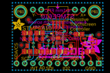
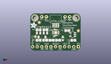
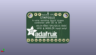
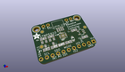

Contents
========

* [PROJ-ADAF-1571-STAN-01>Adafruit STMPE610 Breakout PCB](#proj-adaf-1571-stan-01adafruit-stmpe610-breakout-pcb)
	* [Images](#images)
	* [Interactive BOM](#interactive-bom)
	* [Tags](#tags)
  
![][im]
# PROJ-ADAF-1571-STAN-01>Adafruit STMPE610 Breakout PCB

- ID: PROJ-ADAF-1571-STAN-01
- Hex ID: PRA1571
- Name: Adafruit STMPE610 Breakout PCB
- Description: 

## Images
  
  

|eagleImage|kicadPcb3dFront|kicadPcb3dBack|kicadPcb3d|
| :---: | :---: | :---: | :---: |
|||||

## Interactive BOM

- Interactive BOM page: [ibom.html](kicad/bom/ibom.html)

## Tags

- hexID: PRA1571
- oompType: PROJ
- oompSize: ADAF
- oompColor: 1571
- oompDesc: STAN
- oompIndex: 01
- oompName: Adafruit STMPE610 Breakout PCB
- sources: All source files from https://github.com/adafruit/Adafruit-STMPE610-Breakout-PCB (source licence details in srcLicense.md)
- linkBuyPage: http://www.adafruit.com/products/1571
- oompPart: CAPC-0805-X-NF100-V50, C1, 20.574, 11.302999999999999, 180
- oompPart: CAPC-0805-X-UF10-V25, C2, 23.875999999999998, 5.842, 180
- oompPart: UNMATCHED-UNMATCHED-X-UNMATCHED-01, D1, 18.034, 6.858, 90
- oompPart: SKIP-UNMATCHED-X-UNMATCHED-01, FID1, 4.953, 15.875, 0
- oompPart: SKIP-UNMATCHED-X-UNMATCHED-01, FID2, 26.669999999999998, 11.176, 0
- oompPart: SKIP-UNMATCHED-X-UNMATCHED-01, FID3, 2.794, 7.874, 0
- oompPart: UNMATCHED-UNMATCHED-X-UNMATCHED-01, JP1, 13.97, 2.1590000000000003, 180
- oompPart: UNMATCHED-UNMATCHED-X-UNMATCHED-01, JP4, 20.574, 19.049999999999997, 180
- oompPart: UNMATCHED-UNMATCHED-X-UNMATCHED-01, JP5, 7.619999999999999, 19.049999999999997, 0
- oompPart: UNMATCHED-UNMATCHED-X-UNMATCHED-01, Q1, 8.382, 8.762999999999998, 180
- oompPart: UNMATCHED-UNMATCHED-X-UNMATCHED-01, Q2, 4.571999999999999, 8.762999999999998, 180
- oompPart: RESE-0805-X-O103-01, R1, 8.382, 11.684, 0
- oompPart: RESE-0805-X-O103-01, R2, 8.254999999999999, 5.842, 0
- oompPart: RESE-0805-X-O103-01, R3, 4.571999999999999, 5.842, 180
- oompPart: RESE-0805-X-O103-01, R4, 4.571999999999999, 11.684, 180
- oompPart: RESE-0805-X-O103-01, R5, 15.366999999999999, 5.842, 180
- oompPart: RESE-0805-X-O103-01, R6, 11.811, 5.842, 180
- oompPart: SKIP-UNMATCHED-X-UNMATCHED-01, U$4, 2.54, 18.415, 0
- oompPart: SKIP-UNMATCHED-X-UNMATCHED-01, U$5, 25.4, 18.415, 0
- oompPart: SKIP-UNMATCHED-X-UNMATCHED-01, U$7, 14.097000000000001, 15.493999999999998, 180
- oompPart: UNMATCHED-UNMATCHED-X-UNMATCHED-01, U1, 14.097000000000001, 10.16, 0
- oompPart: UNMATCHED-UNMATCHED-X-UNMATCHED-01, U2, 23.495, 9.017, 90
- rawPart: 

[im]: kicadPcb3d_450.png
