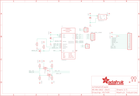

Contents
========

* [PRA1571 > Adafruit](#pra1571--adafruit)
	* [Schematic](#schematic)
	* [Interactive BOM](#interactive-bom)
	* [OOMP Parts](#oomp-parts)
	* [Images](#images)
	* [Tags](#tags)
  
![][im]
# PRA1571 > Adafruit

- ID: PROJ-ADAF-1571-STAN-01
- Hex ID: PRA1571
- Name: Adafruit
- Description: Adafruit
- Long Link: [http://oom.lt/PROJ-ADAF-1571-STAN-01](http://oom.lt/PROJ-ADAF-1571-STAN-01)
- Short Link: [http://oom.lt/PRA1571](http://oom.lt/PRA1571)

## Schematic
  

## Interactive BOM

- Interactive BOM page: [ibom.html](https://htmlpreview.github.io/?https://github.com/oomlout/oomlout_OOMP_projects/blob/main/PROJ-ADAF-1571-STAN-01/kicad/bom/ibom.html)

## OOMP Parts
  

|OOMP Parts|
| :---: |
|C1,UNMATCHED-UNMATCHED-UNMATCHED-UNMATCHED-UNMATCHED,C1,0.1uF,CAP_CERAMIC0805-NOOUTLINE,0805-NO,Ceramic Capacitors,,|
|C2,UNMATCHED-UNMATCHED-UNMATCHED-UNMATCHED-UNMATCHED,C2,10uF,CAP_CERAMIC0805-NOOUTLINE,0805-NO,Ceramic Capacitors,,|
|D1,UNMATCHED-UNMATCHED-UNMATCHED-UNMATCHED-UNMATCHED,D1,1N4148,DIODESOD-323F,SOD-323F,Diode,,|
|JP1,UNMATCHED-UNMATCHED-UNMATCHED-UNMATCHED-UNMATCHED,FID1,FIDUCIAL,FIDUCIAL,FIDUCIAL_1MM,Fiducial Alignment Points,EXCLUDE,|
|JP4,UNMATCHED-UNMATCHED-UNMATCHED-UNMATCHED-UNMATCHED,FID2,FIDUCIAL,FIDUCIAL,FIDUCIAL_1MM,Fiducial Alignment Points,EXCLUDE,|
|JP5,UNMATCHED-UNMATCHED-UNMATCHED-UNMATCHED-UNMATCHED,FID3,FIDUCIAL,FIDUCIAL,FIDUCIAL_1MM,Fiducial Alignment Points,EXCLUDE,|
|Q1,UNMATCHED-UNMATCHED-UNMATCHED-UNMATCHED-UNMATCHED,JP1,,HEADER-1X11,1X11_ROUND,,,|
|Q2,UNMATCHED-UNMATCHED-UNMATCHED-UNMATCHED-UNMATCHED,JP4,,HEADER-1X2ROUND,1X02_ROUND,PIN HEADER,,|
|R1,UNMATCHED-UNMATCHED-UNMATCHED-UNMATCHED-UNMATCHED,JP5,,HEADER-1X2ROUND,1X02_ROUND,PIN HEADER,,|
|R2,UNMATCHED-UNMATCHED-UNMATCHED-UNMATCHED-UNMATCHED,Q1,BSS138,MOSFET-NREFLOW,SOT23,N-Channel Mosfet,,|
|R3,UNMATCHED-UNMATCHED-UNMATCHED-UNMATCHED-UNMATCHED,Q2,BSS138,MOSFET-NREFLOW,SOT23,N-Channel Mosfet,,|
|R4,UNMATCHED-UNMATCHED-UNMATCHED-UNMATCHED-UNMATCHED,R1,10K,RESISTOR0805_NOOUTLINE,0805-NO,Resistors,,|
|R5,UNMATCHED-UNMATCHED-UNMATCHED-UNMATCHED-UNMATCHED,R2,10K,RESISTOR0805_NOOUTLINE,0805-NO,Resistors,,|
|R6,UNMATCHED-UNMATCHED-UNMATCHED-UNMATCHED-UNMATCHED,R3,10K,RESISTOR0805_NOOUTLINE,0805-NO,Resistors,,|
|U$7,UNMATCHED-UNMATCHED-UNMATCHED-UNMATCHED-UNMATCHED,R4,10K,RESISTOR0805_NOOUTLINE,0805-NO,Resistors,,|
|U1,UNMATCHED-UNMATCHED-UNMATCHED-UNMATCHED-UNMATCHED,R5,10K,RESISTOR0805_NOOUTLINE,0805-NO,Resistors,,|
|U2,UNMATCHED-UNMATCHED-UNMATCHED-UNMATCHED-UNMATCHED,R6,10K,RESISTOR0805_NOOUTLINE,0805-NO,Resistors,,|

## Images
  
  

|kicadPcb3d|kicadPcb3dFront|kicadPcb3dBack|eagleImage|eagleSchemImage|
| :---: | :---: | :---: | :---: | :---: |
||||||

## Tags

- hexID: PRA1571
- oompType: PROJ
- oompSize: ADAF
- oompColor: 1571
- oompDesc: STAN
- oompIndex: 01
- oompName: Adafruit STMPE610 Breakout PCB
- sources: All source files from https://github.com/adafruit/Adafruit-STMPE610-Breakout-PCB (source licence details in srcLicense.md)
- linkBuyPage: http://www.adafruit.com/products/1571
- oompID: PROJ-ADAF-1571-STAN-01
- oompParts: C1,UNMATCHED-UNMATCHED-UNMATCHED-UNMATCHED-UNMATCHED
- oompParts: C2,UNMATCHED-UNMATCHED-UNMATCHED-UNMATCHED-UNMATCHED
- oompParts: D1,UNMATCHED-UNMATCHED-UNMATCHED-UNMATCHED-UNMATCHED
- oompParts: JP1,UNMATCHED-UNMATCHED-UNMATCHED-UNMATCHED-UNMATCHED
- oompParts: JP4,UNMATCHED-UNMATCHED-UNMATCHED-UNMATCHED-UNMATCHED
- oompParts: JP5,UNMATCHED-UNMATCHED-UNMATCHED-UNMATCHED-UNMATCHED
- oompParts: Q1,UNMATCHED-UNMATCHED-UNMATCHED-UNMATCHED-UNMATCHED
- oompParts: Q2,UNMATCHED-UNMATCHED-UNMATCHED-UNMATCHED-UNMATCHED
- oompParts: R1,UNMATCHED-UNMATCHED-UNMATCHED-UNMATCHED-UNMATCHED
- oompParts: R2,UNMATCHED-UNMATCHED-UNMATCHED-UNMATCHED-UNMATCHED
- oompParts: R3,UNMATCHED-UNMATCHED-UNMATCHED-UNMATCHED-UNMATCHED
- oompParts: R4,UNMATCHED-UNMATCHED-UNMATCHED-UNMATCHED-UNMATCHED
- oompParts: R5,UNMATCHED-UNMATCHED-UNMATCHED-UNMATCHED-UNMATCHED
- oompParts: R6,UNMATCHED-UNMATCHED-UNMATCHED-UNMATCHED-UNMATCHED
- oompParts: U$7,UNMATCHED-UNMATCHED-UNMATCHED-UNMATCHED-UNMATCHED
- oompParts: U1,UNMATCHED-UNMATCHED-UNMATCHED-UNMATCHED-UNMATCHED
- oompParts: U2,UNMATCHED-UNMATCHED-UNMATCHED-UNMATCHED-UNMATCHED
- rawParts: C1,0.1uF,CAP_CERAMIC0805-NOOUTLINE,0805-NO,Ceramic Capacitors,,
- rawParts: C2,10uF,CAP_CERAMIC0805-NOOUTLINE,0805-NO,Ceramic Capacitors,,
- rawParts: D1,1N4148,DIODESOD-323F,SOD-323F,Diode,,
- rawParts: FID1,FIDUCIAL,FIDUCIAL,FIDUCIAL_1MM,Fiducial Alignment Points,EXCLUDE,
- rawParts: FID2,FIDUCIAL,FIDUCIAL,FIDUCIAL_1MM,Fiducial Alignment Points,EXCLUDE,
- rawParts: FID3,FIDUCIAL,FIDUCIAL,FIDUCIAL_1MM,Fiducial Alignment Points,EXCLUDE,
- rawParts: JP1,,HEADER-1X11,1X11_ROUND,,,
- rawParts: JP4,,HEADER-1X2ROUND,1X02_ROUND,PIN HEADER,,
- rawParts: JP5,,HEADER-1X2ROUND,1X02_ROUND,PIN HEADER,,
- rawParts: Q1,BSS138,MOSFET-NREFLOW,SOT23,N-Channel Mosfet,,
- rawParts: Q2,BSS138,MOSFET-NREFLOW,SOT23,N-Channel Mosfet,,
- rawParts: R1,10K,RESISTOR0805_NOOUTLINE,0805-NO,Resistors,,
- rawParts: R2,10K,RESISTOR0805_NOOUTLINE,0805-NO,Resistors,,
- rawParts: R3,10K,RESISTOR0805_NOOUTLINE,0805-NO,Resistors,,
- rawParts: R4,10K,RESISTOR0805_NOOUTLINE,0805-NO,Resistors,,
- rawParts: R5,10K,RESISTOR0805_NOOUTLINE,0805-NO,Resistors,,
- rawParts: R6,10K,RESISTOR0805_NOOUTLINE,0805-NO,Resistors,,
- rawParts: U$4,MOUNTINGHOLE2.5,MOUNTINGHOLE2.5,MOUNTINGHOLE_2.5_PLATED,Mounting Hole,EXCLUDE,
- rawParts: U$5,MOUNTINGHOLE2.5,MOUNTINGHOLE2.5,MOUNTINGHOLE_2.5_PLATED,Mounting Hole,EXCLUDE,
- rawParts: U$7,FPC_4PIN_12969,FPC_4PIN_12969,FPC_CONN_1MM_DUAL_4P,,,
- rawParts: U1,STMPE610,STMPE610,QFN16_3MM,STMPE610 - 12-Bit Touch Screen Controller,,
- rawParts: U2,MIC5225-3.3,VREG_SOT23-5,SOT23-5,SOT23-5 Fixed Voltage Regulators,,

[im]: kicadPcb3d_450.png
