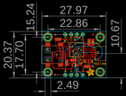
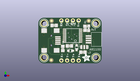
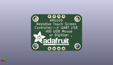
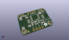

Contents
========

* [PROJ-ADAF-1580-STAN-01>Adafruit AR1100 Resistive Touch Controller PCB](#proj-adaf-1580-stan-01adafruit-ar1100-resistive-touch-controller-pcb)
	* [Images](#images)
	* [Interactive BOM](#interactive-bom)
	* [Tags](#tags)
  
![][im]
# PROJ-ADAF-1580-STAN-01>Adafruit AR1100 Resistive Touch Controller PCB

- ID: PROJ-ADAF-1580-STAN-01
- Hex ID: PRA1580
- Name: Adafruit AR1100 Resistive Touch Controller PCB
- Description: 

## Images
  
  

|eagleImage|kicadPcb3dFront|kicadPcb3dBack|kicadPcb3d|
| :---: | :---: | :---: | :---: |
|||||

## Interactive BOM

- Interactive BOM page: [ibom.html](kicad/bom/ibom.html)

## Tags

- hexID: PRA1580
- oompType: PROJ
- oompSize: ADAF
- oompColor: 1580
- oompDesc: STAN
- oompIndex: 01
- oompName: Adafruit AR1100 Resistive Touch Controller PCB
- sources: All source files from https://github.com/adafruit/Adafruit-AR1100-Resistive-Touch-Controller-PCB (source licence details in srcLicense.md)
- linkBuyPage: http://www.adafruit.com/products/1580
- oompPart: CAPC-0805-X-NF100-V50, C1, 5.08, 5.206999999999999, 90
- oompPart: CAPC-0805-X-UF10-V25, C2, 13.97, 3.556, 0
- oompPart: CAPC-0805-X-UF10-V25, C3, 8.001, 6.35, 180
- oompPart: UNMATCHED-UNMATCHED-X-UNMATCHED-01, CN1, 8.254999999999999, -0.127, 180
- oompPart: UNMATCHED-UNMATCHED-X-UNMATCHED-01, CN2, 8.254999999999999, 17.653, 180
- oompPart: UNMATCHED-UNMATCHED-X-UNMATCHED-01, D2, 8.509, 4.191, 0
- oompPart: UNMATCHED-UNMATCHED-X-UNMATCHED-01, D3, 11.176, 5.588, 270
- oompPart: SKIP-UNMATCHED-X-UNMATCHED-01, FID1, 16.509999999999998, 17.525999999999996, 0
- oompPart: SKIP-UNMATCHED-X-UNMATCHED-01, FID2, 0.0, 0.0, 0
- oompPart: SKIP-UNMATCHED-X-UNMATCHED-01, FID3, 0.127, 17.525999999999996, 0
- oompPart: UNMATCHED-UNMATCHED-X-UNMATCHED-01, IC1, 9.398, 10.921999999999999, 90
- oompPart: UNMATCHED-UNMATCHED-X-UNMATCHED-01, LED1, 16.509999999999998, 14.224, 0
- oompPart: RESE-0805-X-UNMATCHED-01, R1, 14.858999999999998, 14.224, 90
- oompPart: RESE-0805-X-UNMATCHED-01, R2, 1.27, 15.493999999999998, 180
- oompPart: SKIP-UNMATCHED-X-UNMATCHED-01, U$2, -3.175, 1.1429999999999998, 0
- oompPart: SKIP-UNMATCHED-X-UNMATCHED-01, U$4, -3.175, 16.383, 0
- oompPart: SKIP-UNMATCHED-X-UNMATCHED-01, U$5, 19.685, 16.383, 0
- oompPart: SKIP-UNMATCHED-X-UNMATCHED-01, U$6, 19.685, 1.1429999999999998, 0
- oompPart: SKIP-UNMATCHED-X-UNMATCHED-01, U$7, 17.653, 9.270999999999999, 90
- oompPart: UNMATCHED-UNMATCHED-X-UNMATCHED-01, X1, -1.1429999999999998, 8.762999999999998, 270
- oompPart: UNMATCHED-UNMATCHED-X-UNMATCHED-01, Y1, 14.5415, 5.842, 0
- rawPart: 

[im]: kicadPcb3d_450.png
