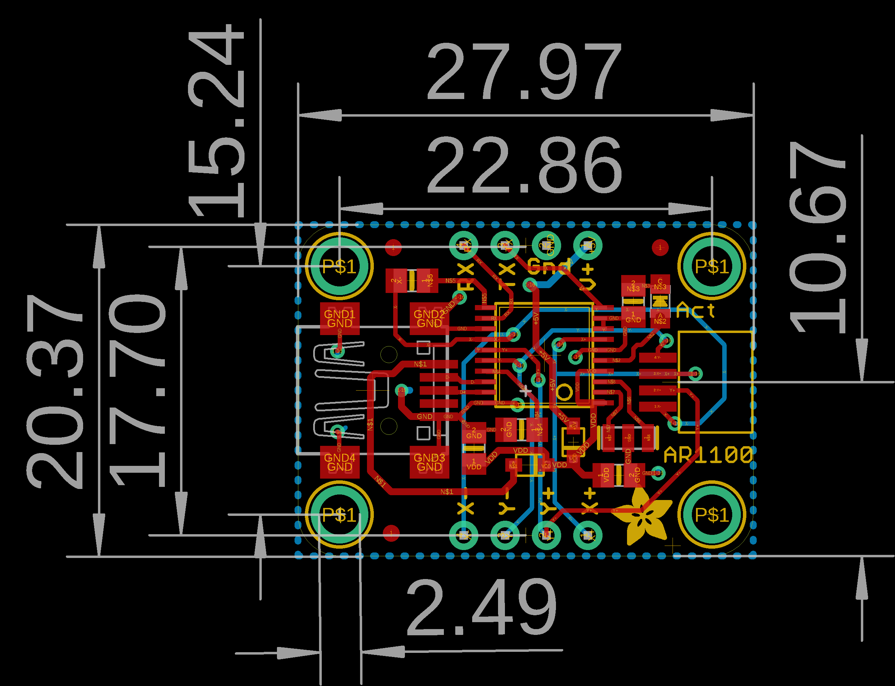
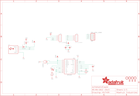

Contents
========

* [PRA1580 > Adafruit AR1100 Resistive Touch Controller PCB](#pra1580--adafruit-ar1100-resistive-touch-controller-pcb)
	* [Schematic](#schematic)
	* [PCB](#pcb)
	* [Interactive BOM](#interactive-bom)
	* [OOMP Parts](#oomp-parts)
	* [Images](#images)
	* [Tags](#tags)
  
![][im]
# PRA1580 > Adafruit AR1100 Resistive Touch Controller PCB

- ID: PROJ-ADAF-1580-STAN-01
- Hex ID: PRA1580
- Name: Adafruit
- Description: Adafruit
- Long Link: [http://oom.lt/PROJ-ADAF-1580-STAN-01](http://oom.lt/PROJ-ADAF-1580-STAN-01)
- Short Link: [http://oom.lt/PRA1580](http://oom.lt/PRA1580)

## Schematic
  

## PCB
  

## Interactive BOM

- Interactive BOM page: [ibom.html](https://htmlpreview.github.io/?https://github.com/oomlout/oomlout_OOMP_projects/blob/main/PROJ-ADAF-1580-STAN-01/kicad/bom/ibom.html)

## OOMP Parts
  

|OOMP Parts|
| :---: |
|C1 C1,CAPC-0805-X-UF1D-01|
|[C2 CAPC-0805-X-UF10-V10 SMD (0805) 10 uF Capacitor (Ceramic) 10v](https://github.com/oomlout/oomlout_OOMP_parts/tree/main/CAPC-0805-X-UF10-V10/)|
|[C3 CAPC-0805-X-UF10-V10 SMD (0805) 10 uF Capacitor (Ceramic) 10v](https://github.com/oomlout/oomlout_OOMP_parts/tree/main/CAPC-0805-X-UF10-V10/)|
|CN1 CN1,UNMATCHED-UNMATCHED-X-UNMATCHED-01|
|CN2 CN2,UNMATCHED-UNMATCHED-X-UNMATCHED-01|
|[D2 DIOD-S323-X-K4148-01 SMD (SOD-323) Diode](https://github.com/oomlout/oomlout_OOMP_parts/tree/main/DIOD-S323-X-K4148-01/)|
|[D3 DIOD-S323-X-K4148-01 SMD (SOD-323) Diode](https://github.com/oomlout/oomlout_OOMP_parts/tree/main/DIOD-S323-X-K4148-01/)|
|IC1 IC1,UNMATCHED-UNMATCHED-X-UNMATCHED-01|
|[LED1 LEDS-0805-G-STAN-01 SMD (0805) Green LED](https://github.com/oomlout/oomlout_OOMP_parts/tree/main/LEDS-0805-G-STAN-01/)|
|R1 R1,RESE-0805-X-O471-01|
|[R2 RESE-0805-X-O203-01 SMD (0805) 20k Ohm Resistor](https://github.com/oomlout/oomlout_OOMP_parts/tree/main/RESE-0805-X-O203-01/)|
|U$7 U$7,UNMATCHED-UNMATCHED-X-UNMATCHED-01|
|X1 X1,UNMATCHED-UNMATCHED-X-UNMATCHED-01|
|Y1 Y1,UNMATCHED-UNMATCHED-X-UNMATCHED-01|

## Images
  
  

|kicadPcb3d|kicadPcb3dFront|kicadPcb3dBack|eagleImage|eagleSchemImage|
| :---: | :---: | :---: | :---: | :---: |
||||||

## Tags

- hexID: PRA1580
- oompType: PROJ
- oompSize: ADAF
- oompColor: 1580
- oompDesc: STAN
- oompIndex: 01
- oompName: Adafruit AR1100 Resistive Touch Controller PCB
- sources: All source files from https://github.com/adafruit/Adafruit-AR1100-Resistive-Touch-Controller-PCB (source licence details in srcLicense.md)
- linkBuyPage: http://www.adafruit.com/products/1580
- oompID: PROJ-ADAF-1580-STAN-01
- oompParts: C1,CAPC-0805-X-UF1D-01
- oompParts: C2,CAPC-0805-X-UF10-V10
- oompParts: C3,CAPC-0805-X-UF10-V10
- oompParts: CN1,UNMATCHED-UNMATCHED-X-UNMATCHED-01
- oompParts: CN2,UNMATCHED-UNMATCHED-X-UNMATCHED-01
- oompParts: D2,DIOD-S323-X-K4148-01
- oompParts: D3,DIOD-S323-X-K4148-01
- oompParts: IC1,UNMATCHED-UNMATCHED-X-UNMATCHED-01
- oompParts: LED1,LEDS-0805-G-STAN-01
- oompParts: R1,RESE-0805-X-O471-01
- oompParts: R2,RESE-0805-X-O203-01
- oompParts: U$7,UNMATCHED-UNMATCHED-X-UNMATCHED-01
- oompParts: X1,UNMATCHED-UNMATCHED-X-UNMATCHED-01
- oompParts: Y1,UNMATCHED-UNMATCHED-X-UNMATCHED-01
- rawParts: C1,0.1uF,CAP_CERAMIC0805-NOOUTLINE,0805-NO,Ceramic Capacitors,,
- rawParts: C2,10uF,CAP_CERAMIC0805-NOOUTLINE,0805-NO,Ceramic Capacitors,,
- rawParts: C3,10uF,CAP_CERAMIC0805-NOOUTLINE,0805-NO,Ceramic Capacitors,,
- rawParts: CN1,1X4-CLEANBIG,1X4-CLEANBIG,1X04-CLEANBIG,4-pin connector,,
- rawParts: CN2,1X4-CLEANBIG,1X4-CLEANBIG,1X04-CLEANBIG,4-pin connector,,
- rawParts: D2,1N4148,DIODESOD-323F,SOD-323F,Diode,,
- rawParts: D3,1N4148,DIODESOD-323F,SOD-323F,Diode,,
- rawParts: FID1,FIDUCIAL,FIDUCIAL,FIDUCIAL_1MM,Fiducial Alignment Points,EXCLUDE,
- rawParts: FID2,FIDUCIAL,FIDUCIAL,FIDUCIAL_1MM,Fiducial Alignment Points,EXCLUDE,
- rawParts: FID3,FIDUCIAL,FIDUCIAL,FIDUCIAL_1MM,Fiducial Alignment Points,EXCLUDE,
- rawParts: IC1,AR1100_SSOP,AR1100_SSOP,TSSOP20-5.3MMBODY,,,
- rawParts: LED1,RED,LED0805_NOOUTLINE,CHIPLED_0805_NOOUTLINE,LED,,
- rawParts: R1,470,RESISTOR0805_NOOUTLINE,0805-NO,Resistors,,
- rawParts: R2,20K,RESISTOR0805_NOOUTLINE,0805-NO,Resistors,,
- rawParts: U$2,MOUNTINGHOLE2.5,MOUNTINGHOLE2.5,MOUNTINGHOLE_2.5_PLATED,Mounting Hole,EXCLUDE,
- rawParts: U$4,MOUNTINGHOLE2.5,MOUNTINGHOLE2.5,MOUNTINGHOLE_2.5_PLATED,Mounting Hole,EXCLUDE,
- rawParts: U$5,MOUNTINGHOLE2.5,MOUNTINGHOLE2.5,MOUNTINGHOLE_2.5_PLATED,Mounting Hole,EXCLUDE,
- rawParts: U$6,MOUNTINGHOLE2.5,MOUNTINGHOLE2.5,MOUNTINGHOLE_2.5_PLATED,Mounting Hole,EXCLUDE,
- rawParts: U$7,FPC_4PIN_12969,FPC_4PIN_12969,FPC_CONN_1MM_DUAL_4P,,,
- rawParts: X1,,USBMINIB,USB-MINIB,USB Connectors,,
- rawParts: Y1,12MHz,RESONATORSMD,RESONATOR-SMD,Resonator,,

[im]: kicadPcb3d_450.png
