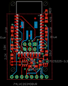
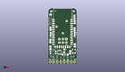
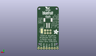
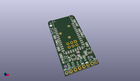

Contents
========

* [PROJ-ADAF-1588-STAN-01>Adafruit Bluefruit Classic PCBs](#proj-adaf-1588-stan-01adafruit-bluefruit-classic-pcbs)
	* [Images](#images)
	* [Interactive BOM](#interactive-bom)
	* [Tags](#tags)
  
![][im]
# PROJ-ADAF-1588-STAN-01>Adafruit Bluefruit Classic PCBs

- ID: PROJ-ADAF-1588-STAN-01
- Hex ID: PRA1588
- Name: Adafruit Bluefruit Classic PCBs
- Description: 

## Images
  
  

|eagleImage|kicadPcb3dFront|kicadPcb3dBack|kicadPcb3d|
| :---: | :---: | :---: | :---: |
|||||

## Interactive BOM

- Interactive BOM page: [ibom.html](kicad/bom/ibom.html)

## Tags

- hexID: PRA1588
- oompType: PROJ
- oompSize: ADAF
- oompColor: 1588
- oompDesc: STAN
- oompIndex: 01
- oompName: Adafruit Bluefruit Classic PCBs
- sources: All source files from https://github.com/adafruit/Adafruit-Bluefruit-Classic-PCBs (source licence details in srcLicense.md)
- linkBuyPage: http://www.adafruit.com/products/1588
- oompPart: CAPC-0805-X-UF10-V25, C1, 19.049999999999997, 13.462, 90
- oompPart: CAPC-0805-X-UF10-V25, C4, 15.748, 8.382, 90
- oompPart: UNMATCHED-UNMATCHED-X-UNMATCHED-01, D2, 12.065, 6.731, 0
- oompPart: SKIP-UNMATCHED-X-UNMATCHED-01, FID1, 10.413999999999998, 22.352, 0
- oompPart: SKIP-UNMATCHED-X-UNMATCHED-01, FID2, 5.842, 27.178, 0
- oompPart: SKIP-UNMATCHED-X-UNMATCHED-01, FID3, 13.208, 31.241999999999997, 0
- oompPart: UNMATCHED-UNMATCHED-X-UNMATCHED-01, IC1, 7.874, 8.382, 0
- oompPart: UNMATCHED-UNMATCHED-X-UNMATCHED-01, JP1, 19.049999999999997, 1.27, 0
- oompPart: UNMATCHED-UNMATCHED-X-UNMATCHED-01, JP2, 1.27, 1.27, 0
- oompPart: UNMATCHED-UNMATCHED-X-UNMATCHED-01, JP4, 10.16, 1.27, 0
- oompPart: UNMATCHED-UNMATCHED-X-UNMATCHED-01, JP5, 10.413999999999998, 16.764, 180
- oompPart: UNMATCHED-UNMATCHED-X-UNMATCHED-01, LED1, 18.923, 34.29, 0
- oompPart: UNMATCHED-UNMATCHED-X-UNMATCHED-01, LED3, 18.923, 21.59, 180
- oompPart: UNMATCHED-UNMATCHED-X-UNMATCHED-01, LED4, 1.5239999999999998, 21.59, 180
- oompPart: RESE-0805-X-O103-01, R1, 1.397, 16.637, 90
- oompPart: RESE-0805-X-UNMATCHED-01, R2, 18.923, 30.607, 270
- oompPart: RESE-0805-X-O222-01, R5, 1.397, 11.684, 270
- oompPart: RESE-UNMATCHED-X-O103-01, R6, 11.43, 9.524999999999999, 270
- oompPart: RESE-0805-X-O221-01, R8, 18.923, 25.145999999999997, 90
- oompPart: RESE-0805-X-O221-01, R10, 1.5239999999999998, 25.654, 90
- oompPart: UNMATCHED-UNMATCHED-X-UNMATCHED-01, SJ1, 16.002, 17.653, M270
- oompPart: UNMATCHED-UNMATCHED-X-UNMATCHED-01, SW1, 3.429, 8.254999999999999, 0
- oompPart: UNMATCHED-UNMATCHED-X-UNMATCHED-01, U1, 10.16, 26.416, 0
- oompPart: UNMATCHED-UNMATCHED-X-UNMATCHED-01, U2, 18.415, 9.143999999999998, 0
- oompPart: UNMATCHED-UNMATCHED-X-UNMATCHED-01, VBAT, 10.16, 26.416, M0
- rawPart: 

[im]: kicadPcb3d_450.png
