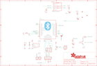

Contents
========

* [PRA1588 > Adafruit Bluefruit Classic PCBs](#pra1588--adafruit-bluefruit-classic-pcbs)
	* [Schematic](#schematic)
	* [PCB](#pcb)
	* [Interactive BOM](#interactive-bom)
	* [OOMP Parts](#oomp-parts)
	* [Images](#images)
	* [Tags](#tags)
  
![][im]
# PRA1588 > Adafruit Bluefruit Classic PCBs

- ID: PROJ-ADAF-1588-STAN-01
- Hex ID: PRA1588
- Name: Adafruit
- Description: Adafruit
- Long Link: [http://oom.lt/PROJ-ADAF-1588-STAN-01](http://oom.lt/PROJ-ADAF-1588-STAN-01)
- Short Link: [http://oom.lt/PRA1588](http://oom.lt/PRA1588)

## Schematic
  

## PCB
  

## Interactive BOM

- Interactive BOM page: [ibom.html](https://htmlpreview.github.io/?https://github.com/oomlout/oomlout_OOMP_projects/blob/main/PROJ-ADAF-1588-STAN-01/kicad/bom/ibom.html)

## OOMP Parts
  

|OOMP ID|Name|Identifier|
| :---: | :---: | :---: |
|[CAPC-0805-X-UF10-V10](https://github.com/oomlout/oomlout_OOMP_parts/tree/main/CAPC-0805-X-UF10-V10/)|[SMD (0805) 10 uF Capacitor (Ceramic) 10v](https://github.com/oomlout/oomlout_OOMP_parts/tree/main/CAPC-0805-X-UF10-V10/)|[C1, C4](https://github.com/oomlout/oomlout_OOMP_parts/tree/main/CAPC-0805-X-UF10-V10/)|
|[DIOD-S123-X-KMBR120-01](https://github.com/oomlout/oomlout_OOMP_parts/tree/main/DIOD-S123-X-KMBR120-01/)|[SMD (SOD-123) MBR120 Diode](https://github.com/oomlout/oomlout_OOMP_parts/tree/main/DIOD-S123-X-KMBR120-01/)|[D2](https://github.com/oomlout/oomlout_OOMP_parts/tree/main/DIOD-S123-X-KMBR120-01/)|
|UNMATCHED-SO23-X-UNMATCHED-01||IC1|
|HEAD-I01-X-PI01-01||JP1, JP2|
|[HEAD-I01-X-PI06-01](https://github.com/oomlout/oomlout_OOMP_parts/tree/main/HEAD-I01-X-PI06-01/)|[2.54 mm 6 Pin Header](https://github.com/oomlout/oomlout_OOMP_parts/tree/main/HEAD-I01-X-PI06-01/)|[JP4](https://github.com/oomlout/oomlout_OOMP_parts/tree/main/HEAD-I01-X-PI06-01/)|
|[HEAD-I01-X-PI2X03-01](https://github.com/oomlout/oomlout_OOMP_parts/tree/main/HEAD-I01-X-PI2X03-01/)|[2.54 mm 6 Pin (2x3) Header](https://github.com/oomlout/oomlout_OOMP_parts/tree/main/HEAD-I01-X-PI2X03-01/)|[JP5](https://github.com/oomlout/oomlout_OOMP_parts/tree/main/HEAD-I01-X-PI2X03-01/)|
|[LEDS-0805-R-STAN-01](https://github.com/oomlout/oomlout_OOMP_parts/tree/main/LEDS-0805-R-STAN-01/)|[SMD (0805) Red LED](https://github.com/oomlout/oomlout_OOMP_parts/tree/main/LEDS-0805-R-STAN-01/)|[LED1](https://github.com/oomlout/oomlout_OOMP_parts/tree/main/LEDS-0805-R-STAN-01/)|
|[LEDS-0805-L-STAN-01](https://github.com/oomlout/oomlout_OOMP_parts/tree/main/LEDS-0805-L-STAN-01/)|[SMD (0805) Blue LED](https://github.com/oomlout/oomlout_OOMP_parts/tree/main/LEDS-0805-L-STAN-01/)|[LED3, LED4](https://github.com/oomlout/oomlout_OOMP_parts/tree/main/LEDS-0805-L-STAN-01/)|
|[RESE-0805-X-O103-01](https://github.com/oomlout/oomlout_OOMP_parts/tree/main/RESE-0805-X-O103-01/)|[SMD (0805) 10k Ohm Resistor](https://github.com/oomlout/oomlout_OOMP_parts/tree/main/RESE-0805-X-O103-01/)|[R1, R6](https://github.com/oomlout/oomlout_OOMP_parts/tree/main/RESE-0805-X-O103-01/)|
|[RESE-0805-X-O471-01](https://github.com/oomlout/oomlout_OOMP_parts/tree/main/RESE-0805-X-O471-01/)|[SMD (0805) 470 Ohm Resistor](https://github.com/oomlout/oomlout_OOMP_parts/tree/main/RESE-0805-X-O471-01/)|[R2](https://github.com/oomlout/oomlout_OOMP_parts/tree/main/RESE-0805-X-O471-01/)|
|[RESE-0805-X-O222-01](https://github.com/oomlout/oomlout_OOMP_parts/tree/main/RESE-0805-X-O222-01/)|[SMD (0805) 2.2k Ohm Resistor](https://github.com/oomlout/oomlout_OOMP_parts/tree/main/RESE-0805-X-O222-01/)|[R5](https://github.com/oomlout/oomlout_OOMP_parts/tree/main/RESE-0805-X-O222-01/)|
|[RESE-0805-X-O221-01](https://github.com/oomlout/oomlout_OOMP_parts/tree/main/RESE-0805-X-O221-01/)|[SMD (0805) 220 Ohm Resistor](https://github.com/oomlout/oomlout_OOMP_parts/tree/main/RESE-0805-X-O221-01/)|[R8, R10](https://github.com/oomlout/oomlout_OOMP_parts/tree/main/RESE-0805-X-O221-01/)|
|BUTA-UNMATCHED-X-STAN-01||SW1|
|UNMATCHED-UNMATCHED-X-UNMATCHED-01||U1, VBAT|
|[VREG-SO235-X-KMIC5225-V33D](https://github.com/oomlout/oomlout_OOMP_parts/tree/main/VREG-SO235-X-KMIC5225-V33D/)|[SMD (SOT-23-5) MIC5225 Voltage Regulator 3.3v](https://github.com/oomlout/oomlout_OOMP_parts/tree/main/VREG-SO235-X-KMIC5225-V33D/)|[U2](https://github.com/oomlout/oomlout_OOMP_parts/tree/main/VREG-SO235-X-KMIC5225-V33D/)|

## Images
  
  

|bominteractivefront|bominteractiveback|kicadPcb3d|kicadPcb3dFront|kicadPcb3dBack|kicadSchem|eagleImage|eagleSchemImage|pcbdraw|pcbdrawback|
| :---: | :---: | :---: | :---: | :---: | :---: | :---: | :---: | :---: | :---: |
|||||||||||

## Tags

- hexID: PRA1588
- oompType: PROJ
- oompSize: ADAF
- oompColor: 1588
- oompDesc: STAN
- oompIndex: 01
- oompName: Adafruit Bluefruit Classic PCBs
- sources: All source files from https://github.com/adafruit/Adafruit-Bluefruit-Classic-PCBs (source licence details in srcLicense.md)
- linkBuyPage: http://www.adafruit.com/products/1588
- oompID: PROJ-ADAF-1588-STAN-01
- oompParts: C1,CAPC-0805-X-UF10-V10
- oompParts: C4,CAPC-0805-X-UF10-V10
- oompParts: D2,DIOD-S123-X-KMBR120-01
- oompParts: IC1,UNMATCHED-SO23-X-UNMATCHED-01
- oompParts: JP1,HEAD-I01-X-PI01-01
- oompParts: JP2,HEAD-I01-X-PI01-01
- oompParts: JP4,HEAD-I01-X-PI06-01
- oompParts: JP5,HEAD-I01-X-PI2X03-01
- oompParts: LED1,LEDS-0805-R-STAN-01
- oompParts: LED3,LEDS-0805-L-STAN-01
- oompParts: LED4,LEDS-0805-L-STAN-01
- oompParts: R1,RESE-0805-X-O103-01
- oompParts: R2,RESE-0805-X-O471-01
- oompParts: R5,RESE-0805-X-O222-01
- oompParts: R6,RESE-0805-X-O103-01
- oompParts: R8,RESE-0805-X-O221-01
- oompParts: R10,RESE-0805-X-O221-01
- oompParts: SW1,BUTA-UNMATCHED-X-STAN-01
- oompParts: U1,UNMATCHED-UNMATCHED-X-UNMATCHED-01
- oompParts: U2,VREG-SO235-X-KMIC5225-V33D
- oompParts: VBAT,UNMATCHED-UNMATCHED-X-UNMATCHED-01
- rawParts: C1,10uF,CAP_CERAMIC0805-NOOUTLINE,0805-NO,Ceramic Capacitors,,
- rawParts: C4,10uF,CAP_CERAMIC0805-NOOUTLINE,0805-NO,Ceramic Capacitors,,
- rawParts: D2,MBR120,DIODESOD-123,SOD-123,Diode,,
- rawParts: FID1,FIDUCIAL,FIDUCIAL,FIDUCIAL_1MM,Fiducial Alignment Points,EXCLUDE,
- rawParts: FID2,FIDUCIAL,FIDUCIAL,FIDUCIAL_1MM,Fiducial Alignment Points,EXCLUDE,
- rawParts: FID3,FIDUCIAL,FIDUCIAL,FIDUCIAL_1MM,Fiducial Alignment Points,EXCLUDE,
- rawParts: IC1,74LVC2G34DBVR,74LVC2G34DBVR,SOT23-6,,,
- rawParts: JP1,,PINHD-1X1CB,1X01-CLEANBIG,Pin header 1x1 for 0.1 spacing,,
- rawParts: JP2,,PINHD-1X1CB,1X01-CLEANBIG,Pin header 1x1 for 0.1 spacing,,
- rawParts: JP4,,PINHD-1X6B,1X06-BIG,PIN HEADER,,
- rawParts: JP5,,HEADER-2X3,2X03_ROUND_70MIL,PIN HEADER,,
- rawParts: LED1,RED,LED0805_NOOUTLINE,CHIPLED_0805_NOOUTLINE,LED,,
- rawParts: LED3,Blue,LED0805_NOOUTLINE,CHIPLED_0805_NOOUTLINE,LED,,
- rawParts: LED4,Blue,LED0805_NOOUTLINE,CHIPLED_0805_NOOUTLINE,LED,,
- rawParts: R1,10K,RESISTOR0805_NOOUTLINE,0805-NO,Resistors,,
- rawParts: R2,470,RESISTOR0805_NOOUTLINE,0805-NO,Resistors,,
- rawParts: R5,2.2K,RESISTOR0805_NOOUTLINE,0805-NO,Resistors,,
- rawParts: R6,10K,RESISTOR_0805MP,_0805MP,Resistors,,
- rawParts: R8,220,RESISTOR0805_NOOUTLINE,0805-NO,Resistors,,
- rawParts: R10,220,RESISTOR0805_NOOUTLINE,0805-NO,Resistors,,
- rawParts: SJ1,,SOLDERJUMPER_2WAY,SOLDERJUMPER_2WAY_OPEN_NOPASTE,2-Way Solder Jumper,,
- rawParts: SW1,SPST_TACT-KMR2,SPST_TACT-KMR2,KMR2,SMT 6mm switch, EVQQ2 series,,
- rawParts: U1,BlueFruit,BLUETOOTH_MODULE,BLUETOOTH_MODULE,BLUETOOTH MODULE,,
- rawParts: U2,MIC5225-3.3,VREG_SOT23-5,SOT23-5,SOT23-5 Fixed Voltage Regulators,,
- rawParts: VBAT,JST-2PH,JST_2PIN-SMT-RA,JST-PH-2-SMT-RA,JST 2-Pin Connectors of various flavors,,

[im]: kicadPcb3d_450.png
