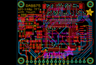
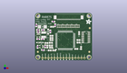
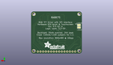
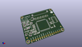

Contents
========

* [PROJ-ADAF-1590-STAN-01>Adafruit RA8875 Breakout Board PCB](#proj-adaf-1590-stan-01adafruit-ra8875-breakout-board-pcb)
	* [Images](#images)
	* [Interactive BOM](#interactive-bom)
	* [OOMP Parts](#oomp-parts)
	* [Tags](#tags)
  
![][im]
# PROJ-ADAF-1590-STAN-01>Adafruit RA8875 Breakout Board PCB

- ID: PROJ-ADAF-1590-STAN-01
- Hex ID: PRA1590
- Name: Adafruit RA8875 Breakout Board PCB
- Description: 

## Images
  
  

|eagleImage|kicadPcb3dFront|kicadPcb3dBack|kicadPcb3d|
| :---: | :---: | :---: | :---: |
|||||

## Interactive BOM

- Interactive BOM page: [ibom.html](kicad/bom/ibom.html)

## OOMP Parts
  

|OOMP Parts|
| :---: |
|<table><tr><td></td><td> C1</td><td>[CAPC-0805-X-NF100-V50 SMD (0805) 100 nF Capacitor (Ceramic) 50v](https://github.com/oomlout/oomlout_OOMP_parts/tree/main/CAPC-0805-X-NF100-V50/)</td><td>[C85N100](https://github.com/oomlout/oomlout_OOMP_parts/tree/main/CAPC-0805-X-NF100-V50/)</td></tr></table>|
|CAPE-0805-X-UNMATCHED-01, C2, 9.644000016, 14.731999999999998, 0,C2, 20pF, 0805-NO, microbuilder, (0.37968504, 0.58), R0|
|CAPE-0805-X-UNMATCHED-01, C3, 13.581000015999997, 10.668, 180,C3, 20pF, 0805-NO, microbuilder, (0.53468504, 0.42), R180|
|<table><tr><td></td><td> C4</td><td>[CAPC-0805-X-NF100-V50 SMD (0805) 100 nF Capacitor (Ceramic) 50v](https://github.com/oomlout/oomlout_OOMP_parts/tree/main/CAPC-0805-X-NF100-V50/)</td><td>[C85N100](https://github.com/oomlout/oomlout_OOMP_parts/tree/main/CAPC-0805-X-NF100-V50/)</td></tr></table>|
|<table><tr><td></td><td> C5</td><td>[CAPC-0805-X-NF100-V50 SMD (0805) 100 nF Capacitor (Ceramic) 50v](https://github.com/oomlout/oomlout_OOMP_parts/tree/main/CAPC-0805-X-NF100-V50/)</td><td>[C85N100](https://github.com/oomlout/oomlout_OOMP_parts/tree/main/CAPC-0805-X-NF100-V50/)</td></tr></table>|
|<table><tr><td></td><td> C6</td><td>[CAPC-0805-X-NF100-V50 SMD (0805) 100 nF Capacitor (Ceramic) 50v](https://github.com/oomlout/oomlout_OOMP_parts/tree/main/CAPC-0805-X-NF100-V50/)</td><td>[C85N100](https://github.com/oomlout/oomlout_OOMP_parts/tree/main/CAPC-0805-X-NF100-V50/)</td></tr></table>|
|<table><tr><td></td><td> C7</td><td>[CAPC-0805-X-NF100-V50 SMD (0805) 100 nF Capacitor (Ceramic) 50v](https://github.com/oomlout/oomlout_OOMP_parts/tree/main/CAPC-0805-X-NF100-V50/)</td><td>[C85N100](https://github.com/oomlout/oomlout_OOMP_parts/tree/main/CAPC-0805-X-NF100-V50/)</td></tr></table>|
|<table><tr><td></td><td> C8</td><td>[CAPC-0805-X-NF100-V50 SMD (0805) 100 nF Capacitor (Ceramic) 50v](https://github.com/oomlout/oomlout_OOMP_parts/tree/main/CAPC-0805-X-NF100-V50/)</td><td>[C85N100](https://github.com/oomlout/oomlout_OOMP_parts/tree/main/CAPC-0805-X-NF100-V50/)</td></tr></table>|
|<table><tr><td></td><td> C9</td><td>[CAPC-0805-X-NF100-V50 SMD (0805) 100 nF Capacitor (Ceramic) 50v](https://github.com/oomlout/oomlout_OOMP_parts/tree/main/CAPC-0805-X-NF100-V50/)</td><td>[C85N100](https://github.com/oomlout/oomlout_OOMP_parts/tree/main/CAPC-0805-X-NF100-V50/)</td></tr></table>|
|<table><tr><td></td><td> C10</td><td>[CAPC-0805-X-NF100-V50 SMD (0805) 100 nF Capacitor (Ceramic) 50v](https://github.com/oomlout/oomlout_OOMP_parts/tree/main/CAPC-0805-X-NF100-V50/)</td><td>[C85N100](https://github.com/oomlout/oomlout_OOMP_parts/tree/main/CAPC-0805-X-NF100-V50/)</td></tr></table>|
|<table><tr><td></td><td> C11</td><td>[CAPC-0805-X-NF100-V50 SMD (0805) 100 nF Capacitor (Ceramic) 50v](https://github.com/oomlout/oomlout_OOMP_parts/tree/main/CAPC-0805-X-NF100-V50/)</td><td>[C85N100](https://github.com/oomlout/oomlout_OOMP_parts/tree/main/CAPC-0805-X-NF100-V50/)</td></tr></table>|
|<table><tr><td></td><td> C12</td><td>[CAPC-0805-X-NF100-V50 SMD (0805) 100 nF Capacitor (Ceramic) 50v](https://github.com/oomlout/oomlout_OOMP_parts/tree/main/CAPC-0805-X-NF100-V50/)</td><td>[C85N100](https://github.com/oomlout/oomlout_OOMP_parts/tree/main/CAPC-0805-X-NF100-V50/)</td></tr></table>|
|CAPC-UNMATCHED-X-UF10-V25, C16, 6.596000015999999, 18.034, 0,C16, 10uF, _0805MP, microbuilder, (0.25968504, 0.71), R0|
|CAPC-UNMATCHED-X-UNMATCHED-01, C17, 12.961999983999998, 24.637999999999998, 270,C17, 1uF, _0805MP, microbuilder, (0.51031496, 0.97), R270|
|CAPC-UNMATCHED-X-NF100-V50, C18, 6.731, 25.915999984000003, 0,C18, 0.1uF, _0805MP, microbuilder, (0.265, 1.02031496), R0|
|CAPC-UNMATCHED-X-UF10-V25, C19, 2.2780000159999996, 11.43, 90,C19, 10uF, _0805MP, microbuilder, (0.08968504, 0.45), R90|
|CAPC-UNMATCHED-X-UNMATCHED-01, C20, 17.010000016, 29.971999999999998, 270,C20, 1uF, _0805MP, microbuilder, (0.66968504, 1.18), R270|
|CAPC-UNMATCHED-X-UF10-V25, C21, 15.559000124, 33.197999898, 180,C21, 10uF, _0805MP, microbuilder, (0.61255906, 1.30700787), R180|
|CAPC-UNMATCHED-X-UF10-V25, C22, 8.628000016, 11.811, 90,C22, 10uF, _0805MP, microbuilder, (0.33968504, 0.465), R90|
|UNMATCHED-UNMATCHED-X-UNMATCHED-01, D1, 6.215000015999999, 28.701999999999995, 180,D1, MM3Z24VT1G, SMADIODE, microbuilder, (0.24468504, 1.13), R180|
|UNMATCHED-UNMATCHED-X-UNMATCHED-01, D2, 11.168000016, 24.511, 270,D2, MBR0540, SOD-123, microbuilder, (0.43968504, 0.965), R270|
|UNMATCHED-UNMATCHED-X-UNMATCHED-01, D3, 5.842, 15.112999999999998, 0,D3, 1N4148, SOD-323F, adafruit, (0.23, 0.595), R0|
|UNMATCHED-UNMATCHED-X-UNMATCHED-01, D4, 2.54, 15.112999999999998, 180,D4, 1N4148, SOD-323F, adafruit, (0.1, 0.595), R180|
|UNMATCHED-UNMATCHED-X-UNMATCHED-01, FB2, 6.723000015999999, 8.762999999999998, 180,FB2, Ferrite, _0805MP, microbuilder, (0.26468504, 0.345), R180|
|UNMATCHED-UNMATCHED-X-UNMATCHED-01, J1, 28.440000016, 37.592, 0,J1, 40PINFPCM4-1734839-0, 4-1734839-0, adafruit, (1.11968504, 1.48), R0|
|UNMATCHED-UNMATCHED-X-UNMATCHED-01, JP1, 24.13, 1.9049999999999998, 180,JP1, Breakout, 1X15-CB, adafruit, (0.95, 0.075), R180|
|ERROR, L1 6.8uH large, 0, 0, 0,L1, 6.8uH, large, inductor, INDUCTOR_5X5MM_NR5040_NOTHERMALS, microbuilder, (0.28968504, 0.86), R90|
|RESE-UNMATCHED-X-UNMATCHED-01, R1, 1.27, 29.971999999999998, 90,R1, 3?, _0805MP, microbuilder, (0.05, 1.18), R90|
|RESE-0805-X-O105-01, R3, 10.406000016, 11.684, 90,R3, 1M, 0805-NO, microbuilder, (0.40968504, 0.46), R90|
|RESE-UNMATCHED-X-UNMATCHED-01, R4, 31.996000015999996, 29.209999999999997, 0,R4, 33, RESPACK_4X0603, microbuilder, (1.25968504, 1.15), R0|
|RESE-UNMATCHED-X-UNMATCHED-01, R5, 28.186000015999998, 29.209999999999997, 0,R5, 33, RESPACK_4X0603, microbuilder, (1.10968504, 1.15), R0|
|RESE-UNMATCHED-X-UNMATCHED-01, R6, 24.376000016, 29.209999999999997, 0,R6, 33, RESPACK_4X0603, microbuilder, (0.95968504, 1.15), R0|
|RESE-UNMATCHED-X-UNMATCHED-01, R7, 20.566000015999997, 29.209999999999997, 0,R7, 33, RESPACK_4X0603, microbuilder, (0.80968504, 1.15), R0|
|RESE-UNMATCHED-X-UNMATCHED-01, R8, 35.806000016, 29.209999999999997, 0,R8, 33, RESPACK_4X0603, microbuilder, (1.40968504, 1.15), R0|
|RESE-UNMATCHED-X-UNMATCHED-01, R9, 2.667, 25.907999999999998, 0,R9, 12?, _0805MP, microbuilder, (0.105, 1.02), R0|
|RESE-UNMATCHED-X-UNMATCHED-01, R10, 2.7860000159999996, 24.13, 180,R10, 12?, _0805MP, microbuilder, (0.10968504, 0.95), R180|
|RESE-UNMATCHED-X-O103-01, R11, 2.7860000159999996, 18.034, 0,R11, 10K, _0805MP, microbuilder, (0.10968504, 0.71), R0|
|<table><tr><td></td><td> R12</td><td>[RESE-0805-X-O103-01 SMD (0805) 10k Ohm Resistor](https://github.com/oomlout/oomlout_OOMP_parts/tree/main/RESE-0805-X-O103-01/)</td><td>[R85103](https://github.com/oomlout/oomlout_OOMP_parts/tree/main/RESE-0805-X-O103-01/)</td></tr></table>|
|UNMATCHED-UNMATCHED-X-UNMATCHED-01, SJ1, 2.794, 25.145999999999997, M0,SJ1, +25mA, SOLDERJUMPER_ARROW_NOPASTE, microbuilder, (0.11, 0.99), MR0|
|UNMATCHED-UNMATCHED-X-UNMATCHED-01, SJ2, 2.794, 27.558999999999997, M0,SJ2, +100mA, SOLDERJUMPER_ARROW_NOPASTE, microbuilder, (0.11, 1.085), MR0|
|UNMATCHED-UNMATCHED-X-UNMATCHED-01, U1, 25.646000015999995, 17.018, 0,U1, RA8875, LQFP100, microbuilder, (1.00968504, 0.67), R0|
|UNMATCHED-UNMATCHED-X-UNMATCHED-01, U3, 2.7860000159999996, 21.081999999999997, 180,U3, FAN5333BSX, SOT23-5@1, microbuilder, (0.10968504, 0.83), R180|
|UNMATCHED-UNMATCHED-X-UNMATCHED-01, U4, 5.326000015999999, 11.684, 90,U4, MIC5225-3.3v, SOT23-5, microbuilder, (0.20968504, 0.46), R90|
|UNMATCHED-UNMATCHED-X-UNMATCHED-01, U5, 43.045000015999996, 19.685, 270,U5, 74HC4050, SOIC16, microbuilder, (1.69468504, 0.775), R270|
|UNMATCHED-UNMATCHED-X-UNMATCHED-01, Y1, 13.454000016, 13.716, 90,Y1, 20MHz, CRYSTAL_3.2X2.5, microbuilder, (0.52968504, 0.54), R90|

## Tags

- hexID: PRA1590
- oompType: PROJ
- oompSize: ADAF
- oompColor: 1590
- oompDesc: STAN
- oompIndex: 01
- oompName: Adafruit RA8875 Breakout Board PCB
- sources: All source files from https://github.com/adafruit/Adafruit-RA8875-Breakout-Board-PCB (source licence details in srcLicense.md)
- linkBuyPage: http://www.adafruit.com/products/1590
- oompPart: CAPC-0805-X-NF100-V50, C1, 14.470000015999998, 28.701999999999995, 180
- oompPart: CAPE-0805-X-UNMATCHED-01, C2, 9.644000016, 14.731999999999998, 0
- oompPart: CAPE-0805-X-UNMATCHED-01, C3, 13.581000015999997, 10.668, 180
- oompPart: CAPC-0805-X-NF100-V50, C4, 13.962000015999998, 20.955, 180
- oompPart: CAPC-0805-X-NF100-V50, C5, 36.822000016, 17.272000000000002, 0
- oompPart: CAPC-0805-X-NF100-V50, C6, 34.917000015999996, 9.652, 0
- oompPart: CAPC-0805-X-NF100-V50, C7, 16.248000016, 8.382, 180
- oompPart: CAPC-0805-X-NF100-V50, C8, 37.330000016, 23.241, 270
- oompPart: CAPC-0805-X-NF100-V50, C9, 12.438000016, 8.382, 180
- oompPart: CAPC-0805-X-NF100-V50, C10, 13.962000015999998, 19.049999999999997, 180
- oompPart: CAPC-0805-X-NF100-V50, C11, 13.962000015999998, 17.272000000000002, 180
- oompPart: CAPC-0805-X-NF100-V50, C12, 36.822000016, 15.112999999999998, 0
- oompPart: CAPC-UNMATCHED-X-UF10-V25, C16, 6.596000015999999, 18.034, 0
- oompPart: CAPC-UNMATCHED-X-UNMATCHED-01, C17, 12.961999983999998, 24.637999999999998, 270
- oompPart: CAPC-UNMATCHED-X-NF100-V50, C18, 6.731, 25.915999984000003, 0
- oompPart: CAPC-UNMATCHED-X-UF10-V25, C19, 2.2780000159999996, 11.43, 90
- oompPart: CAPC-UNMATCHED-X-UNMATCHED-01, C20, 17.010000016, 29.971999999999998, 270
- oompPart: CAPC-UNMATCHED-X-UF10-V25, C21, 15.559000124, 33.197999898, 180
- oompPart: CAPC-UNMATCHED-X-UF10-V25, C22, 8.628000016, 11.811, 90
- oompPart: UNMATCHED-UNMATCHED-X-UNMATCHED-01, D1, 6.215000015999999, 28.701999999999995, 180
- oompPart: UNMATCHED-UNMATCHED-X-UNMATCHED-01, D2, 11.168000016, 24.511, 270
- oompPart: UNMATCHED-UNMATCHED-X-UNMATCHED-01, D3, 5.842, 15.112999999999998, 0
- oompPart: UNMATCHED-UNMATCHED-X-UNMATCHED-01, D4, 2.54, 15.112999999999998, 180
- oompPart: UNMATCHED-UNMATCHED-X-UNMATCHED-01, FB2, 6.723000015999999, 8.762999999999998, 180
- oompPart: SKIP-UNMATCHED-X-UNMATCHED-01, FID1, 2.413, 7.112, 0
- oompPart: SKIP-UNMATCHED-X-UNMATCHED-01, FID2, 45.974, 7.112, 0
- oompPart: SKIP-UNMATCHED-X-UNMATCHED-01, FID3, 46.355, 27.558999999999997, 0
- oompPart: UNMATCHED-UNMATCHED-X-UNMATCHED-01, J1, 28.440000016, 37.592, 0
- oompPart: UNMATCHED-UNMATCHED-X-UNMATCHED-01, JP1, 24.13, 1.9049999999999998, 180
- oompPart: ERROR, L1 6.8uH large, 0, 0, 0
- oompPart: RESE-UNMATCHED-X-UNMATCHED-01, R1, 1.27, 29.971999999999998, 90
- oompPart: RESE-0805-X-O105-01, R3, 10.406000016, 11.684, 90
- oompPart: RESE-UNMATCHED-X-UNMATCHED-01, R4, 31.996000015999996, 29.209999999999997, 0
- oompPart: RESE-UNMATCHED-X-UNMATCHED-01, R5, 28.186000015999998, 29.209999999999997, 0
- oompPart: RESE-UNMATCHED-X-UNMATCHED-01, R6, 24.376000016, 29.209999999999997, 0
- oompPart: RESE-UNMATCHED-X-UNMATCHED-01, R7, 20.566000015999997, 29.209999999999997, 0
- oompPart: RESE-UNMATCHED-X-UNMATCHED-01, R8, 35.806000016, 29.209999999999997, 0
- oompPart: RESE-UNMATCHED-X-UNMATCHED-01, R9, 2.667, 25.907999999999998, 0
- oompPart: RESE-UNMATCHED-X-UNMATCHED-01, R10, 2.7860000159999996, 24.13, 180
- oompPart: RESE-UNMATCHED-X-O103-01, R11, 2.7860000159999996, 18.034, 0
- oompPart: RESE-0805-X-O103-01, R12, 38.981000015999996, 10.413999999999998, 90
- oompPart: UNMATCHED-UNMATCHED-X-UNMATCHED-01, SJ1, 2.794, 25.145999999999997, M0
- oompPart: UNMATCHED-UNMATCHED-X-UNMATCHED-01, SJ2, 2.794, 27.558999999999997, M0
- oompPart: SKIP-UNMATCHED-X-UNMATCHED-01, U$21, 2.54, 38.099999999999994, 0
- oompPart: SKIP-UNMATCHED-X-UNMATCHED-01, U$22, 45.72, 38.099999999999994, 0
- oompPart: SKIP-UNMATCHED-X-UNMATCHED-01, U$23, 45.72, 2.54, 0
- oompPart: SKIP-UNMATCHED-X-UNMATCHED-01, U$24, 2.54, 2.54, 0
- oompPart: UNMATCHED-UNMATCHED-X-UNMATCHED-01, U1, 25.646000015999995, 17.018, 0
- oompPart: UNMATCHED-UNMATCHED-X-UNMATCHED-01, U3, 2.7860000159999996, 21.081999999999997, 180
- oompPart: UNMATCHED-UNMATCHED-X-UNMATCHED-01, U4, 5.326000015999999, 11.684, 90
- oompPart: UNMATCHED-UNMATCHED-X-UNMATCHED-01, U5, 43.045000015999996, 19.685, 270
- oompPart: UNMATCHED-UNMATCHED-X-UNMATCHED-01, Y1, 13.454000016, 13.716, 90
- rawPart: C1, 0.1uF, 0805-NO, microbuilder, (0.56968504, 1.13), R180
- rawPart: C2, 20pF, 0805-NO, microbuilder, (0.37968504, 0.58), R0
- rawPart: C3, 20pF, 0805-NO, microbuilder, (0.53468504, 0.42), R180
- rawPart: C4, 0.1uF, 0805-NO, microbuilder, (0.54968504, 0.825), R180
- rawPart: C5, 0.1uF, 0805-NO, microbuilder, (1.44968504, 0.68), R0
- rawPart: C6, 0.1uF, 0805-NO, microbuilder, (1.37468504, 0.38), R0
- rawPart: C7, 0.1uF, 0805-NO, microbuilder, (0.63968504, 0.33), R180
- rawPart: C8, 0.1uF, 0805-NO, microbuilder, (1.46968504, 0.915), R270
- rawPart: C9, 0.1uF, 0805-NO, microbuilder, (0.48968504, 0.33), R180
- rawPart: C10, 0.1uF, 0805-NO, microbuilder, (0.54968504, 0.75), R180
- rawPart: C11, 0.1uF, 0805-NO, microbuilder, (0.54968504, 0.68), R180
- rawPart: C12, 0.1uF, 0805-NO, microbuilder, (1.44968504, 0.595), R0
- rawPart: C16, 10uF, _0805MP, microbuilder, (0.25968504, 0.71), R0
- rawPart: C17, 1uF, _0805MP, microbuilder, (0.51031496, 0.97), R270
- rawPart: C18, 0.1uF, _0805MP, microbuilder, (0.265, 1.02031496), R0
- rawPart: C19, 10uF, _0805MP, microbuilder, (0.08968504, 0.45), R90
- rawPart: C20, 1uF, _0805MP, microbuilder, (0.66968504, 1.18), R270
- rawPart: C21, 10uF, _0805MP, microbuilder, (0.61255906, 1.30700787), R180
- rawPart: C22, 10uF, _0805MP, microbuilder, (0.33968504, 0.465), R90
- rawPart: D1, MM3Z24VT1G, SMADIODE, microbuilder, (0.24468504, 1.13), R180
- rawPart: D2, MBR0540, SOD-123, microbuilder, (0.43968504, 0.965), R270
- rawPart: D3, 1N4148, SOD-323F, adafruit, (0.23, 0.595), R0
- rawPart: D4, 1N4148, SOD-323F, adafruit, (0.1, 0.595), R180
- rawPart: FB2, Ferrite, _0805MP, microbuilder, (0.26468504, 0.345), R180
- rawPart: FID1, FIDUCIAL, FIDUCIAL_1MM, microbuilder, (0.095, 0.28), R0
- rawPart: FID2, FIDUCIAL, FIDUCIAL_1MM, microbuilder, (1.81, 0.28), R0
- rawPart: FID3, FIDUCIAL, FIDUCIAL_1MM, microbuilder, (1.825, 1.085), R0
- rawPart: J1, 40PINFPCM4-1734839-0, 4-1734839-0, adafruit, (1.11968504, 1.48), R0
- rawPart: JP1, Breakout, 1X15-CB, adafruit, (0.95, 0.075), R180
- rawPart: L1, 6.8uH, large, inductor, INDUCTOR_5X5MM_NR5040_NOTHERMALS, microbuilder, (0.28968504, 0.86), R90
- rawPart: R1, 3?, _0805MP, microbuilder, (0.05, 1.18), R90
- rawPart: R3, 1M, 0805-NO, microbuilder, (0.40968504, 0.46), R90
- rawPart: R4, 33, RESPACK_4X0603, microbuilder, (1.25968504, 1.15), R0
- rawPart: R5, 33, RESPACK_4X0603, microbuilder, (1.10968504, 1.15), R0
- rawPart: R6, 33, RESPACK_4X0603, microbuilder, (0.95968504, 1.15), R0
- rawPart: R7, 33, RESPACK_4X0603, microbuilder, (0.80968504, 1.15), R0
- rawPart: R8, 33, RESPACK_4X0603, microbuilder, (1.40968504, 1.15), R0
- rawPart: R9, 12?, _0805MP, microbuilder, (0.105, 1.02), R0
- rawPart: R10, 12?, _0805MP, microbuilder, (0.10968504, 0.95), R180
- rawPart: R11, 10K, _0805MP, microbuilder, (0.10968504, 0.71), R0
- rawPart: R12, 10K, 0805-NO, microbuilder, (1.53468504, 0.41), R90
- rawPart: SJ1, +25mA, SOLDERJUMPER_ARROW_NOPASTE, microbuilder, (0.11, 0.99), MR0
- rawPart: SJ2, +100mA, SOLDERJUMPER_ARROW_NOPASTE, microbuilder, (0.11, 1.085), MR0
- rawPart: U$21, MOUNTINGHOLE2.5, MOUNTINGHOLE_2.5_PLATED, microbuilder, (0.1, 1.5), R0
- rawPart: U$22, MOUNTINGHOLE2.5, MOUNTINGHOLE_2.5_PLATED, microbuilder, (1.8, 1.5), R0
- rawPart: U$23, MOUNTINGHOLE2.5, MOUNTINGHOLE_2.5_PLATED, microbuilder, (1.8, 0.1), R0
- rawPart: U$24, MOUNTINGHOLE2.5, MOUNTINGHOLE_2.5_PLATED, microbuilder, (0.1, 0.1), R0
- rawPart: U1, RA8875, LQFP100, microbuilder, (1.00968504, 0.67), R0
- rawPart: U3, FAN5333BSX, SOT23-5@1, microbuilder, (0.10968504, 0.83), R180
- rawPart: U4, MIC5225-3.3v, SOT23-5, microbuilder, (0.20968504, 0.46), R90
- rawPart: U5, 74HC4050, SOIC16, microbuilder, (1.69468504, 0.775), R270
- rawPart: Y1, 20MHz, CRYSTAL_3.2X2.5, microbuilder, (0.52968504, 0.54), R90

[im]: kicadPcb3d_450.png
