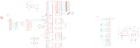

Contents
========

* [PRA1590 > Adafruit](#pra1590--adafruit)
	* [Schematic](#schematic)
	* [Interactive BOM](#interactive-bom)
	* [OOMP Parts](#oomp-parts)
	* [Images](#images)
	* [Tags](#tags)
  
![][im]
# PRA1590 > Adafruit

- ID: PROJ-ADAF-1590-STAN-01
- Hex ID: PRA1590
- Name: Adafruit
- Description: Adafruit
- Long Link: [http://oom.lt/PROJ-ADAF-1590-STAN-01](http://oom.lt/PROJ-ADAF-1590-STAN-01)
- Long Link: [http://oom.lt/PRA1590](http://oom.lt/PRA1590)

## Schematic
  
![][schem]
## Interactive BOM

- Interactive BOM page: [ibom.html](https://htmlpreview.github.io/?https://github.com/oomlout/oomlout_OOMP_projects/blob/main/PROJ-ADAF-1590-STAN-01/kicad/bom/ibom.html)

## OOMP Parts
  

|OOMP Parts|
| :---: |
|C1,UNMATCHED-UNMATCHED-UNMATCHED-UNMATCHED-UNMATCHED,C1,0.1uF,CAP_CERAMIC0805-NOOUTLINE,0805-NO,Ceramic Capacitors,,|
|C2,UNMATCHED-UNMATCHED-UNMATCHED-UNMATCHED-UNMATCHED,C2,20pF,CAP_CERAMIC0805-NOOUTLINE,0805-NO,Ceramic Capacitors,,|
|C3,UNMATCHED-UNMATCHED-UNMATCHED-UNMATCHED-UNMATCHED,C3,20pF,CAP_CERAMIC0805-NOOUTLINE,0805-NO,Ceramic Capacitors,,|
|C4,UNMATCHED-UNMATCHED-UNMATCHED-UNMATCHED-UNMATCHED,C4,0.1uF,CAP_CERAMIC0805-NOOUTLINE,0805-NO,Ceramic Capacitors,,|
|C5,UNMATCHED-UNMATCHED-UNMATCHED-UNMATCHED-UNMATCHED,C5,0.1uF,CAP_CERAMIC0805-NOOUTLINE,0805-NO,Ceramic Capacitors,,|
|C6,UNMATCHED-UNMATCHED-UNMATCHED-UNMATCHED-UNMATCHED,C6,0.1uF,CAP_CERAMIC0805-NOOUTLINE,0805-NO,Ceramic Capacitors,,|
|C7,UNMATCHED-UNMATCHED-UNMATCHED-UNMATCHED-UNMATCHED,C7,0.1uF,CAP_CERAMIC0805-NOOUTLINE,0805-NO,Ceramic Capacitors,,|
|C8,UNMATCHED-UNMATCHED-UNMATCHED-UNMATCHED-UNMATCHED,C8,0.1uF,CAP_CERAMIC0805-NOOUTLINE,0805-NO,Ceramic Capacitors,,|
|C9,UNMATCHED-UNMATCHED-UNMATCHED-UNMATCHED-UNMATCHED,C9,0.1uF,CAP_CERAMIC0805-NOOUTLINE,0805-NO,Ceramic Capacitors,,|
|C10,UNMATCHED-UNMATCHED-UNMATCHED-UNMATCHED-UNMATCHED,C10,0.1uF,CAP_CERAMIC0805-NOOUTLINE,0805-NO,Ceramic Capacitors,,|
|C11,UNMATCHED-UNMATCHED-UNMATCHED-UNMATCHED-UNMATCHED,C11,0.1uF,CAP_CERAMIC0805-NOOUTLINE,0805-NO,Ceramic Capacitors,,|
|C12,UNMATCHED-UNMATCHED-UNMATCHED-UNMATCHED-UNMATCHED,C12,0.1uF,CAP_CERAMIC0805-NOOUTLINE,0805-NO,Ceramic Capacitors,,|
|C16,UNMATCHED-UNMATCHED-UNMATCHED-UNMATCHED-UNMATCHED,C16,10uF,CAP_CERAMIC_0805MP,_0805MP,Ceramic Capacitors,,|
|C17,UNMATCHED-UNMATCHED-UNMATCHED-UNMATCHED-UNMATCHED,C17,1uF,CAP_CERAMIC_0805MP,_0805MP,Ceramic Capacitors,,|
|C18,UNMATCHED-UNMATCHED-UNMATCHED-UNMATCHED-UNMATCHED,C18,0.1uF,CAP_CERAMIC_0805MP,_0805MP,Ceramic Capacitors,,|
|C19,UNMATCHED-UNMATCHED-UNMATCHED-UNMATCHED-UNMATCHED,C19,10µF,CAP_CERAMIC_0805MP,_0805MP,Ceramic Capacitors,,|
|C20,UNMATCHED-UNMATCHED-UNMATCHED-UNMATCHED-UNMATCHED,C20,1uF,CAP_CERAMIC_0805MP,_0805MP,Ceramic Capacitors,,|
|C21,UNMATCHED-UNMATCHED-UNMATCHED-UNMATCHED-UNMATCHED,C21,10µF,CAP_CERAMIC_0805MP,_0805MP,Ceramic Capacitors,,|
|C22,UNMATCHED-UNMATCHED-UNMATCHED-UNMATCHED-UNMATCHED,C22,10uF,CAP_CERAMIC_0805MP,_0805MP,Ceramic Capacitors,,|
|D1,UNMATCHED-UNMATCHED-UNMATCHED-UNMATCHED-UNMATCHED,D1,MM3Z24VT1G,DIODESMA,SMADIODE,Diode,,|
|D2,UNMATCHED-UNMATCHED-UNMATCHED-UNMATCHED-UNMATCHED,D2,MBR0540,DIODESOD-123,SOD-123,Diode,,|
|D3,UNMATCHED-UNMATCHED-UNMATCHED-UNMATCHED-UNMATCHED,D3,1N4148,DIODESOD-323F,SOD-323F,Diode,,|
|D4,UNMATCHED-UNMATCHED-UNMATCHED-UNMATCHED-UNMATCHED,D4,1N4148,DIODESOD-323F,SOD-323F,Diode,,|
|FB2,UNMATCHED-UNMATCHED-UNMATCHED-UNMATCHED-UNMATCHED,FB2,Ferrite,FERRITE_0805MP,_0805MP,Ferrite Bead,,|
|J1,UNMATCHED-UNMATCHED-UNMATCHED-UNMATCHED-UNMATCHED,FID1,FIDUCIAL,FIDUCIAL,FIDUCIAL_1MM,Fiducial Alignment Points,EXCLUDE,|
|JP1,UNMATCHED-UNMATCHED-UNMATCHED-UNMATCHED-UNMATCHED,FID2,FIDUCIAL,FIDUCIAL,FIDUCIAL_1MM,Fiducial Alignment Points,EXCLUDE,|
|L1,UNMATCHED-UNMATCHED-UNMATCHED-UNMATCHED-UNMATCHED,FID3,FIDUCIAL,FIDUCIAL,FIDUCIAL_1MM,Fiducial Alignment Points,EXCLUDE,|
|R1,UNMATCHED-UNMATCHED-UNMATCHED-UNMATCHED-UNMATCHED,J1,40PINFPCM4-1734839-0,40PINFPCM4-1734839-0,4-1734839-0,OMRON FPC Connector,,|
|R3,UNMATCHED-UNMATCHED-UNMATCHED-UNMATCHED-UNMATCHED,JP1,Breakout,PINHD-1X15-CB,1X15-CB,PIN HEADER,,|
|R4,UNMATCHED-UNMATCHED-UNMATCHED-UNMATCHED-UNMATCHED,L1,6.8uH large inductor,INDUCTORNR5040,INDUCTOR_5X5MM_NR5040_NOTHERMALS,Inductors,,|
|R5,UNMATCHED-UNMATCHED-UNMATCHED-UNMATCHED-UNMATCHED,R1,3Ω,RESISTOR_0805MP,_0805MP,Resistors,,|
|R6,UNMATCHED-UNMATCHED-UNMATCHED-UNMATCHED-UNMATCHED,R3,1M,RESISTOR0805_NOOUTLINE,0805-NO,Resistors,,|
|R7,UNMATCHED-UNMATCHED-UNMATCHED-UNMATCHED-UNMATCHED,R4,33,RESISTOR_4PACK_US,RESPACK_4X0603,Resistor Packs (4 resistors),,|
|R8,UNMATCHED-UNMATCHED-UNMATCHED-UNMATCHED-UNMATCHED,R5,33,RESISTOR_4PACK_US,RESPACK_4X0603,Resistor Packs (4 resistors),,|
|R9,UNMATCHED-UNMATCHED-UNMATCHED-UNMATCHED-UNMATCHED,R6,33,RESISTOR_4PACK_US,RESPACK_4X0603,Resistor Packs (4 resistors),,|
|R10,UNMATCHED-UNMATCHED-UNMATCHED-UNMATCHED-UNMATCHED,R7,33,RESISTOR_4PACK_US,RESPACK_4X0603,Resistor Packs (4 resistors),,|
|R11,UNMATCHED-UNMATCHED-UNMATCHED-UNMATCHED-UNMATCHED,R8,33,RESISTOR_4PACK_US,RESPACK_4X0603,Resistor Packs (4 resistors),,|
|R12,UNMATCHED-UNMATCHED-UNMATCHED-UNMATCHED-UNMATCHED,R9,12Ω,RESISTOR_0805MP,_0805MP,Resistors,,|
|U1,UNMATCHED-UNMATCHED-UNMATCHED-UNMATCHED-UNMATCHED,R10,12Ω,RESISTOR_0805MP,_0805MP,Resistors,,|
|U3,UNMATCHED-UNMATCHED-UNMATCHED-UNMATCHED-UNMATCHED,R11,10K,RESISTOR_0805MP,_0805MP,Resistors,,|
|U4,UNMATCHED-UNMATCHED-UNMATCHED-UNMATCHED-UNMATCHED,R12,10K,RESISTOR0805_NOOUTLINE,0805-NO,Resistors,,|
|U5,UNMATCHED-UNMATCHED-UNMATCHED-UNMATCHED-UNMATCHED,SJ1,+25mA,SOLDERJUMPER,SOLDERJUMPER_ARROW_NOPASTE,SMD Solder JUMPER,EXCLUDE,|
|Y1,UNMATCHED-UNMATCHED-UNMATCHED-UNMATCHED-UNMATCHED,SJ2,+100mA,SOLDERJUMPER,SOLDERJUMPER_ARROW_NOPASTE,SMD Solder JUMPER,EXCLUDE,|

## Images
  
  

|kicadPcb3d|kicadPcb3dFront|kicadPcb3dBack|eagleImage|eagleSchemImage|
| :---: | :---: | :---: | :---: | :---: |
||||||

## Tags

- hexID: PRA1590
- oompType: PROJ
- oompSize: ADAF
- oompColor: 1590
- oompDesc: STAN
- oompIndex: 01
- oompName: Adafruit RA8875 Breakout Board PCB
- sources: All source files from https://github.com/adafruit/Adafruit-RA8875-Breakout-Board-PCB (source licence details in srcLicense.md)
- linkBuyPage: http://www.adafruit.com/products/1590
- oompID: PROJ-ADAF-1590-STAN-01
- oompParts: C1,UNMATCHED-UNMATCHED-UNMATCHED-UNMATCHED-UNMATCHED
- oompParts: C2,UNMATCHED-UNMATCHED-UNMATCHED-UNMATCHED-UNMATCHED
- oompParts: C3,UNMATCHED-UNMATCHED-UNMATCHED-UNMATCHED-UNMATCHED
- oompParts: C4,UNMATCHED-UNMATCHED-UNMATCHED-UNMATCHED-UNMATCHED
- oompParts: C5,UNMATCHED-UNMATCHED-UNMATCHED-UNMATCHED-UNMATCHED
- oompParts: C6,UNMATCHED-UNMATCHED-UNMATCHED-UNMATCHED-UNMATCHED
- oompParts: C7,UNMATCHED-UNMATCHED-UNMATCHED-UNMATCHED-UNMATCHED
- oompParts: C8,UNMATCHED-UNMATCHED-UNMATCHED-UNMATCHED-UNMATCHED
- oompParts: C9,UNMATCHED-UNMATCHED-UNMATCHED-UNMATCHED-UNMATCHED
- oompParts: C10,UNMATCHED-UNMATCHED-UNMATCHED-UNMATCHED-UNMATCHED
- oompParts: C11,UNMATCHED-UNMATCHED-UNMATCHED-UNMATCHED-UNMATCHED
- oompParts: C12,UNMATCHED-UNMATCHED-UNMATCHED-UNMATCHED-UNMATCHED
- oompParts: C16,UNMATCHED-UNMATCHED-UNMATCHED-UNMATCHED-UNMATCHED
- oompParts: C17,UNMATCHED-UNMATCHED-UNMATCHED-UNMATCHED-UNMATCHED
- oompParts: C18,UNMATCHED-UNMATCHED-UNMATCHED-UNMATCHED-UNMATCHED
- oompParts: C19,UNMATCHED-UNMATCHED-UNMATCHED-UNMATCHED-UNMATCHED
- oompParts: C20,UNMATCHED-UNMATCHED-UNMATCHED-UNMATCHED-UNMATCHED
- oompParts: C21,UNMATCHED-UNMATCHED-UNMATCHED-UNMATCHED-UNMATCHED
- oompParts: C22,UNMATCHED-UNMATCHED-UNMATCHED-UNMATCHED-UNMATCHED
- oompParts: D1,UNMATCHED-UNMATCHED-UNMATCHED-UNMATCHED-UNMATCHED
- oompParts: D2,UNMATCHED-UNMATCHED-UNMATCHED-UNMATCHED-UNMATCHED
- oompParts: D3,UNMATCHED-UNMATCHED-UNMATCHED-UNMATCHED-UNMATCHED
- oompParts: D4,UNMATCHED-UNMATCHED-UNMATCHED-UNMATCHED-UNMATCHED
- oompParts: FB2,UNMATCHED-UNMATCHED-UNMATCHED-UNMATCHED-UNMATCHED
- oompParts: J1,UNMATCHED-UNMATCHED-UNMATCHED-UNMATCHED-UNMATCHED
- oompParts: JP1,UNMATCHED-UNMATCHED-UNMATCHED-UNMATCHED-UNMATCHED
- oompParts: L1,UNMATCHED-UNMATCHED-UNMATCHED-UNMATCHED-UNMATCHED
- oompParts: R1,UNMATCHED-UNMATCHED-UNMATCHED-UNMATCHED-UNMATCHED
- oompParts: R3,UNMATCHED-UNMATCHED-UNMATCHED-UNMATCHED-UNMATCHED
- oompParts: R4,UNMATCHED-UNMATCHED-UNMATCHED-UNMATCHED-UNMATCHED
- oompParts: R5,UNMATCHED-UNMATCHED-UNMATCHED-UNMATCHED-UNMATCHED
- oompParts: R6,UNMATCHED-UNMATCHED-UNMATCHED-UNMATCHED-UNMATCHED
- oompParts: R7,UNMATCHED-UNMATCHED-UNMATCHED-UNMATCHED-UNMATCHED
- oompParts: R8,UNMATCHED-UNMATCHED-UNMATCHED-UNMATCHED-UNMATCHED
- oompParts: R9,UNMATCHED-UNMATCHED-UNMATCHED-UNMATCHED-UNMATCHED
- oompParts: R10,UNMATCHED-UNMATCHED-UNMATCHED-UNMATCHED-UNMATCHED
- oompParts: R11,UNMATCHED-UNMATCHED-UNMATCHED-UNMATCHED-UNMATCHED
- oompParts: R12,UNMATCHED-UNMATCHED-UNMATCHED-UNMATCHED-UNMATCHED
- oompParts: U1,UNMATCHED-UNMATCHED-UNMATCHED-UNMATCHED-UNMATCHED
- oompParts: U3,UNMATCHED-UNMATCHED-UNMATCHED-UNMATCHED-UNMATCHED
- oompParts: U4,UNMATCHED-UNMATCHED-UNMATCHED-UNMATCHED-UNMATCHED
- oompParts: U5,UNMATCHED-UNMATCHED-UNMATCHED-UNMATCHED-UNMATCHED
- oompParts: Y1,UNMATCHED-UNMATCHED-UNMATCHED-UNMATCHED-UNMATCHED
- rawParts: C1,0.1uF,CAP_CERAMIC0805-NOOUTLINE,0805-NO,Ceramic Capacitors,,
- rawParts: C2,20pF,CAP_CERAMIC0805-NOOUTLINE,0805-NO,Ceramic Capacitors,,
- rawParts: C3,20pF,CAP_CERAMIC0805-NOOUTLINE,0805-NO,Ceramic Capacitors,,
- rawParts: C4,0.1uF,CAP_CERAMIC0805-NOOUTLINE,0805-NO,Ceramic Capacitors,,
- rawParts: C5,0.1uF,CAP_CERAMIC0805-NOOUTLINE,0805-NO,Ceramic Capacitors,,
- rawParts: C6,0.1uF,CAP_CERAMIC0805-NOOUTLINE,0805-NO,Ceramic Capacitors,,
- rawParts: C7,0.1uF,CAP_CERAMIC0805-NOOUTLINE,0805-NO,Ceramic Capacitors,,
- rawParts: C8,0.1uF,CAP_CERAMIC0805-NOOUTLINE,0805-NO,Ceramic Capacitors,,
- rawParts: C9,0.1uF,CAP_CERAMIC0805-NOOUTLINE,0805-NO,Ceramic Capacitors,,
- rawParts: C10,0.1uF,CAP_CERAMIC0805-NOOUTLINE,0805-NO,Ceramic Capacitors,,
- rawParts: C11,0.1uF,CAP_CERAMIC0805-NOOUTLINE,0805-NO,Ceramic Capacitors,,
- rawParts: C12,0.1uF,CAP_CERAMIC0805-NOOUTLINE,0805-NO,Ceramic Capacitors,,
- rawParts: C16,10uF,CAP_CERAMIC_0805MP,_0805MP,Ceramic Capacitors,,
- rawParts: C17,1uF,CAP_CERAMIC_0805MP,_0805MP,Ceramic Capacitors,,
- rawParts: C18,0.1uF,CAP_CERAMIC_0805MP,_0805MP,Ceramic Capacitors,,
- rawParts: C19,10µF,CAP_CERAMIC_0805MP,_0805MP,Ceramic Capacitors,,
- rawParts: C20,1uF,CAP_CERAMIC_0805MP,_0805MP,Ceramic Capacitors,,
- rawParts: C21,10µF,CAP_CERAMIC_0805MP,_0805MP,Ceramic Capacitors,,
- rawParts: C22,10uF,CAP_CERAMIC_0805MP,_0805MP,Ceramic Capacitors,,
- rawParts: D1,MM3Z24VT1G,DIODESMA,SMADIODE,Diode,,
- rawParts: D2,MBR0540,DIODESOD-123,SOD-123,Diode,,
- rawParts: D3,1N4148,DIODESOD-323F,SOD-323F,Diode,,
- rawParts: D4,1N4148,DIODESOD-323F,SOD-323F,Diode,,
- rawParts: FB2,Ferrite,FERRITE_0805MP,_0805MP,Ferrite Bead,,
- rawParts: FID1,FIDUCIAL,FIDUCIAL,FIDUCIAL_1MM,Fiducial Alignment Points,EXCLUDE,
- rawParts: FID2,FIDUCIAL,FIDUCIAL,FIDUCIAL_1MM,Fiducial Alignment Points,EXCLUDE,
- rawParts: FID3,FIDUCIAL,FIDUCIAL,FIDUCIAL_1MM,Fiducial Alignment Points,EXCLUDE,
- rawParts: J1,40PINFPCM4-1734839-0,40PINFPCM4-1734839-0,4-1734839-0,OMRON FPC Connector,,
- rawParts: JP1,Breakout,PINHD-1X15-CB,1X15-CB,PIN HEADER,,
- rawParts: L1,6.8uH large inductor,INDUCTORNR5040,INDUCTOR_5X5MM_NR5040_NOTHERMALS,Inductors,,
- rawParts: R1,3Ω,RESISTOR_0805MP,_0805MP,Resistors,,
- rawParts: R3,1M,RESISTOR0805_NOOUTLINE,0805-NO,Resistors,,
- rawParts: R4,33,RESISTOR_4PACK_US,RESPACK_4X0603,Resistor Packs (4 resistors),,
- rawParts: R5,33,RESISTOR_4PACK_US,RESPACK_4X0603,Resistor Packs (4 resistors),,
- rawParts: R6,33,RESISTOR_4PACK_US,RESPACK_4X0603,Resistor Packs (4 resistors),,
- rawParts: R7,33,RESISTOR_4PACK_US,RESPACK_4X0603,Resistor Packs (4 resistors),,
- rawParts: R8,33,RESISTOR_4PACK_US,RESPACK_4X0603,Resistor Packs (4 resistors),,
- rawParts: R9,12Ω,RESISTOR_0805MP,_0805MP,Resistors,,
- rawParts: R10,12Ω,RESISTOR_0805MP,_0805MP,Resistors,,
- rawParts: R11,10K,RESISTOR_0805MP,_0805MP,Resistors,,
- rawParts: R12,10K,RESISTOR0805_NOOUTLINE,0805-NO,Resistors,,
- rawParts: SJ1,+25mA,SOLDERJUMPER,SOLDERJUMPER_ARROW_NOPASTE,SMD Solder JUMPER,EXCLUDE,
- rawParts: SJ2,+100mA,SOLDERJUMPER,SOLDERJUMPER_ARROW_NOPASTE,SMD Solder JUMPER,EXCLUDE,
- rawParts: U$21,MOUNTINGHOLE2.5,MOUNTINGHOLE2.5,MOUNTINGHOLE_2.5_PLATED,Mounting Hole,EXCLUDE,
- rawParts: U$22,MOUNTINGHOLE2.5,MOUNTINGHOLE2.5,MOUNTINGHOLE_2.5_PLATED,Mounting Hole,EXCLUDE,
- rawParts: U$23,MOUNTINGHOLE2.5,MOUNTINGHOLE2.5,MOUNTINGHOLE_2.5_PLATED,Mounting Hole,EXCLUDE,
- rawParts: U$24,MOUNTINGHOLE2.5,MOUNTINGHOLE2.5,MOUNTINGHOLE_2.5_PLATED,Mounting Hole,EXCLUDE,
- rawParts: U1,RA8875,RA8875,LQFP100,RA8875 TFT LCD Controller,,
- rawParts: U3,FAN5333BSX,FAN5331,SOT23-5@1,FAN5331 - LED/OLED 20V Boost Converter,,
- rawParts: U4,MIC5225-3.3v,VREG_SOT23-5,SOT23-5,SOT23-5 Fixed Voltage Regulators,,
- rawParts: U5,74HC4050,74HC4050D,SOIC16,6-channel level shifter,,
- rawParts: Y1,20MHz,CRYSTAL3.2X2.5,CRYSTAL_3.2X2.5,Crystals,,

[im]: kicadPcb3d_450.png
[schem]: eagleSchemImage.png
