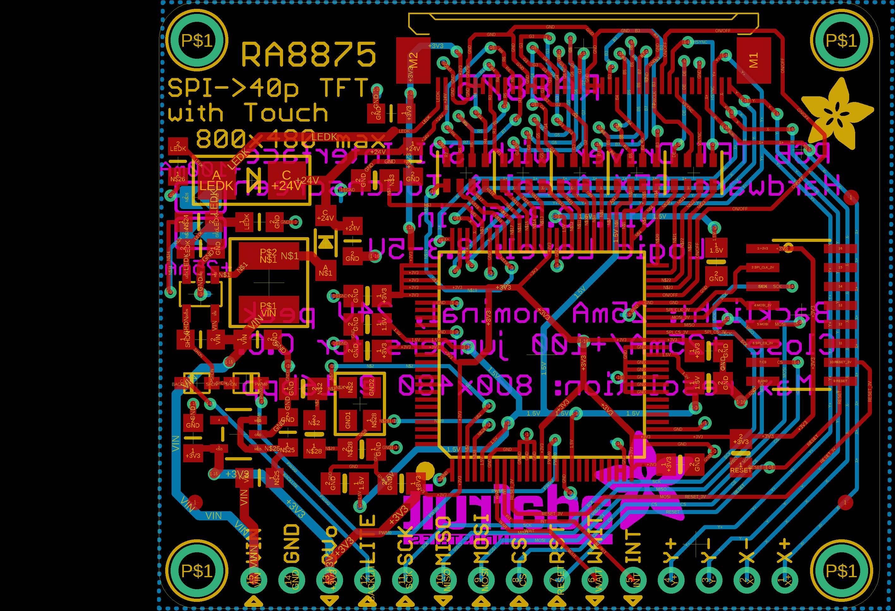
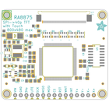
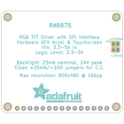
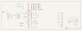
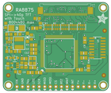
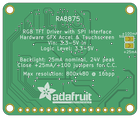

Contents
========

* [PRA1590 > Adafruit RA8875 Breakout Board PCB](#pra1590--adafruit-ra8875-breakout-board-pcb)
	* [Schematic](#schematic)
	* [PCB](#pcb)
	* [Interactive BOM](#interactive-bom)
	* [OOMP Parts](#oomp-parts)
	* [Images](#images)
	* [Tags](#tags)
  
![][im]
# PRA1590 > Adafruit RA8875 Breakout Board PCB

- ID: PROJ-ADAF-1590-STAN-01
- Hex ID: PRA1590
- Name: Adafruit
- Description: Adafruit
- Long Link: [http://oom.lt/PROJ-ADAF-1590-STAN-01](http://oom.lt/PROJ-ADAF-1590-STAN-01)
- Short Link: [http://oom.lt/PRA1590](http://oom.lt/PRA1590)

## Schematic
  

## PCB
  

## Interactive BOM

- Interactive BOM page: [ibom.html](https://htmlpreview.github.io/?https://github.com/oomlout/oomlout_OOMP_projects/blob/main/PROJ-ADAF-1590-STAN-01/kicad/bom/ibom.html)

## OOMP Parts
  

|OOMP ID|Name|Identifier|
| :---: | :---: | :---: |
|[CAPC-0805-X-NF100-V50](https://github.com/oomlout/oomlout_OOMP_parts/tree/main/CAPC-0805-X-NF100-V50/)|[SMD (0805) 100 nF Capacitor (Ceramic) 50v](https://github.com/oomlout/oomlout_OOMP_parts/tree/main/CAPC-0805-X-NF100-V50/)|[C1, C4, C5, C6, C7, C8, C9, C10, C11, C12, C18](https://github.com/oomlout/oomlout_OOMP_parts/tree/main/CAPC-0805-X-NF100-V50/)|
|CAPC-0805-X-PF20-01||C2, C3|
|[CAPC-0805-X-UF10-V10](https://github.com/oomlout/oomlout_OOMP_parts/tree/main/CAPC-0805-X-UF10-V10/)|[SMD (0805) 10 uF Capacitor (Ceramic) 10v](https://github.com/oomlout/oomlout_OOMP_parts/tree/main/CAPC-0805-X-UF10-V10/)|[C16, C22](https://github.com/oomlout/oomlout_OOMP_parts/tree/main/CAPC-0805-X-UF10-V10/)|
|[CAPC-0805-X-UF1-V25](https://github.com/oomlout/oomlout_OOMP_parts/tree/main/CAPC-0805-X-UF1-V25/)|[SMD (0805) 1 uF Capacitor (Ceramic) 25v](https://github.com/oomlout/oomlout_OOMP_parts/tree/main/CAPC-0805-X-UF1-V25/)|[C17, C20](https://github.com/oomlout/oomlout_OOMP_parts/tree/main/CAPC-0805-X-UF1-V25/)|
|CAPC-0805-X-UNMATCHED-01||C19, C21|
|DIOD-UNMATCHED-X-UNMATCHED-01||D1|
|DIOD-S123-X-UNMATCHED-01||D2|
|[DIOD-S323-X-K4148-01](https://github.com/oomlout/oomlout_OOMP_parts/tree/main/DIOD-S323-X-K4148-01/)|[SMD (SOD-323) Diode](https://github.com/oomlout/oomlout_OOMP_parts/tree/main/DIOD-S323-X-K4148-01/)|[D3, D4](https://github.com/oomlout/oomlout_OOMP_parts/tree/main/DIOD-S323-X-K4148-01/)|
|FERB-0805-X-UNMATCHED-01||FB2|
|UNMATCHED-UNMATCHED-X-UNMATCHED-01||J1, L1, U1, U5, Y1|
|HEAD-I01-X-PI15-01||JP1|
|RESE-0805-X-UNMATCHED-01||R1, R9, R10|
|RESE-0805-X-O105-01||R3|
|RESA-06038-X-O330X4-01||R4, R5, R6, R7, R8|
|[RESE-0805-X-O103-01](https://github.com/oomlout/oomlout_OOMP_parts/tree/main/RESE-0805-X-O103-01/)|[SMD (0805) 10k Ohm Resistor](https://github.com/oomlout/oomlout_OOMP_parts/tree/main/RESE-0805-X-O103-01/)|[R11, R12](https://github.com/oomlout/oomlout_OOMP_parts/tree/main/RESE-0805-X-O103-01/)|
|UNMATCHED-SO235-X-UNMATCHED-01||U3|
|[VREG-SO235-X-KMIC5225-V33D](https://github.com/oomlout/oomlout_OOMP_parts/tree/main/VREG-SO235-X-KMIC5225-V33D/)|[SMD (SOT-23-5) MIC5225 Voltage Regulator 3.3v](https://github.com/oomlout/oomlout_OOMP_parts/tree/main/VREG-SO235-X-KMIC5225-V33D/)|[U4](https://github.com/oomlout/oomlout_OOMP_parts/tree/main/VREG-SO235-X-KMIC5225-V33D/)|

## Images
  
  

|bominteractivefront|bominteractiveback|kicadPcb3d|kicadPcb3dFront|kicadPcb3dBack|kicadSchem|eagleImage|eagleSchemImage|pcbdraw|pcbdrawback|
| :---: | :---: | :---: | :---: | :---: | :---: | :---: | :---: | :---: | :---: |
|||||||||||

## Tags

- hexID: PRA1590
- oompType: PROJ
- oompSize: ADAF
- oompColor: 1590
- oompDesc: STAN
- oompIndex: 01
- oompName: Adafruit RA8875 Breakout Board PCB
- sources: All source files from https://github.com/adafruit/Adafruit-RA8875-Breakout-Board-PCB (source licence details in srcLicense.md)
- linkBuyPage: http://www.adafruit.com/products/1590
- oompID: PROJ-ADAF-1590-STAN-01
- oompParts: C1,CAPC-0805-X-NF100-V50
- oompParts: C2,CAPC-0805-X-PF20-01
- oompParts: C3,CAPC-0805-X-PF20-01
- oompParts: C4,CAPC-0805-X-NF100-V50
- oompParts: C5,CAPC-0805-X-NF100-V50
- oompParts: C6,CAPC-0805-X-NF100-V50
- oompParts: C7,CAPC-0805-X-NF100-V50
- oompParts: C8,CAPC-0805-X-NF100-V50
- oompParts: C9,CAPC-0805-X-NF100-V50
- oompParts: C10,CAPC-0805-X-NF100-V50
- oompParts: C11,CAPC-0805-X-NF100-V50
- oompParts: C12,CAPC-0805-X-NF100-V50
- oompParts: C16,CAPC-0805-X-UF10-V10
- oompParts: C17,CAPC-0805-X-UF1-V25
- oompParts: C18,CAPC-0805-X-NF100-V50
- oompParts: C19,CAPC-0805-X-UNMATCHED-01
- oompParts: C20,CAPC-0805-X-UF1-V25
- oompParts: C21,CAPC-0805-X-UNMATCHED-01
- oompParts: C22,CAPC-0805-X-UF10-V10
- oompParts: D1,DIOD-UNMATCHED-X-UNMATCHED-01
- oompParts: D2,DIOD-S123-X-UNMATCHED-01
- oompParts: D3,DIOD-S323-X-K4148-01
- oompParts: D4,DIOD-S323-X-K4148-01
- oompParts: FB2,FERB-0805-X-UNMATCHED-01
- oompParts: J1,UNMATCHED-UNMATCHED-X-UNMATCHED-01
- oompParts: JP1,HEAD-I01-X-PI15-01
- oompParts: L1,UNMATCHED-UNMATCHED-X-UNMATCHED-01
- oompParts: R1,RESE-0805-X-UNMATCHED-01
- oompParts: R3,RESE-0805-X-O105-01
- oompParts: R4,RESA-06038-X-O330X4-01
- oompParts: R5,RESA-06038-X-O330X4-01
- oompParts: R6,RESA-06038-X-O330X4-01
- oompParts: R7,RESA-06038-X-O330X4-01
- oompParts: R8,RESA-06038-X-O330X4-01
- oompParts: R9,RESE-0805-X-UNMATCHED-01
- oompParts: R10,RESE-0805-X-UNMATCHED-01
- oompParts: R11,RESE-0805-X-O103-01
- oompParts: R12,RESE-0805-X-O103-01
- oompParts: U1,UNMATCHED-UNMATCHED-X-UNMATCHED-01
- oompParts: U3,UNMATCHED-SO235-X-UNMATCHED-01
- oompParts: U4,VREG-SO235-X-KMIC5225-V33D
- oompParts: U5,UNMATCHED-UNMATCHED-X-UNMATCHED-01
- oompParts: Y1,UNMATCHED-UNMATCHED-X-UNMATCHED-01
- rawParts: C1,0.1uF,CAP_CERAMIC0805-NOOUTLINE,0805-NO,Ceramic Capacitors,,
- rawParts: C2,20pF,CAP_CERAMIC0805-NOOUTLINE,0805-NO,Ceramic Capacitors,,
- rawParts: C3,20pF,CAP_CERAMIC0805-NOOUTLINE,0805-NO,Ceramic Capacitors,,
- rawParts: C4,0.1uF,CAP_CERAMIC0805-NOOUTLINE,0805-NO,Ceramic Capacitors,,
- rawParts: C5,0.1uF,CAP_CERAMIC0805-NOOUTLINE,0805-NO,Ceramic Capacitors,,
- rawParts: C6,0.1uF,CAP_CERAMIC0805-NOOUTLINE,0805-NO,Ceramic Capacitors,,
- rawParts: C7,0.1uF,CAP_CERAMIC0805-NOOUTLINE,0805-NO,Ceramic Capacitors,,
- rawParts: C8,0.1uF,CAP_CERAMIC0805-NOOUTLINE,0805-NO,Ceramic Capacitors,,
- rawParts: C9,0.1uF,CAP_CERAMIC0805-NOOUTLINE,0805-NO,Ceramic Capacitors,,
- rawParts: C10,0.1uF,CAP_CERAMIC0805-NOOUTLINE,0805-NO,Ceramic Capacitors,,
- rawParts: C11,0.1uF,CAP_CERAMIC0805-NOOUTLINE,0805-NO,Ceramic Capacitors,,
- rawParts: C12,0.1uF,CAP_CERAMIC0805-NOOUTLINE,0805-NO,Ceramic Capacitors,,
- rawParts: C16,10uF,CAP_CERAMIC_0805MP,_0805MP,Ceramic Capacitors,,
- rawParts: C17,1uF,CAP_CERAMIC_0805MP,_0805MP,Ceramic Capacitors,,
- rawParts: C18,0.1uF,CAP_CERAMIC_0805MP,_0805MP,Ceramic Capacitors,,
- rawParts: C19,10µF,CAP_CERAMIC_0805MP,_0805MP,Ceramic Capacitors,,
- rawParts: C20,1uF,CAP_CERAMIC_0805MP,_0805MP,Ceramic Capacitors,,
- rawParts: C21,10µF,CAP_CERAMIC_0805MP,_0805MP,Ceramic Capacitors,,
- rawParts: C22,10uF,CAP_CERAMIC_0805MP,_0805MP,Ceramic Capacitors,,
- rawParts: D1,MM3Z24VT1G,DIODESMA,SMADIODE,Diode,,
- rawParts: D2,MBR0540,DIODESOD-123,SOD-123,Diode,,
- rawParts: D3,1N4148,DIODESOD-323F,SOD-323F,Diode,,
- rawParts: D4,1N4148,DIODESOD-323F,SOD-323F,Diode,,
- rawParts: FB2,Ferrite,FERRITE_0805MP,_0805MP,Ferrite Bead,,
- rawParts: FID1,FIDUCIAL,FIDUCIAL,FIDUCIAL_1MM,Fiducial Alignment Points,EXCLUDE,
- rawParts: FID2,FIDUCIAL,FIDUCIAL,FIDUCIAL_1MM,Fiducial Alignment Points,EXCLUDE,
- rawParts: FID3,FIDUCIAL,FIDUCIAL,FIDUCIAL_1MM,Fiducial Alignment Points,EXCLUDE,
- rawParts: J1,40PINFPCM4-1734839-0,40PINFPCM4-1734839-0,4-1734839-0,OMRON FPC Connector,,
- rawParts: JP1,Breakout,PINHD-1X15-CB,1X15-CB,PIN HEADER,,
- rawParts: L1,6.8uH large inductor,INDUCTORNR5040,INDUCTOR_5X5MM_NR5040_NOTHERMALS,Inductors,,
- rawParts: R1,3Ω,RESISTOR_0805MP,_0805MP,Resistors,,
- rawParts: R3,1M,RESISTOR0805_NOOUTLINE,0805-NO,Resistors,,
- rawParts: R4,33,RESISTOR_4PACK_US,RESPACK_4X0603,Resistor Packs (4 resistors),,
- rawParts: R5,33,RESISTOR_4PACK_US,RESPACK_4X0603,Resistor Packs (4 resistors),,
- rawParts: R6,33,RESISTOR_4PACK_US,RESPACK_4X0603,Resistor Packs (4 resistors),,
- rawParts: R7,33,RESISTOR_4PACK_US,RESPACK_4X0603,Resistor Packs (4 resistors),,
- rawParts: R8,33,RESISTOR_4PACK_US,RESPACK_4X0603,Resistor Packs (4 resistors),,
- rawParts: R9,12Ω,RESISTOR_0805MP,_0805MP,Resistors,,
- rawParts: R10,12Ω,RESISTOR_0805MP,_0805MP,Resistors,,
- rawParts: R11,10K,RESISTOR_0805MP,_0805MP,Resistors,,
- rawParts: R12,10K,RESISTOR0805_NOOUTLINE,0805-NO,Resistors,,
- rawParts: SJ1,+25mA,SOLDERJUMPER,SOLDERJUMPER_ARROW_NOPASTE,SMD Solder JUMPER,EXCLUDE,
- rawParts: SJ2,+100mA,SOLDERJUMPER,SOLDERJUMPER_ARROW_NOPASTE,SMD Solder JUMPER,EXCLUDE,
- rawParts: U$21,MOUNTINGHOLE2.5,MOUNTINGHOLE2.5,MOUNTINGHOLE_2.5_PLATED,Mounting Hole,EXCLUDE,
- rawParts: U$22,MOUNTINGHOLE2.5,MOUNTINGHOLE2.5,MOUNTINGHOLE_2.5_PLATED,Mounting Hole,EXCLUDE,
- rawParts: U$23,MOUNTINGHOLE2.5,MOUNTINGHOLE2.5,MOUNTINGHOLE_2.5_PLATED,Mounting Hole,EXCLUDE,
- rawParts: U$24,MOUNTINGHOLE2.5,MOUNTINGHOLE2.5,MOUNTINGHOLE_2.5_PLATED,Mounting Hole,EXCLUDE,
- rawParts: U1,RA8875,RA8875,LQFP100,RA8875 TFT LCD Controller,,
- rawParts: U3,FAN5333BSX,FAN5331,SOT23-5@1,FAN5331 - LED/OLED 20V Boost Converter,,
- rawParts: U4,MIC5225-3.3v,VREG_SOT23-5,SOT23-5,SOT23-5 Fixed Voltage Regulators,,
- rawParts: U5,74HC4050,74HC4050D,SOIC16,6-channel level shifter,,
- rawParts: Y1,20MHz,CRYSTAL3.2X2.5,CRYSTAL_3.2X2.5,Crystals,,

[im]: kicadPcb3d_450.png
