Contents
========

* [PRA1601 > Adafruit PiTFT 2.8 inch Display PCB](#pra1601--adafruit-pitft-28-inch-display-pcb)
	* [Schematic](#schematic)
	* [PCB](#pcb)
	* [Interactive BOM](#interactive-bom)
	* [OOMP Parts](#oomp-parts)
	* [Images](#images)
	* [Tags](#tags)
  
![][im]
# PRA1601 > Adafruit PiTFT 2.8 inch Display PCB

- ID: PROJ-ADAF-1601-STAN-01
- Hex ID: PRA1601
- Name: Adafruit
- Description: Adafruit
- Long Link: [http://oom.lt/PROJ-ADAF-1601-STAN-01](http://oom.lt/PROJ-ADAF-1601-STAN-01)
- Short Link: [http://oom.lt/PRA1601](http://oom.lt/PRA1601)

## Schematic
  
[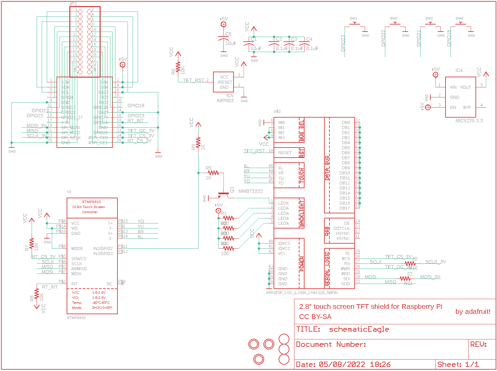](eagleSchemImage.png)
## PCB
  
[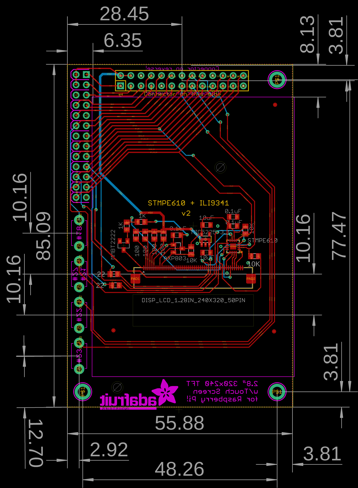](eagleImage.png)
## Interactive BOM

- Interactive BOM page: [ibom.html](https://htmlpreview.github.io/?https://github.com/oomlout/oomlout_OOMP_projects/blob/main/PROJ-ADAF-1601-STAN-01/kicad/bom/ibom.html)

## OOMP Parts
  

|OOMP Parts|
| :---: |
|[CAPC-0805-X-UF10-V10  SMD (0805) 10 uF Capacitor (Ceramic) 10v  C1, C5](https://github.com/oomlout/oomlout_OOMP_parts/tree/main/CAPC-0805-X-UF10-V10/)|
|[CAPC-0805-X-NF100-V50  SMD (0805) 100 nF Capacitor (Ceramic) 50v  C2, C3, C4](https://github.com/oomlout/oomlout_OOMP_parts/tree/main/CAPC-0805-X-NF100-V50/)|
|[VREG-SO235-X-KMIC5225-V33D  SMD (SOT-23-5) MIC5225 Voltage Regulator 3.3v  IC4](https://github.com/oomlout/oomlout_OOMP_parts/tree/main/VREG-SO235-X-KMIC5225-V33D/)|
|UNMATCHED-SO23-X-UNMATCHED-01 IC5, Q1|
|HEAD-I01-X-PI2X13-01 JP1|
|[RESE-0805-X-O101-01  SMD (0805) 100 Ohm Resistor  R1, R2, R3, R4](https://github.com/oomlout/oomlout_OOMP_parts/tree/main/RESE-0805-X-O101-01/)|
|[RESE-0805-X-O102-01  SMD (0805) 1k Ohm Resistor  R5, R9](https://github.com/oomlout/oomlout_OOMP_parts/tree/main/RESE-0805-X-O102-01/)|
|[RESE-0805-X-O103-01  SMD (0805) 10k Ohm Resistor  R6, R7, R8](https://github.com/oomlout/oomlout_OOMP_parts/tree/main/RESE-0805-X-O103-01/)|
|[RESE-0805-X-O220-01  SMD (0805) 22 Ohm Resistor  R10, R11](https://github.com/oomlout/oomlout_OOMP_parts/tree/main/RESE-0805-X-O220-01/)|
|UNMATCHED-UNMATCHED-X-UNMATCHED-01 SW1, SW2, SW3, SW4, U$2, U$3, U2|

## Images
  
  

|bominteractivefront|bominteractiveback|kicadPcb3d|kicadPcb3dFront|kicadPcb3dBack|eagleImage|eagleSchemImage|pcbdraw|pcbdrawback|
| :---: | :---: | :---: | :---: | :---: | :---: | :---: | :---: | :---: |
|[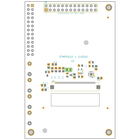](bomFront.png)|[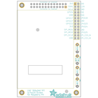](bomBack.png)|[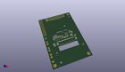](kicadPcb3d.png)|[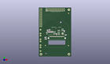](kicadPcb3dFront.png)|[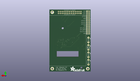](kicadPcb3dBack.png)|[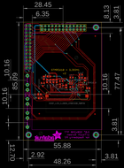](eagleImage.png)|[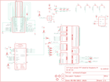](eagleSchemImage.png)|[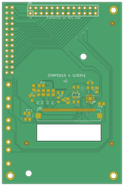](pcbdraw.png)|[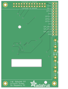](pcbdrawBack.png)|

## Tags

- hexID: PRA1601
- oompType: PROJ
- oompSize: ADAF
- oompColor: 1601
- oompDesc: STAN
- oompIndex: 01
- oompName: Adafruit PiTFT 2.8 inch Display PCB
- sources: All source files from https://github.com/adafruit/Adafruit-PiTFT-2.8-inch-Display-PCB (source licence details in srcLicense.md)
- linkBuyPage: http://www.adafruit.com/products/1601
- oompID: PROJ-ADAF-1601-STAN-01
- oompParts: C1,CAPC-0805-X-UF10-V10
- oompParts: C2,CAPC-0805-X-NF100-V50
- oompParts: C3,CAPC-0805-X-NF100-V50
- oompParts: C4,CAPC-0805-X-NF100-V50
- oompParts: C5,CAPC-0805-X-UF10-V10
- oompParts: IC4,VREG-SO235-X-KMIC5225-V33D
- oompParts: IC5,UNMATCHED-SO23-X-UNMATCHED-01
- oompParts: JP1,HEAD-I01-X-PI2X13-01
- oompParts: Q1,UNMATCHED-SO23-X-UNMATCHED-01
- oompParts: R1,RESE-0805-X-O101-01
- oompParts: R2,RESE-0805-X-O101-01
- oompParts: R3,RESE-0805-X-O101-01
- oompParts: R4,RESE-0805-X-O101-01
- oompParts: R5,RESE-0805-X-O102-01
- oompParts: R6,RESE-0805-X-O103-01
- oompParts: R7,RESE-0805-X-O103-01
- oompParts: R8,RESE-0805-X-O103-01
- oompParts: R9,RESE-0805-X-O102-01
- oompParts: R10,RESE-0805-X-O220-01
- oompParts: R11,RESE-0805-X-O220-01
- oompParts: SW1,UNMATCHED-UNMATCHED-X-UNMATCHED-01
- oompParts: SW2,UNMATCHED-UNMATCHED-X-UNMATCHED-01
- oompParts: SW3,UNMATCHED-UNMATCHED-X-UNMATCHED-01
- oompParts: SW4,UNMATCHED-UNMATCHED-X-UNMATCHED-01
- oompParts: U$2,UNMATCHED-UNMATCHED-X-UNMATCHED-01
- oompParts: U$3,UNMATCHED-UNMATCHED-X-UNMATCHED-01
- oompParts: U2,UNMATCHED-UNMATCHED-X-UNMATCHED-01
- rawParts: C1,10uF,C-USC0805K,C0805K,CAPACITOR, American symbol,,
- rawParts: C2,0.1uF,C-USC0805K,C0805K,CAPACITOR, American symbol,,
- rawParts: C3,0.1uF,C-USC0805K,C0805K,CAPACITOR, American symbol,,
- rawParts: C4,0.1uF,C-USC0805K,C0805K,CAPACITOR, American symbol,,
- rawParts: C5,10uF,C-USC0805K,C0805K,CAPACITOR, American symbol,,
- rawParts: IC4,MIC5225-3.3,LP298XS,SOT23-5L,,,
- rawParts: IC5,AXP803,AXP083-SAG,SOT23,,,
- rawParts: JP1,,HEADER-2X13,2X13,,,
- rawParts: Q1,MMBT2222,MMBT2222ALT1-NPN-SOT23-BEC,SOT23-BEC,NPN Transistror,,
- rawParts: R1,100,R-US_R0805,R0805,RESISTOR, American symbol,,
- rawParts: R2,100,R-US_R0805,R0805,RESISTOR, American symbol,,
- rawParts: R3,100,R-US_R0805,R0805,RESISTOR, American symbol,,
- rawParts: R4,100,R-US_R0805,R0805,RESISTOR, American symbol,,
- rawParts: R5,1K,R-US_R0805,R0805,RESISTOR, American symbol,,
- rawParts: R6,10K,R-US_R0805,R0805,RESISTOR, American symbol,,
- rawParts: R7,10K,R-US_R0805,R0805,RESISTOR, American symbol,,
- rawParts: R8,10K,R-US_R0805,R0805,RESISTOR, American symbol,,
- rawParts: R9,1K,R-US_R0805,R0805,RESISTOR, American symbol,,
- rawParts: R10,22,R-US_R0805,R0805,RESISTOR, American symbol,,
- rawParts: R11,22,R-US_R0805,R0805,RESISTOR, American symbol,,
- rawParts: SW1,,SWITCH_PUSHBUTTONEVQ-PE,TACT_PANA-EVQ,Buttons,,
- rawParts: SW2,,SWITCH_PUSHBUTTONEVQ-PE,TACT_PANA-EVQ,Buttons,,
- rawParts: SW3,,SWITCH_PUSHBUTTONEVQ-PE,TACT_PANA-EVQ,Buttons,,
- rawParts: SW4,,SWITCH_PUSHBUTTONEVQ-PE,TACT_PANA-EVQ,Buttons,,
- rawParts: U$2,DISP_LCD_1.28IN_240X320_50PIN,DISP_LCD_1.28IN_240X320_50PIN,TFT_2.83IN_240X320_50PIN,,,
- rawParts: U$3,RASPBERRYPI_B_MODELB_V2,RASPBERRYPI_B_MODELB_V2,RASPBERRYPIV2_SHIELD,,,
- rawParts: U$10,FIDUCIAL,FIDUCIAL,FIDUCIAL_1MM,For use by pick and place machines to calibrate the vision/machine, 1mm,,
- rawParts: U$11,FIDUCIAL,FIDUCIAL,FIDUCIAL_1MM,For use by pick and place machines to calibrate the vision/machine, 1mm,,
- rawParts: U$15,MOUNTINGHOLE2.5_THICK,MOUNTINGHOLE2.5_THICK,MOUNTINGHOLE_2.5_PLATED_THICK,Mounting Hole,EXCLUDE,
- rawParts: U$16,MOUNTINGHOLE2.5_THICK,MOUNTINGHOLE2.5_THICK,MOUNTINGHOLE_2.5_PLATED_THICK,Mounting Hole,EXCLUDE,
- rawParts: U$17,MOUNTINGHOLE2.5_THICK,MOUNTINGHOLE2.5_THICK,MOUNTINGHOLE_2.5_PLATED_THICK,Mounting Hole,EXCLUDE,
- rawParts: U$18,FIDUCIAL,FIDUCIAL,FIDUCIAL_1MM,For use by pick and place machines to calibrate the vision/machine, 1mm,,
- rawParts: U2,STMPE610,STMPE610,QFN16_3MM,STMPE610 - 12-Bit Touch Screen Controller,,

[im]: kicadPcb3d_450.png
