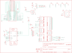

Contents
========

* [PRA1601 > Adafruit](#pra1601--adafruit)
	* [Images](#images)
	* [Tags](#tags)
  
![][im]
# PRA1601 > Adafruit

- ID: PROJ-ADAF-1601-STAN-01
- Hex ID: PRA1601
- Name: Adafruit
- Description: Adafruit

## Images
  
  

|kicadPcb3d|kicadPcb3dFront|kicadPcb3dBack|eagleImage|eagleSchemImage|
| :---: | :---: | :---: | :---: | :---: |
||||||

## Tags

- hexID: PRA1601
- oompType: PROJ
- oompSize: ADAF
- oompColor: 1601
- oompDesc: STAN
- oompIndex: 01
- oompName: Adafruit PiTFT 2.8 inch Display PCB
- sources: All source files from https://github.com/adafruit/Adafruit-PiTFT-2.8-inch-Display-PCB (source licence details in srcLicense.md)
- linkBuyPage: http://www.adafruit.com/products/1601
- oompID: PROJ-ADAF-1601-STAN-01
- oompParts: C1,UNMATCHED-UNMATCHED-UNMATCHED-UNMATCHED-UNMATCHED
- oompParts: C2,UNMATCHED-UNMATCHED-UNMATCHED-UNMATCHED-UNMATCHED
- oompParts: C3,UNMATCHED-UNMATCHED-UNMATCHED-UNMATCHED-UNMATCHED
- oompParts: C4,UNMATCHED-UNMATCHED-UNMATCHED-UNMATCHED-UNMATCHED
- oompParts: C5,UNMATCHED-UNMATCHED-UNMATCHED-UNMATCHED-UNMATCHED
- oompParts: IC4,UNMATCHED-UNMATCHED-UNMATCHED-UNMATCHED-UNMATCHED
- oompParts: IC5,UNMATCHED-UNMATCHED-UNMATCHED-UNMATCHED-UNMATCHED
- oompParts: JP1,UNMATCHED-UNMATCHED-UNMATCHED-UNMATCHED-UNMATCHED
- oompParts: Q1,UNMATCHED-UNMATCHED-UNMATCHED-UNMATCHED-UNMATCHED
- oompParts: R1,UNMATCHED-UNMATCHED-UNMATCHED-UNMATCHED-UNMATCHED
- oompParts: R2,UNMATCHED-UNMATCHED-UNMATCHED-UNMATCHED-UNMATCHED
- oompParts: R3,UNMATCHED-UNMATCHED-UNMATCHED-UNMATCHED-UNMATCHED
- oompParts: R4,UNMATCHED-UNMATCHED-UNMATCHED-UNMATCHED-UNMATCHED
- oompParts: R5,UNMATCHED-UNMATCHED-UNMATCHED-UNMATCHED-UNMATCHED
- oompParts: R6,UNMATCHED-UNMATCHED-UNMATCHED-UNMATCHED-UNMATCHED
- oompParts: R7,UNMATCHED-UNMATCHED-UNMATCHED-UNMATCHED-UNMATCHED
- oompParts: R8,UNMATCHED-UNMATCHED-UNMATCHED-UNMATCHED-UNMATCHED
- oompParts: R9,UNMATCHED-UNMATCHED-UNMATCHED-UNMATCHED-UNMATCHED
- oompParts: R10,UNMATCHED-UNMATCHED-UNMATCHED-UNMATCHED-UNMATCHED
- oompParts: R11,UNMATCHED-UNMATCHED-UNMATCHED-UNMATCHED-UNMATCHED
- oompParts: SW1,UNMATCHED-UNMATCHED-UNMATCHED-UNMATCHED-UNMATCHED
- oompParts: SW2,UNMATCHED-UNMATCHED-UNMATCHED-UNMATCHED-UNMATCHED
- oompParts: SW3,UNMATCHED-UNMATCHED-UNMATCHED-UNMATCHED-UNMATCHED
- oompParts: SW4,UNMATCHED-UNMATCHED-UNMATCHED-UNMATCHED-UNMATCHED
- oompParts: U$2,UNMATCHED-UNMATCHED-UNMATCHED-UNMATCHED-UNMATCHED
- oompParts: U$3,UNMATCHED-UNMATCHED-UNMATCHED-UNMATCHED-UNMATCHED
- oompParts: U2,UNMATCHED-UNMATCHED-UNMATCHED-UNMATCHED-UNMATCHED
- rawParts: C1,10uF,C-USC0805K,C0805K,CAPACITOR, American symbol,,
- rawParts: C2,0.1uF,C-USC0805K,C0805K,CAPACITOR, American symbol,,
- rawParts: C3,0.1uF,C-USC0805K,C0805K,CAPACITOR, American symbol,,
- rawParts: C4,0.1uF,C-USC0805K,C0805K,CAPACITOR, American symbol,,
- rawParts: C5,10uF,C-USC0805K,C0805K,CAPACITOR, American symbol,,
- rawParts: IC4,MIC5225-3.3,LP298XS,SOT23-5L,,,
- rawParts: IC5,AXP803,AXP083-SAG,SOT23,,,
- rawParts: JP1,,HEADER-2X13,2X13,,,
- rawParts: Q1,MMBT2222,MMBT2222ALT1-NPN-SOT23-BEC,SOT23-BEC,NPN Transistror,,
- rawParts: R1,100,R-US_R0805,R0805,RESISTOR, American symbol,,
- rawParts: R2,100,R-US_R0805,R0805,RESISTOR, American symbol,,
- rawParts: R3,100,R-US_R0805,R0805,RESISTOR, American symbol,,
- rawParts: R4,100,R-US_R0805,R0805,RESISTOR, American symbol,,
- rawParts: R5,1K,R-US_R0805,R0805,RESISTOR, American symbol,,
- rawParts: R6,10K,R-US_R0805,R0805,RESISTOR, American symbol,,
- rawParts: R7,10K,R-US_R0805,R0805,RESISTOR, American symbol,,
- rawParts: R8,10K,R-US_R0805,R0805,RESISTOR, American symbol,,
- rawParts: R9,1K,R-US_R0805,R0805,RESISTOR, American symbol,,
- rawParts: R10,22,R-US_R0805,R0805,RESISTOR, American symbol,,
- rawParts: R11,22,R-US_R0805,R0805,RESISTOR, American symbol,,
- rawParts: SW1,,SWITCH_PUSHBUTTONEVQ-PE,TACT_PANA-EVQ,Buttons,,
- rawParts: SW2,,SWITCH_PUSHBUTTONEVQ-PE,TACT_PANA-EVQ,Buttons,,
- rawParts: SW3,,SWITCH_PUSHBUTTONEVQ-PE,TACT_PANA-EVQ,Buttons,,
- rawParts: SW4,,SWITCH_PUSHBUTTONEVQ-PE,TACT_PANA-EVQ,Buttons,,
- rawParts: U$2,DISP_LCD_1.28IN_240X320_50PIN,DISP_LCD_1.28IN_240X320_50PIN,TFT_2.83IN_240X320_50PIN,,,
- rawParts: U$3,RASPBERRYPI_B_MODELB_V2,RASPBERRYPI_B_MODELB_V2,RASPBERRYPIV2_SHIELD,,,
- rawParts: U$10,FIDUCIAL,FIDUCIAL,FIDUCIAL_1MM,For use by pick and place machines to calibrate the vision/machine, 1mm,,
- rawParts: U$11,FIDUCIAL,FIDUCIAL,FIDUCIAL_1MM,For use by pick and place machines to calibrate the vision/machine, 1mm,,
- rawParts: U$15,MOUNTINGHOLE2.5_THICK,MOUNTINGHOLE2.5_THICK,MOUNTINGHOLE_2.5_PLATED_THICK,Mounting Hole,EXCLUDE,
- rawParts: U$16,MOUNTINGHOLE2.5_THICK,MOUNTINGHOLE2.5_THICK,MOUNTINGHOLE_2.5_PLATED_THICK,Mounting Hole,EXCLUDE,
- rawParts: U$17,MOUNTINGHOLE2.5_THICK,MOUNTINGHOLE2.5_THICK,MOUNTINGHOLE_2.5_PLATED_THICK,Mounting Hole,EXCLUDE,
- rawParts: U$18,FIDUCIAL,FIDUCIAL,FIDUCIAL_1MM,For use by pick and place machines to calibrate the vision/machine, 1mm,,
- rawParts: U2,STMPE610,STMPE610,QFN16_3MM,STMPE610 - 12-Bit Touch Screen Controller,,

[im]: kicadPcb3d_450.png
