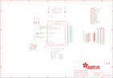

Contents
========

* [PRA1602 > Adafruit CAP1188 PCB](#pra1602--adafruit-cap1188-pcb)
	* [Schematic](#schematic)
	* [PCB](#pcb)
	* [Interactive BOM](#interactive-bom)
	* [OOMP Parts](#oomp-parts)
	* [Images](#images)
	* [Tags](#tags)
  
![][im]
# PRA1602 > Adafruit CAP1188 PCB

- ID: PROJ-ADAF-1602-STAN-01
- Hex ID: PRA1602
- Name: Adafruit
- Description: Adafruit
- Long Link: [http://oom.lt/PROJ-ADAF-1602-STAN-01](http://oom.lt/PROJ-ADAF-1602-STAN-01)
- Short Link: [http://oom.lt/PRA1602](http://oom.lt/PRA1602)

## Schematic
  

## PCB
  

## Interactive BOM

- Interactive BOM page: [ibom.html](https://htmlpreview.github.io/?https://github.com/oomlout/oomlout_OOMP_projects/blob/main/PROJ-ADAF-1602-STAN-01/kicad/bom/ibom.html)

## OOMP Parts
  

|OOMP ID|Name|Identifier|
| :---: | :---: | :---: |
|[CAPC-0805-X-UF10-V10](https://github.com/oomlout/oomlout_OOMP_parts/tree/main/CAPC-0805-X-UF10-V10/)|[SMD (0805) 10 uF Capacitor (Ceramic) 10v](https://github.com/oomlout/oomlout_OOMP_parts/tree/main/CAPC-0805-X-UF10-V10/)|[C2, C3](https://github.com/oomlout/oomlout_OOMP_parts/tree/main/CAPC-0805-X-UF10-V10/)|
|HEAD-I01-X-PI13-01||JP3, JP4|
|[LEDS-0805-G-STAN-01](https://github.com/oomlout/oomlout_OOMP_parts/tree/main/LEDS-0805-G-STAN-01/)|[SMD (0805) Green LED](https://github.com/oomlout/oomlout_OOMP_parts/tree/main/LEDS-0805-G-STAN-01/)|[LED1, LED2, LED3, LED4, LED5, LED6, LED7, LED8](https://github.com/oomlout/oomlout_OOMP_parts/tree/main/LEDS-0805-G-STAN-01/)|
|RESA-06038-X-O471X4-01||R1, R2|
|[RESE-0805-X-O103-01](https://github.com/oomlout/oomlout_OOMP_parts/tree/main/RESE-0805-X-O103-01/)|[SMD (0805) 10k Ohm Resistor](https://github.com/oomlout/oomlout_OOMP_parts/tree/main/RESE-0805-X-O103-01/)|[R9, R10, R11, R12](https://github.com/oomlout/oomlout_OOMP_parts/tree/main/RESE-0805-X-O103-01/)|
|RESE-0805-X-O1503-01||R13|
|UNMATCHED-UNMATCHED-X-UNMATCHED-01||U1|
|[VREG-SO235-X-KMIC5225-V33D](https://github.com/oomlout/oomlout_OOMP_parts/tree/main/VREG-SO235-X-KMIC5225-V33D/)|[SMD (SOT-23-5) MIC5225 Voltage Regulator 3.3v](https://github.com/oomlout/oomlout_OOMP_parts/tree/main/VREG-SO235-X-KMIC5225-V33D/)|[U2](https://github.com/oomlout/oomlout_OOMP_parts/tree/main/VREG-SO235-X-KMIC5225-V33D/)|

## Images
  
  

|bominteractivefront|bominteractiveback|kicadPcb3d|kicadPcb3dFront|kicadPcb3dBack|eagleImage|eagleSchemImage|pcbdraw|pcbdrawback|
| :---: | :---: | :---: | :---: | :---: | :---: | :---: | :---: | :---: |
||||||||||

## Tags

- hexID: PRA1602
- oompType: PROJ
- oompSize: ADAF
- oompColor: 1602
- oompDesc: STAN
- oompIndex: 01
- oompName: Adafruit CAP1188 PCB
- sources: All source files from https://github.com/adafruit/Adafruit-CAP1188-PCB (source licence details in srcLicense.md)
- linkBuyPage: http://www.adafruit.com/products/1602
- oompID: PROJ-ADAF-1602-STAN-01
- oompParts: C2,CAPC-0805-X-UF10-V10
- oompParts: C3,CAPC-0805-X-UF10-V10
- oompParts: JP3,HEAD-I01-X-PI13-01
- oompParts: JP4,HEAD-I01-X-PI13-01
- oompParts: LED1,LEDS-0805-G-STAN-01
- oompParts: LED2,LEDS-0805-G-STAN-01
- oompParts: LED3,LEDS-0805-G-STAN-01
- oompParts: LED4,LEDS-0805-G-STAN-01
- oompParts: LED5,LEDS-0805-G-STAN-01
- oompParts: LED6,LEDS-0805-G-STAN-01
- oompParts: LED7,LEDS-0805-G-STAN-01
- oompParts: LED8,LEDS-0805-G-STAN-01
- oompParts: R1,RESA-06038-X-O471X4-01
- oompParts: R2,RESA-06038-X-O471X4-01
- oompParts: R9,RESE-0805-X-O103-01
- oompParts: R10,RESE-0805-X-O103-01
- oompParts: R11,RESE-0805-X-O103-01
- oompParts: R12,RESE-0805-X-O103-01
- oompParts: R13,RESE-0805-X-O1503-01
- oompParts: U1,UNMATCHED-UNMATCHED-X-UNMATCHED-01
- oompParts: U2,VREG-SO235-X-KMIC5225-V33D
- rawParts: C2,10uF,CAP_CERAMIC0805-NOOUTLINE,0805-NO,Ceramic Capacitors,,
- rawParts: C3,10uF,CAP_CERAMIC0805-NOOUTLINE,0805-NO,Ceramic Capacitors,,
- rawParts: FID1,FIDUCIAL,FIDUCIAL,FIDUCIAL_1MM,Fiducial Alignment Points,EXCLUDE,
- rawParts: FID2,FIDUCIAL,FIDUCIAL,FIDUCIAL_1MM,Fiducial Alignment Points,EXCLUDE,
- rawParts: JP3,,HEADER-1X13,1X13_ROUND_70,,,
- rawParts: JP4,,HEADER-1X13,1X13_ROUND_70,,,
- rawParts: LED1,,LED0805,CHIPLED_0805,LED,,
- rawParts: LED2,,LED0805,CHIPLED_0805,LED,,
- rawParts: LED3,,LED0805,CHIPLED_0805,LED,,
- rawParts: LED4,,LED0805,CHIPLED_0805,LED,,
- rawParts: LED5,,LED0805,CHIPLED_0805,LED,,
- rawParts: LED6,,LED0805,CHIPLED_0805,LED,,
- rawParts: LED7,,LED0805,CHIPLED_0805,LED,,
- rawParts: LED8,,LED0805,CHIPLED_0805,LED,,
- rawParts: R1,470,RESISTOR_4PACK,RESPACK_4X0603,Resistor Packs (4 resistors),,
- rawParts: R2,470,RESISTOR_4PACK,RESPACK_4X0603,Resistor Packs (4 resistors),,
- rawParts: R9,10K,RESISTOR0805_NOOUTLINE,0805-NO,Resistors,,
- rawParts: R10,10K,RESISTOR0805_NOOUTLINE,0805-NO,Resistors,,
- rawParts: R11,10K,RESISTOR0805_NOOUTLINE,0805-NO,Resistors,,
- rawParts: R12,10K,RESISTOR0805_NOOUTLINE,0805-NO,Resistors,,
- rawParts: R13,150K,RESISTOR_0805MP,_0805MP,Resistors,,
- rawParts: U$7,MOUNTINGHOLE2.0,MOUNTINGHOLE2.0,MOUNTINGHOLE_2.0_PLATED,Mounting Hole,EXCLUDE,
- rawParts: U$8,MOUNTINGHOLE2.0,MOUNTINGHOLE2.0,MOUNTINGHOLE_2.0_PLATED,Mounting Hole,EXCLUDE,
- rawParts: U$9,MOUNTINGHOLE2.0,MOUNTINGHOLE2.0,MOUNTINGHOLE_2.0_PLATED,Mounting Hole,EXCLUDE,
- rawParts: U$10,MOUNTINGHOLE2.0,MOUNTINGHOLE2.0,MOUNTINGHOLE_2.0_PLATED,Mounting Hole,EXCLUDE,
- rawParts: U1,,CAP1188,QFN24_4MM_SMSC,CAP1188 - Eight Channel Cap Touch Controller,,
- rawParts: U2,MIC5225-3,VREG_SOT23-5,SOT23-5,SOT23-5 Fixed Voltage Regulators,,

[im]: kicadPcb3d_450.png
