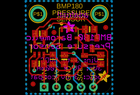
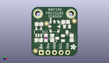
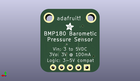
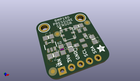

Contents
========

* [PROJ-ADAF-1603-STAN-01>Adafruit BMP180 PCB](#proj-adaf-1603-stan-01adafruit-bmp180-pcb)
	* [Images](#images)
	* [Interactive BOM](#interactive-bom)
	* [OOMP Parts](#oomp-parts)
	* [Tags](#tags)
  
![][im]
# PROJ-ADAF-1603-STAN-01>Adafruit BMP180 PCB

- ID: PROJ-ADAF-1603-STAN-01
- Hex ID: PRA1603
- Name: Adafruit BMP180 PCB
- Description: 

## Images
  
  

|eagleImage|kicadPcb3dFront|kicadPcb3dBack|kicadPcb3d|
| :---: | :---: | :---: | :---: |
|||||

## Interactive BOM

- Interactive BOM page: [ibom.html](kicad/bom/ibom.html)

## OOMP Parts
  

|OOMP Parts|
| :---: |
|<table><tr><td></td><td> C1</td><td>[CAPC-0805-X-UF10-V25 SMD (0805) 10 uF Capacitor (Ceramic) 25v](https://github.com/oomlout/oomlout_OOMP_parts/tree/main/CAPC-0805-X-UF10-V25/)</td><td>[C85U010](https://github.com/oomlout/oomlout_OOMP_parts/tree/main/CAPC-0805-X-UF10-V25/)</td></tr></table>|
|<table><tr><td></td><td> C2</td><td>[CAPC-0805-X-UF10-V25 SMD (0805) 10 uF Capacitor (Ceramic) 25v](https://github.com/oomlout/oomlout_OOMP_parts/tree/main/CAPC-0805-X-UF10-V25/)</td><td>[C85U010](https://github.com/oomlout/oomlout_OOMP_parts/tree/main/CAPC-0805-X-UF10-V25/)</td></tr></table>|
|UNMATCHED-UNMATCHED-X-UNMATCHED-01, JP1, 8.889999999999999, 1.397, 0,JP1, 1X05_ROUND_70, microbuilder, (0.35, 0.055), R0|
|UNMATCHED-UNMATCHED-X-UNMATCHED-01, Q1, 11.049, 6.985, 90,Q1, BSS138, SOT23, adafruit, (0.435, 0.275), R90|
|UNMATCHED-UNMATCHED-X-UNMATCHED-01, Q2, 13.716, 10.413999999999998, 180,Q2, BSS138, SOT23, adafruit, (0.54, 0.41), R180|
|<table><tr><td></td><td> R1</td><td>[RESE-0805-X-O103-01 SMD (0805) 10k Ohm Resistor](https://github.com/oomlout/oomlout_OOMP_parts/tree/main/RESE-0805-X-O103-01/)</td><td>[R85103](https://github.com/oomlout/oomlout_OOMP_parts/tree/main/RESE-0805-X-O103-01/)</td></tr></table>|
|RESE-UNMATCHED-X-O103-01, R2, 5.588, 7.112, 90,R2, 10K, _0805MP, microbuilder, (0.22, 0.28), R90|
|<table><tr><td></td><td> R3</td><td>[RESE-0805-X-O103-01 SMD (0805) 10k Ohm Resistor](https://github.com/oomlout/oomlout_OOMP_parts/tree/main/RESE-0805-X-O103-01/)</td><td>[R85103](https://github.com/oomlout/oomlout_OOMP_parts/tree/main/RESE-0805-X-O103-01/)</td></tr></table>|
|<table><tr><td></td><td> R4</td><td>[RESE-0805-X-O103-01 SMD (0805) 10k Ohm Resistor](https://github.com/oomlout/oomlout_OOMP_parts/tree/main/RESE-0805-X-O103-01/)</td><td>[R85103](https://github.com/oomlout/oomlout_OOMP_parts/tree/main/RESE-0805-X-O103-01/)</td></tr></table>|
|UNMATCHED-UNMATCHED-X-UNMATCHED-01, U2, 2.794, 9.398, 0,U2, MIC5225-3.3, SOT23-5, microbuilder, (0.11, 0.37), R0|
|UNMATCHED-UNMATCHED-X-UNMATCHED-01, U3, 8.889999999999999, 11.557, 270,U3, BMP180, BMP180_EXTENDED, microbuilder, (0.35, 0.455), R270|

## Tags

- hexID: PRA1603
- oompType: PROJ
- oompSize: ADAF
- oompColor: 1603
- oompDesc: STAN
- oompIndex: 01
- oompName: Adafruit BMP180 PCB
- sources: All source files from https://github.com/adafruit/Adafruit-BMP180-PCB (source licence details in srcLicense.md)
- linkBuyPage: http://www.adafruit.com/products/1603
- oompPart: CAPC-0805-X-UF10-V25, C1, 2.921, 12.446, 0
- oompPart: CAPC-0805-X-UF10-V25, C2, 2.794, 6.223, 180
- oompPart: UNMATCHED-UNMATCHED-X-UNMATCHED-01, JP1, 8.889999999999999, 1.397, 0
- oompPart: UNMATCHED-UNMATCHED-X-UNMATCHED-01, Q1, 11.049, 6.985, 90
- oompPart: UNMATCHED-UNMATCHED-X-UNMATCHED-01, Q2, 13.716, 10.413999999999998, 180
- oompPart: RESE-0805-X-O103-01, R1, 15.493999999999998, 7.112, 270
- oompPart: RESE-UNMATCHED-X-O103-01, R2, 5.588, 7.112, 90
- oompPart: RESE-0805-X-O103-01, R3, 8.001, 7.112, 90
- oompPart: RESE-0805-X-O103-01, R4, 13.208, 13.334999999999999, 180
- oompPart: SKIP-UNMATCHED-X-UNMATCHED-01, U$1, 1.5239999999999998, 2.032, 0
- oompPart: SKIP-UNMATCHED-X-UNMATCHED-01, U$5, 5.842, 12.7, 0
- oompPart: SKIP-UNMATCHED-X-UNMATCHED-01, U$7, 2.54, 16.509999999999998, 0
- oompPart: SKIP-UNMATCHED-X-UNMATCHED-01, U$8, 15.239999999999998, 16.509999999999998, 0
- oompPart: SKIP-UNMATCHED-X-UNMATCHED-01, U$15, 16.509999999999998, 13.716, 0
- oompPart: UNMATCHED-UNMATCHED-X-UNMATCHED-01, U2, 2.794, 9.398, 0
- oompPart: UNMATCHED-UNMATCHED-X-UNMATCHED-01, U3, 8.889999999999999, 11.557, 270
- rawPart: C1, 10uF, 0805-NO, microbuilder, (0.115, 0.49), R0
- rawPart: C2, 10uF, 0805-NO, microbuilder, (0.11, 0.245), R180
- rawPart: JP1, 1X05_ROUND_70, microbuilder, (0.35, 0.055), R0
- rawPart: Q1, BSS138, SOT23, adafruit, (0.435, 0.275), R90
- rawPart: Q2, BSS138, SOT23, adafruit, (0.54, 0.41), R180
- rawPart: R1, 10K, 0805-NO, microbuilder, (0.61, 0.28), R270
- rawPart: R2, 10K, _0805MP, microbuilder, (0.22, 0.28), R90
- rawPart: R3, 10K, 0805-NO, microbuilder, (0.315, 0.28), R90
- rawPart: R4, 10K, 0805-NO, microbuilder, (0.52, 0.525), R180
- rawPart: U$1, FIDUCIAL, FIDUCIAL_1MM, adafruit, (0.06, 0.08), R0
- rawPart: U$5, FIDUCIAL, FIDUCIAL_1MM, adafruit, (0.23, 0.5), R0
- rawPart: U$7, MOUNTINGHOLE2.0, MOUNTINGHOLE_2.0_PLATED, microbuilder, (0.1, 0.65), R0
- rawPart: U$8, MOUNTINGHOLE2.0, MOUNTINGHOLE_2.0_PLATED, microbuilder, (0.6, 0.65), R0
- rawPart: U$15, FIDUCIAL, FIDUCIAL_1MM, adafruit, (0.65, 0.54), R0
- rawPart: U2, MIC5225-3.3, SOT23-5, microbuilder, (0.11, 0.37), R0
- rawPart: U3, BMP180, BMP180_EXTENDED, microbuilder, (0.35, 0.455), R270

[im]: kicadPcb3d_450.png
