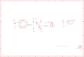

Contents
========

* [PRA1603 > Adafruit BMP180 PCB](#pra1603--adafruit-bmp180-pcb)
	* [Schematic](#schematic)
	* [PCB](#pcb)
	* [Interactive BOM](#interactive-bom)
	* [OOMP Parts](#oomp-parts)
	* [Images](#images)
	* [Tags](#tags)
  
![][im]
# PRA1603 > Adafruit BMP180 PCB

- ID: PROJ-ADAF-1603-STAN-01
- Hex ID: PRA1603
- Name: Adafruit
- Description: Adafruit
- Long Link: [http://oom.lt/PROJ-ADAF-1603-STAN-01](http://oom.lt/PROJ-ADAF-1603-STAN-01)
- Short Link: [http://oom.lt/PRA1603](http://oom.lt/PRA1603)

## Schematic
  

## PCB
  

## Interactive BOM

- Interactive BOM page: [ibom.html](https://htmlpreview.github.io/?https://github.com/oomlout/oomlout_OOMP_projects/blob/main/PROJ-ADAF-1603-STAN-01/kicad/bom/ibom.html)

## OOMP Parts
  

|OOMP Parts|
| :---: |
|[C1 CAPC-0805-X-UF10-V10 SMD (0805) 10 uF Capacitor (Ceramic) 10v](https://github.com/oomlout/oomlout_OOMP_parts/tree/main/CAPC-0805-X-UF10-V10/)|
|[C2 CAPC-0805-X-UF10-V10 SMD (0805) 10 uF Capacitor (Ceramic) 10v](https://github.com/oomlout/oomlout_OOMP_parts/tree/main/CAPC-0805-X-UF10-V10/)|
|[JP1 HEAD-I01-X-PI05-01 2.54 mm 5 Pin Header](https://github.com/oomlout/oomlout_OOMP_parts/tree/main/HEAD-I01-X-PI05-01/)|
|[Q1 MOSN-SO23-X-KBSS138-01 SMD (SOT-23) BSS138 N-Ch. MOSFET](https://github.com/oomlout/oomlout_OOMP_parts/tree/main/MOSN-SO23-X-KBSS138-01/)|
|[Q2 MOSN-SO23-X-KBSS138-01 SMD (SOT-23) BSS138 N-Ch. MOSFET](https://github.com/oomlout/oomlout_OOMP_parts/tree/main/MOSN-SO23-X-KBSS138-01/)|
|[R1 RESE-0805-X-O103-01 SMD (0805) 10k Ohm Resistor](https://github.com/oomlout/oomlout_OOMP_parts/tree/main/RESE-0805-X-O103-01/)|
|[R2 RESE-0805-X-O103-01 SMD (0805) 10k Ohm Resistor](https://github.com/oomlout/oomlout_OOMP_parts/tree/main/RESE-0805-X-O103-01/)|
|[R3 RESE-0805-X-O103-01 SMD (0805) 10k Ohm Resistor](https://github.com/oomlout/oomlout_OOMP_parts/tree/main/RESE-0805-X-O103-01/)|
|[R4 RESE-0805-X-O103-01 SMD (0805) 10k Ohm Resistor](https://github.com/oomlout/oomlout_OOMP_parts/tree/main/RESE-0805-X-O103-01/)|
|[U2 VREG-SO235-X-KMIC5225-V33D SMD (SOT-23-5) MIC5225 Voltage Regulator 3.3v](https://github.com/oomlout/oomlout_OOMP_parts/tree/main/VREG-SO235-X-KMIC5225-V33D/)|
|U3 U3,UNMATCHED-UNMATCHED-X-UNMATCHED-01|

## Images
  
  

|kicadPcb3d|kicadPcb3dFront|kicadPcb3dBack|eagleImage|eagleSchemImage|
| :---: | :---: | :---: | :---: | :---: |
||||||

## Tags

- hexID: PRA1603
- oompType: PROJ
- oompSize: ADAF
- oompColor: 1603
- oompDesc: STAN
- oompIndex: 01
- oompName: Adafruit BMP180 PCB
- sources: All source files from https://github.com/adafruit/Adafruit-BMP180-PCB (source licence details in srcLicense.md)
- linkBuyPage: http://www.adafruit.com/products/1603
- oompID: PROJ-ADAF-1603-STAN-01
- oompParts: C1,CAPC-0805-X-UF10-V10
- oompParts: C2,CAPC-0805-X-UF10-V10
- oompParts: JP1,HEAD-I01-X-PI05-01
- oompParts: Q1,MOSN-SO23-X-KBSS138-01
- oompParts: Q2,MOSN-SO23-X-KBSS138-01
- oompParts: R1,RESE-0805-X-O103-01
- oompParts: R2,RESE-0805-X-O103-01
- oompParts: R3,RESE-0805-X-O103-01
- oompParts: R4,RESE-0805-X-O103-01
- oompParts: U2,VREG-SO235-X-KMIC5225-V33D
- oompParts: U3,UNMATCHED-UNMATCHED-X-UNMATCHED-01
- rawParts: C1,10uF,CAP_CERAMIC0805-NOOUTLINE,0805-NO,Ceramic Capacitors,,
- rawParts: C2,10uF,CAP_CERAMIC0805-NOOUTLINE,0805-NO,Ceramic Capacitors,,
- rawParts: JP1,,HEADER-1X570MIL,1X05_ROUND_70,PIN HEADER,,
- rawParts: Q1,BSS138,MOSFET-NREFLOW,SOT23,N-Channel Mosfet,,
- rawParts: Q2,BSS138,MOSFET-NREFLOW,SOT23,N-Channel Mosfet,,
- rawParts: R1,10K,RESISTOR0805_NOOUTLINE,0805-NO,Resistors,,
- rawParts: R2,10K,RESISTOR_0805MP,_0805MP,Resistors,,
- rawParts: R3,10K,RESISTOR0805_NOOUTLINE,0805-NO,Resistors,,
- rawParts: R4,10K,RESISTOR0805_NOOUTLINE,0805-NO,Resistors,,
- rawParts: U$1,FIDUCIAL,FIDUCIAL,FIDUCIAL_1MM,For use by pick and place machines to calibrate the vision/machine, 1mm,,
- rawParts: U$5,FIDUCIAL,FIDUCIAL,FIDUCIAL_1MM,For use by pick and place machines to calibrate the vision/machine, 1mm,,
- rawParts: U$7,MOUNTINGHOLE2.0,MOUNTINGHOLE2.0,MOUNTINGHOLE_2.0_PLATED,Mounting Hole,EXCLUDE,
- rawParts: U$8,MOUNTINGHOLE2.0,MOUNTINGHOLE2.0,MOUNTINGHOLE_2.0_PLATED,Mounting Hole,EXCLUDE,
- rawParts: U$15,FIDUCIAL,FIDUCIAL,FIDUCIAL_1MM,For use by pick and place machines to calibrate the vision/machine, 1mm,,
- rawParts: U2,MIC5225-3.3,VREG_SOT23-5,SOT23-5,SOT23-5 Fixed Voltage Regulators,,
- rawParts: U3,BMP180,BMP180EXT,BMP180_EXTENDED,BMP180 Digital Pressure Sensor,,

[im]: kicadPcb3d_450.png
