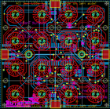
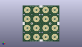
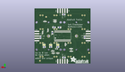
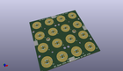

Contents
========

* [PROJ-ADAF-1611-STAN-01>Adafruit_Trellis](#proj-adaf-1611-stan-01adafruit_trellis)
	* [Images](#images)
	* [Interactive BOM](#interactive-bom)
	* [Tags](#tags)
  
![][im]
# PROJ-ADAF-1611-STAN-01>Adafruit_Trellis

- ID: PROJ-ADAF-1611-STAN-01
- Hex ID: PRA1611
- Name: Adafruit_Trellis
- Description: 

## Images
  
  

|eagleImage|kicadPcb3dFront|kicadPcb3dBack|kicadPcb3d|
| :---: | :---: | :---: | :---: |
|||||

## Interactive BOM

- Interactive BOM page: [ibom.html](kicad/bom/ibom.html)

## Tags

- hexID: PRA1611
- oompType: PROJ
- oompSize: ADAF
- oompColor: 1611
- oompDesc: STAN
- oompIndex: 01
- oompName: Adafruit_Trellis
- sources: All source files from https://github.com/adafruit/Adafruit_Trellis (source licence details in srcLicense.md)
- linkBuyPage: http://www.adafruit.com/products/1611
- oompPart: UNMATCHED-UNMATCHED-X-UNMATCHED-01, A0, 12.7, -9.652, M180
- oompPart: UNMATCHED-UNMATCHED-X-UNMATCHED-01, A1, 5.08, -9.652, M180
- oompPart: UNMATCHED-UNMATCHED-X-UNMATCHED-01, A2, 19.812, -9.652, M180
- oompPart: ERROR, C1  _0805, 0, 0, 0
- oompPart: ERROR, C2  _0805, 0, 0, 0
- oompPart: ERROR, C3  _0805, 0, 0, 0
- oompPart: ERROR, C4  _0805, 0, 0, 0
- oompPart: CAPC-UNMATCHED-X-UF10-V25, C5, 10.921999999999999, 3.556, M90
- oompPart: UNMATCHED-UNMATCHED-X-UNMATCHED-01, D1, 10.447999932, -16.299999912, M0
- oompPart: UNMATCHED-UNMATCHED-X-UNMATCHED-01, D2, 15.490000008, 6.316000067999999, M90
- oompPart: UNMATCHED-UNMATCHED-X-UNMATCHED-01, D4, 6.35, -13.97, M0
- oompPart: UNMATCHED-UNMATCHED-X-UNMATCHED-01, D5, 21.336, 3.8099999999999996, M270
- oompPart: UNMATCHED-UNMATCHED-X-UNMATCHED-01, D6, -9.143999999999998, -13.716, M180
- oompPart: UNMATCHED-UNMATCHED-X-UNMATCHED-01, D7, -9.398, -16.509999999999998, M0
- oompPart: UNMATCHED-UNMATCHED-X-UNMATCHED-01, D8, 8.128, 17.272000000000002, M180
- oompPart: UNMATCHED-UNMATCHED-X-UNMATCHED-01, D9, 8.128, 15.493999999999998, M180
- oompPart: UNMATCHED-UNMATCHED-X-UNMATCHED-01, D10, 9.906, -18.541999999999998, M180
- oompPart: UNMATCHED-UNMATCHED-X-UNMATCHED-01, D11, 5.08, -18.541999999999998, M180
- oompPart: UNMATCHED-UNMATCHED-X-UNMATCHED-01, D12, 18.796, 15.748, M0
- oompPart: UNMATCHED-UNMATCHED-X-UNMATCHED-01, D13, -3.0479999999999996, -9.143999999999998, M270
- oompPart: SKIP-UNMATCHED-X-UNMATCHED-01, FID1, 24.13, -26.924, M0
- oompPart: SKIP-UNMATCHED-X-UNMATCHED-01, FID2, -28.448, -18.287999999999997, M0
- oompPart: SKIP-UNMATCHED-X-UNMATCHED-01, FID3, 17.525999999999996, 20.827999999999996, M0
- oompPart: UNMATCHED-UNMATCHED-X-UNMATCHED-01, JP1, 27.432, 0.0, M90
- oompPart: UNMATCHED-UNMATCHED-X-UNMATCHED-01, JP2, -27.432, 0.0, M90
- oompPart: UNMATCHED-UNMATCHED-X-UNMATCHED-01, JP3, 0.0, -27.432, M180
- oompPart: UNMATCHED-UNMATCHED-X-UNMATCHED-01, JP4, 0.0, 27.432, M180
- oompPart: UNMATCHED-UNMATCHED-X-UNMATCHED-01, LED1, 0.027999943999999995, 0.027999943999999995, 180
- oompPart: RESE-UNMATCHED-X-O103-01, R1, 3.302, 9.398, M180
- oompPart: RESE-UNMATCHED-X-O103-01, R2, 9.143999999999998, 9.398, M0
- oompPart: RESE-0805-X-UNMATCHED-01, R3, 5.08, -11.937999999999999, M180
- oompPart: RESE-0805-X-UNMATCHED-01, R4, 12.7, -11.937999999999999, M0
- oompPart: RESE-0805-X-UNMATCHED-01, R5, 19.558, -11.937999999999999, M180
- oompPart: UNMATCHED-UNMATCHED-X-UNMATCHED-01, SW1, 0.027999943999999995, 0.027999943999999995, 180
- oompPart: UNMATCHED-UNMATCHED-X-UNMATCHED-01, TP1, -28.448, 0.0, 90
- oompPart: UNMATCHED-UNMATCHED-X-UNMATCHED-01, TP2, 0.254, -28.448, 0
- oompPart: UNMATCHED-UNMATCHED-X-UNMATCHED-01, TP3, 0.0, 28.448, 0
- oompPart: UNMATCHED-UNMATCHED-X-UNMATCHED-01, TP4, 28.448, 0.0, 90
- oompPart: SKIP-UNMATCHED-X-UNMATCHED-01, U$1, -14.985999999999999, 0.0, 0
- oompPart: SKIP-UNMATCHED-X-UNMATCHED-01, U$2, 14.985999999999999, 0.0, 0
- oompPart: ERROR, U1 HT16K33 28SOP, 0, 0, 0
- rawPart: 

[im]: kicadPcb3d_450.png
