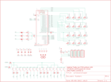

Contents
========

* [PRA1611 > Adafruit_Trellis](#pra1611--adafruit_trellis)
	* [Schematic](#schematic)
	* [PCB](#pcb)
	* [Interactive BOM](#interactive-bom)
	* [OOMP Parts](#oomp-parts)
	* [Images](#images)
	* [Tags](#tags)
  
![][im]
# PRA1611 > Adafruit_Trellis

- ID: PROJ-ADAF-1611-STAN-01
- Hex ID: PRA1611
- Name: Adafruit
- Description: Adafruit
- Long Link: [http://oom.lt/PROJ-ADAF-1611-STAN-01](http://oom.lt/PROJ-ADAF-1611-STAN-01)
- Short Link: [http://oom.lt/PRA1611](http://oom.lt/PRA1611)

## Schematic
  

## PCB
  

## Interactive BOM

- Interactive BOM page: [ibom.html](https://htmlpreview.github.io/?https://github.com/oomlout/oomlout_OOMP_projects/blob/main/PROJ-ADAF-1611-STAN-01/kicad/bom/ibom.html)

## OOMP Parts
  

|OOMP ID|Name|Identifier|
| :---: | :---: | :---: |
|[CAPC-0805-X-NF100-V50](https://github.com/oomlout/oomlout_OOMP_parts/tree/main/CAPC-0805-X-NF100-V50/)|[SMD (0805) 100 nF Capacitor (Ceramic) 50v](https://github.com/oomlout/oomlout_OOMP_parts/tree/main/CAPC-0805-X-NF100-V50/)|[C1, C2, C3, C4](https://github.com/oomlout/oomlout_OOMP_parts/tree/main/CAPC-0805-X-NF100-V50/)|
|[CAPC-0805-X-UF10-V10](https://github.com/oomlout/oomlout_OOMP_parts/tree/main/CAPC-0805-X-UF10-V10/)|[SMD (0805) 10 uF Capacitor (Ceramic) 10v](https://github.com/oomlout/oomlout_OOMP_parts/tree/main/CAPC-0805-X-UF10-V10/)|[C5](https://github.com/oomlout/oomlout_OOMP_parts/tree/main/CAPC-0805-X-UF10-V10/)|
|[DIOD-S323-X-K4148-01](https://github.com/oomlout/oomlout_OOMP_parts/tree/main/DIOD-S323-X-K4148-01/)|[SMD (SOD-323) Diode](https://github.com/oomlout/oomlout_OOMP_parts/tree/main/DIOD-S323-X-K4148-01/)|[D1, D2, D4, D5, D6, D7, D8, D9, D10, D11, D12, D13](https://github.com/oomlout/oomlout_OOMP_parts/tree/main/DIOD-S323-X-K4148-01/)|
|HEAD-I01-X-UNMATCHED-01||JP1, JP2, JP3, JP4|
|LEDS-UNMATCHED-G-STAN-01||LED1|
|[RESE-0805-X-O103-01](https://github.com/oomlout/oomlout_OOMP_parts/tree/main/RESE-0805-X-O103-01/)|[SMD (0805) 10k Ohm Resistor](https://github.com/oomlout/oomlout_OOMP_parts/tree/main/RESE-0805-X-O103-01/)|[R1, R2](https://github.com/oomlout/oomlout_OOMP_parts/tree/main/RESE-0805-X-O103-01/)|
|RESE-0805-X-O473-01||R3, R4, R5|
|UNMATCHED-UNMATCHED-X-UNMATCHED-01||SW1, U1|

## Images
  
  

|bominteractivefront|bominteractiveback|kicadPcb3d|kicadPcb3dFront|kicadPcb3dBack|eagleImage|eagleSchemImage|pcbdraw|pcbdrawback|
| :---: | :---: | :---: | :---: | :---: | :---: | :---: | :---: | :---: |
||||||||||

## Tags

- hexID: PRA1611
- oompType: PROJ
- oompSize: ADAF
- oompColor: 1611
- oompDesc: STAN
- oompIndex: 01
- oompName: Adafruit_Trellis
- sources: All source files from https://github.com/adafruit/Adafruit_Trellis (source licence details in srcLicense.md)
- linkBuyPage: http://www.adafruit.com/products/1611
- oompID: PROJ-ADAF-1611-STAN-01
- oompParts: C1,CAPC-0805-X-NF100-V50
- oompParts: C2,CAPC-0805-X-NF100-V50
- oompParts: C3,CAPC-0805-X-NF100-V50
- oompParts: C4,CAPC-0805-X-NF100-V50
- oompParts: C5,CAPC-0805-X-UF10-V10
- oompParts: D1,DIOD-S323-X-K4148-01
- oompParts: D2,DIOD-S323-X-K4148-01
- oompParts: D4,DIOD-S323-X-K4148-01
- oompParts: D5,DIOD-S323-X-K4148-01
- oompParts: D6,DIOD-S323-X-K4148-01
- oompParts: D7,DIOD-S323-X-K4148-01
- oompParts: D8,DIOD-S323-X-K4148-01
- oompParts: D9,DIOD-S323-X-K4148-01
- oompParts: D10,DIOD-S323-X-K4148-01
- oompParts: D11,DIOD-S323-X-K4148-01
- oompParts: D12,DIOD-S323-X-K4148-01
- oompParts: D13,DIOD-S323-X-K4148-01
- oompParts: JP1,HEAD-I01-X-UNMATCHED-01
- oompParts: JP2,HEAD-I01-X-UNMATCHED-01
- oompParts: JP3,HEAD-I01-X-UNMATCHED-01
- oompParts: JP4,HEAD-I01-X-UNMATCHED-01
- oompParts: LED1,LEDS-UNMATCHED-G-STAN-01
- oompParts: R1,RESE-0805-X-O103-01
- oompParts: R2,RESE-0805-X-O103-01
- oompParts: R3,RESE-0805-X-O473-01
- oompParts: R4,RESE-0805-X-O473-01
- oompParts: R5,RESE-0805-X-O473-01
- oompParts: SW1,UNMATCHED-UNMATCHED-X-UNMATCHED-01
- oompParts: U1,UNMATCHED-UNMATCHED-X-UNMATCHED-01
- rawParts: A0,,SOLDERJUMPERREFLOW_NOPASTE,SOLDERJUMPER_REFLOW_NOPASTE,SMD Solder JUMPER,,
- rawParts: A1,,SOLDERJUMPERREFLOW_NOPASTE,SOLDERJUMPER_REFLOW_NOPASTE,SMD Solder JUMPER,,
- rawParts: A2,,SOLDERJUMPERREFLOW_NOPASTE,SOLDERJUMPER_REFLOW_NOPASTE,SMD Solder JUMPER,,
- rawParts: C1,,CAP_CERAMIC_0805,_0805,Ceramic Capacitors,,
- rawParts: C2,,CAP_CERAMIC_0805,_0805,Ceramic Capacitors,,
- rawParts: C3,,CAP_CERAMIC_0805,_0805,Ceramic Capacitors,,
- rawParts: C4,,CAP_CERAMIC_0805,_0805,Ceramic Capacitors,,
- rawParts: C5,10uF,CAP_CERAMIC_0805,_0805,Ceramic Capacitors,,
- rawParts: D1,1N4148,DIODESOD-323,SOD-323,Diode,,
- rawParts: D2,1N4148,DIODESOD-323,SOD-323,Diode,,
- rawParts: D4,1N4148,DIODESOD-323F,SOD-323F,Diode,,
- rawParts: D5,1N4148,DIODESOD-323,SOD-323,Diode,,
- rawParts: D6,1N4148,DIODESOD-323,SOD-323,Diode,,
- rawParts: D7,1N4148,DIODESOD-323,SOD-323,Diode,,
- rawParts: D8,1N4148,DIODESOD-323,SOD-323,Diode,,
- rawParts: D9,1N4148,DIODESOD-323,SOD-323,Diode,,
- rawParts: D10,1N4148,DIODESOD-323,SOD-323,Diode,,
- rawParts: D11,1N4148,DIODESOD-323,SOD-323,Diode,,
- rawParts: D12,1N4148,DIODESOD-323,SOD-323,Diode,,
- rawParts: D13,1N4148,DIODESOD-323,SOD-323,Diode,,
- rawParts: FID1,FIDUCIAL,FIDUCIAL,FIDUCIAL_1MM,Fiducial Alignment Points,EXCLUDE,
- rawParts: FID2,FIDUCIAL,FIDUCIAL,FIDUCIAL_1MM,Fiducial Alignment Points,EXCLUDE,
- rawParts: FID3,FIDUCIAL,FIDUCIAL,FIDUCIAL_1MM,Fiducial Alignment Points,EXCLUDE,
- rawParts: JP1,,HEADER-1X5EDGESMT,1X5_SMT,PIN HEADER,,
- rawParts: JP2,,HEADER-1X5EDGESMT,1X5_SMT,PIN HEADER,,
- rawParts: JP3,,HEADER-1X5EDGESMT,1X5_SMT,PIN HEADER,,
- rawParts: JP4,,HEADER-1X5EDGESMT,1X5_SMT,PIN HEADER,,
- rawParts: LED1,TBD,LED-3MM-4X4GRID-3MM,LED3MM-4X4GRID,,,
- rawParts: R1,10K,RESISTOR_0805,_0805,Resistors,,
- rawParts: R2,10K,RESISTOR_0805,_0805,Resistors,,
- rawParts: R3,47K,R-US_R0805,R0805,RESISTOR, American symbol,,
- rawParts: R4,47K,R-US_R0805,R0805,RESISTOR, American symbol,,
- rawParts: R5,47K,R-US_R0805,R0805,RESISTOR, American symbol,,
- rawParts: SW1,,SWITCH-SILICON-4X4GRID-10MM-5.4MM,ELAST_PAD_SQUARE_10MM_5.4MM_4X4GRID,,,
- rawParts: TP1,,TESTPOINT,TESTPOINT_SMT,Test Point,,
- rawParts: TP2,,TESTPOINT,TESTPOINT_SMT,Test Point,,
- rawParts: TP3,,TESTPOINT,TESTPOINT_SMT,Test Point,,
- rawParts: TP4,,TESTPOINT,TESTPOINT_SMT,Test Point,,
- rawParts: U$1,MOUNTINGHOLE2.5,MOUNTINGHOLE2.5,MOUNTINGHOLE_2.5_PLATED,Mounting Hole,EXCLUDE,
- rawParts: U$2,MOUNTINGHOLE2.5,MOUNTINGHOLE2.5,MOUNTINGHOLE_2.5_PLATED,Mounting Hole,EXCLUDE,
- rawParts: U1,HT16K33 28SOP,HT16K33_SOP28,SOP28_300MIL,,,

[im]: kicadPcb3d_450.png
