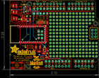
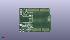
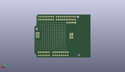
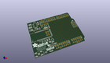

Contents
========

* [PROJ-ADAF-1628-STAN-01>Adafruit Bluefruit EZ Link Shield PCB](#proj-adaf-1628-stan-01adafruit-bluefruit-ez-link-shield-pcb)
	* [Images](#images)
	* [Interactive BOM](#interactive-bom)
	* [OOMP Parts](#oomp-parts)
	* [Tags](#tags)
  
![][im]
# PROJ-ADAF-1628-STAN-01>Adafruit Bluefruit EZ Link Shield PCB

- ID: PROJ-ADAF-1628-STAN-01
- Hex ID: PRA1628
- Name: Adafruit Bluefruit EZ Link Shield PCB
- Description: 

## Images
  
  

|eagleImage|kicadPcb3dFront|kicadPcb3dBack|kicadPcb3d|
| :---: | :---: | :---: | :---: |
|||||

## Interactive BOM

- Interactive BOM page: [ibom.html](kicad/bom/ibom.html)

## OOMP Parts
  

|OOMP Parts|
| :---: |
|CAPC-0805-X-UNMATCHED-01, C1, 22.605999999999998, 13.843, 180,C1, 10uF, 0805-NO, microbuilder, (0.89, 0.545), R180|
|CAPC-0805-X-UF22D-01, C2, 28.701999999999995, 36.195, 90,C2, 2.2uF, 0805-NO, microbuilder, (1.13, 1.425), R90|
|CAPC-0805-X-UNMATCHED-01, C4, 28.448, 9.524999999999999, 180,C4, 10uF, 0805-NO, microbuilder, (1.12, 0.375), R180|
|UNMATCHED-UNMATCHED-X-UNMATCHED-01, IC1, 10.033, 38.862, 0,IC1, 74LVC2G34DBVR, SOT23-6, microbuilder, (0.395, 1.53), R0|
|UNMATCHED-UNMATCHED-X-UNMATCHED-01, IC2, 24.764999999999997, 8.762999999999998, 180,IC2, 74AHC1G07DBV, SOT23-5, 74xx-little-us, (0.975, 0.345), R180|
|<table><tr><td></td><td> JP1</td><td>[HEAD-I01-X-PI05-01 2.54 mm 5 Pin Header](https://github.com/oomlout/oomlout_OOMP_parts/tree/main/HEAD-I01-X-PI05-01/)</td><td>[H05](https://github.com/oomlout/oomlout_OOMP_parts/tree/main/HEAD-I01-X-PI05-01/)</td></tr></table>|
|<table><tr><td></td><td> JP3</td><td>[HEAD-I01-X-PI08-01 2.54 mm 8 Pin Header](https://github.com/oomlout/oomlout_OOMP_parts/tree/main/HEAD-I01-X-PI08-01/)</td><td>[H08](https://github.com/oomlout/oomlout_OOMP_parts/tree/main/HEAD-I01-X-PI08-01/)</td></tr></table>|
|<table><tr><td></td><td> JP4</td><td>[HEAD-I01-X-PI08-01 2.54 mm 8 Pin Header](https://github.com/oomlout/oomlout_OOMP_parts/tree/main/HEAD-I01-X-PI08-01/)</td><td>[H08](https://github.com/oomlout/oomlout_OOMP_parts/tree/main/HEAD-I01-X-PI08-01/)</td></tr></table>|
|UNMATCHED-UNMATCHED-X-UNMATCHED-01, JP5, 23.495, 26.924, 270,JP5, 2X03_ROUND_70MIL, microbuilder, (0.925, 1.06), R270|
|<table><tr><td></td><td> JP6</td><td>[HEAD-I01-X-PI06-01 2.54 mm 6 Pin Header](https://github.com/oomlout/oomlout_OOMP_parts/tree/main/HEAD-I01-X-PI06-01/)</td><td>[H06](https://github.com/oomlout/oomlout_OOMP_parts/tree/main/HEAD-I01-X-PI06-01/)</td></tr></table>|
|UNMATCHED-UNMATCHED-X-UNMATCHED-01, LED1, 3.0479999999999996, 39.49699999999999, 180,LED1, RED, CHIPLED_0805_NOOUTLINE, microbuilder, (0.12, 1.555), R180|
|UNMATCHED-UNMATCHED-X-UNMATCHED-01, LED3, 2.794, 44.449999999999996, 0,LED3, Blue, CHIPLED_0805_NOOUTLINE, microbuilder, (0.11, 1.75), R0|
|UNMATCHED-UNMATCHED-X-UNMATCHED-01, LED4, 2.667, 49.275999999999996, 180,LED4, Blue, CHIPLED_0805_NOOUTLINE, microbuilder, (0.105, 1.94), R180|
|<table><tr><td></td><td> R1</td><td>[RESE-0805-X-O103-01 SMD (0805) 10k Ohm Resistor](https://github.com/oomlout/oomlout_OOMP_parts/tree/main/RESE-0805-X-O103-01/)</td><td>[R85103](https://github.com/oomlout/oomlout_OOMP_parts/tree/main/RESE-0805-X-O103-01/)</td></tr></table>|
|RESE-0805-X-UNMATCHED-01, R2, 5.08, 39.37, 270,R2, 1K, 0805-NO, microbuilder, (0.2, 1.55), R270|
|<table><tr><td></td><td> R3</td><td>[RESE-0805-X-O103-01 SMD (0805) 10k Ohm Resistor](https://github.com/oomlout/oomlout_OOMP_parts/tree/main/RESE-0805-X-O103-01/)</td><td>[R85103](https://github.com/oomlout/oomlout_OOMP_parts/tree/main/RESE-0805-X-O103-01/)</td></tr></table>|
|<table><tr><td></td><td> R4</td><td>[RESE-0805-X-O103-01 SMD (0805) 10k Ohm Resistor](https://github.com/oomlout/oomlout_OOMP_parts/tree/main/RESE-0805-X-O103-01/)</td><td>[R85103](https://github.com/oomlout/oomlout_OOMP_parts/tree/main/RESE-0805-X-O103-01/)</td></tr></table>|
|RESE-0805-X-UNMATCHED-01, R5, 20.066, 17.272000000000002, 270,R5, 2.2K, 0805-NO, microbuilder, (0.79, 0.68), R270|
|<table><tr><td></td><td> R6</td><td>[RESE-0805-X-O103-01 SMD (0805) 10k Ohm Resistor](https://github.com/oomlout/oomlout_OOMP_parts/tree/main/RESE-0805-X-O103-01/)</td><td>[R85103](https://github.com/oomlout/oomlout_OOMP_parts/tree/main/RESE-0805-X-O103-01/)</td></tr></table>|
|ERROR, R7 47 ohm, 0, 0, 0,R7, 47, ohm, 0805-NO, microbuilder, (0.615, 1.84), R90|
|<table><tr><td></td><td> R8</td><td>[RESE-0805-X-O221-01 SMD (0805) 220 Ohm Resistor](https://github.com/oomlout/oomlout_OOMP_parts/tree/main/RESE-0805-X-O221-01/)</td><td>[R85221](https://github.com/oomlout/oomlout_OOMP_parts/tree/main/RESE-0805-X-O221-01/)</td></tr></table>|
|<table><tr><td></td><td> R10</td><td>[RESE-0805-X-O221-01 SMD (0805) 220 Ohm Resistor](https://github.com/oomlout/oomlout_OOMP_parts/tree/main/RESE-0805-X-O221-01/)</td><td>[R85221](https://github.com/oomlout/oomlout_OOMP_parts/tree/main/RESE-0805-X-O221-01/)</td></tr></table>|
|UNMATCHED-UNMATCHED-X-UNMATCHED-01, SW1, 15.366999999999999, 17.525999999999996, 180,SW1, SPST_TACT-KMR2, KMR2, adafruit, (0.605, 0.69), R180|
|UNMATCHED-UNMATCHED-X-UNMATCHED-01, SW2, 10.795, 46.101, 90,SW2, EG1390, adafruit, (0.425, 1.815), R90|
|UNMATCHED-UNMATCHED-X-UNMATCHED-01, SW3, 5.460999999999999, 3.175, 180,SW3, SPST_TACT-EVQQ2, EVQ-Q2, adafruit, (0.215, 0.125), R180|
|UNMATCHED-UNMATCHED-X-UNMATCHED-01, U$5, 0.0, 0.0, 0,U$5, ARDUINO_R3_ICSP, ARDUINOR3_ICSP, adafruit2, (0, 0), R0|
|UNMATCHED-UNMATCHED-X-UNMATCHED-01, U$6, 30.225999999999996, 47.117, 0,U$6, PINHD-1X10, 1X10-BIG, adafruit, (1.19, 1.855), R0|
|UNMATCHED-UNMATCHED-X-UNMATCHED-01, U1, 14.097000000000001, 27.178, 90,U1, BlueFruit, BLUETOOTH_MODULE, microbuilder, (0.555, 1.07), R90|
|UNMATCHED-UNMATCHED-X-UNMATCHED-01, U2, 26.796999999999997, 15.366999999999999, 90,U2, MIC5225-3.3, SOT23-5, microbuilder, (1.055, 0.605), R90|

## Tags

- hexID: PRA1628
- oompType: PROJ
- oompSize: ADAF
- oompColor: 1628
- oompDesc: STAN
- oompIndex: 01
- oompName: Adafruit Bluefruit EZ Link Shield PCB
- sources: All source files from https://github.com/adafruit/Adafruit-Bluefruit-EZ-Link-Shield-PCB (source licence details in srcLicense.md)
- linkBuyPage: http://www.adafruit.com/products/1628
- oompPart: CAPC-0805-X-UNMATCHED-01, C1, 22.605999999999998, 13.843, 180
- oompPart: CAPC-0805-X-UF22D-01, C2, 28.701999999999995, 36.195, 90
- oompPart: CAPC-0805-X-UNMATCHED-01, C4, 28.448, 9.524999999999999, 180
- oompPart: SKIP-UNMATCHED-X-UNMATCHED-01, FID1, 5.460999999999999, 3.175, 0
- oompPart: SKIP-UNMATCHED-X-UNMATCHED-01, FID2, 63.373, 33.654999999999994, 0
- oompPart: SKIP-UNMATCHED-X-UNMATCHED-01, FID3, 6.858, 37.083999999999996, 0
- oompPart: UNMATCHED-UNMATCHED-X-UNMATCHED-01, IC1, 10.033, 38.862, 0
- oompPart: UNMATCHED-UNMATCHED-X-UNMATCHED-01, IC2, 24.764999999999997, 8.762999999999998, 180
- oompPart: HEAD-I01-X-PI05-01, JP1, 23.622, 43.307, 0
- oompPart: HEAD-I01-X-PI08-01, JP3, 54.60999999999999, 47.117, 0
- oompPart: HEAD-I01-X-PI08-01, JP4, 36.83, 6.476999999999999, 180
- oompPart: UNMATCHED-UNMATCHED-X-UNMATCHED-01, JP5, 23.495, 26.924, 270
- oompPart: HEAD-I01-X-PI06-01, JP6, 57.15, 6.476999999999999, 180
- oompPart: UNMATCHED-UNMATCHED-X-UNMATCHED-01, LED1, 3.0479999999999996, 39.49699999999999, 180
- oompPart: UNMATCHED-UNMATCHED-X-UNMATCHED-01, LED3, 2.794, 44.449999999999996, 0
- oompPart: UNMATCHED-UNMATCHED-X-UNMATCHED-01, LED4, 2.667, 49.275999999999996, 180
- oompPart: RESE-0805-X-O103-01, R1, 23.114, 17.399, 90
- oompPart: RESE-0805-X-UNMATCHED-01, R2, 5.08, 39.37, 270
- oompPart: RESE-0805-X-O103-01, R3, 15.620999999999999, 38.354, 90
- oompPart: RESE-0805-X-O103-01, R4, 26.162, 12.446, 180
- oompPart: RESE-0805-X-UNMATCHED-01, R5, 20.066, 17.272000000000002, 270
- oompPart: RESE-0805-X-O103-01, R6, 12.446, 38.354, 270
- oompPart: ERROR, R7 47 ohm, 0, 0, 0
- oompPart: RESE-0805-X-O221-01, R8, 4.826, 44.323, 90
- oompPart: RESE-0805-X-O221-01, R10, 4.826, 49.403, 270
- oompPart: SKIP-UNMATCHED-X-UNMATCHED-01, SJ1, 23.875999999999998, 36.449, 0
- oompPart: UNMATCHED-UNMATCHED-X-UNMATCHED-01, SW1, 15.366999999999999, 17.525999999999996, 180
- oompPart: UNMATCHED-UNMATCHED-X-UNMATCHED-01, SW2, 10.795, 46.101, 90
- oompPart: UNMATCHED-UNMATCHED-X-UNMATCHED-01, SW3, 5.460999999999999, 3.175, 180
- oompPart: UNMATCHED-UNMATCHED-X-UNMATCHED-01, U$5, 0.0, 0.0, 0
- oompPart: UNMATCHED-UNMATCHED-X-UNMATCHED-01, U$6, 30.225999999999996, 47.117, 0
- oompPart: UNMATCHED-UNMATCHED-X-UNMATCHED-01, U1, 14.097000000000001, 27.178, 90
- oompPart: UNMATCHED-UNMATCHED-X-UNMATCHED-01, U2, 26.796999999999997, 15.366999999999999, 90
- rawPart: C1, 10uF, 0805-NO, microbuilder, (0.89, 0.545), R180
- rawPart: C2, 2.2uF, 0805-NO, microbuilder, (1.13, 1.425), R90
- rawPart: C4, 10uF, 0805-NO, microbuilder, (1.12, 0.375), R180
- rawPart: FID1, FIDUCIAL, FIDUCIAL_1MM, microbuilder, (0.215, 0.125), R0
- rawPart: FID2, FIDUCIAL, FIDUCIAL_1MM, microbuilder, (2.495, 1.325), R0
- rawPart: FID3, FIDUCIAL, FIDUCIAL_1MM, microbuilder, (0.27, 1.46), R0
- rawPart: IC1, 74LVC2G34DBVR, SOT23-6, microbuilder, (0.395, 1.53), R0
- rawPart: IC2, 74AHC1G07DBV, SOT23-5, 74xx-little-us, (0.975, 0.345), R180
- rawPart: JP1, 1X05_ROUND_70, microbuilder, (0.93, 1.705), R0
- rawPart: JP3, 1X08-BIG, adafruit, (2.15, 1.855), R0
- rawPart: JP4, 1X08-BIG, adafruit, (1.45, 0.255), R180
- rawPart: JP5, 2X03_ROUND_70MIL, microbuilder, (0.925, 1.06), R270
- rawPart: JP6, 1X06-BIG, adafruit, (2.25, 0.255), R180
- rawPart: LED1, RED, CHIPLED_0805_NOOUTLINE, microbuilder, (0.12, 1.555), R180
- rawPart: LED3, Blue, CHIPLED_0805_NOOUTLINE, microbuilder, (0.11, 1.75), R0
- rawPart: LED4, Blue, CHIPLED_0805_NOOUTLINE, microbuilder, (0.105, 1.94), R180
- rawPart: R1, 10K, 0805-NO, microbuilder, (0.91, 0.685), R90
- rawPart: R2, 1K, 0805-NO, microbuilder, (0.2, 1.55), R270
- rawPart: R3, 10K, _0805MP, microbuilder, (0.615, 1.51), R90
- rawPart: R4, 10K, 0805-NO, microbuilder, (1.03, 0.49), R180
- rawPart: R5, 2.2K, 0805-NO, microbuilder, (0.79, 0.68), R270
- rawPart: R6, 10K, _0805MP, microbuilder, (0.49, 1.51), R270
- rawPart: R7, 47, ohm, 0805-NO, microbuilder, (0.615, 1.84), R90
- rawPart: R8, 220, 0805-NO, microbuilder, (0.19, 1.745), R90
- rawPart: R10, 220, 0805-NO, microbuilder, (0.19, 1.945), R270
- rawPart: SJ1, SOLDERJUMPER_2WAY_OPEN_NOPASTE, microbuilder, (0.94, 1.435), R0
- rawPart: SW1, SPST_TACT-KMR2, KMR2, adafruit, (0.605, 0.69), R180
- rawPart: SW2, EG1390, adafruit, (0.425, 1.815), R90
- rawPart: SW3, SPST_TACT-EVQQ2, EVQ-Q2, adafruit, (0.215, 0.125), R180
- rawPart: U$5, ARDUINO_R3_ICSP, ARDUINOR3_ICSP, adafruit2, (0, 0), R0
- rawPart: U$6, PINHD-1X10, 1X10-BIG, adafruit, (1.19, 1.855), R0
- rawPart: U1, BlueFruit, BLUETOOTH_MODULE, microbuilder, (0.555, 1.07), R90
- rawPart: U2, MIC5225-3.3, SOT23-5, microbuilder, (1.055, 0.605), R90
- oompID: PROJ-ADAF-1628-STAN-01

[im]: kicadPcb3d_450.png
