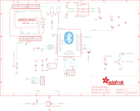

Contents
========

* [PRA1628 > Adafruit](#pra1628--adafruit)
	* [Schematic](#schematic)
	* [Interactive BOM](#interactive-bom)
	* [OOMP Parts](#oomp-parts)
	* [Images](#images)
	* [Tags](#tags)
  
![][im]
# PRA1628 > Adafruit

- ID: PROJ-ADAF-1628-STAN-01
- Hex ID: PRA1628
- Name: Adafruit
- Description: Adafruit
- Long Link: [http://oom.lt/PROJ-ADAF-1628-STAN-01](http://oom.lt/PROJ-ADAF-1628-STAN-01)
- Short Link: [http://oom.lt/PRA1628](http://oom.lt/PRA1628)

## Schematic
  

## Interactive BOM

- Interactive BOM page: [ibom.html](https://htmlpreview.github.io/?https://github.com/oomlout/oomlout_OOMP_projects/blob/main/PROJ-ADAF-1628-STAN-01/kicad/bom/ibom.html)

## OOMP Parts
  

|OOMP Parts|
| :---: |
|C1,CAPC-0805-X-UF10-V10,C1,10uF,CAP_CERAMIC0805-NOOUTLINE,0805-NO,Ceramic Capacitors,,|
|C2,CAPC-0805-X-UNMATCHED-01,C2,2.2uF,CAP_CERAMIC0805-NOOUTLINE,0805-NO,Ceramic Capacitors,,|
|C4,CAPC-0805-X-UF10-V10,C4,10uF,CAP_CERAMIC0805-NOOUTLINE,0805-NO,Ceramic Capacitors,,|
|IC1,UNMATCHED-SO23-X-UNMATCHED-01,FID1,FIDUCIAL,FIDUCIAL,FIDUCIAL_1MM,Fiducial Alignment Points,EXCLUDE,|
|IC2,UNMATCHED-SO235-X-UNMATCHED-01,FID2,FIDUCIAL,FIDUCIAL,FIDUCIAL_1MM,Fiducial Alignment Points,EXCLUDE,|
|JP1,HEAD-I01-X-PI05-01,FID3,FIDUCIAL,FIDUCIAL,FIDUCIAL_1MM,Fiducial Alignment Points,EXCLUDE,|
|JP3,HEAD-I01-X-PI08-01,IC1,74LVC2G34DBVR,74LVC2G34DBVR,SOT23-6,,,|
|JP4,HEAD-I01-X-PI08-01,IC2,74AHC1G07DBV,74AHC1G07DBV,SOT23-5,Single Buffer/Driver With Open-Drain Output,,|
|JP5,HEAD-I01-X-UNMATCHED-01,JP1,,HEADER-1X570MIL,1X05_ROUND_70,PIN HEADER,,|
|JP6,HEAD-I01-X-PI06-01,JP3,,PINHD-1X8BIG,1X08-BIG,PIN HEADER,,|
|LED1,LEDS-0805-G-STAN-01,JP4,,PINHD-1X8BIG,1X08-BIG,PIN HEADER,,|
|LED3,LEDS-0805-G-STAN-01,JP5,,HEADER-2X3,2X03_ROUND_70MIL,PIN HEADER,,|
|LED4,LEDS-0805-G-STAN-01,JP6,,PINHD-1X6B,1X06-BIG,PIN HEADER,,|
|R1,RESE-0805-X-O103-01,LED1,RED,LED0805_NOOUTLINE,CHIPLED_0805_NOOUTLINE,LED,,|
|R2,RESE-0805-X-O102-01,LED3,Blue,LED0805_NOOUTLINE,CHIPLED_0805_NOOUTLINE,LED,,|
|R3,RESE-0805-X-O103-01,LED4,Blue,LED0805_NOOUTLINE,CHIPLED_0805_NOOUTLINE,LED,,|
|R4,RESE-0805-X-O103-01,R1,10K,RESISTOR0805_NOOUTLINE,0805-NO,Resistors,,|
|R5,RESE-0805-X-UNMATCHED-01,R2,1K,RESISTOR0805_NOOUTLINE,0805-NO,Resistors,,|
|R6,RESE-0805-X-O103-01,R3,10K,RESISTOR_0805MP,_0805MP,Resistors,,|
|R7,RESE-0805-X-UNMATCHED-01,R4,10K,RESISTOR0805_NOOUTLINE,0805-NO,Resistors,,|
|R8,RESE-0805-X-O221-01,R5,2.2K,RESISTOR0805_NOOUTLINE,0805-NO,Resistors,,|
|R10,RESE-0805-X-O221-01,R6,10K,RESISTOR_0805MP,_0805MP,Resistors,,|
|SW1,UNMATCHED-UNMATCHED-X-UNMATCHED-01,R7,47 ohm,RESISTOR0805_NOOUTLINE,0805-NO,Resistors,,|
|SW2,UNMATCHED-UNMATCHED-X-UNMATCHED-01,R8,220,RESISTOR0805_NOOUTLINE,0805-NO,Resistors,,|
|SW3,UNMATCHED-UNMATCHED-X-UNMATCHED-01,R10,220,RESISTOR0805_NOOUTLINE,0805-NO,Resistors,,|
|U$5,UNMATCHED-UNMATCHED-X-UNMATCHED-01,SJ1,,SOLDERJUMPER_2WAY,SOLDERJUMPER_2WAY_OPEN_NOPASTE,2-Way Solder Jumper,,|
|U$6,UNMATCHED-UNMATCHED-X-UNMATCHED-01,SW1,SPST_TACT-KMR2,SPST_TACT-KMR2,KMR2,SMT 6mm switch, EVQQ2 series,,|
|U1,UNMATCHED-UNMATCHED-X-UNMATCHED-01,SW2,,DPDT-EG1390,EG1390,,,|
|U2,VREG-SO235-X-KMIC5225-V33D,SW3,SPST_TACT-EVQQ2,SPST_TACT-EVQQ2,EVQ-Q2,SMT 6mm switch, EVQQ2 series,,|

## Images
  
  

|kicadPcb3d|kicadPcb3dFront|kicadPcb3dBack|eagleImage|eagleSchemImage|
| :---: | :---: | :---: | :---: | :---: |
||||||

## Tags

- hexID: PRA1628
- oompType: PROJ
- oompSize: ADAF
- oompColor: 1628
- oompDesc: STAN
- oompIndex: 01
- oompName: Adafruit Bluefruit EZ Link Shield PCB
- sources: All source files from https://github.com/adafruit/Adafruit-Bluefruit-EZ-Link-Shield-PCB (source licence details in srcLicense.md)
- linkBuyPage: http://www.adafruit.com/products/1628
- oompID: PROJ-ADAF-1628-STAN-01
- oompParts: C1,CAPC-0805-X-UF10-V10
- oompParts: C2,CAPC-0805-X-UNMATCHED-01
- oompParts: C4,CAPC-0805-X-UF10-V10
- oompParts: IC1,UNMATCHED-SO23-X-UNMATCHED-01
- oompParts: IC2,UNMATCHED-SO235-X-UNMATCHED-01
- oompParts: JP1,HEAD-I01-X-PI05-01
- oompParts: JP3,HEAD-I01-X-PI08-01
- oompParts: JP4,HEAD-I01-X-PI08-01
- oompParts: JP5,HEAD-I01-X-UNMATCHED-01
- oompParts: JP6,HEAD-I01-X-PI06-01
- oompParts: LED1,LEDS-0805-G-STAN-01
- oompParts: LED3,LEDS-0805-G-STAN-01
- oompParts: LED4,LEDS-0805-G-STAN-01
- oompParts: R1,RESE-0805-X-O103-01
- oompParts: R2,RESE-0805-X-O102-01
- oompParts: R3,RESE-0805-X-O103-01
- oompParts: R4,RESE-0805-X-O103-01
- oompParts: R5,RESE-0805-X-UNMATCHED-01
- oompParts: R6,RESE-0805-X-O103-01
- oompParts: R7,RESE-0805-X-UNMATCHED-01
- oompParts: R8,RESE-0805-X-O221-01
- oompParts: R10,RESE-0805-X-O221-01
- oompParts: SW1,UNMATCHED-UNMATCHED-X-UNMATCHED-01
- oompParts: SW2,UNMATCHED-UNMATCHED-X-UNMATCHED-01
- oompParts: SW3,UNMATCHED-UNMATCHED-X-UNMATCHED-01
- oompParts: U$5,UNMATCHED-UNMATCHED-X-UNMATCHED-01
- oompParts: U$6,UNMATCHED-UNMATCHED-X-UNMATCHED-01
- oompParts: U1,UNMATCHED-UNMATCHED-X-UNMATCHED-01
- oompParts: U2,VREG-SO235-X-KMIC5225-V33D
- rawParts: C1,10uF,CAP_CERAMIC0805-NOOUTLINE,0805-NO,Ceramic Capacitors,,
- rawParts: C2,2.2uF,CAP_CERAMIC0805-NOOUTLINE,0805-NO,Ceramic Capacitors,,
- rawParts: C4,10uF,CAP_CERAMIC0805-NOOUTLINE,0805-NO,Ceramic Capacitors,,
- rawParts: FID1,FIDUCIAL,FIDUCIAL,FIDUCIAL_1MM,Fiducial Alignment Points,EXCLUDE,
- rawParts: FID2,FIDUCIAL,FIDUCIAL,FIDUCIAL_1MM,Fiducial Alignment Points,EXCLUDE,
- rawParts: FID3,FIDUCIAL,FIDUCIAL,FIDUCIAL_1MM,Fiducial Alignment Points,EXCLUDE,
- rawParts: IC1,74LVC2G34DBVR,74LVC2G34DBVR,SOT23-6,,,
- rawParts: IC2,74AHC1G07DBV,74AHC1G07DBV,SOT23-5,Single Buffer/Driver With Open-Drain Output,,
- rawParts: JP1,,HEADER-1X570MIL,1X05_ROUND_70,PIN HEADER,,
- rawParts: JP3,,PINHD-1X8BIG,1X08-BIG,PIN HEADER,,
- rawParts: JP4,,PINHD-1X8BIG,1X08-BIG,PIN HEADER,,
- rawParts: JP5,,HEADER-2X3,2X03_ROUND_70MIL,PIN HEADER,,
- rawParts: JP6,,PINHD-1X6B,1X06-BIG,PIN HEADER,,
- rawParts: LED1,RED,LED0805_NOOUTLINE,CHIPLED_0805_NOOUTLINE,LED,,
- rawParts: LED3,Blue,LED0805_NOOUTLINE,CHIPLED_0805_NOOUTLINE,LED,,
- rawParts: LED4,Blue,LED0805_NOOUTLINE,CHIPLED_0805_NOOUTLINE,LED,,
- rawParts: R1,10K,RESISTOR0805_NOOUTLINE,0805-NO,Resistors,,
- rawParts: R2,1K,RESISTOR0805_NOOUTLINE,0805-NO,Resistors,,
- rawParts: R3,10K,RESISTOR_0805MP,_0805MP,Resistors,,
- rawParts: R4,10K,RESISTOR0805_NOOUTLINE,0805-NO,Resistors,,
- rawParts: R5,2.2K,RESISTOR0805_NOOUTLINE,0805-NO,Resistors,,
- rawParts: R6,10K,RESISTOR_0805MP,_0805MP,Resistors,,
- rawParts: R7,47 ohm,RESISTOR0805_NOOUTLINE,0805-NO,Resistors,,
- rawParts: R8,220,RESISTOR0805_NOOUTLINE,0805-NO,Resistors,,
- rawParts: R10,220,RESISTOR0805_NOOUTLINE,0805-NO,Resistors,,
- rawParts: SJ1,,SOLDERJUMPER_2WAY,SOLDERJUMPER_2WAY_OPEN_NOPASTE,2-Way Solder Jumper,,
- rawParts: SW1,SPST_TACT-KMR2,SPST_TACT-KMR2,KMR2,SMT 6mm switch, EVQQ2 series,,
- rawParts: SW2,,DPDT-EG1390,EG1390,,,
- rawParts: SW3,SPST_TACT-EVQQ2,SPST_TACT-EVQQ2,EVQ-Q2,SMT 6mm switch, EVQQ2 series,,
- rawParts: U$5,ARDUINO_R3_ICSP,ARDUINO_R3_ICSP,ARDUINOR3_ICSP,,,
- rawParts: U$6,PINHD-1X10,PINHD-1X10,1X10-BIG,Pin header 1x10 0.1 spacing,,
- rawParts: U1,BlueFruit,BLUETOOTH_MODULE,BLUETOOTH_MODULE,BLUETOOTH MODULE,,
- rawParts: U2,MIC5225-3.3,VREG_SOT23-5,SOT23-5,SOT23-5 Fixed Voltage Regulators,,

[im]: kicadPcb3d_450.png
