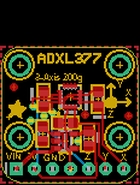
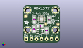
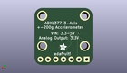
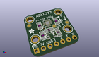

Contents
========

* [PROJ-ADAF-163-STAN-01>Adafruit Analog Accelerometers PCBs](#proj-adaf-163-stan-01adafruit-analog-accelerometers-pcbs)
	* [Images](#images)
	* [Interactive BOM](#interactive-bom)
	* [OOMP Parts](#oomp-parts)
	* [Tags](#tags)
  
![][im]
# PROJ-ADAF-163-STAN-01>Adafruit Analog Accelerometers PCBs

- ID: PROJ-ADAF-163-STAN-01
- Hex ID: PRA163
- Name: Adafruit Analog Accelerometers PCBs
- Description: 

## Images
  
  

|eagleImage|kicadPcb3dFront|kicadPcb3dBack|kicadPcb3d|
| :---: | :---: | :---: | :---: |
|||||

## Interactive BOM

- Interactive BOM page: [ibom.html](kicad/bom/ibom.html)

## OOMP Parts
  

|OOMP Parts|
| :---: |
|CAPE-0805-X-NF10-01, C1, 4.2164, -1.6256, 90,C1, 0.01uF, _0805, microbuilder, (0.166, -0.064), R90|
|CAPE-0805-X-NF10-01, C2, 7.264399999999999, -5.0546, 180,C2, 0.01uF, _0805, microbuilder, (0.286, -0.199), R180|
|CAPE-0805-X-NF10-01, C3, 11.8364, -1.7526000000000002, 90,C3, 0.01uF, _0805, microbuilder, (0.466, -0.069), R90|
|CAPE-0805-X-UNMATCHED-01, C4, 10.4394, -7.213599999999999, 270,C4, 10uF, _0805, microbuilder, (0.411, -0.284), R270|
|CAPE-0805-X-UNMATCHED-01, C5, 4.0893999999999995, -6.5786, 270,C5, 10uF, _0805, microbuilder, (0.161, -0.259), R270|
|UNMATCHED-UNMATCHED-X-UNMATCHED-01, JP2, 7.899399999999999, -11.5316, 0,JP2, 1X07_ROUND_70, microbuilder, (0.311, -0.454), R0|
|UNMATCHED-UNMATCHED-X-UNMATCHED-01, U1, 7.899399999999999, -1.3716, 90,U1, ADXL377, LFCSP16_LQ, microbuilder, (0.311, -0.054), R90|
|UNMATCHED-UNMATCHED-X-UNMATCHED-01, U2, 7.264399999999999, -7.594599999999999, 270,U2, RT9193, SOT23-5, microbuilder, (0.286, -0.299), R270|

## Tags

- hexID: PRA163
- oompType: PROJ
- oompSize: ADAF
- oompColor: 163
- oompDesc: STAN
- oompIndex: 01
- oompName: Adafruit Analog Accelerometers PCBs
- sources: All source files from https://github.com/adafruit/Adafruit-Analog-Accelerometers-PCBs (source licence details in srcLicense.md)
- linkBuyPage: http://www.adafruit.com/products/163
- oompPart: CAPE-0805-X-NF10-01, C1, 4.2164, -1.6256, 90
- oompPart: CAPE-0805-X-NF10-01, C2, 7.264399999999999, -5.0546, 180
- oompPart: CAPE-0805-X-NF10-01, C3, 11.8364, -1.7526000000000002, 90
- oompPart: CAPE-0805-X-UNMATCHED-01, C4, 10.4394, -7.213599999999999, 270
- oompPart: CAPE-0805-X-UNMATCHED-01, C5, 4.0893999999999995, -6.5786, 270
- oompPart: SKIP-UNMATCHED-X-UNMATCHED-01, FID1, 0.0, 0.0, 0
- oompPart: SKIP-UNMATCHED-X-UNMATCHED-01, FID2, 16.1544, -4.0386, 0
- oompPart: SKIP-UNMATCHED-X-UNMATCHED-01, FID3, 10.0584, -3.9115999999999995, 0
- oompPart: UNMATCHED-UNMATCHED-X-UNMATCHED-01, JP2, 7.899399999999999, -11.5316, 0
- oompPart: SKIP-UNMATCHED-X-UNMATCHED-01, U$2, 14.884399999999998, 3.0734, 0
- oompPart: SKIP-UNMATCHED-X-UNMATCHED-01, U$3, 0.9143999999999999, 3.0734, 0
- oompPart: SKIP-UNMATCHED-X-UNMATCHED-01, U$17, 0.9143999999999999, -7.086600000000001, 0
- oompPart: SKIP-UNMATCHED-X-UNMATCHED-01, U$18, 14.884399999999998, -7.086600000000001, 0
- oompPart: UNMATCHED-UNMATCHED-X-UNMATCHED-01, U1, 7.899399999999999, -1.3716, 90
- oompPart: UNMATCHED-UNMATCHED-X-UNMATCHED-01, U2, 7.264399999999999, -7.594599999999999, 270
- rawPart: C1, 0.01uF, _0805, microbuilder, (0.166, -0.064), R90
- rawPart: C2, 0.01uF, _0805, microbuilder, (0.286, -0.199), R180
- rawPart: C3, 0.01uF, _0805, microbuilder, (0.466, -0.069), R90
- rawPart: C4, 10uF, _0805, microbuilder, (0.411, -0.284), R270
- rawPart: C5, 10uF, _0805, microbuilder, (0.161, -0.259), R270
- rawPart: FID1, FIDUCIAL, FIDUCIAL_1MM, microbuilder, (0, 0), R0
- rawPart: FID2, FIDUCIAL, FIDUCIAL_1MM, microbuilder, (0.636, -0.159), R0
- rawPart: FID3, FIDUCIAL, FIDUCIAL_1MM, microbuilder, (0.396, -0.154), R0
- rawPart: JP2, 1X07_ROUND_70, microbuilder, (0.311, -0.454), R0
- rawPart: U$2, MOUNTINGHOLE2.5, MOUNTINGHOLE_2.5_PLATED, microbuilder, (0.586, 0.121), R0
- rawPart: U$3, MOUNTINGHOLE2.5, MOUNTINGHOLE_2.5_PLATED, microbuilder, (0.036, 0.121), R0
- rawPart: U$17, MOUNTINGHOLE2.5, MOUNTINGHOLE_2.5_PLATED, microbuilder, (0.036, -0.279), R0
- rawPart: U$18, MOUNTINGHOLE2.5, MOUNTINGHOLE_2.5_PLATED, microbuilder, (0.586, -0.279), R0
- rawPart: U1, ADXL377, LFCSP16_LQ, microbuilder, (0.311, -0.054), R90
- rawPart: U2, RT9193, SOT23-5, microbuilder, (0.286, -0.299), R270

[im]: kicadPcb3d_450.png
