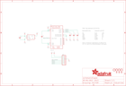

Contents
========

* [PRA163 > Adafruit](#pra163--adafruit)
	* [Schematic](#schematic)
	* [Interactive BOM](#interactive-bom)
	* [OOMP Parts](#oomp-parts)
	* [Images](#images)
	* [Tags](#tags)
  
![][im]
# PRA163 > Adafruit

- ID: PROJ-ADAF-163-STAN-01
- Hex ID: PRA163
- Name: Adafruit
- Description: Adafruit
- Long Link: [http://oom.lt/PROJ-ADAF-163-STAN-01](http://oom.lt/PROJ-ADAF-163-STAN-01)
- Short Link: [http://oom.lt/PRA163](http://oom.lt/PRA163)

## Schematic
  

## Interactive BOM

- Interactive BOM page: [ibom.html](https://htmlpreview.github.io/?https://github.com/oomlout/oomlout_OOMP_projects/blob/main/PROJ-ADAF-163-STAN-01/kicad/bom/ibom.html)

## OOMP Parts
  

|OOMP Parts|
| :---: |
|C1,CAPC-0805-X-UNMATCHED-01,C1,0.01uF,CAP_CERAMIC_0805,_0805,Ceramic Capacitors,,|
|C2,CAPC-0805-X-UNMATCHED-01,C2,0.01uF,CAP_CERAMIC_0805,_0805,Ceramic Capacitors,,|
|C3,CAPC-0805-X-UNMATCHED-01,C3,0.01uF,CAP_CERAMIC_0805,_0805,Ceramic Capacitors,,|
|C4,CAPC-0805-X-UNMATCHED-01,C4,10µF,CAP_CERAMIC_0805,_0805,Ceramic Capacitors,,|
|C5,CAPC-0805-X-UNMATCHED-01,C5,10µF,CAP_CERAMIC_0805,_0805,Ceramic Capacitors,,|
|JP2,HEAD-I01-X-PI07-01,FID1,FIDUCIAL,FIDUCIAL,FIDUCIAL_1MM,Fiducial Alignment Points,,|
|U$2,UNMATCHED-UNMATCHED-X-UNMATCHED-01,FID2,FIDUCIAL,FIDUCIAL,FIDUCIAL_1MM,Fiducial Alignment Points,,|
|U$3,UNMATCHED-UNMATCHED-X-UNMATCHED-01,FID3,FIDUCIAL,FIDUCIAL,FIDUCIAL_1MM,Fiducial Alignment Points,,|
|U$17,UNMATCHED-UNMATCHED-X-UNMATCHED-01,JP2,,HEADER-1X770MIL,1X07_ROUND_70,PIN HEADER,,|
|U$18,UNMATCHED-UNMATCHED-X-UNMATCHED-01,U$2,MOUNTINGHOLE2.5,MOUNTINGHOLE2.5,MOUNTINGHOLE_2.5_PLATED,Mounting Hole,,|
|U1,UNMATCHED-UNMATCHED-X-UNMATCHED-01,U$3,MOUNTINGHOLE2.5,MOUNTINGHOLE2.5,MOUNTINGHOLE_2.5_PLATED,Mounting Hole,,|
|U2,UNMATCHED-SO235-X-UNMATCHED-01,U$17,MOUNTINGHOLE2.5,MOUNTINGHOLE2.5,MOUNTINGHOLE_2.5_PLATED,Mounting Hole,,|

## Images
  
  

|kicadPcb3d|kicadPcb3dFront|kicadPcb3dBack|eagleImage|eagleSchemImage|
| :---: | :---: | :---: | :---: | :---: |
||||||

## Tags

- hexID: PRA163
- oompType: PROJ
- oompSize: ADAF
- oompColor: 163
- oompDesc: STAN
- oompIndex: 01
- oompName: Adafruit Analog Accelerometers PCBs
- sources: All source files from https://github.com/adafruit/Adafruit-Analog-Accelerometers-PCBs (source licence details in srcLicense.md)
- linkBuyPage: http://www.adafruit.com/products/163
- oompID: PROJ-ADAF-163-STAN-01
- oompParts: C1,CAPC-0805-X-UNMATCHED-01
- oompParts: C2,CAPC-0805-X-UNMATCHED-01
- oompParts: C3,CAPC-0805-X-UNMATCHED-01
- oompParts: C4,CAPC-0805-X-UNMATCHED-01
- oompParts: C5,CAPC-0805-X-UNMATCHED-01
- oompParts: JP2,HEAD-I01-X-PI07-01
- oompParts: U$2,UNMATCHED-UNMATCHED-X-UNMATCHED-01
- oompParts: U$3,UNMATCHED-UNMATCHED-X-UNMATCHED-01
- oompParts: U$17,UNMATCHED-UNMATCHED-X-UNMATCHED-01
- oompParts: U$18,UNMATCHED-UNMATCHED-X-UNMATCHED-01
- oompParts: U1,UNMATCHED-UNMATCHED-X-UNMATCHED-01
- oompParts: U2,UNMATCHED-SO235-X-UNMATCHED-01
- rawParts: C1,0.01uF,CAP_CERAMIC_0805,_0805,Ceramic Capacitors,,
- rawParts: C2,0.01uF,CAP_CERAMIC_0805,_0805,Ceramic Capacitors,,
- rawParts: C3,0.01uF,CAP_CERAMIC_0805,_0805,Ceramic Capacitors,,
- rawParts: C4,10µF,CAP_CERAMIC_0805,_0805,Ceramic Capacitors,,
- rawParts: C5,10µF,CAP_CERAMIC_0805,_0805,Ceramic Capacitors,,
- rawParts: FID1,FIDUCIAL,FIDUCIAL,FIDUCIAL_1MM,Fiducial Alignment Points,,
- rawParts: FID2,FIDUCIAL,FIDUCIAL,FIDUCIAL_1MM,Fiducial Alignment Points,,
- rawParts: FID3,FIDUCIAL,FIDUCIAL,FIDUCIAL_1MM,Fiducial Alignment Points,,
- rawParts: JP2,,HEADER-1X770MIL,1X07_ROUND_70,PIN HEADER,,
- rawParts: U$2,MOUNTINGHOLE2.5,MOUNTINGHOLE2.5,MOUNTINGHOLE_2.5_PLATED,Mounting Hole,,
- rawParts: U$3,MOUNTINGHOLE2.5,MOUNTINGHOLE2.5,MOUNTINGHOLE_2.5_PLATED,Mounting Hole,,
- rawParts: U$17,MOUNTINGHOLE2.5,MOUNTINGHOLE2.5,MOUNTINGHOLE_2.5_PLATED,Mounting Hole,,
- rawParts: U$18,MOUNTINGHOLE2.5,MOUNTINGHOLE2.5,MOUNTINGHOLE_2.5_PLATED,Mounting Hole,,
- rawParts: U1,ADXL377,ACCEL_ADXL377,LFCSP16_LQ,ADXL377 +/-200g 3-Axis Analog Accelerometer,,
- rawParts: U2,RT9193,VREG_SOT23-5,SOT23-5,SOT23-5 Fixed Voltage Regulators,,

[im]: kicadPcb3d_450.png
