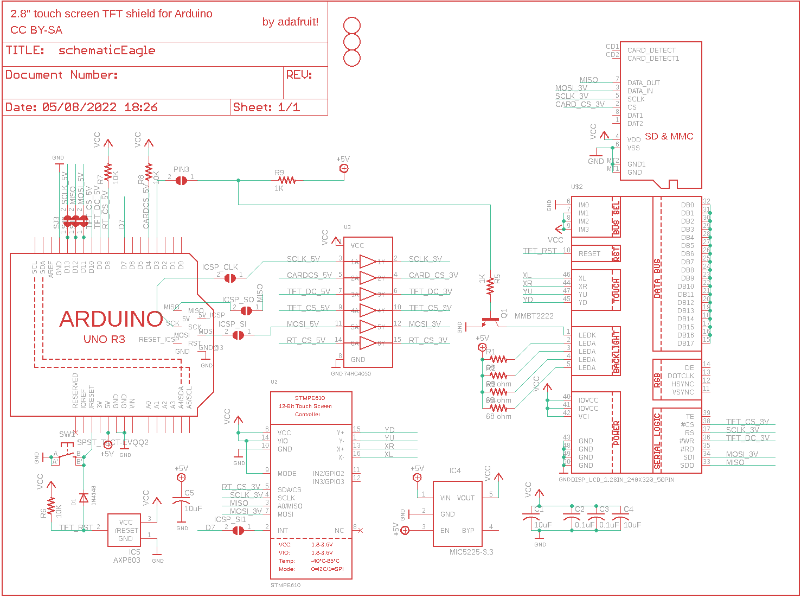

Contents
========

* [PRA1651 > Adafruit](#pra1651--adafruit)
	* [Schematic](#schematic)
	* [Interactive BOM](#interactive-bom)
	* [OOMP Parts](#oomp-parts)
	* [Images](#images)
	* [Tags](#tags)
  
![][im]
# PRA1651 > Adafruit

- ID: PROJ-ADAF-1651-STAN-01
- Hex ID: PRA1651
- Name: Adafruit
- Description: Adafruit
- Long Link: [http://oom.lt/PROJ-ADAF-1651-STAN-01](http://oom.lt/PROJ-ADAF-1651-STAN-01)
- Short Link: [http://oom.lt/PRA1651](http://oom.lt/PRA1651)

## Schematic
  

## Interactive BOM

- Interactive BOM page: [ibom.html](https://htmlpreview.github.io/?https://github.com/oomlout/oomlout_OOMP_projects/blob/main/PROJ-ADAF-1651-STAN-01/kicad/bom/ibom.html)

## OOMP Parts
  

|OOMP Parts|
| :---: |
|C1,CAPC-0805-X-UF10-V10,C1,10uF,C-USC0805K,C0805K,CAPACITOR, American symbol,,|
|C2,CAPC-0805-X-NF100-V50,C2,0.1uF,C-USC0805K,C0805K,CAPACITOR, American symbol,,|
|C3,CAPC-0805-X-NF100-V50,C3,0.1uF,C-USC0805K,C0805K,CAPACITOR, American symbol,,|
|C4,CAPC-0805-X-UF10-V10,C4,10uF,C-USC0805K,C0805K,CAPACITOR, American symbol,,|
|C5,CAPC-0805-X-UF10-V10,C5,10uF,C-USC0805K,C0805K,CAPACITOR, American symbol,,|
|D1,DIOD-S323-X-K4148-01,D1,1N4148,DIODESOD-323F,SOD-323F,Diode,,|
|IC4,VREG-SO235-X-KMIC5225-V33D,IC4,MIC5225-3.3,LP298XS,SOT23-5L,,,|
|IC5,UNMATCHED-SO23-X-UNMATCHED-01,IC5,AXP803,AXP083-SAG,SOT23,,,|
|Q1,UNMATCHED-SO23-X-UNMATCHED-01,ICSP_CLK,,SOLDERJUMPERREFLOW_NOPASTE,SOLDERJUMPER_REFLOW_NOPASTE,SMD Solder JUMPER,,|
|R1,RESE-0805-X-O61-01,ICSP_SI,,SOLDERJUMPERREFLOW_NOPASTE,SOLDERJUMPER_REFLOW_NOPASTE,SMD Solder JUMPER,,|
|R2,RESE-0805-X-UNMATCHED-01,ICSP_SI1,,SOLDERJUMPERREFLOW_NOPASTE,SOLDERJUMPER_REFLOW_NOPASTE,SMD Solder JUMPER,,|
|R3,RESE-0805-X-UNMATCHED-01,ICSP_SO,,SOLDERJUMPERREFLOW_NOPASTE,SOLDERJUMPER_REFLOW_NOPASTE,SMD Solder JUMPER,,|
|R4,RESE-0805-X-UNMATCHED-01,PIN3,,SOLDERJUMPERREFLOW_NOPASTE,SOLDERJUMPER_REFLOW_NOPASTE,SMD Solder JUMPER,,|
|R5,RESE-0805-X-O102-01,Q1,MMBT2222,MMBT2222ALT1-NPN-SOT23-BEC,SOT23-BEC,NPN Transistror,,|
|R6,RESE-0805-X-O103-01,R1,68,R-US_R0805,R0805,RESISTOR, American symbol,,|
|R7,RESE-0805-X-O103-01,R2,68 ohm,R-US_R0805,R0805,RESISTOR, American symbol,,|
|R8,RESE-0805-X-O103-01,R3,68 ohm,R-US_R0805,R0805,RESISTOR, American symbol,,|
|R9,RESE-0805-X-O102-01,R4,68 ohm,R-US_R0805,R0805,RESISTOR, American symbol,,|
|SW1,UNMATCHED-UNMATCHED-X-UNMATCHED-01,R5,1K,R-US_R0805,R0805,RESISTOR, American symbol,,|
|U$2,UNMATCHED-UNMATCHED-X-UNMATCHED-01,R6,10K,R-US_R0805,R0805,RESISTOR, American symbol,,|
|U$3,UNMATCHED-UNMATCHED-X-UNMATCHED-01,R7,10K,R-US_R0805,R0805,RESISTOR, American symbol,,|
|U$17,UNMATCHED-UNMATCHED-X-UNMATCHED-01,R8,10K,R-US_R0805,R0805,RESISTOR, American symbol,,|
|U2,UNMATCHED-UNMATCHED-X-UNMATCHED-01,R9,1K,R-US_R0805,R0805,RESISTOR, American symbol,,|
|U3,UNMATCHED-UNMATCHED-X-UNMATCHED-01,SJ1,,SOLDERJUMPER_CLOSED,SOLDERJUMPER_CLOSEDWIRE,Solder Jumper - Closed,,|

## Images
  
  

|kicadPcb3d|kicadPcb3dFront|kicadPcb3dBack|eagleImage|eagleSchemImage|
| :---: | :---: | :---: | :---: | :---: |
||||||

## Tags

- hexID: PRA1651
- oompType: PROJ
- oompSize: ADAF
- oompColor: 1651
- oompDesc: STAN
- oompIndex: 01
- oompName: Adafruit 2.8 TFT Shield v2 PCB
- sources: All source files from https://github.com/adafruit/Adafruit-2.8-TFT-Shield-v2-PCB (source licence details in srcLicense.md)
- linkBuyPage: http://www.adafruit.com/products/1651
- oompID: PROJ-ADAF-1651-STAN-01
- oompParts: C1,CAPC-0805-X-UF10-V10
- oompParts: C2,CAPC-0805-X-NF100-V50
- oompParts: C3,CAPC-0805-X-NF100-V50
- oompParts: C4,CAPC-0805-X-UF10-V10
- oompParts: C5,CAPC-0805-X-UF10-V10
- oompParts: D1,DIOD-S323-X-K4148-01
- oompParts: IC4,VREG-SO235-X-KMIC5225-V33D
- oompParts: IC5,UNMATCHED-SO23-X-UNMATCHED-01
- oompParts: Q1,UNMATCHED-SO23-X-UNMATCHED-01
- oompParts: R1,RESE-0805-X-O61-01
- oompParts: R2,RESE-0805-X-UNMATCHED-01
- oompParts: R3,RESE-0805-X-UNMATCHED-01
- oompParts: R4,RESE-0805-X-UNMATCHED-01
- oompParts: R5,RESE-0805-X-O102-01
- oompParts: R6,RESE-0805-X-O103-01
- oompParts: R7,RESE-0805-X-O103-01
- oompParts: R8,RESE-0805-X-O103-01
- oompParts: R9,RESE-0805-X-O102-01
- oompParts: SW1,UNMATCHED-UNMATCHED-X-UNMATCHED-01
- oompParts: U$2,UNMATCHED-UNMATCHED-X-UNMATCHED-01
- oompParts: U$3,UNMATCHED-UNMATCHED-X-UNMATCHED-01
- oompParts: U$17,UNMATCHED-UNMATCHED-X-UNMATCHED-01
- oompParts: U2,UNMATCHED-UNMATCHED-X-UNMATCHED-01
- oompParts: U3,UNMATCHED-UNMATCHED-X-UNMATCHED-01
- rawParts: C1,10uF,C-USC0805K,C0805K,CAPACITOR, American symbol,,
- rawParts: C2,0.1uF,C-USC0805K,C0805K,CAPACITOR, American symbol,,
- rawParts: C3,0.1uF,C-USC0805K,C0805K,CAPACITOR, American symbol,,
- rawParts: C4,10uF,C-USC0805K,C0805K,CAPACITOR, American symbol,,
- rawParts: C5,10uF,C-USC0805K,C0805K,CAPACITOR, American symbol,,
- rawParts: D1,1N4148,DIODESOD-323F,SOD-323F,Diode,,
- rawParts: IC4,MIC5225-3.3,LP298XS,SOT23-5L,,,
- rawParts: IC5,AXP803,AXP083-SAG,SOT23,,,
- rawParts: ICSP_CLK,,SOLDERJUMPERREFLOW_NOPASTE,SOLDERJUMPER_REFLOW_NOPASTE,SMD Solder JUMPER,,
- rawParts: ICSP_SI,,SOLDERJUMPERREFLOW_NOPASTE,SOLDERJUMPER_REFLOW_NOPASTE,SMD Solder JUMPER,,
- rawParts: ICSP_SI1,,SOLDERJUMPERREFLOW_NOPASTE,SOLDERJUMPER_REFLOW_NOPASTE,SMD Solder JUMPER,,
- rawParts: ICSP_SO,,SOLDERJUMPERREFLOW_NOPASTE,SOLDERJUMPER_REFLOW_NOPASTE,SMD Solder JUMPER,,
- rawParts: PIN3,,SOLDERJUMPERREFLOW_NOPASTE,SOLDERJUMPER_REFLOW_NOPASTE,SMD Solder JUMPER,,
- rawParts: Q1,MMBT2222,MMBT2222ALT1-NPN-SOT23-BEC,SOT23-BEC,NPN Transistror,,
- rawParts: R1,68,R-US_R0805,R0805,RESISTOR, American symbol,,
- rawParts: R2,68 ohm,R-US_R0805,R0805,RESISTOR, American symbol,,
- rawParts: R3,68 ohm,R-US_R0805,R0805,RESISTOR, American symbol,,
- rawParts: R4,68 ohm,R-US_R0805,R0805,RESISTOR, American symbol,,
- rawParts: R5,1K,R-US_R0805,R0805,RESISTOR, American symbol,,
- rawParts: R6,10K,R-US_R0805,R0805,RESISTOR, American symbol,,
- rawParts: R7,10K,R-US_R0805,R0805,RESISTOR, American symbol,,
- rawParts: R8,10K,R-US_R0805,R0805,RESISTOR, American symbol,,
- rawParts: R9,1K,R-US_R0805,R0805,RESISTOR, American symbol,,
- rawParts: SJ1,,SOLDERJUMPER_CLOSED,SOLDERJUMPER_CLOSEDWIRE,Solder Jumper - Closed,,
- rawParts: SJ2,,SOLDERJUMPER_CLOSED,SOLDERJUMPER_CLOSEDWIRE,Solder Jumper - Closed,,
- rawParts: SJ3,,SOLDERJUMPER_CLOSED,SOLDERJUMPER_CLOSEDWIRE,Solder Jumper - Closed,,
- rawParts: SW1,SPST_TACT-EVQQ2,SPST_TACT-EVQQ2,EVQ-Q2,SMT 6mm switch, EVQQ2 series,,
- rawParts: U$2,DISP_LCD_1.28IN_240X320_50PIN,DISP_LCD_1.28IN_240X320_50PIN,TFT_2.83IN_240X320_50PIN,,,
- rawParts: U$3,MICROSD,MICROSD,MICROSD,Micro-SD / Transflash card holder with SPI pinout,,
- rawParts: U$10,FIDUCIAL,FIDUCIAL,FIDUCIAL_1MM,For use by pick and place machines to calibrate the vision/machine, 1mm,,
- rawParts: U$11,FIDUCIAL,FIDUCIAL,FIDUCIAL_1MM,For use by pick and place machines to calibrate the vision/machine, 1mm,,
- rawParts: U$17,ARDUINO_R3_ICSPSMT,ARDUINO_R3_ICSPSMT,ARDUINOR3_ICSP_SMT,,,
- rawParts: U$19,FIDUCIAL,FIDUCIAL,FIDUCIAL_1MM,For use by pick and place machines to calibrate the vision/machine, 1mm,,
- rawParts: U2,STMPE610,STMPE610,QFN16_3MM,STMPE610 - 12-Bit Touch Screen Controller,,
- rawParts: U3,74HC4050,74HC4050D,SOIC16,6-channel level shifter,,

[im]: kicadPcb3d_450.png
