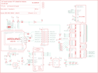

Contents
========

* [PRA1651 > Adafruit](#pra1651--adafruit)
	* [Images](#images)
	* [Tags](#tags)
  
![][im]
# PRA1651 > Adafruit

- ID: PROJ-ADAF-1651-STAN-01
- Hex ID: PRA1651
- Name: Adafruit
- Description: Adafruit

## Images
  
  

|kicadPcb3d|kicadPcb3dFront|kicadPcb3dBack|eagleImage|eagleSchemImage|
| :---: | :---: | :---: | :---: | :---: |
||||||

## Tags

- hexID: PRA1651
- oompType: PROJ
- oompSize: ADAF
- oompColor: 1651
- oompDesc: STAN
- oompIndex: 01
- oompName: Adafruit 2.8 TFT Shield v2 PCB
- sources: All source files from https://github.com/adafruit/Adafruit-2.8-TFT-Shield-v2-PCB (source licence details in srcLicense.md)
- linkBuyPage: http://www.adafruit.com/products/1651
- oompID: PROJ-ADAF-1651-STAN-01
- oompParts: C1,UNMATCHED-UNMATCHED-UNMATCHED-UNMATCHED-UNMATCHED
- oompParts: C2,UNMATCHED-UNMATCHED-UNMATCHED-UNMATCHED-UNMATCHED
- oompParts: C3,UNMATCHED-UNMATCHED-UNMATCHED-UNMATCHED-UNMATCHED
- oompParts: C4,UNMATCHED-UNMATCHED-UNMATCHED-UNMATCHED-UNMATCHED
- oompParts: C5,UNMATCHED-UNMATCHED-UNMATCHED-UNMATCHED-UNMATCHED
- oompParts: D1,UNMATCHED-UNMATCHED-UNMATCHED-UNMATCHED-UNMATCHED
- oompParts: IC4,UNMATCHED-UNMATCHED-UNMATCHED-UNMATCHED-UNMATCHED
- oompParts: IC5,UNMATCHED-UNMATCHED-UNMATCHED-UNMATCHED-UNMATCHED
- oompParts: ICSP_CLK,UNMATCHED-UNMATCHED-UNMATCHED-UNMATCHED-UNMATCHED
- oompParts: ICSP_SI,UNMATCHED-UNMATCHED-UNMATCHED-UNMATCHED-UNMATCHED
- oompParts: ICSP_SI1,UNMATCHED-UNMATCHED-UNMATCHED-UNMATCHED-UNMATCHED
- oompParts: ICSP_SO,UNMATCHED-UNMATCHED-UNMATCHED-UNMATCHED-UNMATCHED
- oompParts: PIN3,UNMATCHED-UNMATCHED-UNMATCHED-UNMATCHED-UNMATCHED
- oompParts: Q1,UNMATCHED-UNMATCHED-UNMATCHED-UNMATCHED-UNMATCHED
- oompParts: R1,UNMATCHED-UNMATCHED-UNMATCHED-UNMATCHED-UNMATCHED
- oompParts: R2,UNMATCHED-UNMATCHED-UNMATCHED-UNMATCHED-UNMATCHED
- oompParts: R3,UNMATCHED-UNMATCHED-UNMATCHED-UNMATCHED-UNMATCHED
- oompParts: R4,UNMATCHED-UNMATCHED-UNMATCHED-UNMATCHED-UNMATCHED
- oompParts: R5,UNMATCHED-UNMATCHED-UNMATCHED-UNMATCHED-UNMATCHED
- oompParts: R6,UNMATCHED-UNMATCHED-UNMATCHED-UNMATCHED-UNMATCHED
- oompParts: R7,UNMATCHED-UNMATCHED-UNMATCHED-UNMATCHED-UNMATCHED
- oompParts: R8,UNMATCHED-UNMATCHED-UNMATCHED-UNMATCHED-UNMATCHED
- oompParts: R9,UNMATCHED-UNMATCHED-UNMATCHED-UNMATCHED-UNMATCHED
- oompParts: SJ1,UNMATCHED-UNMATCHED-UNMATCHED-UNMATCHED-UNMATCHED
- oompParts: SJ2,UNMATCHED-UNMATCHED-UNMATCHED-UNMATCHED-UNMATCHED
- oompParts: SJ3,UNMATCHED-UNMATCHED-UNMATCHED-UNMATCHED-UNMATCHED
- oompParts: SW1,UNMATCHED-UNMATCHED-UNMATCHED-UNMATCHED-UNMATCHED
- oompParts: U$2,UNMATCHED-UNMATCHED-UNMATCHED-UNMATCHED-UNMATCHED
- oompParts: U$3,UNMATCHED-UNMATCHED-UNMATCHED-UNMATCHED-UNMATCHED
- oompParts: U$17,UNMATCHED-UNMATCHED-UNMATCHED-UNMATCHED-UNMATCHED
- oompParts: U2,UNMATCHED-UNMATCHED-UNMATCHED-UNMATCHED-UNMATCHED
- oompParts: U3,UNMATCHED-UNMATCHED-UNMATCHED-UNMATCHED-UNMATCHED
- rawParts: C1,10uF,C-USC0805K,C0805K,CAPACITOR, American symbol,,
- rawParts: C2,0.1uF,C-USC0805K,C0805K,CAPACITOR, American symbol,,
- rawParts: C3,0.1uF,C-USC0805K,C0805K,CAPACITOR, American symbol,,
- rawParts: C4,10uF,C-USC0805K,C0805K,CAPACITOR, American symbol,,
- rawParts: C5,10uF,C-USC0805K,C0805K,CAPACITOR, American symbol,,
- rawParts: D1,1N4148,DIODESOD-323F,SOD-323F,Diode,,
- rawParts: IC4,MIC5225-3.3,LP298XS,SOT23-5L,,,
- rawParts: IC5,AXP803,AXP083-SAG,SOT23,,,
- rawParts: ICSP_CLK,,SOLDERJUMPERREFLOW_NOPASTE,SOLDERJUMPER_REFLOW_NOPASTE,SMD Solder JUMPER,,
- rawParts: ICSP_SI,,SOLDERJUMPERREFLOW_NOPASTE,SOLDERJUMPER_REFLOW_NOPASTE,SMD Solder JUMPER,,
- rawParts: ICSP_SI1,,SOLDERJUMPERREFLOW_NOPASTE,SOLDERJUMPER_REFLOW_NOPASTE,SMD Solder JUMPER,,
- rawParts: ICSP_SO,,SOLDERJUMPERREFLOW_NOPASTE,SOLDERJUMPER_REFLOW_NOPASTE,SMD Solder JUMPER,,
- rawParts: PIN3,,SOLDERJUMPERREFLOW_NOPASTE,SOLDERJUMPER_REFLOW_NOPASTE,SMD Solder JUMPER,,
- rawParts: Q1,MMBT2222,MMBT2222ALT1-NPN-SOT23-BEC,SOT23-BEC,NPN Transistror,,
- rawParts: R1,68,R-US_R0805,R0805,RESISTOR, American symbol,,
- rawParts: R2,68 ohm,R-US_R0805,R0805,RESISTOR, American symbol,,
- rawParts: R3,68 ohm,R-US_R0805,R0805,RESISTOR, American symbol,,
- rawParts: R4,68 ohm,R-US_R0805,R0805,RESISTOR, American symbol,,
- rawParts: R5,1K,R-US_R0805,R0805,RESISTOR, American symbol,,
- rawParts: R6,10K,R-US_R0805,R0805,RESISTOR, American symbol,,
- rawParts: R7,10K,R-US_R0805,R0805,RESISTOR, American symbol,,
- rawParts: R8,10K,R-US_R0805,R0805,RESISTOR, American symbol,,
- rawParts: R9,1K,R-US_R0805,R0805,RESISTOR, American symbol,,
- rawParts: SJ1,,SOLDERJUMPER_CLOSED,SOLDERJUMPER_CLOSEDWIRE,Solder Jumper - Closed,,
- rawParts: SJ2,,SOLDERJUMPER_CLOSED,SOLDERJUMPER_CLOSEDWIRE,Solder Jumper - Closed,,
- rawParts: SJ3,,SOLDERJUMPER_CLOSED,SOLDERJUMPER_CLOSEDWIRE,Solder Jumper - Closed,,
- rawParts: SW1,SPST_TACT-EVQQ2,SPST_TACT-EVQQ2,EVQ-Q2,SMT 6mm switch, EVQQ2 series,,
- rawParts: U$2,DISP_LCD_1.28IN_240X320_50PIN,DISP_LCD_1.28IN_240X320_50PIN,TFT_2.83IN_240X320_50PIN,,,
- rawParts: U$3,MICROSD,MICROSD,MICROSD,Micro-SD / Transflash card holder with SPI pinout,,
- rawParts: U$10,FIDUCIAL,FIDUCIAL,FIDUCIAL_1MM,For use by pick and place machines to calibrate the vision/machine, 1mm,,
- rawParts: U$11,FIDUCIAL,FIDUCIAL,FIDUCIAL_1MM,For use by pick and place machines to calibrate the vision/machine, 1mm,,
- rawParts: U$17,ARDUINO_R3_ICSPSMT,ARDUINO_R3_ICSPSMT,ARDUINOR3_ICSP_SMT,,,
- rawParts: U$19,FIDUCIAL,FIDUCIAL,FIDUCIAL_1MM,For use by pick and place machines to calibrate the vision/machine, 1mm,,
- rawParts: U2,STMPE610,STMPE610,QFN16_3MM,STMPE610 - 12-Bit Touch Screen Controller,,
- rawParts: U3,74HC4050,74HC4050D,SOIC16,6-channel level shifter,,

[im]: kicadPcb3d_450.png
