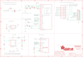

Contents
========

* [PRA1673 > Adafruit](#pra1673--adafruit)
	* [Schematic](#schematic)
	* [Interactive BOM](#interactive-bom)
	* [OOMP Parts](#oomp-parts)
	* [Images](#images)
	* [Tags](#tags)
  
![][im]
# PRA1673 > Adafruit

- ID: PROJ-ADAF-1673-STAN-01
- Hex ID: PRA1673
- Name: Adafruit
- Description: Adafruit
- Long Link: [http://oom.lt/PROJ-ADAF-1673-STAN-01](http://oom.lt/PROJ-ADAF-1673-STAN-01)
- Short Link: [http://oom.lt/PRA1673](http://oom.lt/PRA1673)

## Schematic
  

## Interactive BOM

- Interactive BOM page: [ibom.html](https://htmlpreview.github.io/?https://github.com/oomlout/oomlout_OOMP_projects/blob/main/PROJ-ADAF-1673-STAN-01/kicad/bom/ibom.html)

## OOMP Parts
  

|OOMP Parts|
| :---: |
|C1,CAPC-0805-X-UNMATCHED-01,C1,10uF/16V,CAP_CERAMIC_0805MP,_0805MP,Ceramic Capacitors,,|
|C2,CAPC-0805-X-UNMATCHED-01,C2,10uF/16V,CAP_CERAMIC_0805MP,_0805MP,Ceramic Capacitors,,|
|C3,CAPC-0805-X-UNMATCHED-01,C3,1.0uF,CAP_CERAMIC_0805MP,_0805MP,Ceramic Capacitors,,|
|C4,CAPC-0805-X-UNMATCHED-01,C4,1.0uF,CAP_CERAMIC_0805MP,_0805MP,Ceramic Capacitors,,|
|C5,CAPC-0805-X-UF10-V10,C5,10uF,CAP_CERAMIC_0805MP,_0805MP,Ceramic Capacitors,,|
|C6,CAPC-0805-X-UF10-V10,C6,10uF,CAP_CERAMIC_0805MP,_0805MP,Ceramic Capacitors,,|
|C7,CAPC-0805-X-UF10-V10,C7,10uF,CAP_CERAMIC_0805MP,_0805MP,Ceramic Capacitors,,|
|C8,CAPC-0805-X-NF100-V50,C8,0.1uF,CAP_CERAMIC_0805MP,_0805MP,Ceramic Capacitors,,|
|C9,CAPC-0805-X-UF10-V10,C9,10uF,CAP_CERAMIC_0805MP,_0805MP,Ceramic Capacitors,,|
|CN1,UNMATCHED-UNMATCHED-X-UNMATCHED-01,CN1,microSD,MICROSD,MICROSD,MicroSD/Transflash Card Holder with SPI pinout,,|
|D1,DIOD-S323-X-K4148-01,D1,1N4148,DIODESOD-323,SOD-323,Diode,,|
|D2,DIOD-UNMATCHED-X-UNMATCHED-01,D2,BAT54T1G,DIODESOD-123,SOD-123,Diode,,|
|D3,DIOD-S323-X-K4148-01,D3,1N4148,DIODESOD-323,SOD-323,Diode,,|
|JP1,HEAD-I01-X-PI11-01,JP1,,HEADER-1X11,1X11_ROUND,,,|
|L1,UNMATCHED-UNMATCHED-X-UNMATCHED-01,L1,10uH,INDUCTOR,INDUCTOR_1007,Inductors,,|
|R4,RESE-0805-X-O6003-01,R4,600K,RESISTOR_0805MP,_0805MP,Resistors,,|
|R5,RESE-0805-X-O51-01,R5,50,RESISTOR_0805MP,_0805MP,Resistors,,|
|R6,RESE-0805-X-O1003-01,R6,100K,RESISTOR_0805MP,_0805MP,Resistors,,|
|R7,RESE-0805-X-O103-01,R7,10K,RESISTOR_0805MP,_0805MP,Resistors,,|
|R8,RESE-0805-X-O103-01,R8,10K,RESISTOR_0805MP,_0805MP,Resistors,,|
|U1,UNMATCHED-UNMATCHED-X-UNMATCHED-01,SJ1,BS0,SOLDERJUMPERREFLOW_NOPASTE,SOLDERJUMPER_REFLOW_NOPASTE,SMD Solder JUMPER,,|
|U2,VREG-SO235-X-KMIC5225-V33D,U$22,MOUNTINGHOLE2.5,MOUNTINGHOLE2.5,MOUNTINGHOLE_2.5_PLATED,Mounting Hole,EXCLUDE,|
|U3,UNMATCHED-SO235-X-UNMATCHED-01,U$23,MOUNTINGHOLE2.5,MOUNTINGHOLE2.5,MOUNTINGHOLE_2.5_PLATED,Mounting Hole,EXCLUDE,|
|U4,UNMATCHED-UNMATCHED-X-UNMATCHED-01,U$24,MOUNTINGHOLE2.5,MOUNTINGHOLE2.5,MOUNTINGHOLE_2.5_PLATED,Mounting Hole,EXCLUDE,|

## Images
  
  

|kicadPcb3d|kicadPcb3dFront|kicadPcb3dBack|eagleImage|eagleSchemImage|
| :---: | :---: | :---: | :---: | :---: |
||||||

## Tags

- hexID: PRA1673
- oompType: PROJ
- oompSize: ADAF
- oompColor: 1673
- oompDesc: STAN
- oompIndex: 01
- oompName: Adafruit 1.27inch Color OLED Breakout PCB
- sources: All source files from https://github.com/adafruit/Adafruit-1.27inch-Color-OLED-Breakout-PCB (source licence details in srcLicense.md)
- linkBuyPage: http://www.adafruit.com/products/1673
- oompID: PROJ-ADAF-1673-STAN-01
- oompParts: C1,CAPC-0805-X-UNMATCHED-01
- oompParts: C2,CAPC-0805-X-UNMATCHED-01
- oompParts: C3,CAPC-0805-X-UNMATCHED-01
- oompParts: C4,CAPC-0805-X-UNMATCHED-01
- oompParts: C5,CAPC-0805-X-UF10-V10
- oompParts: C6,CAPC-0805-X-UF10-V10
- oompParts: C7,CAPC-0805-X-UF10-V10
- oompParts: C8,CAPC-0805-X-NF100-V50
- oompParts: C9,CAPC-0805-X-UF10-V10
- oompParts: CN1,UNMATCHED-UNMATCHED-X-UNMATCHED-01
- oompParts: D1,DIOD-S323-X-K4148-01
- oompParts: D2,DIOD-UNMATCHED-X-UNMATCHED-01
- oompParts: D3,DIOD-S323-X-K4148-01
- oompParts: JP1,HEAD-I01-X-PI11-01
- oompParts: L1,UNMATCHED-UNMATCHED-X-UNMATCHED-01
- oompParts: R4,RESE-0805-X-O6003-01
- oompParts: R5,RESE-0805-X-O51-01
- oompParts: R6,RESE-0805-X-O1003-01
- oompParts: R7,RESE-0805-X-O103-01
- oompParts: R8,RESE-0805-X-O103-01
- oompParts: U1,UNMATCHED-UNMATCHED-X-UNMATCHED-01
- oompParts: U2,VREG-SO235-X-KMIC5225-V33D
- oompParts: U3,UNMATCHED-SO235-X-UNMATCHED-01
- oompParts: U4,UNMATCHED-UNMATCHED-X-UNMATCHED-01
- rawParts: C1,10uF/16V,CAP_CERAMIC_0805MP,_0805MP,Ceramic Capacitors,,
- rawParts: C2,10uF/16V,CAP_CERAMIC_0805MP,_0805MP,Ceramic Capacitors,,
- rawParts: C3,1.0uF,CAP_CERAMIC_0805MP,_0805MP,Ceramic Capacitors,,
- rawParts: C4,1.0uF,CAP_CERAMIC_0805MP,_0805MP,Ceramic Capacitors,,
- rawParts: C5,10uF,CAP_CERAMIC_0805MP,_0805MP,Ceramic Capacitors,,
- rawParts: C6,10uF,CAP_CERAMIC_0805MP,_0805MP,Ceramic Capacitors,,
- rawParts: C7,10uF,CAP_CERAMIC_0805MP,_0805MP,Ceramic Capacitors,,
- rawParts: C8,0.1uF,CAP_CERAMIC_0805MP,_0805MP,Ceramic Capacitors,,
- rawParts: C9,10uF,CAP_CERAMIC_0805MP,_0805MP,Ceramic Capacitors,,
- rawParts: CN1,microSD,MICROSD,MICROSD,MicroSD/Transflash Card Holder with SPI pinout,,
- rawParts: D1,1N4148,DIODESOD-323,SOD-323,Diode,,
- rawParts: D2,BAT54T1G,DIODESOD-123,SOD-123,Diode,,
- rawParts: D3,1N4148,DIODESOD-323,SOD-323,Diode,,
- rawParts: JP1,,HEADER-1X11,1X11_ROUND,,,
- rawParts: L1,10uH,INDUCTOR,INDUCTOR_1007,Inductors,,
- rawParts: R4,600K,RESISTOR_0805MP,_0805MP,Resistors,,
- rawParts: R5,50,RESISTOR_0805MP,_0805MP,Resistors,,
- rawParts: R6,100K,RESISTOR_0805MP,_0805MP,Resistors,,
- rawParts: R7,10K,RESISTOR_0805MP,_0805MP,Resistors,,
- rawParts: R8,10K,RESISTOR_0805MP,_0805MP,Resistors,,
- rawParts: SJ1,BS0,SOLDERJUMPERREFLOW_NOPASTE,SOLDERJUMPER_REFLOW_NOPASTE,SMD Solder JUMPER,,
- rawParts: U$22,MOUNTINGHOLE2.5,MOUNTINGHOLE2.5,MOUNTINGHOLE_2.5_PLATED,Mounting Hole,EXCLUDE,
- rawParts: U$23,MOUNTINGHOLE2.5,MOUNTINGHOLE2.5,MOUNTINGHOLE_2.5_PLATED,Mounting Hole,EXCLUDE,
- rawParts: U$24,MOUNTINGHOLE2.5,MOUNTINGHOLE2.5,MOUNTINGHOLE_2.5_PLATED,Mounting Hole,EXCLUDE,
- rawParts: U$25,MOUNTINGHOLE2.5,MOUNTINGHOLE2.5,MOUNTINGHOLE_2.5_PLATED,Mounting Hole,EXCLUDE,
- rawParts: U$26,FIDUCIAL,FIDUCIAL,FIDUCIAL_1MM,For use by pick and place machines to calibrate the vision/machine, 1mm,,
- rawParts: U$27,FIDUCIAL,FIDUCIAL,FIDUCIAL_1MM,For use by pick and place machines to calibrate the vision/machine, 1mm,,
- rawParts: U$29,FIDUCIAL,FIDUCIAL,FIDUCIAL_1MM,For use by pick and place machines to calibrate the vision/machine, 1mm,,
- rawParts: U1,UG-2828GDEDF11,DISP_OLED_UG-2896GDEAF11TOP,FPC_XF2M-3015-1A,128x96 1.27 RGB OLED - UG-2896GDEAF11,,
- rawParts: U2,MIC5225-3.3v,VREG_SOT23-5,SOT23-5,SOT23-5 Fixed Voltage Regulators,,
- rawParts: U3,FAN5331SX,FAN5331,SOT23-5@1,FAN5331 - LED/OLED 20V Boost Converter,,
- rawParts: U4,74HC4050D,74HC4050D,SOIC16,6-channel level shifter,,

[im]: kicadPcb3d_450.png
