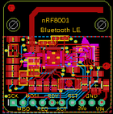
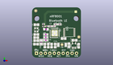
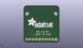
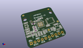

Contents
========

* [PROJ-ADAF-1697-STAN-01>Adafruit Bluefruit LE nRF8001 PCB](#proj-adaf-1697-stan-01adafruit-bluefruit-le-nrf8001-pcb)
	* [Images](#images)
	* [Interactive BOM](#interactive-bom)
	* [OOMP Parts](#oomp-parts)
	* [Tags](#tags)
  
![][im]
# PROJ-ADAF-1697-STAN-01>Adafruit Bluefruit LE nRF8001 PCB

- ID: PROJ-ADAF-1697-STAN-01
- Hex ID: PRA1697
- Name: Adafruit Bluefruit LE nRF8001 PCB
- Description: 

## Images
  
  

|eagleImage|kicadPcb3dFront|kicadPcb3dBack|kicadPcb3d|
| :---: | :---: | :---: | :---: |
|||||

## Interactive BOM

- Interactive BOM page: [ibom.html](kicad/bom/ibom.html)

## OOMP Parts
  

|OOMP Parts|
| :---: |
|CAPE-0805-X-UNMATCHED-01, C1, 2.4509999239999996, 13.439599993999998, 180,C1, 15pF, 0805-NO, microbuilder, (0.09649606, 0.52911811), R180|
|CAPE-0805-X-UNMATCHED-01, C2, 2.529400072, 19.123600056, 0,C2, 15pF, 0805-NO, microbuilder, (0.09958268, 0.75289764), R0|
|CAPE-0402-X-NF22D-01, C3, 15.75299999, 19.32899995, 0,C3, 2.2nF, _0402, microbuilder, (0.62019685, 0.76098425), R0|
|CAPE-0805-X-NF100-01, C4, 2.3810000639999997, 9.881199947999999, 180,C4, 0.1uF, 0805-NO, microbuilder, (0.09374016, 0.38902362), R180|
|CAPE-0402-X-UNMATCHED-01, C5, 8.353000058, 18.201999918, 0,C5, 1.8pF, _0402MP, microbuilder, (0.32885827, 0.71661417), R0|
|CAPE-0402-X-UNMATCHED-01, C6, 6.5530001019999995, 18.201999918, 0,C6, 1.2pF, _0402MP, microbuilder, (0.25799213, 0.71661417), R0|
|CAPE-0805-X-UNMATCHED-01, C7, 2.3810000639999997, 11.651199964, 180,C7, 1uF, 0805-NO, microbuilder, (0.09374016, 0.45870866), R180|
|CAPE-0603-X-UNMATCHED-01, C8, 7.876999993999999, 13.451800121999998, 180,C8, 1nF, _0603, microbuilder, (0.31011811, 0.52959843), R180|
|CAPE-0805-X-UNMATCHED-01, C9, 7.326000079999999, 7.027200067999999, 270,C9, 10uF, 0805-NO, microbuilder, (0.2884252, 0.27666142), R270|
|CAPE-0805-X-NF100-01, C10, 9.264000013999999, 7.0008000699999995, 270,C10, 0.1uF, 0805-NO, microbuilder, (0.36472441, 0.27562205), R270|
|CAPE-0805-X-UNMATCHED-01, C11, 11.161000029999999, 7.0008000699999995, 270,C11, 33nF, 0805-NO, microbuilder, (0.43940945, 0.27562205), R270|
|CAPE-0805-X-NF100-01, C12, 18.019599978, 11.098399952, 0,C12, 0.1uF, 0805-NO, microbuilder, (0.70943307, 0.43694488), R0|
|CAPE-0805-X-UNMATCHED-01, C13, 21.1082001, 7.238400051999999, 90,C13, 15pF, 0805-NO, microbuilder, (0.8310315, 0.28497638), R90|
|CAPE-0805-X-UNMATCHED-01, C14, 13.212800092, 7.003999961999999, 90,C14, 15pF, 0805-NO, microbuilder, (0.52018898, 0.27574803), R90|
|CAPE-0402-X-UNMATCHED-01, C15, 6.5530001019999995, 19.402000058, 0,C15, 1.5pF, _0402MP, microbuilder, (0.25799213, 0.76385827), R0|
|CAPE-0805-X-UNMATCHED-01, C16, 26.619799947999997, 6.942399882, 90,C16, 10uF, 0805-NO, microbuilder, (1.04802362, 0.27332283), R90|
|CAPE-0805-X-UNMATCHED-01, C17, 24.298999916, 10.100000119999999, 0,C17, 10uF, 0805-NO, microbuilder, (0.95665354, 0.3976378), R0|
|UNMATCHED-0805-X-UNMATCHED-01, FB1, 5.250800013999999, 8.985000064, 90,FB1, MMZ1608B121C, 0805, microbuilder, (0.20672441, 0.35374016), R90|
|UNMATCHED-UNMATCHED-X-UNMATCHED-01, JP1, 13.97, 2.54, 0,JP1, 1X10_ROUND70, microbuilder, (0.55, 0.1), R0|
|UNMATCHED-0402-X-UNMATCHED-01, L1, 12.452999985999998, 18.201999918, 180,L1, 8.2nH, _0402, microbuilder, (0.49027559, 0.71661417), R180|
|UNMATCHED-0402-X-UNMATCHED-01, L2, 13.453000017999997, 19.32899995, 0,L2, 5.6nH, _0402, microbuilder, (0.52964567, 0.76098425), R0|
|UNMATCHED-0402-X-UNMATCHED-01, L3, 10.325999922, 18.201999918, 180,L3, 3.9nH, _0402, microbuilder, (0.40653543, 0.71661417), R180|
|UNMATCHED-0603-X-UNMATCHED-01, L4, 7.886199873999999, 10.148000024, 180,L4, 10uH, _0603, microbuilder, (0.31048031, 0.39952756), R180|
|UNMATCHED-0603-X-UNMATCHED-01, L5, 7.886199873999999, 11.791000039999998, 0,L5, 15nH, _0603, microbuilder, (0.31048031, 0.4642126), R0|
|<table><tr><td></td><td> R1</td><td>[RESE-0805-X-O223-01 SMD (0805) 22k Ohm Resistor](https://github.com/oomlout/oomlout_OOMP_parts/tree/main/RESE-0805-X-O223-01/)</td><td>[R85223](https://github.com/oomlout/oomlout_OOMP_parts/tree/main/RESE-0805-X-O223-01/)</td></tr></table>|
|<table><tr><td></td><td> R2</td><td>[RESE-0805-X-O103-01 SMD (0805) 10k Ohm Resistor](https://github.com/oomlout/oomlout_OOMP_parts/tree/main/RESE-0805-X-O103-01/)</td><td>[R85103](https://github.com/oomlout/oomlout_OOMP_parts/tree/main/RESE-0805-X-O103-01/)</td></tr></table>|
|UNMATCHED-UNMATCHED-X-UNMATCHED-01, U1, 12.922000063999999, 14.227800094, 90,U1, nRF8001, QFN32_5MM, microbuilder, (0.50874016, 0.56014961), R90|
|UNMATCHED-UNMATCHED-X-UNMATCHED-01, U2, 23.966400124, 7.03160011, 0,U2, MIC5225-3.3v, SOT23-5, microbuilder, (0.94355906, 0.27683465), R0|
|UNMATCHED-UNMATCHED-X-UNMATCHED-01, U3, 21.26939993, 14.670200022, 270,U3, 74HC4050D, TSSOP16, microbuilder, (0.83737795, 0.57756693), R270|
|UNMATCHED-UNMATCHED-X-UNMATCHED-01, Y1, 2.427200124, 16.150999956, 270,Y1, 16MHz, CRYSTAL_2.5X2, microbuilder, (0.09555906, 0.63586614), R270|
|ERROR, Y2 FC-255 32.7680K-A3, 0, 0, 0,Y2, FC-255, 32.7680K-A3, CRYSTAL_4.9X1.8, microbuilder, (0.67515748, 0.29308661), R180|

## Tags

- hexID: PRA1697
- oompType: PROJ
- oompSize: ADAF
- oompColor: 1697
- oompDesc: STAN
- oompIndex: 01
- oompName: Adafruit Bluefruit LE nRF8001 PCB
- sources: All source files from https://github.com/adafruit/Adafruit-Bluefruit-LE-nRF8001-PCB (source licence details in srcLicense.md)
- linkBuyPage: http://www.adafruit.com/products/1697
- oompPart: CAPE-0805-X-UNMATCHED-01, C1, 2.4509999239999996, 13.439599993999998, 180
- oompPart: CAPE-0805-X-UNMATCHED-01, C2, 2.529400072, 19.123600056, 0
- oompPart: CAPE-0402-X-NF22D-01, C3, 15.75299999, 19.32899995, 0
- oompPart: CAPE-0805-X-NF100-01, C4, 2.3810000639999997, 9.881199947999999, 180
- oompPart: CAPE-0402-X-UNMATCHED-01, C5, 8.353000058, 18.201999918, 0
- oompPart: CAPE-0402-X-UNMATCHED-01, C6, 6.5530001019999995, 18.201999918, 0
- oompPart: CAPE-0805-X-UNMATCHED-01, C7, 2.3810000639999997, 11.651199964, 180
- oompPart: CAPE-0603-X-UNMATCHED-01, C8, 7.876999993999999, 13.451800121999998, 180
- oompPart: CAPE-0805-X-UNMATCHED-01, C9, 7.326000079999999, 7.027200067999999, 270
- oompPart: CAPE-0805-X-NF100-01, C10, 9.264000013999999, 7.0008000699999995, 270
- oompPart: CAPE-0805-X-UNMATCHED-01, C11, 11.161000029999999, 7.0008000699999995, 270
- oompPart: CAPE-0805-X-NF100-01, C12, 18.019599978, 11.098399952, 0
- oompPart: CAPE-0805-X-UNMATCHED-01, C13, 21.1082001, 7.238400051999999, 90
- oompPart: CAPE-0805-X-UNMATCHED-01, C14, 13.212800092, 7.003999961999999, 90
- oompPart: CAPE-0402-X-UNMATCHED-01, C15, 6.5530001019999995, 19.402000058, 0
- oompPart: CAPE-0805-X-UNMATCHED-01, C16, 26.619799947999997, 6.942399882, 90
- oompPart: CAPE-0805-X-UNMATCHED-01, C17, 24.298999916, 10.100000119999999, 0
- oompPart: UNMATCHED-0805-X-UNMATCHED-01, FB1, 5.250800013999999, 8.985000064, 90
- oompPart: SKIP-UNMATCHED-X-UNMATCHED-01, FID1, 17.110000069999998, 7.552799982, 270
- oompPart: SKIP-UNMATCHED-X-UNMATCHED-01, FID2, 26.739000116, 12.018000094, 270
- oompPart: SKIP-UNMATCHED-X-UNMATCHED-01, FID3, 2.1270000639999997, 27.236999882, 270
- oompPart: UNMATCHED-UNMATCHED-X-UNMATCHED-01, JP1, 13.97, 2.54, 0
- oompPart: UNMATCHED-0402-X-UNMATCHED-01, L1, 12.452999985999998, 18.201999918, 180
- oompPart: UNMATCHED-0402-X-UNMATCHED-01, L2, 13.453000017999997, 19.32899995, 0
- oompPart: UNMATCHED-0402-X-UNMATCHED-01, L3, 10.325999922, 18.201999918, 180
- oompPart: UNMATCHED-0603-X-UNMATCHED-01, L4, 7.886199873999999, 10.148000024, 180
- oompPart: UNMATCHED-0603-X-UNMATCHED-01, L5, 7.886199873999999, 11.791000039999998, 0
- oompPart: RESE-0805-X-O223-01, R1, 7.977000048, 16.494799878, 180
- oompPart: RESE-0805-X-O103-01, R2, 2.270000032, 7.85400004, 0
- oompPart: SKIP-UNMATCHED-X-UNMATCHED-01, U$28, 7.429699898, 18.522400089999998, 270
- oompPart: UNMATCHED-UNMATCHED-X-UNMATCHED-01, U1, 12.922000063999999, 14.227800094, 90
- oompPart: UNMATCHED-UNMATCHED-X-UNMATCHED-01, U2, 23.966400124, 7.03160011, 0
- oompPart: UNMATCHED-UNMATCHED-X-UNMATCHED-01, U3, 21.26939993, 14.670200022, 270
- oompPart: UNMATCHED-UNMATCHED-X-UNMATCHED-01, Y1, 2.427200124, 16.150999956, 270
- oompPart: ERROR, Y2 FC-255 32.7680K-A3, 0, 0, 0
- rawPart: C1, 15pF, 0805-NO, microbuilder, (0.09649606, 0.52911811), R180
- rawPart: C2, 15pF, 0805-NO, microbuilder, (0.09958268, 0.75289764), R0
- rawPart: C3, 2.2nF, _0402, microbuilder, (0.62019685, 0.76098425), R0
- rawPart: C4, 0.1uF, 0805-NO, microbuilder, (0.09374016, 0.38902362), R180
- rawPart: C5, 1.8pF, _0402MP, microbuilder, (0.32885827, 0.71661417), R0
- rawPart: C6, 1.2pF, _0402MP, microbuilder, (0.25799213, 0.71661417), R0
- rawPart: C7, 1uF, 0805-NO, microbuilder, (0.09374016, 0.45870866), R180
- rawPart: C8, 1nF, _0603, microbuilder, (0.31011811, 0.52959843), R180
- rawPart: C9, 10uF, 0805-NO, microbuilder, (0.2884252, 0.27666142), R270
- rawPart: C10, 0.1uF, 0805-NO, microbuilder, (0.36472441, 0.27562205), R270
- rawPart: C11, 33nF, 0805-NO, microbuilder, (0.43940945, 0.27562205), R270
- rawPart: C12, 0.1uF, 0805-NO, microbuilder, (0.70943307, 0.43694488), R0
- rawPart: C13, 15pF, 0805-NO, microbuilder, (0.8310315, 0.28497638), R90
- rawPart: C14, 15pF, 0805-NO, microbuilder, (0.52018898, 0.27574803), R90
- rawPart: C15, 1.5pF, _0402MP, microbuilder, (0.25799213, 0.76385827), R0
- rawPart: C16, 10uF, 0805-NO, microbuilder, (1.04802362, 0.27332283), R90
- rawPart: C17, 10uF, 0805-NO, microbuilder, (0.95665354, 0.3976378), R0
- rawPart: FB1, MMZ1608B121C, 0805, microbuilder, (0.20672441, 0.35374016), R90
- rawPart: FID1, FIDUCIAL, FIDUCIAL_1MM, microbuilder, (0.67362205, 0.29735433), R270
- rawPart: FID2, FIDUCIAL, FIDUCIAL_1MM, microbuilder, (1.05271654, 0.47314961), R270
- rawPart: FID3, FIDUCIAL, FIDUCIAL_1MM, microbuilder, (0.08374016, 1.07232283), R270
- rawPart: JP1, 1X10_ROUND70, microbuilder, (0.55, 0.1), R0
- rawPart: L1, 8.2nH, _0402, microbuilder, (0.49027559, 0.71661417), R180
- rawPart: L2, 5.6nH, _0402, microbuilder, (0.52964567, 0.76098425), R0
- rawPart: L3, 3.9nH, _0402, microbuilder, (0.40653543, 0.71661417), R180
- rawPart: L4, 10uH, _0603, microbuilder, (0.31048031, 0.39952756), R180
- rawPart: L5, 15nH, _0603, microbuilder, (0.31048031, 0.4642126), R0
- rawPart: R1, 22K, _0805MP, microbuilder, (0.31405512, 0.64940157), R180
- rawPart: R2, 10K, 0805-NO, microbuilder, (0.08937008, 0.3092126), R0
- rawPart: U$28, ANT_PCB_2.4GHZ_NRF8001_1.6MM_1OZ, microbuilder, (0.29250787, 0.72922835), R270
- rawPart: U1, nRF8001, QFN32_5MM, microbuilder, (0.50874016, 0.56014961), R90
- rawPart: U2, MIC5225-3.3v, SOT23-5, microbuilder, (0.94355906, 0.27683465), R0
- rawPart: U3, 74HC4050D, TSSOP16, microbuilder, (0.83737795, 0.57756693), R270
- rawPart: Y1, 16MHz, CRYSTAL_2.5X2, microbuilder, (0.09555906, 0.63586614), R270
- rawPart: Y2, FC-255, 32.7680K-A3, CRYSTAL_4.9X1.8, microbuilder, (0.67515748, 0.29308661), R180

[im]: kicadPcb3d_450.png
