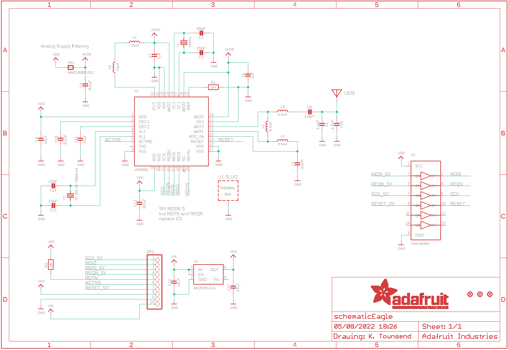
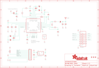

Contents
========

* [PRA1697 > Adafruit](#pra1697--adafruit)
	* [Schematic](#schematic)
	* [Interactive BOM](#interactive-bom)
	* [OOMP Parts](#oomp-parts)
	* [Images](#images)
	* [Tags](#tags)
  
![][im]
# PRA1697 > Adafruit

- ID: PROJ-ADAF-1697-STAN-01
- Hex ID: PRA1697
- Name: Adafruit
- Description: Adafruit
- Long Link: [http://oom.lt/PROJ-ADAF-1697-STAN-01](http://oom.lt/PROJ-ADAF-1697-STAN-01)
- Short Link: [http://oom.lt/PRA1697](http://oom.lt/PRA1697)

## Schematic
  

## Interactive BOM

- Interactive BOM page: [ibom.html](https://htmlpreview.github.io/?https://github.com/oomlout/oomlout_OOMP_projects/blob/main/PROJ-ADAF-1697-STAN-01/kicad/bom/ibom.html)

## OOMP Parts
  

|OOMP Parts|
| :---: |
|C1,UNMATCHED-UNMATCHED-UNMATCHED-UNMATCHED-UNMATCHED,C1,15pF,CAP_CERAMIC0805-NOOUTLINE,0805-NO,Ceramic Capacitors,,|
|C2,UNMATCHED-UNMATCHED-UNMATCHED-UNMATCHED-UNMATCHED,C2,15pF,CAP_CERAMIC0805-NOOUTLINE,0805-NO,Ceramic Capacitors,,|
|C3,UNMATCHED-UNMATCHED-UNMATCHED-UNMATCHED-UNMATCHED,C3,2.2nF,CAP_CERAMIC_0402,_0402,Ceramic Capacitors,,|
|C4,UNMATCHED-UNMATCHED-UNMATCHED-UNMATCHED-UNMATCHED,C4,0.1µF,CAP_CERAMIC0805-NOOUTLINE,0805-NO,Ceramic Capacitors,,|
|C5,UNMATCHED-UNMATCHED-UNMATCHED-UNMATCHED-UNMATCHED,C5,1.8pF,CAP_CERAMIC_0402MP,_0402MP,Ceramic Capacitors,,|
|C6,UNMATCHED-UNMATCHED-UNMATCHED-UNMATCHED-UNMATCHED,C6,1.2pF,CAP_CERAMIC_0402MP,_0402MP,Ceramic Capacitors,,|
|C7,UNMATCHED-UNMATCHED-UNMATCHED-UNMATCHED-UNMATCHED,C7,1µF,CAP_CERAMIC0805-NOOUTLINE,0805-NO,Ceramic Capacitors,,|
|C8,UNMATCHED-UNMATCHED-UNMATCHED-UNMATCHED-UNMATCHED,C8,1nF,CAP_CERAMIC_0603,_0603,Ceramic Capacitors,,|
|C9,UNMATCHED-UNMATCHED-UNMATCHED-UNMATCHED-UNMATCHED,C9,10µF,CAP_CERAMIC0805-NOOUTLINE,0805-NO,Ceramic Capacitors,,|
|C10,UNMATCHED-UNMATCHED-UNMATCHED-UNMATCHED-UNMATCHED,C10,0.1uF,CAP_CERAMIC0805-NOOUTLINE,0805-NO,Ceramic Capacitors,,|
|C11,UNMATCHED-UNMATCHED-UNMATCHED-UNMATCHED-UNMATCHED,C11,33nF,CAP_CERAMIC0805-NOOUTLINE,0805-NO,Ceramic Capacitors,,|
|C12,UNMATCHED-UNMATCHED-UNMATCHED-UNMATCHED-UNMATCHED,C12,0.1µF,CAP_CERAMIC0805-NOOUTLINE,0805-NO,Ceramic Capacitors,,|
|C13,UNMATCHED-UNMATCHED-UNMATCHED-UNMATCHED-UNMATCHED,C13,15pF,CAP_CERAMIC0805-NOOUTLINE,0805-NO,Ceramic Capacitors,,|
|C14,UNMATCHED-UNMATCHED-UNMATCHED-UNMATCHED-UNMATCHED,C14,15pF,CAP_CERAMIC0805-NOOUTLINE,0805-NO,Ceramic Capacitors,,|
|C15,UNMATCHED-UNMATCHED-UNMATCHED-UNMATCHED-UNMATCHED,C15,1.5pF,CAP_CERAMIC_0402MP,_0402MP,Ceramic Capacitors,,|
|C16,UNMATCHED-UNMATCHED-UNMATCHED-UNMATCHED-UNMATCHED,C16,10µF,CAP_CERAMIC0805-NOOUTLINE,0805-NO,Ceramic Capacitors,,|
|C17,UNMATCHED-UNMATCHED-UNMATCHED-UNMATCHED-UNMATCHED,C17,10µF,CAP_CERAMIC0805-NOOUTLINE,0805-NO,Ceramic Capacitors,,|
|FB1,UNMATCHED-UNMATCHED-UNMATCHED-UNMATCHED-UNMATCHED,FB1,MMZ1608B121C,FERRITE0805,0805,Ferrite Bead,,|
|JP1,UNMATCHED-UNMATCHED-UNMATCHED-UNMATCHED-UNMATCHED,FID1,FIDUCIAL,FIDUCIAL,FIDUCIAL_1MM,Fiducial Alignment Points,EXCLUDE,|
|L1,UNMATCHED-UNMATCHED-UNMATCHED-UNMATCHED-UNMATCHED,FID2,FIDUCIAL,FIDUCIAL,FIDUCIAL_1MM,Fiducial Alignment Points,EXCLUDE,|
|L2,UNMATCHED-UNMATCHED-UNMATCHED-UNMATCHED-UNMATCHED,FID3,FIDUCIAL,FIDUCIAL,FIDUCIAL_1MM,Fiducial Alignment Points,EXCLUDE,|
|L3,UNMATCHED-UNMATCHED-UNMATCHED-UNMATCHED-UNMATCHED,JP1,,HEADER-1X1070MIL,1X10_ROUND70,PIN HEADER,,|
|L4,UNMATCHED-UNMATCHED-UNMATCHED-UNMATCHED-UNMATCHED,L1,8.2nH,INDUCTOR_0402,_0402,Inductors,,|
|L5,UNMATCHED-UNMATCHED-UNMATCHED-UNMATCHED-UNMATCHED,L2,5.6nH,INDUCTOR_0402,_0402,Inductors,,|
|R1,UNMATCHED-UNMATCHED-UNMATCHED-UNMATCHED-UNMATCHED,L3,3.9nH,INDUCTOR_0402,_0402,Inductors,,|
|R2,UNMATCHED-UNMATCHED-UNMATCHED-UNMATCHED-UNMATCHED,L4,10µH,INDUCTOR_0603,_0603,Inductors,,|
|U$28,UNMATCHED-UNMATCHED-UNMATCHED-UNMATCHED-UNMATCHED,L5,15nH,INDUCTOR_0603,_0603,Inductors,,|
|U1,UNMATCHED-UNMATCHED-UNMATCHED-UNMATCHED-UNMATCHED,R1,22K,RESISTOR_0805MP,_0805MP,Resistors,,|
|U2,UNMATCHED-UNMATCHED-UNMATCHED-UNMATCHED-UNMATCHED,R2,10K,RESISTOR0805_NOOUTLINE,0805-NO,Resistors,,|
|U3,UNMATCHED-UNMATCHED-UNMATCHED-UNMATCHED-UNMATCHED,U$28,,ANTENNA_PCBNRF8001_1.6MM,ANT_PCB_2.4GHZ_NRF8001_1.6MM_1OZ,Various pre-calculated PCB Antennas,,|
|Y1,UNMATCHED-UNMATCHED-UNMATCHED-UNMATCHED-UNMATCHED,U1,nRF8001,NRF8001,QFN32_5MM,nRF8001 - Bluetooth Low-Energy Transceiver,,|
|Y2,UNMATCHED-UNMATCHED-UNMATCHED-UNMATCHED-UNMATCHED,U2,MIC5225-3.3v,VREG_SOT23-5,SOT23-5,SOT23-5 Fixed Voltage Regulators,,|

## Images
  
  

|kicadPcb3d|kicadPcb3dFront|kicadPcb3dBack|eagleImage|eagleSchemImage|
| :---: | :---: | :---: | :---: | :---: |
||||||

## Tags

- hexID: PRA1697
- oompType: PROJ
- oompSize: ADAF
- oompColor: 1697
- oompDesc: STAN
- oompIndex: 01
- oompName: Adafruit Bluefruit LE nRF8001 PCB
- sources: All source files from https://github.com/adafruit/Adafruit-Bluefruit-LE-nRF8001-PCB (source licence details in srcLicense.md)
- linkBuyPage: http://www.adafruit.com/products/1697
- oompID: PROJ-ADAF-1697-STAN-01
- oompParts: C1,UNMATCHED-UNMATCHED-UNMATCHED-UNMATCHED-UNMATCHED
- oompParts: C2,UNMATCHED-UNMATCHED-UNMATCHED-UNMATCHED-UNMATCHED
- oompParts: C3,UNMATCHED-UNMATCHED-UNMATCHED-UNMATCHED-UNMATCHED
- oompParts: C4,UNMATCHED-UNMATCHED-UNMATCHED-UNMATCHED-UNMATCHED
- oompParts: C5,UNMATCHED-UNMATCHED-UNMATCHED-UNMATCHED-UNMATCHED
- oompParts: C6,UNMATCHED-UNMATCHED-UNMATCHED-UNMATCHED-UNMATCHED
- oompParts: C7,UNMATCHED-UNMATCHED-UNMATCHED-UNMATCHED-UNMATCHED
- oompParts: C8,UNMATCHED-UNMATCHED-UNMATCHED-UNMATCHED-UNMATCHED
- oompParts: C9,UNMATCHED-UNMATCHED-UNMATCHED-UNMATCHED-UNMATCHED
- oompParts: C10,UNMATCHED-UNMATCHED-UNMATCHED-UNMATCHED-UNMATCHED
- oompParts: C11,UNMATCHED-UNMATCHED-UNMATCHED-UNMATCHED-UNMATCHED
- oompParts: C12,UNMATCHED-UNMATCHED-UNMATCHED-UNMATCHED-UNMATCHED
- oompParts: C13,UNMATCHED-UNMATCHED-UNMATCHED-UNMATCHED-UNMATCHED
- oompParts: C14,UNMATCHED-UNMATCHED-UNMATCHED-UNMATCHED-UNMATCHED
- oompParts: C15,UNMATCHED-UNMATCHED-UNMATCHED-UNMATCHED-UNMATCHED
- oompParts: C16,UNMATCHED-UNMATCHED-UNMATCHED-UNMATCHED-UNMATCHED
- oompParts: C17,UNMATCHED-UNMATCHED-UNMATCHED-UNMATCHED-UNMATCHED
- oompParts: FB1,UNMATCHED-UNMATCHED-UNMATCHED-UNMATCHED-UNMATCHED
- oompParts: JP1,UNMATCHED-UNMATCHED-UNMATCHED-UNMATCHED-UNMATCHED
- oompParts: L1,UNMATCHED-UNMATCHED-UNMATCHED-UNMATCHED-UNMATCHED
- oompParts: L2,UNMATCHED-UNMATCHED-UNMATCHED-UNMATCHED-UNMATCHED
- oompParts: L3,UNMATCHED-UNMATCHED-UNMATCHED-UNMATCHED-UNMATCHED
- oompParts: L4,UNMATCHED-UNMATCHED-UNMATCHED-UNMATCHED-UNMATCHED
- oompParts: L5,UNMATCHED-UNMATCHED-UNMATCHED-UNMATCHED-UNMATCHED
- oompParts: R1,UNMATCHED-UNMATCHED-UNMATCHED-UNMATCHED-UNMATCHED
- oompParts: R2,UNMATCHED-UNMATCHED-UNMATCHED-UNMATCHED-UNMATCHED
- oompParts: U$28,UNMATCHED-UNMATCHED-UNMATCHED-UNMATCHED-UNMATCHED
- oompParts: U1,UNMATCHED-UNMATCHED-UNMATCHED-UNMATCHED-UNMATCHED
- oompParts: U2,UNMATCHED-UNMATCHED-UNMATCHED-UNMATCHED-UNMATCHED
- oompParts: U3,UNMATCHED-UNMATCHED-UNMATCHED-UNMATCHED-UNMATCHED
- oompParts: Y1,UNMATCHED-UNMATCHED-UNMATCHED-UNMATCHED-UNMATCHED
- oompParts: Y2,UNMATCHED-UNMATCHED-UNMATCHED-UNMATCHED-UNMATCHED
- rawParts: C1,15pF,CAP_CERAMIC0805-NOOUTLINE,0805-NO,Ceramic Capacitors,,
- rawParts: C2,15pF,CAP_CERAMIC0805-NOOUTLINE,0805-NO,Ceramic Capacitors,,
- rawParts: C3,2.2nF,CAP_CERAMIC_0402,_0402,Ceramic Capacitors,,
- rawParts: C4,0.1µF,CAP_CERAMIC0805-NOOUTLINE,0805-NO,Ceramic Capacitors,,
- rawParts: C5,1.8pF,CAP_CERAMIC_0402MP,_0402MP,Ceramic Capacitors,,
- rawParts: C6,1.2pF,CAP_CERAMIC_0402MP,_0402MP,Ceramic Capacitors,,
- rawParts: C7,1µF,CAP_CERAMIC0805-NOOUTLINE,0805-NO,Ceramic Capacitors,,
- rawParts: C8,1nF,CAP_CERAMIC_0603,_0603,Ceramic Capacitors,,
- rawParts: C9,10µF,CAP_CERAMIC0805-NOOUTLINE,0805-NO,Ceramic Capacitors,,
- rawParts: C10,0.1uF,CAP_CERAMIC0805-NOOUTLINE,0805-NO,Ceramic Capacitors,,
- rawParts: C11,33nF,CAP_CERAMIC0805-NOOUTLINE,0805-NO,Ceramic Capacitors,,
- rawParts: C12,0.1µF,CAP_CERAMIC0805-NOOUTLINE,0805-NO,Ceramic Capacitors,,
- rawParts: C13,15pF,CAP_CERAMIC0805-NOOUTLINE,0805-NO,Ceramic Capacitors,,
- rawParts: C14,15pF,CAP_CERAMIC0805-NOOUTLINE,0805-NO,Ceramic Capacitors,,
- rawParts: C15,1.5pF,CAP_CERAMIC_0402MP,_0402MP,Ceramic Capacitors,,
- rawParts: C16,10µF,CAP_CERAMIC0805-NOOUTLINE,0805-NO,Ceramic Capacitors,,
- rawParts: C17,10µF,CAP_CERAMIC0805-NOOUTLINE,0805-NO,Ceramic Capacitors,,
- rawParts: FB1,MMZ1608B121C,FERRITE0805,0805,Ferrite Bead,,
- rawParts: FID1,FIDUCIAL,FIDUCIAL,FIDUCIAL_1MM,Fiducial Alignment Points,EXCLUDE,
- rawParts: FID2,FIDUCIAL,FIDUCIAL,FIDUCIAL_1MM,Fiducial Alignment Points,EXCLUDE,
- rawParts: FID3,FIDUCIAL,FIDUCIAL,FIDUCIAL_1MM,Fiducial Alignment Points,EXCLUDE,
- rawParts: JP1,,HEADER-1X1070MIL,1X10_ROUND70,PIN HEADER,,
- rawParts: L1,8.2nH,INDUCTOR_0402,_0402,Inductors,,
- rawParts: L2,5.6nH,INDUCTOR_0402,_0402,Inductors,,
- rawParts: L3,3.9nH,INDUCTOR_0402,_0402,Inductors,,
- rawParts: L4,10µH,INDUCTOR_0603,_0603,Inductors,,
- rawParts: L5,15nH,INDUCTOR_0603,_0603,Inductors,,
- rawParts: R1,22K,RESISTOR_0805MP,_0805MP,Resistors,,
- rawParts: R2,10K,RESISTOR0805_NOOUTLINE,0805-NO,Resistors,,
- rawParts: U$28,,ANTENNA_PCBNRF8001_1.6MM,ANT_PCB_2.4GHZ_NRF8001_1.6MM_1OZ,Various pre-calculated PCB Antennas,,
- rawParts: U1,nRF8001,NRF8001,QFN32_5MM,nRF8001 - Bluetooth Low-Energy Transceiver,,
- rawParts: U2,MIC5225-3.3v,VREG_SOT23-5,SOT23-5,SOT23-5 Fixed Voltage Regulators,,
- rawParts: U3,74HC4050D,74HC4050DTSSOP,TSSOP16,6-channel level shifter,,
- rawParts: Y1,16MHz,CRYSTAL2.5X2.0,CRYSTAL_2.5X2,Crystals,,
- rawParts: Y2,FC-255 32.7680K-A3,CRYSTAL4.9X1.8,CRYSTAL_4.9X1.8,Crystals,,

[im]: kicadPcb3d_450.png
