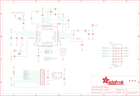

Contents
========

* [PRA1697 > Adafruit Bluefruit LE nRF8001 PCB](#pra1697--adafruit-bluefruit-le-nrf8001-pcb)
	* [Schematic](#schematic)
	* [PCB](#pcb)
	* [Interactive BOM](#interactive-bom)
	* [OOMP Parts](#oomp-parts)
	* [Images](#images)
	* [Tags](#tags)
  
![][im]
# PRA1697 > Adafruit Bluefruit LE nRF8001 PCB

- ID: PROJ-ADAF-1697-STAN-01
- Hex ID: PRA1697
- Name: Adafruit
- Description: Adafruit
- Long Link: [http://oom.lt/PROJ-ADAF-1697-STAN-01](http://oom.lt/PROJ-ADAF-1697-STAN-01)
- Short Link: [http://oom.lt/PRA1697](http://oom.lt/PRA1697)

## Schematic
  

## PCB
  

## Interactive BOM

- Interactive BOM page: [ibom.html](https://htmlpreview.github.io/?https://github.com/oomlout/oomlout_OOMP_projects/blob/main/PROJ-ADAF-1697-STAN-01/kicad/bom/ibom.html)

## OOMP Parts
  

|OOMP Parts|
| :---: |
|C1 C1,CAPC-0805-X-PF15-01|
|C2 C2,CAPC-0805-X-PF15-01|
|C3 C3,CAPC-0402-X-PF22D-01|
|C4 C4,CAPC-0805-X-UF1D-01|
|C5 C5,CAPC-0402-X-PF18D-01|
|C6 C6,CAPC-0402-X-PF12D-01|
|C7 C7,CAPC-0805-X-UF1-01|
|C8 C8,CAPC-0603-X-NF1-01|
|[C9 CAPC-0805-X-UF10-V10 SMD (0805) 10 uF Capacitor (Ceramic) 10v](https://github.com/oomlout/oomlout_OOMP_parts/tree/main/CAPC-0805-X-UF10-V10/)|
|C10 C10,CAPC-0805-X-UF1D-01|
|C11 C11,CAPC-0805-X-NF33-01|
|C12 C12,CAPC-0805-X-UF1D-01|
|C13 C13,CAPC-0805-X-PF15-01|
|C14 C14,CAPC-0805-X-PF15-01|
|C15 C15,CAPC-0402-X-PF15D-01|
|[C16 CAPC-0805-X-UF10-V10 SMD (0805) 10 uF Capacitor (Ceramic) 10v](https://github.com/oomlout/oomlout_OOMP_parts/tree/main/CAPC-0805-X-UF10-V10/)|
|[C17 CAPC-0805-X-UF10-V10 SMD (0805) 10 uF Capacitor (Ceramic) 10v](https://github.com/oomlout/oomlout_OOMP_parts/tree/main/CAPC-0805-X-UF10-V10/)|
|[FB1 FERB-0805-X-O121-01 SMD (0805) 120 Ohm Ferrite Bead](https://github.com/oomlout/oomlout_OOMP_parts/tree/main/FERB-0805-X-O121-01/)|
|[JP1 HEAD-I01-X-PI10-01 2.54 mm 10 Pin Header](https://github.com/oomlout/oomlout_OOMP_parts/tree/main/HEAD-I01-X-PI10-01/)|
|L1 L1,UNMATCHED-0402-X-UNMATCHED-01|
|L2 L2,UNMATCHED-0402-X-UNMATCHED-01|
|L3 L3,UNMATCHED-0402-X-UNMATCHED-01|
|L4 L4,UNMATCHED-0603-X-UNMATCHED-01|
|L5 L5,UNMATCHED-0603-X-UNMATCHED-01|
|[R1 RESE-0805-X-O223-01 SMD (0805) 22k Ohm Resistor](https://github.com/oomlout/oomlout_OOMP_parts/tree/main/RESE-0805-X-O223-01/)|
|[R2 RESE-0805-X-O103-01 SMD (0805) 10k Ohm Resistor](https://github.com/oomlout/oomlout_OOMP_parts/tree/main/RESE-0805-X-O103-01/)|
|U$28 U$28,UNMATCHED-UNMATCHED-X-UNMATCHED-01|
|U1 U1,UNMATCHED-UNMATCHED-X-UNMATCHED-01|
|[U2 VREG-SO235-X-KMIC5225-V33D SMD (SOT-23-5) MIC5225 Voltage Regulator 3.3v](https://github.com/oomlout/oomlout_OOMP_parts/tree/main/VREG-SO235-X-KMIC5225-V33D/)|
|U3 U3,UNMATCHED-UNMATCHED-X-UNMATCHED-01|
|Y1 Y1,UNMATCHED-UNMATCHED-X-UNMATCHED-01|
|Y2 Y2,UNMATCHED-UNMATCHED-X-UNMATCHED-01|

## Images
  
  

|kicadPcb3d|kicadPcb3dFront|kicadPcb3dBack|eagleImage|eagleSchemImage|
| :---: | :---: | :---: | :---: | :---: |
||||||

## Tags

- hexID: PRA1697
- oompType: PROJ
- oompSize: ADAF
- oompColor: 1697
- oompDesc: STAN
- oompIndex: 01
- oompName: Adafruit Bluefruit LE nRF8001 PCB
- sources: All source files from https://github.com/adafruit/Adafruit-Bluefruit-LE-nRF8001-PCB (source licence details in srcLicense.md)
- linkBuyPage: http://www.adafruit.com/products/1697
- oompID: PROJ-ADAF-1697-STAN-01
- oompParts: C1,CAPC-0805-X-PF15-01
- oompParts: C2,CAPC-0805-X-PF15-01
- oompParts: C3,CAPC-0402-X-PF22D-01
- oompParts: C4,CAPC-0805-X-UF1D-01
- oompParts: C5,CAPC-0402-X-PF18D-01
- oompParts: C6,CAPC-0402-X-PF12D-01
- oompParts: C7,CAPC-0805-X-UF1-01
- oompParts: C8,CAPC-0603-X-NF1-01
- oompParts: C9,CAPC-0805-X-UF10-V10
- oompParts: C10,CAPC-0805-X-UF1D-01
- oompParts: C11,CAPC-0805-X-NF33-01
- oompParts: C12,CAPC-0805-X-UF1D-01
- oompParts: C13,CAPC-0805-X-PF15-01
- oompParts: C14,CAPC-0805-X-PF15-01
- oompParts: C15,CAPC-0402-X-PF15D-01
- oompParts: C16,CAPC-0805-X-UF10-V10
- oompParts: C17,CAPC-0805-X-UF10-V10
- oompParts: FB1,FERB-0805-X-O121-01
- oompParts: JP1,HEAD-I01-X-PI10-01
- oompParts: L1,UNMATCHED-0402-X-UNMATCHED-01
- oompParts: L2,UNMATCHED-0402-X-UNMATCHED-01
- oompParts: L3,UNMATCHED-0402-X-UNMATCHED-01
- oompParts: L4,UNMATCHED-0603-X-UNMATCHED-01
- oompParts: L5,UNMATCHED-0603-X-UNMATCHED-01
- oompParts: R1,RESE-0805-X-O223-01
- oompParts: R2,RESE-0805-X-O103-01
- oompParts: U$28,UNMATCHED-UNMATCHED-X-UNMATCHED-01
- oompParts: U1,UNMATCHED-UNMATCHED-X-UNMATCHED-01
- oompParts: U2,VREG-SO235-X-KMIC5225-V33D
- oompParts: U3,UNMATCHED-UNMATCHED-X-UNMATCHED-01
- oompParts: Y1,UNMATCHED-UNMATCHED-X-UNMATCHED-01
- oompParts: Y2,UNMATCHED-UNMATCHED-X-UNMATCHED-01
- rawParts: C1,15pF,CAP_CERAMIC0805-NOOUTLINE,0805-NO,Ceramic Capacitors,,
- rawParts: C2,15pF,CAP_CERAMIC0805-NOOUTLINE,0805-NO,Ceramic Capacitors,,
- rawParts: C3,2.2nF,CAP_CERAMIC_0402,_0402,Ceramic Capacitors,,
- rawParts: C4,0.1µF,CAP_CERAMIC0805-NOOUTLINE,0805-NO,Ceramic Capacitors,,
- rawParts: C5,1.8pF,CAP_CERAMIC_0402MP,_0402MP,Ceramic Capacitors,,
- rawParts: C6,1.2pF,CAP_CERAMIC_0402MP,_0402MP,Ceramic Capacitors,,
- rawParts: C7,1µF,CAP_CERAMIC0805-NOOUTLINE,0805-NO,Ceramic Capacitors,,
- rawParts: C8,1nF,CAP_CERAMIC_0603,_0603,Ceramic Capacitors,,
- rawParts: C9,10µF,CAP_CERAMIC0805-NOOUTLINE,0805-NO,Ceramic Capacitors,,
- rawParts: C10,0.1uF,CAP_CERAMIC0805-NOOUTLINE,0805-NO,Ceramic Capacitors,,
- rawParts: C11,33nF,CAP_CERAMIC0805-NOOUTLINE,0805-NO,Ceramic Capacitors,,
- rawParts: C12,0.1µF,CAP_CERAMIC0805-NOOUTLINE,0805-NO,Ceramic Capacitors,,
- rawParts: C13,15pF,CAP_CERAMIC0805-NOOUTLINE,0805-NO,Ceramic Capacitors,,
- rawParts: C14,15pF,CAP_CERAMIC0805-NOOUTLINE,0805-NO,Ceramic Capacitors,,
- rawParts: C15,1.5pF,CAP_CERAMIC_0402MP,_0402MP,Ceramic Capacitors,,
- rawParts: C16,10µF,CAP_CERAMIC0805-NOOUTLINE,0805-NO,Ceramic Capacitors,,
- rawParts: C17,10µF,CAP_CERAMIC0805-NOOUTLINE,0805-NO,Ceramic Capacitors,,
- rawParts: FB1,MMZ1608B121C,FERRITE0805,0805,Ferrite Bead,,
- rawParts: FID1,FIDUCIAL,FIDUCIAL,FIDUCIAL_1MM,Fiducial Alignment Points,EXCLUDE,
- rawParts: FID2,FIDUCIAL,FIDUCIAL,FIDUCIAL_1MM,Fiducial Alignment Points,EXCLUDE,
- rawParts: FID3,FIDUCIAL,FIDUCIAL,FIDUCIAL_1MM,Fiducial Alignment Points,EXCLUDE,
- rawParts: JP1,,HEADER-1X1070MIL,1X10_ROUND70,PIN HEADER,,
- rawParts: L1,8.2nH,INDUCTOR_0402,_0402,Inductors,,
- rawParts: L2,5.6nH,INDUCTOR_0402,_0402,Inductors,,
- rawParts: L3,3.9nH,INDUCTOR_0402,_0402,Inductors,,
- rawParts: L4,10µH,INDUCTOR_0603,_0603,Inductors,,
- rawParts: L5,15nH,INDUCTOR_0603,_0603,Inductors,,
- rawParts: R1,22K,RESISTOR_0805MP,_0805MP,Resistors,,
- rawParts: R2,10K,RESISTOR0805_NOOUTLINE,0805-NO,Resistors,,
- rawParts: U$28,,ANTENNA_PCBNRF8001_1.6MM,ANT_PCB_2.4GHZ_NRF8001_1.6MM_1OZ,Various pre-calculated PCB Antennas,,
- rawParts: U1,nRF8001,NRF8001,QFN32_5MM,nRF8001 - Bluetooth Low-Energy Transceiver,,
- rawParts: U2,MIC5225-3.3v,VREG_SOT23-5,SOT23-5,SOT23-5 Fixed Voltage Regulators,,
- rawParts: U3,74HC4050D,74HC4050DTSSOP,TSSOP16,6-channel level shifter,,
- rawParts: Y1,16MHz,CRYSTAL2.5X2.0,CRYSTAL_2.5X2,Crystals,,
- rawParts: Y2,FC-255 32.7680K-A3,CRYSTAL4.9X1.8,CRYSTAL_4.9X1.8,Crystals,,

[im]: kicadPcb3d_450.png
