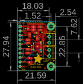
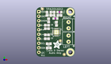
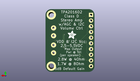
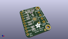

Contents
========

* [PROJ-ADAF-1712-STAN-01>Adafruit TPA2016 PCB](#proj-adaf-1712-stan-01adafruit-tpa2016-pcb)
	* [Images](#images)
	* [Interactive BOM](#interactive-bom)
	* [OOMP Parts](#oomp-parts)
	* [Tags](#tags)
  
![][im]
# PROJ-ADAF-1712-STAN-01>Adafruit TPA2016 PCB

- ID: PROJ-ADAF-1712-STAN-01
- Hex ID: PRA1712
- Name: Adafruit TPA2016 PCB
- Description: 

## Images
  
  

|eagleImage|kicadPcb3dFront|kicadPcb3dBack|kicadPcb3d|
| :---: | :---: | :---: | :---: |
|||||

## Interactive BOM

- Interactive BOM page: [ibom.html](kicad/bom/ibom.html)

## OOMP Parts
  

|OOMP Parts|
| :---: |
|CAPC-0805-X-UNMATCHED-01, C1, 6.054000084, 24.214000086, 270,C1, 10uF, 0805-NO, microbuilder, (0.23834646, 0.95330709), R270|
|<table><tr><td></td><td> C2</td><td>[CAPC-0805-X-NF100-V50 SMD (0805) 100 nF Capacitor (Ceramic) 50v](https://github.com/oomlout/oomlout_OOMP_parts/tree/main/CAPC-0805-X-NF100-V50/)</td><td>[C85N100](https://github.com/oomlout/oomlout_OOMP_parts/tree/main/CAPC-0805-X-NF100-V50/)</td></tr></table>|
|<table><tr><td></td><td> C3</td><td>[CAPC-0805-X-NF100-V50 SMD (0805) 100 nF Capacitor (Ceramic) 50v](https://github.com/oomlout/oomlout_OOMP_parts/tree/main/CAPC-0805-X-NF100-V50/)</td><td>[C85N100](https://github.com/oomlout/oomlout_OOMP_parts/tree/main/CAPC-0805-X-NF100-V50/)</td></tr></table>|
|<table><tr><td></td><td> C4</td><td>[CAPC-0805-X-NF100-V50 SMD (0805) 100 nF Capacitor (Ceramic) 50v](https://github.com/oomlout/oomlout_OOMP_parts/tree/main/CAPC-0805-X-NF100-V50/)</td><td>[C85N100](https://github.com/oomlout/oomlout_OOMP_parts/tree/main/CAPC-0805-X-NF100-V50/)</td></tr></table>|
|CAPC-0805-X-UNMATCHED-01, C5, 6.026999883999999, 10.186999946, 0,C5, 1uF, 0805-NO, microbuilder, (0.23728346, 0.40106299), R0|
|CAPC-0805-X-UNMATCHED-01, C6, 6.026999883999999, 12.358999919999999, 0,C6, 1uF, 0805-NO, microbuilder, (0.23728346, 0.4865748), R0|
|CAPC-0805-X-UNMATCHED-01, C7, 6.026999883999999, 15.868000014, 0,C7, 1uF, 0805-NO, microbuilder, (0.23728346, 0.62472441), R0|
|CAPC-0805-X-UNMATCHED-01, C8, 6.026999883999999, 17.812999933999997, 0,C8, 1uF, 0805-NO, microbuilder, (0.23728346, 0.70129921), R0|
|CAPC-0805-X-UNMATCHED-01, C9, 9.143999999999998, 23.368, 180,C9, 10uF, 0805-NO, microbuilder, (0.36, 0.92), R180|
|UNMATCHED-0805-X-UNMATCHED-01, FB1, 12.98399994, 25.174999942, 0,FB1, ferrite, _0805MP, microbuilder, (0.5111811, 0.99114173), R0|
|UNMATCHED-0805-X-UNMATCHED-01, FB2, 10.762000065999999, 21.587000006, 0,FB2, ferrite, _0805MP, microbuilder, (0.42370079, 0.84988189), R0|
|UNMATCHED-UNMATCHED-X-UNMATCHED-01, IC1, 11.302999999999999, 13.843, 90,IC1, TPA2016D2QFN, QFN20_4MM, microbuilder, (0.445, 0.545), R90|
|UNMATCHED-UNMATCHED-X-UNMATCHED-01, J1, 18.034, 10.16, 90,J1, TERMBLOCK_1X2-3.5MM, microbuilder, (0.71, 0.4), R90|
|UNMATCHED-UNMATCHED-X-UNMATCHED-01, J2, 18.034, 17.779999999999998, 90,J2, TERMBLOCK_1X2-3.5MM, microbuilder, (0.71, 0.7), R90|
|<table><tr><td></td><td> JP1</td><td>[HEAD-I01-X-PI10-01 2.54 mm 10 Pin Header](https://github.com/oomlout/oomlout_OOMP_parts/tree/main/HEAD-I01-X-PI10-01/)</td><td>[H10](https://github.com/oomlout/oomlout_OOMP_parts/tree/main/HEAD-I01-X-PI10-01/)</td></tr></table>|
|<table><tr><td></td><td> R1</td><td>[RESE-0805-X-O103-01 SMD (0805) 10k Ohm Resistor](https://github.com/oomlout/oomlout_OOMP_parts/tree/main/RESE-0805-X-O103-01/)</td><td>[R85103](https://github.com/oomlout/oomlout_OOMP_parts/tree/main/RESE-0805-X-O103-01/)</td></tr></table>|
|<table><tr><td></td><td> R2</td><td>[RESE-0805-X-O103-01 SMD (0805) 10k Ohm Resistor](https://github.com/oomlout/oomlout_OOMP_parts/tree/main/RESE-0805-X-O103-01/)</td><td>[R85103](https://github.com/oomlout/oomlout_OOMP_parts/tree/main/RESE-0805-X-O103-01/)</td></tr></table>|
|RESE-0805-X-O104-01, R3, 6.985, 20.574, 90,R3, 100K, 0805-NO, microbuilder, (0.275, 0.81), R90|

## Tags

- hexID: PRA1712
- oompType: PROJ
- oompSize: ADAF
- oompColor: 1712
- oompDesc: STAN
- oompIndex: 01
- oompName: Adafruit TPA2016 PCB
- sources: All source files from https://github.com/adafruit/Adafruit-TPA2016-PCB (source licence details in srcLicense.md)
- linkBuyPage: http://www.adafruit.com/products/1712
- oompPart: CAPC-0805-X-UNMATCHED-01, C1, 6.054000084, 24.214000086, 270
- oompPart: CAPC-0805-X-NF100-V50, C2, 11.324999956, 18.62400009, 90
- oompPart: CAPC-0805-X-NF100-V50, C3, 12.98399994, 23.365000006, 180
- oompPart: CAPC-0805-X-NF100-V50, C4, 9.111000065999999, 25.174999942, 180
- oompPart: CAPC-0805-X-UNMATCHED-01, C5, 6.026999883999999, 10.186999946, 0
- oompPart: CAPC-0805-X-UNMATCHED-01, C6, 6.026999883999999, 12.358999919999999, 0
- oompPart: CAPC-0805-X-UNMATCHED-01, C7, 6.026999883999999, 15.868000014, 0
- oompPart: CAPC-0805-X-UNMATCHED-01, C8, 6.026999883999999, 17.812999933999997, 0
- oompPart: CAPC-0805-X-UNMATCHED-01, C9, 9.143999999999998, 23.368, 180
- oompPart: UNMATCHED-0805-X-UNMATCHED-01, FB1, 12.98399994, 25.174999942, 0
- oompPart: UNMATCHED-0805-X-UNMATCHED-01, FB2, 10.762000065999999, 21.587000006, 0
- oompPart: SKIP-UNMATCHED-X-UNMATCHED-01, FID1, 3.491999874, 27.005000092, 0
- oompPart: SKIP-UNMATCHED-X-UNMATCHED-01, FID2, 15.667999905999999, 1.300999938, 0
- oompPart: SKIP-UNMATCHED-X-UNMATCHED-01, FID3, 13.462, 9.017, 0
- oompPart: UNMATCHED-UNMATCHED-X-UNMATCHED-01, IC1, 11.302999999999999, 13.843, 90
- oompPart: UNMATCHED-UNMATCHED-X-UNMATCHED-01, J1, 18.034, 10.16, 90
- oompPart: UNMATCHED-UNMATCHED-X-UNMATCHED-01, J2, 18.034, 17.779999999999998, 90
- oompPart: HEAD-I01-X-PI10-01, JP1, 1.5239999999999998, 13.97, 270
- oompPart: RESE-0805-X-O103-01, R1, 7.066000091999999, 7.343000045999999, 0
- oompPart: RESE-0805-X-O103-01, R2, 7.095000033999999, 4.975999954, 0
- oompPart: RESE-0805-X-O104-01, R3, 6.985, 20.574, 90
- oompPart: SKIP-UNMATCHED-X-UNMATCHED-01, U$20, 19.049999999999997, 2.54, 0
- oompPart: SKIP-UNMATCHED-X-UNMATCHED-01, U$21, 19.049999999999997, 25.4, 0
- rawPart: C1, 10uF, 0805-NO, microbuilder, (0.23834646, 0.95330709), R270
- rawPart: C2, 0.1uF, 0805-NO, microbuilder, (0.44586614, 0.73322835), R90
- rawPart: C3, 0.1uF, 0805-NO, microbuilder, (0.5111811, 0.91988189), R180
- rawPart: C4, 0.1uF, 0805-NO, microbuilder, (0.35870079, 0.99114173), R180
- rawPart: C5, 1uF, 0805-NO, microbuilder, (0.23728346, 0.40106299), R0
- rawPart: C6, 1uF, 0805-NO, microbuilder, (0.23728346, 0.4865748), R0
- rawPart: C7, 1uF, 0805-NO, microbuilder, (0.23728346, 0.62472441), R0
- rawPart: C8, 1uF, 0805-NO, microbuilder, (0.23728346, 0.70129921), R0
- rawPart: C9, 10uF, 0805-NO, microbuilder, (0.36, 0.92), R180
- rawPart: FB1, ferrite, _0805MP, microbuilder, (0.5111811, 0.99114173), R0
- rawPart: FB2, ferrite, _0805MP, microbuilder, (0.42370079, 0.84988189), R0
- rawPart: FID1, FIDUCIAL, FIDUCIAL_1MM, microbuilder, (0.13748031, 1.06318898), R0
- rawPart: FID2, FIDUCIAL, FIDUCIAL_1MM, microbuilder, (0.61685039, 0.05122047), R0
- rawPart: FID3, FIDUCIAL, FIDUCIAL_1MM, microbuilder, (0.53, 0.355), R0
- rawPart: IC1, TPA2016D2QFN, QFN20_4MM, microbuilder, (0.445, 0.545), R90
- rawPart: J1, TERMBLOCK_1X2-3.5MM, microbuilder, (0.71, 0.4), R90
- rawPart: J2, TERMBLOCK_1X2-3.5MM, microbuilder, (0.71, 0.7), R90
- rawPart: JP1, 1X10_ROUND70, microbuilder, (0.06, 0.55), R270
- rawPart: R1, 10K, 0805-NO, microbuilder, (0.27818898, 0.28909449), R0
- rawPart: R2, 10K, 0805-NO, microbuilder, (0.27933071, 0.19590551), R0
- rawPart: R3, 100K, 0805-NO, microbuilder, (0.275, 0.81), R90
- rawPart: U$20, MOUNTINGHOLE2.5_THICK, MOUNTINGHOLE_2.5_PLATED_THICK, microbuilder, (0.75, 0.1), R0
- rawPart: U$21, MOUNTINGHOLE2.5_THICK, MOUNTINGHOLE_2.5_PLATED_THICK, microbuilder, (0.75, 1), R0
- oompID: PROJ-ADAF-1712-STAN-01

[im]: kicadPcb3d_450.png
